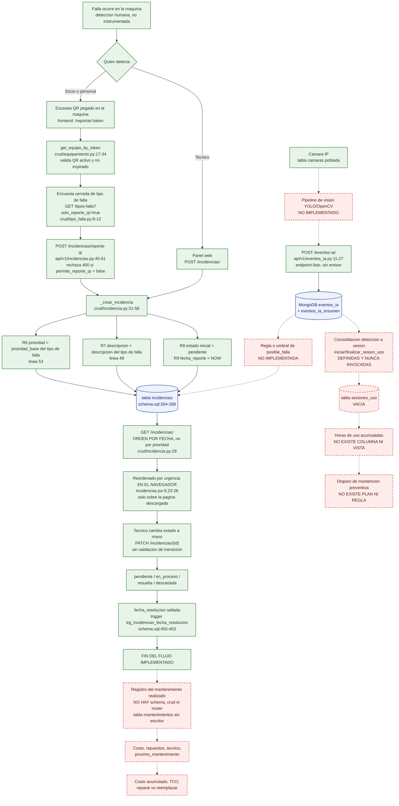
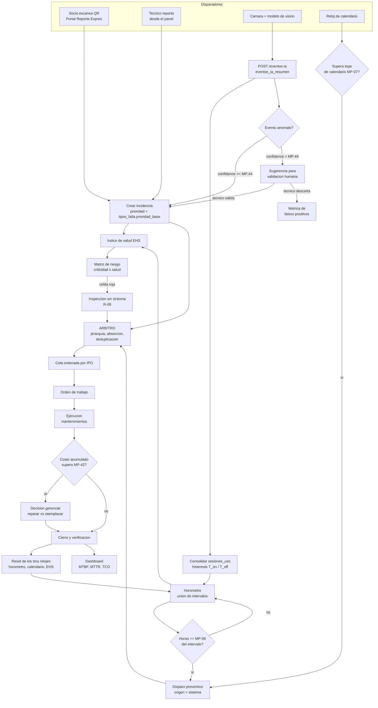
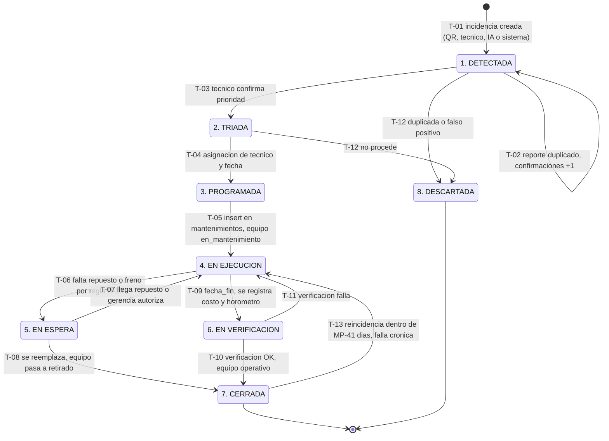
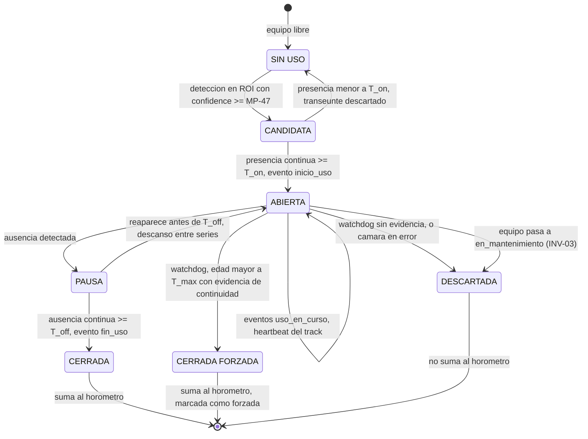
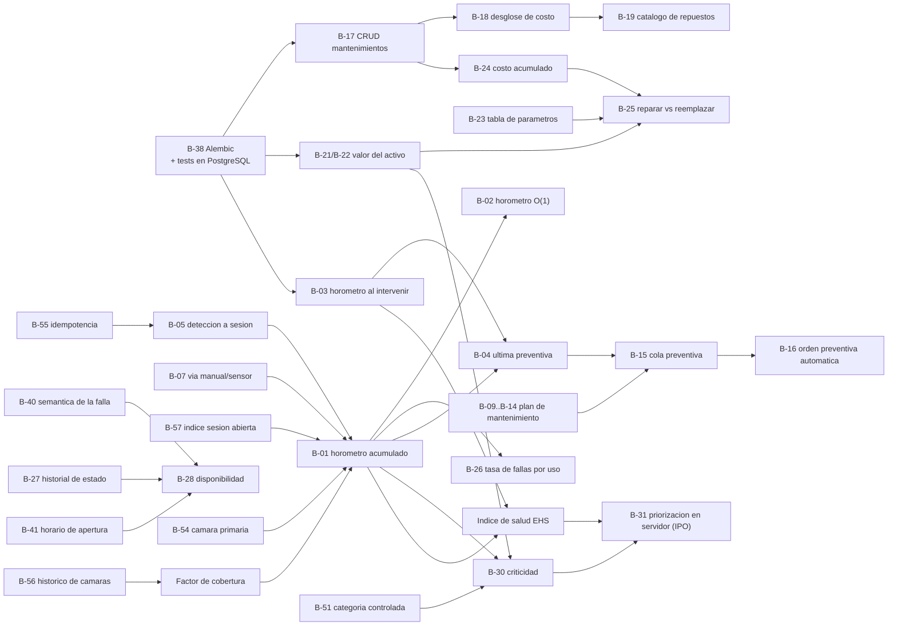

# Estudio de ingeniería del modelo productivo de mantenimiento

**Proyecto:** GymKeep — Sistema de gestión inteligente del mantenimiento de equipamiento de gimnasios
**Asignatura:** Capstone PTY4614 — Duoc UC, sede Puerto Montt
**Equipo:** Braihan González, Luis Salamanca, Benjamín Oviedo
**Fecha de elaboración:** 21 de septiembre de 2026
**Estado del documento:** versión de ingeniería, completa y consolidada. Pendiente de una única tarea externa: la verificación documental de las fuentes (ver §0 y Anexo A).

---

## 0. Regla de evidencia del documento

Este estudio se elaboró en un entorno cuya política de egreso de red **bloqueó el acceso directo (fetch) a la totalidad de los dominios externos consultados**: organismos normalizadores (`iso.org`, `sis.se`, `standards.iteh.ai`, `sae.org`, `electropedia.org`, `cencenelec.eu`), repositorios institucionales (`energy.gov`, `nasa.gov`, `nist.gov`, `pnnl.gov`), bases documentales (`arxiv.org`, `mdpi.com`, `patents.google.com`), sitios de fabricantes de equipamiento (`lifefitness.com`, `precor.com`, `concept2.com`, `johnsonhealthtech.com`) y portales del mercado chileno. Una verificación independiente posterior, realizada por revisores que intentaron abrir cada URL una por una, confirmó el bloqueo y **no pudo validar por lectura directa ninguna de las referencias externas**; sí pudo confirmar, mediante fichas concordantes de múltiples organismos, el título, la edición y el alcance de las normas principales, y detectó errores de edición y de atribución que este documento ya incorpora corregidos (§10).

De ese hecho se desprende la regla que gobierna todo el texto y que debe mantenerse en el informe final mientras la verificación no se complete:

> **Regla E-1.** Ninguna cifra de origen externo se presenta como dato del estudio. Todo valor numérico proveniente de literatura, de fabricante o de práctica de industria se adopta como **supuesto parametrizable del proyecto**, con su valor propuesto, su unidad, su procedencia declarada y su método de calibración. La fuente externa justifica el **orden de magnitud** y el **mecanismo**, nunca el número.
>
> **Regla E-2.** Sólo se citan como referencias (§10) los documentos cuyo título, edición y alcance pudieron corroborarse de forma concordante entre varios organismos independientes, y siempre por **designación normativa** (norma, edición, año), no por URL de tienda. El resto de las fuentes localizadas se traslada al **Anexo A**, marcado como no verificado y no citable hasta que un integrante del equipo lo abra y lo confirme.
>
> **Regla E-3.** Toda tabla que contenga cifras de origen externo lleva la etiqueta de evidencia de cada valor (§1.4) y, cuando corresponde, la leyenda **pendiente de verificación**.

Esta regla no debilita el estudio: lo hace auditable. El modelo productivo que aquí se define **no depende de ninguna cifra externa para ser correcto**; depende de que los parámetros estén declarados, sean configurables y se calibren con los datos que el propio sistema producirá.

---

## 1. Propósito y alcance

### 1.1 Qué es un modelo productivo de mantenimiento

Un **modelo productivo de mantenimiento** es el conjunto de reglas formales con las que una organización decide **cuándo intervenir cada activo, por qué, con qué prioridad y con qué criterio económico**. No es un plan de tareas ni un manual de procedimientos: es el mecanismo de decisión que convierte datos observables en trabajo de mantenimiento ejecutable, y que permite después medir si ese trabajo sirvió.

Un modelo productivo queda completamente especificado cuando responde cinco preguntas:

| # | Pregunta | Dónde se responde en este documento |
|---|---|---|
| 1 | ¿Qué **estrategia** de mantenimiento se aplica sobre cada modo de falla? | §3.1 y §3.4 (marco), §6.1 (operacionalización) |
| 2 | ¿Con qué **reglas de decisión** se dispara una orden de trabajo? | §6.4 (reglas R-01 a R-12), §6.5 (ciclo de vida de la OT) |
| 3 | ¿Con qué **datos** se alimentan esas reglas? | §5 (qué hay hoy), §6.6 (cadena de visión), §7.4 (consultas SQL) |
| 4 | ¿Con qué **indicadores** se mide el desempeño del modelo? | §7.3 (30 KPI) |
| 5 | ¿Con qué **criterios económicos** se decide reparar, diferir o reemplazar? | §7.5 (TCO), §7.6 (regla reparar vs. reemplazar) |

### 1.2 Qué decide este estudio y qué no

**Decide:** la estrategia de mantenimiento de GymKeep y su justificación técnica; la taxonomía de equipos y de modos de falla; los disparadores de trabajo y su arbitraje; la matriz de criticidad del activo; el índice de salud del equipo; las reglas de disparo y los SLA; el ciclo de vida de la orden de trabajo; la definición operativa del horómetro y su integración con el módulo de visión; el tablero de indicadores; el modelo de costo total de propiedad y la regla de reemplazo; y la lista completa de parámetros configurables con su método de calibración.

**No decide:** la arquitectura de software, el diseño de interfaz, la selección de modelo de detección ni el plan de proyecto. Cuando el modelo exige una capacidad que el sistema construido no tiene, este documento **no la supone resuelta**: la registra como brecha con su corrección propuesta (§9).

**Criterio de aceptación aplicado en todo el documento:** ninguna regla puede depender de un dato que nadie va a capturar. Cada regla se acompaña de la tabla, la columna o la consulta que la alimenta, contra el esquema real `GymKeep/postgres/schema.sql`.

### 1.3 Sistema de identificadores unificado

Las cinco secciones de trabajo que dieron origen a este documento usaron numeraciones independientes que en algunos casos colisionaban. El documento consolidado adopta el siguiente sistema único, y la tabla de equivalencias de §9.1 permite rastrear cualquier identificador original.

| Prefijo | Significado | Rango | Dónde se lista completo |
|---|---|---|---|
| `P-xx` | Parámetro del dominio (intervalos, vidas útiles, costos, metas) | P-01 … P-51 | §4.7 y §8 |
| `S-xx` | Supuesto de dominio (uso, ocupación, costos de mercado) | S-01 … S-12 | §8 |
| `SE-xx` | Supuesto económico y de medición (metas de KPI, TCO, reemplazo) | SE-10 … SE-27 | §8 |
| `SO-xx` | Supuesto operativo derivado del diagnóstico del sistema | SO-01 … SO-12 | §8 |
| `ST-x` | Supuesto del marco teórico | ST-1 … ST-8 | §8 |
| `MP-xx` | Supuesto parametrizable del modelo productivo | MP-01 … MP-54 | §6, §8 |
| `R-xx` | Regla de decisión y disparo de orden de trabajo | R-01 … R-12 | §6.4 |
| `INV-xx` | Invariante del ciclo de vida de la orden de trabajo | INV-01 … INV-07 | §6.5.4 |
| `T-xx` | Transición de estado de la orden de trabajo | T-01 … T-13 | §6.5.3 |
| `K-xx` | Indicador (KPI) | K-01 … K-30 | §7.3 |
| `Qx` | Consulta SQL de referencia | Q1 … Q12 | §7.4 |
| `B-xx` | Brecha del sistema actual | B-01 … B-62 | §9 |
| `D1/D2/D3` | Disparador de trabajo del modelo híbrido | — | §6.1 |

**Regla de rigor aplicada sin excepciones:** todo peso, umbral, SLA o constante numérica del modelo lleva un identificador y está declarado como supuesto parametrizable. La tabla consolidada de §8 es el contrato con el equipo: esos valores **se configuran, no se codifican**.

### 1.4 Etiquetas de evidencia

| Etiqueta | Significado |
|---|---|
| **[DATO]** | Cifra atribuible a una fuente primaria identificable con título y URL. **Pendiente de verificación directa** en todos los casos de este documento (regla E-1) |
| **[DATO-SEC]** | Cifra de fuente secundaria (servicio técnico, distribuidor, medio del sector, proveedor de CMMS). Direccional, nunca normativa |
| **[DERIVADO]** | Cifra calculada en este documento a partir de valores etiquetados, aplicando supuestos explícitos |
| **[SUPUESTO]** | Parámetro fijado por decisión de diseño del equipo. **No es un dato.** Debe calibrarse con el gimnasio piloto |
| **[VERIFICADO]** | Afirmación verificada por lectura directa del repositorio del proyecto o de documentación técnica abierta |

### 1.5 Anclaje al sistema real

Todo el documento se escribe contra el repositorio `/home/user/CAPSTONE_Grupo6_PM`, commit `0ada613`. El diagnóstico de §5 es una auditoría de código con cita de archivo y línea; las consultas de §6 y §7 se escriben contra `GymKeep/postgres/schema.sql` y las de §7.4 fueron **ejecutadas contra una instancia real de PostgreSQL 16.13** con ese esquema cargado.

---

## 2. Resumen ejecutivo

### 2.1 El problema y el cambio de modelo

GymKeep opera hoy un modelo de mantenimiento **100 % correctivo**: toda intervención se dispara por una falla ya ocurrida y reportada por una persona. La única regla de negocio de mantenimiento efectivamente implementada es la herencia de prioridad desde el catálogo de tipos de falla (`app/crud/incidencia.py:53`). El ciclo está abierto en su punto crítico: la tabla `mantenimientos` existe con su ORM completo pero **no tiene esquema Pydantic, ni CRUD, ni router**, de modo que la intervención física, su costo y su próxima fecha no se pueden registrar desde la aplicación. El eje de uso está igualmente cortado: las funciones `iniciar_sesion_uso` y `finalizar_sesion_uso` están implementadas y **nunca son invocadas**, por lo que `sesiones_uso` queda vacía y con ella toda la base del preventivo por desgaste.

El modelo propuesto no sustituye el correctivo: lo **transforma de reactivo en gestionado** y le agrega dos disparadores que hoy no existen. El resultado es un modelo **híbrido de tres disparadores** que conviven sobre cada equipo:

| | **D1 — Correctivo priorizado** | **D2 — Preventivo por uso real** | **D3 — Preventivo por calendario** |
|---|---|---|---|
| Qué lo dispara | Una incidencia registrada | El horómetro cruza un umbral | El tiempo desde la última intervención |
| Canal de entrada | QR público, panel técnico o IA | Módulo de visión → `sesiones_uso` | Reloj del sistema |
| `incidencias.origen` | `qr` / `tecnico` / `ia` | `sistema` | `sistema` |
| Latencia típica | Minutos desde la falla | Días de anticipación | Semanas de anticipación |
| Qué problema resuelve | La falla que ya ocurrió | El desgaste que se acumula | El deterioro que no depende del uso |
| Riesgo si es el único | Indisponibilidad e inseguridad | Los equipos de bajo uso nunca se tocan | Se interviene de más en máquinas ociosas y de menos en saturadas |
| Estado en el proyecto | **Implementado** | Modelo de datos listo, lógica ausente | Campo existe, lógica ausente |

**D2 es el disparador que justifica el proyecto, D1 es el que mantiene el gimnasio funcionando hoy, y D3 es la red de seguridad que impide que D2 produzca puntos ciegos.**

### 2.2 Las cinco decisiones de diseño principales

**Decisión 1 — El disparador del preventivo es la variable causal del desgaste, no su proxy.** Una política de calendario impone un único intervalo a equipos cuya tasa de uso difiere por un factor cercano a tres, e incurre simultáneamente en sobremantenimiento de los ociosos y submantenimiento de los intensivos (§3.4.2). Medir horas de uso efectivo elimina ese error por construcción. Esa misma medición es, además, la condición para que el MTBF sea comparable entre equipos, marcas y sucursales, porque el MTBF se define sobre **tiempo de operación** y no sobre tiempo calendario (§3.3.2). La justificación del proyecto se enuncia en una línea auditable: **GymKeep no promete más mantenimiento, promete reasignar el que ya se hace hacia donde el desgaste realmente ocurre.**

**Decisión 2 — Criticidad y salud se mantienen estrictamente separadas, y su producto ordena la cola.** La criticidad mide **consecuencia** de la falla (impacto en servicio, costo de reposición, falta de redundancia) y es independiente de la probabilidad de fallar; el índice de salud del equipo mide **condición actual** (consumo del intervalo, carga de fallas reciente, antigüedad, señal de la IA). Su producto es el riesgo del activo, y el riesgo dispara trabajo **sin que nadie haya reportado una falla** (§6.2, §6.3). Esta separación es la que permite que una prensa de piernas impopular pero única quede por encima de una bicicleta de spinning muy usada con diecinueve sustitutas.

**Decisión 3 — El horómetro mide tiempo de máquina ocupada, por unión de intervalos, y nunca imputa uso no observado.** La definición formal $H = \frac{1}{3600}\left|\bigcup_i [a_i,b_i]\right|$ elimina por construcción la doble contabilidad por múltiples cámaras y por múltiples personas (§6.6.3). El sistema declara además su **factor de cobertura**: por debajo del 60 % de observación el equipo sale del régimen preventivo por uso y cae a calendario puro. Es preferible un horómetro que subcuenta y se sabe que subcuenta, a uno que rellena huecos y pierde trazabilidad.

**Decisión 4 — La visión por computadora es un medidor de exposición al desgaste, no un detector de fallas, y nunca bloquea un equipo por sí sola.** Un modelo de detección de personas no ve un cable deshilachado ni huele un motor quemado: de dieciséis tipos de falla del catálogo propuesto, sólo dos son marcables como detectables por IA, y por inferencia de ausencia de uso, no por observación del defecto (§4.2.5). El peor caso de un detector defectuoso queda acotado a "genera inspecciones innecesarias", nunca a "deja el gimnasio sin máquinas" (§6.6.6).

**Decisión 5 — Dos relojes, nunca mezclados, y todo parámetro es configurable.** MTBF, tasa de fallas, desgaste y costo por hora se miden en **horas de uso efectivo**; disponibilidad, SLA y backlog se miden en **horas de calendario y de apertura**. La identidad $A = \mathrm{MTBF}/(\mathrm{MTBF}+\mathrm{MTTR})$ sólo es válida bajo una única base temporal, por lo que la disponibilidad se calcula directamente del tiempo caído (§7.1). En paralelo, los **más de cien parámetros** del modelo viven en una tabla de configuración por empresa y sucursal, no en constantes del código (§8, brecha B-23).

### 2.3 Qué bloquea hoy la implementación

El esfuerzo dominante **no es de modelado de datos, sino de reglas de negocio**: de las 62 brechas documentadas, 17 se resuelven sin tocar el esquema y 10 son vistas derivadas de datos que ya existen. El modelo propuesto **cabe en el esquema actual con extensiones acotadas y ninguna reescritura**.

Dos brechas son bloqueantes y definen si el proyecto cumple o no su promesa central:

| Brecha | Qué falta | Por qué bloquea |
|---|---|---|
| **B-01 / B-02** | No existe horómetro acumulado por equipo | Sin él no hay término de consumo de intervalo, no hay regla R-05 y no existe el disparador D2 |
| **B-03** | No se registran las horas del equipo al momento de cada mantención | Sin ese valor el intervalo no tiene origen y el ciclo "acumular → disparar → reiniciar" no se cierra |

A ellas se suman dos bloqueantes del eje económico, ambas de costo bajo: **B-17** (no hay CRUD de mantenimientos, aunque el esquema está listo) y **B-21/B-22** (no existe valor de adquisición ni de reposición del activo, sin los cuales el TCO no tiene base de comparación).

**Hallazgo de priorización:** los cuatro primeros pasos de la hoja de ruta (§9.3) son de costo bajo y habilitan entre los cuatro **18 de los 30 indicadores definidos**. Ese es el argumento para ejecutarlos antes que el propio módulo de visión si el tiempo del Capstone se acorta: sin ellos el panel financiero no tiene nada que mostrar aunque la IA funcione perfectamente.

**Medida del propio modelo sobre sí mismo:** hoy, sin módulo de visión, toda la flota opera con un indicador de completitud del índice de salud $\kappa = 0{,}50$, justo en el límite de publicación. Esa cifra mide exactamente cuánto del modelo depende de que el módulo de visión se construya, y es un argumento cuantitativo para la defensa.

---

## 3. Marco teórico y normativo

### 3.1 Taxonomía de estrategias de mantenimiento

#### 3.1.1 El eje de clasificación: cuándo se decide intervenir

Toda estrategia de mantenimiento se distingue por **el evento que dispara la intervención**. Ese único criterio ordena la taxonomía completa y determina qué datos necesita el sistema de información para operar la estrategia. La norma europea EN 13306 establece la partición primaria en dos ramas —mantenimiento **preventivo** (antes de la falla) y **correctivo** (después de la falla)— y subdivide cada rama según el criterio de programación.

```
MANTENIMIENTO
├── PREVENTIVO  (ejecutado antes de la falla funcional)
│   ├── Predeterminado        → disparador: intervalo fijo
│   │   ├── por calendario    → t = 90 días
│   │   └── por uso/ciclos    → h = 500 horas-máquina, n = 100.000 ciclos
│   └── Basado en condición (CBM) → disparador: variable de estado medida
│       ├── inspección periódica  → ronda técnica, checklist
│       └── monitoreo continuo    → sensor / visión por computadora
│           └── PREDICTIVO        → CBM + pronóstico del tiempo a la falla
└── CORRECTIVO  (ejecutado después de la falla funcional)
    ├── Inmediato (de emergencia) → se interviene apenas ocurre la falla
    └── Diferido (programado)     → se posterga según reglas de despacho
```

El **RCM (Reliability-Centered Maintenance)** no ocupa un lugar en este árbol: no es una estrategia, es el **método de decisión que asigna, modo de falla por modo de falla, cuál de las ramas anteriores corresponde**. Confundir RCM con una estrategia más es un error frecuente en la literatura divulgativa; se trata de un proceso de análisis cuyo producto es una política de mantenimiento heterogénea.

#### 3.1.2 Mantenimiento correctivo

**Definición operativa.** Intervención ejecutada tras el reconocimiento de una falla, destinada a restituir el ítem a un estado en que pueda cumplir su función requerida. EN 13306 distingue dos modalidades según el momento de ejecución:

- **Correctivo inmediato (de emergencia):** la intervención comienza sin demora tras la detección, para evitar consecuencias inaceptables (riesgo de lesión, daño en cascada, pérdida crítica de servicio).
- **Correctivo diferido (programado):** la intervención se posterga conforme a reglas de despacho previamente definidas —ventana horaria, disponibilidad de repuesto, agrupamiento con otras órdenes de la misma sucursal.

**Estructura de costos.** El correctivo tiene el menor costo de planificación y el mayor costo esperado por evento:

| Componente | Naturaleza | Observabilidad |
|---|---|---|
| Mano de obra de reparación | Directo | Alta (registrable) |
| Repuesto | Directo | Alta (registrable) |
| Sobrecosto por urgencia (flete express, recargo fuera de horario) | Directo | Media |
| Lucro cesante por indisponibilidad | Indirecto | Baja (requiere modelo) |
| Daño secundario por falla en cascada | Indirecto | Baja |
| Deterioro de la experiencia del socio y rotación | Indirecto | Muy baja |

La asimetría entre la observabilidad de los componentes directos e indirectos es la razón estructural por la que las organizaciones sobreestiman el atractivo del modelo reactivo: **se contabiliza lo que se factura y no lo que se pierde**.

**Cuándo aplica legítimamente.** El correctivo es la política óptima cuando se cumplen simultáneamente: (1) la falla no tiene consecuencias de seguridad; (2) la falla es evidente para el operador o el usuario, no es oculta; (3) el costo de la intervención preventiva excede el costo esperado de la falla; (4) no existe tarea proactiva técnicamente factible. En terminología RCM este caso corresponde a la acción por defecto **"operar hasta la falla"**, que es una decisión explícita y documentada, no una omisión. La diferencia entre "operar hasta la falla" y "mantenimiento reactivo" es precisamente esa: la primera es el resultado de un análisis, la segunda es la ausencia de análisis.

#### 3.1.3 Preventivo predeterminado por calendario

**Definición operativa.** Intervención ejecutada a intervalos fijos de tiempo calendario, sin investigación previa de la condición del ítem.

**Ventajas.** Es la política más simple de planificar y auditar; no exige instrumentación ni datos de uso; permite nivelar la carga del equipo técnico y negociar contratos de servicio a precio cerrado.

**Limitación estructural.** El calendario es un **proxy del desgaste, no una medida del desgaste**. Su validez depende de que la tasa de uso sea homogénea entre ítems del mismo tipo y estable en el tiempo. Cuando la varianza de uso entre ítems es alta, la política de calendario produce simultáneamente los dos errores opuestos:

- **Sobremantenimiento** en los ítems de baja utilización: se consume mano de obra y repuesto sobre equipos que no lo requieren, y se introduce riesgo de mortalidad infantil inducida por la propia intervención (reensamblado incorrecto, contaminación, ajuste fuera de especificación).
- **Submantenimiento** en los ítems de alta utilización: el intervalo vence después de que el equipo ya superó su umbral de desgaste, y la falla ocurre igualmente.

#### 3.1.4 Preventivo basado en uso (horas-máquina, ciclos)

**Definición operativa.** Intervención ejecutada al alcanzar un umbral acumulado de una variable que mide el trabajo efectivamente realizado por el ítem: horas de operación, ciclos, kilómetros, número de sesiones.

Sea $u(t)$ el uso acumulado del equipo hasta el instante $t$ y $U^{*}$ el umbral de intervención. La tarea se dispara en el instante $\tau$ tal que:

$$\tau = \min \{\, t : u(t) \ge U^{*} \,\}, \qquad u(t) = \int_{0}^{t} \dot{u}(s)\, ds$$

donde $\dot{u}(s)$ es la tasa instantánea de uso. El mantenimiento por calendario es el **caso particular** en que se supone $\dot{u}(s) = \bar{u}$ constante y conocida, de modo que $\tau = U^{*}/\bar{u}$ se puede fijar de antemano en el almanaque. Cuando esa suposición no se sostiene, el mantenimiento basado en uso domina estrictamente al de calendario: **usa la misma lógica de umbral sobre la variable correcta**.

**Requisito habilitante.** La estrategia exige un mecanismo de medición del uso; históricamente, el horómetro embebido en el equipo. Existe precedente industrial documentado de esta aproximación en el dominio del equipamiento de gimnasio: la patente estadounidense US 7.988.599 B2, *Service tracking and alerting system for fitness equipment*, describiría un servidor de control que recoge información de servicio desde las unidades de equipamiento y emite alertas, contemplando que la vida útil de un componente como la banda de una trotadora se determine por horas totales de uso, millas acumuladas de odómetro o número de sesiones. **Esta referencia no pudo verificarse (Anexo A, A-32) y no debe usarse en la defensa hasta abrir el documento de patente**; si se confirma, acredita que el criterio "horas de uso efectivo como disparador de mantenimiento" es práctica reconocida del sector y no una invención ad hoc de este proyecto.

**Ventajas.** Alinea el consumo de mantenimiento con el consumo de vida útil; elimina el sobremantenimiento de equipos ociosos; produce, como subproducto, el denominador correcto del MTBF (§3.3.2).

**Costos.** Requiere infraestructura de medición y una política de calibración de esa medición. Si la medición del uso es sesgada, el sesgo se propaga íntegramente a la política de mantenimiento.

#### 3.1.5 Mantenimiento basado en condición (CBM) y predictivo

**Definición operativa.** El CBM dispara la intervención a partir de la **evaluación de una o más variables de estado del ítem** (vibración, temperatura, ruido, holgura, consumo eléctrico, patrón de movimiento), obtenidas por inspección periódica o por monitoreo continuo. El mantenimiento **predictivo** es el subconjunto del CBM que además **pronostica el tiempo restante hasta la falla funcional** (RUL) y programa la intervención dentro de esa ventana.

**El intervalo P-F.** Sobre la trayectoria de degradación del activo se definen dos puntos: **P (falla potencial)**, primer instante en que la degradación incipiente es detectable por la técnica de monitoreo elegida aunque el equipo aún cumpla su estándar de desempeño; y **F (falla funcional)**, instante en que el equipo deja de cumplir su función. El **intervalo P-F** es el tiempo entre ambos y constituye la ventana disponible para intervenir sin incurrir en falla. De aquí la regla de diseño fundamental del CBM:

$$\Delta_{\text{inspección}} \le \frac{\text{Intervalo P-F}}{2}$$

Si la frecuencia de inspección es mayor que el intervalo P-F, la degradación puede iniciarse y consumarse entre dos inspecciones consecutivas: **una tarea CBM con intervalo mal dimensionado tiene eficacia nula y costo positivo**. Se recomienda un factor de seguridad adicional —intervalo igual a un cuarto del P-F— cuando la velocidad de degradación es variable. El origen del término y la regla de intervalo provienen de literatura de RCM no verificada (Anexo A); el valor del intervalo P-F por modo de falla queda declarado como supuesto **ST-2**.

*Corolario de diseño para este proyecto:* un monitoreo continuo por visión computacional tiene $\Delta_{\text{inspección}}$ próximo a cero para los modos de falla que sea capaz de observar, lo que lo hace apto para modos de falla con intervalo P-F corto —precisamente los que una ronda semanal nunca alcanzaría a capturar. La contrapartida, desarrollada en §4.2.5, es que el detector propuesto observa **ocupación**, no defectos.

**Costos y riesgos.** Es la estrategia con mayor costo de implantación y la que introduce un modo de falla propio: el **error de detección**. Un falso positivo genera una orden de trabajo innecesaria; un falso negativo devuelve el sistema al régimen reactivo sin que nadie lo advierta. **Una política CBM sin métricas de desempeño del detector (precisión, exhaustividad, tasa de falsas alarmas por equipo-día) no es auditable y no debe declararse implantada** (§6.6.6).

#### 3.1.6 Mantenimiento centrado en fiabilidad (RCM)

El RCM es un proceso estructurado para determinar qué debe hacerse para asegurar que un activo físico continúe cumpliendo sus funciones requeridas **en su contexto operacional presente**. Su producto no es una tarea, sino una **asignación de política por modo de falla**.

La norma SAE JA1011 no prescribe una metodología ni una herramienta: establece el **criterio mínimo auditable** que un proceso debe satisfacer para denominarse RCM, en respuesta a la proliferación de metodologías comerciales que omitían pasos analíticos esenciales. El criterio se expresa como siete preguntas que deben responderse satisfactoriamente y **en la secuencia mostrada**:

| # | Pregunta | Concepto |
|---|---|---|
| a | ¿Cuáles son las funciones y los estándares de desempeño asociados del activo en su contexto operacional presente? | Funciones |
| b | ¿De qué maneras puede fallar en cumplir sus funciones? | Fallas funcionales |
| c | ¿Qué causa cada falla funcional? | Modos de falla |
| d | ¿Qué ocurre cuando se produce cada falla? | Efectos de falla |
| e | ¿En qué sentido importa cada falla? | Consecuencias de falla |
| f | ¿Qué debe hacerse para predecir o prevenir cada falla? | Tareas proactivas e intervalos |
| g | ¿Qué debe hacerse si no se encuentra una tarea proactiva adecuada? | Acciones por defecto |

La séptima pregunta es la que se omite con mayor frecuencia en implantaciones simplificadas y es, en rigor, la que dota de honestidad al método: **muchos modos de falla no admiten ninguna tarea proactiva costo-efectiva**, y un proceso conforme debe declararlo explícitamente (rediseño, búsqueda de fallas ocultas u operar hasta la falla) en lugar de ignorarlos.

> **Precisión de alcance (corrección introducida por la verificación de fuentes).** JA1011 no se agota en las siete preguntas: sus subcláusulas imponen criterios adicionales —contexto operacional definido, estándares de desempeño cuantificados, nivel de causalidad de los modos de falla, categorías de consecuencia incluyendo fallas ocultas, seguridad, ambiente y consecuencias operacionales y no operacionales, criterios de aplicabilidad y efectividad de tareas, y acciones por defecto—. **Un proceso puede listar las siete preguntas y aun así no cumplir JA1011.** La edición vigente es JA1011_202411 (6 de noviembre de 2024), que supersede a JA1011_200908; la edición original es de agosto de 1999. La guía de aplicación e interpretación es la norma complementaria SAE JA1012.

**Costo.** El RCM completo es intensivo en horas de ingeniería y su aplicación exhaustiva sobre un parque heterogéneo y de bajo costo unitario rara vez se justifica. La práctica recomendable para un parque de gimnasio es un **RCM acotado por criticidad**: análisis completo sobre las familias de mayor criticidad y políticas genéricas por familia para el resto. Es exactamente el enfoque que operacionaliza §6.2.

#### 3.1.7 Cuadro comparativo integrado

| Estrategia | Disparador | Dato requerido | Costo de implantación | Costo esperado por falla | Riesgo dominante | Aptitud para parque de gimnasio |
|---|---|---|---|---|---|---|
| Correctivo inmediato | Falla ocurrida, consecuencia alta | Reporte de falla con marca de tiempo | Muy bajo | Muy alto | Indisponibilidad en hora punta; falla en cascada | Necesario como red de seguridad, nunca como política única |
| Correctivo diferido | Falla ocurrida, consecuencia tolerable | Reporte + regla de priorización | Bajo | Medio | Acumulación de deuda de mantenimiento | Alta, para fallas cosméticas y de baja consecuencia |
| Preventivo por calendario | Fecha | Fecha de última intervención | Bajo | Medio | Sobre y submantenimiento simultáneos | Media; adecuado sólo para tareas independientes del uso (higiene, revisión estructural, torque de anclajes) |
| Preventivo por uso | Umbral de horas/ciclos | Uso acumulado por equipo | Medio | Bajo | Sesgo en la medición del uso | **Alta**; el desgaste del equipamiento cardiovascular y de peso integrado depende del uso |
| CBM / inspección | Variable de estado fuera de rango | Medición periódica de condición | Medio | Bajo | Intervalo de inspección mayor que el P-F | Media-alta, vía ronda técnica con checklist |
| CBM / monitoreo continuo | Variable de estado fuera de rango, en línea | Telemetría o percepción continua | Alto | Muy bajo | Falsos positivos y negativos del detector | Alta en el mediano plazo; exige métricas de desempeño del detector |
| Predictivo (RUL) | Pronóstico de falla dentro del horizonte | Serie histórica de condición + historial de fallas | Muy alto | Muy bajo | Modelo entrenado sobre datos insuficientes | Baja en el corto plazo: requiere volumen de fallas etiquetadas del que aún no se dispone |
| RCM | — (meta-método) | Análisis funcional y de modos de falla | Alto en horas de ingeniería | — | Análisis exhaustivo sobre activos de baja criticidad | Alta si se acota por criticidad |

### 3.2 Normativa y vocabulario aplicable

#### 3.2.1 Criterio de selección y advertencia de alcance

Un error recurrente en trabajos de ingeniería es invocar normas cuyo **campo de aplicación declarado no cubre el caso analizado**, para dotar de autoridad aparente a una decisión de diseño. Esta sección distingue explícitamente, para cada norma:

- **Uso normativo:** la norma es aplicable de derecho al objeto del proyecto y sus requisitos son exigibles.
- **Uso metodológico por analogía:** el campo de aplicación no cubre el objeto, pero su método o taxonomía es transferible; se cita como buena práctica, **no como obligación**.
- **Uso terminológico:** se emplea únicamente para fijar el significado de los términos, evitando ambigüedad.

Se agrega una advertencia general: todas las normas citadas son **voluntarias**; ninguna es exigible a la organización salvo que se adopte por contrato, por requisito de cliente o por referencia en regulación sectorial.

#### 3.2.2 Normas de mantenimiento y gestión de activos

**EN 13306:2017 — Mantenimiento. Terminología del mantenimiento** (adopción española: UNE-EN 13306:2018).
Especifica términos y definiciones genéricos para las áreas técnica, administrativa y de gestión del mantenimiento: términos fundamentales, términos relativos al ítem, propiedades de los ítems, fallos y eventos, averías y estados, **tipos de mantenimiento**, **actividades de mantenimiento**, términos temporales, soporte y herramientas, y factores económicos y técnicos. Declara explícitamente que **no está destinada a términos usados exclusivamente para el mantenimiento de software**. Edición vigente 2017, aprobada por CEN el 16 de julio de 2017; anula y sustituye a EN 13306:2010.
*Uso en este proyecto: terminológico.* Es la fuente de la partición preventivo/correctivo, de la distinción predeterminado/basado en condición y de la distinción correctivo inmediato/diferido empleadas en §3.1. Adoptarla como vocabulario normativo del sistema hace que los valores almacenados en la base de datos tengan significado unívoco y auditable, en lugar de depender de convenciones internas del equipo. **Consecuencia directa de diseño:** el `CHECK` actual de `mantenimientos.tipo` admite sólo `preventivo`, `correctivo` e `inspeccion`, lo que **no permite distinguir los subtipos que el modelo híbrido necesita reportar** (brecha B-61 en §9).

**ISO 55000:2024 — Gestión de activos. Vocabulario, visión general y principios.**
Segunda edición, publicada en julio de 2024; sustituye a ISO 55000:2014 y cambia de título respecto de aquélla. Proporciona una visión general de la gestión de activos, sus principios y los resultados y beneficios esperados de adoptarla, e introduce el sistema de gestión de activos y su terminología; aplicable a todo tipo de activos y organizaciones. **No contiene requisitos y no es certificable.**

**ISO 55001:2024 — Gestión de activos. Sistema de gestión de activos. Requisitos.**
Segunda edición, publicada en julio de 2024; sustituye a ISO 55001:2014, que fue retirada (el período de transición de certificaciones termina el 30 de julio de 2027). Especifica los requisitos para establecer, implementar, mantener y mejorar un sistema de gestión de activos. La revisión 2024 incorpora requisitos más explícitos sobre toma de decisiones, realización de valor a partir de los activos, planificación de la gestión de activos, tratamiento de riesgos y oportunidades, **gestión de datos y conocimiento** y operaciones del ciclo de vida.
*Uso en este proyecto: metodológico.* El proyecto no pretende certificar un sistema de gestión de activos. La familia 55000 se emplea como marco de referencia para dos decisiones concretas: (i) que las decisiones de mantenimiento deben justificarse por el **valor que el activo entrega** y no por el costo de la intervención aislada, y (ii) que el dato y su trazabilidad son parte del sistema de gestión, no un accesorio —lo que respalda la existencia de la tabla de auditoría y del versionado de modelos en el diseño de datos.
> **Advertencia de uso (corrección de la verificación).** ISO 55001 define requisitos de un **sistema de gestión**; no prescribe técnicas, frecuencias ni modelos productivos de mantenimiento de máquinas. Toda afirmación de este estudio sobre estrategias, intervalos o RCM **no está soportada por esa norma** y se apoya en EN 13306, SAE JA1011 o en supuestos declarados del proyecto.

**ISO 14224:2016 — Industrias del petróleo, petroquímica y gas natural. Recolección e intercambio de datos de fiabilidad y mantenimiento de equipos** (tercera edición, 2016-09-15; sustituye a ISO 14224:2006).
Proporciona una base para la recolección de datos de fiabilidad y mantenimiento en formato estándar durante la vida operacional del equipamiento. Define una cantidad mínima de datos en tres categorías: **datos del equipo** (taxonomía y atributos), **datos de falla** (causa y consecuencia) y **datos de mantenimiento** (acción, recursos empleados, consecuencia y tiempo fuera de servicio). Describe además principios de recolección y un conjunto de términos que constituyen un "lenguaje de fiabilidad" común, con los modos de falla como tesauro.

> **Advertencia de alcance, explícita y obligatoria.** El campo de aplicación **declarado** de ISO 14224 son las industrias de petróleo, petroquímica y gas natural. Un gimnasio queda fuera del dominio para el que la norma fue escrita, y además es una norma voluntaria: **no es exigible a este proyecto ni a ninguna organización** salvo adopción contractual. Su valor aquí es exclusivamente metodológico: la estructura tripartita equipo/falla/mantenimiento y la taxonomía jerárquica de activos son el estándar de facto de cualquier sistema que pretenda producir estadísticas de fiabilidad comparables. **Debe citarse en el informe como adaptación metodológica voluntaria, nunca como cumplimiento normativo**, y no debe afirmarse que la norma "excluye" otros sectores en sentido prohibitivo.

**SAE JA1011 — Criterios de evaluación para procesos de mantenimiento centrado en fiabilidad (RCM).**
Edición vigente JA1011_202411 (noviembre de 2024); ediciones previas JA1011_200908 y JA1011_199908. Define el umbral mínimo auditable que debe cumplir un proceso para denominarse RCM (§3.1.6). Aplica a cualquier organización que gestione activos físicos, en todas las industrias. La revisión 2024 se describe como correcciones y aclaraciones menores sobre la edición 2009, no como un cambio conceptual del método.
*Uso en este proyecto: metodológico.* Se adopta como criterio de completitud del análisis de modos de falla, no como requisito de certificación.

**IEC 60050-192:2015 — Vocabulario Electrotécnico Internacional, parte 192: Confiabilidad.**
Fuente terminológica de referencia del campo de la confiabilidad. Define MTBF como el valor esperado del **tiempo de operación** entre dos fallas consecutivas y distingue MTBF (sistemas reparables) de MTTF (no reparables). Es un documento de definiciones, **no una guía de cálculo**.
*Uso en este proyecto: terminológico.* Fija el significado de los indicadores de §3.3 y, en particular, el hecho determinante para el diseño de que el tiempo relevante en MTBF es tiempo de operación y no tiempo calendario. **Esta referencia no pudo verificarse (Anexo A, A-23);** la definición se usa como convención del estudio mientras no se confirme.

#### 3.2.3 Normas de producto aplicables al equipamiento

**ISO 20957-1 — Equipamiento de entrenamiento estacionario. Parte 1: Requisitos generales de seguridad y métodos de ensayo** (ediciones 2005, 2013 y 2024).
Especifica requisitos generales de seguridad y métodos de ensayo para equipamiento de entrenamiento estacionario de interior, cubre aspectos ambientales y establece un **sistema de clasificación por clases de uso**: clases S e I para equipamiento destinado a áreas de entrenamiento de organizaciones —asociaciones deportivas, establecimientos educacionales, hoteles, gimnasios, clubes, centros de rehabilitación y estudios— donde el acceso y el control están regulados por el propietario, y clase H para uso doméstico.
*Uso en este proyecto: normativo parcial, con reserva.* Es la única norma de la lista cuyo objeto **sí es** el equipamiento de gimnasio. Su relevancia para el modelo es doble: (i) la clase de uso es un discriminante legítimo de política de mantenimiento, porque un equipo clase S/I está dimensionado para régimen comercial intensivo; (ii) al ser norma de seguridad, delimita qué modos de falla tienen consecuencia de seguridad y por tanto **no admiten diferimiento del correctivo**.
> **Reserva de verificación (crítica).** No fue posible abrir el texto de la norma. **No debe afirmarse en el informe final que ISO 20957-1 impone obligaciones de mantenimiento, de instrucciones de cuidado o de periodicidad de inspección** hasta confirmarlo. La justificación del disparador D3 (§6.1.2) se apoya hoy en los argumentos de cobertura y de bajo uso, que son independientes de esta norma; si la cláusula existe, D3 gana además respaldo normativo. Acción adicional recomendada: verificar si el INN ha adoptado ISO 20957 como norma chilena, lo que daría al estudio un anclaje normativo formal del que hoy carece (brecha B-47).

#### 3.2.4 Normas aplicables a la calidad del software del sistema

La distinción de objeto es imprescindible: las normas siguientes aplican al **producto de software** desarrollado y en ningún caso a las máquinas. Confundir la "fiabilidad" y la "mantenibilidad" de ISO/IEC 25010 con la fiabilidad y la mantenibilidad de los activos físicos es un error conceptual: son conceptos homónimos definidos en marcos distintos.

**ISO/IEC 25010:2023 — SQuaRE. Modelo de calidad del producto.** Define un modelo estructurado en nueve características subdivididas en subcaracterísticas: adecuación funcional, eficiencia de desempeño, compatibilidad, usabilidad, fiabilidad, seguridad (*security*), mantenibilidad, inocuidad (*safety*) y portabilidad.
*Uso: metodológico, para el plan de QA.* Las características comprometidas por el modelo productivo son **fiabilidad** (el sistema no puede perder reportes de falla), **adecuación funcional** (las reglas de decisión deben producir la orden correcta) y **mantenibilidad** (los umbrales deben ser parametrizables sin redespliegue, lo que es exactamente la exigencia de la brecha B-23).

**ISO/IEC/IEEE 29119 — Pruebas de software (serie multiparte).** Parte 1 conceptos generales (edición 2022), parte 2 procesos, parte 3 documentación, parte 4 técnicas, parte 5 pruebas dirigidas por palabras clave.
*Uso: metodológico.* Provee la estructura de procesos y documentación de prueba para verificar las reglas de decisión del modelo. Conviene registrar que esta serie ha sido objeto de controversia pública en parte de la comunidad de testing por su orientación documental; esa discusión no invalida su uso como marco académico, pero desaconseja presentarla como única definición legítima de "probar bien".

#### 3.2.5 Síntesis normativa

| Norma | Objeto real | Aplicabilidad al proyecto | Uso declarado | Estado de verificación |
|---|---|---|---|---|
| EN 13306:2017 / UNE-EN 13306:2018 | Terminología de mantenimiento | Directa | Terminológico | Alcance y edición corroborados; texto íntegro no abierto |
| ISO 55000:2024 | Vocabulario y principios de gestión de activos | Directa | Terminológico / metodológico | Alcance y edición corroborados; no certificable |
| ISO 55001:2024 | Requisitos del sistema de gestión de activos | Indirecta (no se certifica) | Metodológico | Edición 2024 corroborada; **no sostiene decisiones técnicas de mantenimiento** |
| ISO 14224:2016 | Datos de fiabilidad y mantenimiento, petróleo y gas | **Fuera del dominio declarado** | Metodológico por analogía | Alcance y edición corroborados |
| SAE JA1011_202411 | Criterios de evaluación de procesos RCM | Directa (activos físicos, toda industria) | Metodológico | Edición vigente corroborada; texto tras pago |
| IEC 60050-192:2015 | Vocabulario de confiabilidad | Directa | Terminológico | **No verificada** (Anexo A) |
| ISO 20957-1 | Seguridad de equipamiento de entrenamiento estacionario | **Directa sobre el activo** | Normativo parcial, con reserva | **No verificada**; reserva crítica declarada |
| ISO/IEC 25010:2023 | Modelo de calidad de producto de software | Directa sobre el software | Metodológico (QA) | **No verificada** (Anexo A) |
| ISO/IEC/IEEE 29119 | Pruebas de software | Directa sobre el software | Metodológico (QA) | **No verificada** (Anexo A) |
| EN 15341:2019 | Indicadores clave de desempeño de mantenimiento | Directa | Metodológico (tablero) | **No verificada** (Anexo A) |

### 3.3 Indicadores de fiabilidad, mantenibilidad y disponibilidad

#### 3.3.1 Definiciones formales

Sea $T$ la variable aleatoria "tiempo hasta la falla" de un ítem, con función de distribución acumulada $F(t) = P(T \le t)$ y densidad $f(t) = dF/dt$.

**Función de fiabilidad (supervivencia).** Probabilidad de que el ítem cumpla su función requerida durante $[0, t]$ bajo condiciones dadas:

$$R(t) = P(T > t) = 1 - F(t)$$

**Tasa instantánea de fallas (función de riesgo).** Probabilidad condicional de falla por unidad de tiempo, dado que el ítem sobrevivió hasta $t$:

$$\lambda(t) = \lim_{\Delta t \to 0} \frac{P(t < T \le t + \Delta t \mid T > t)}{\Delta t} = \frac{f(t)}{R(t)}$$

De donde la relación general que vincula ambas funciones:

$$R(t) = \exp\left(-\int_{0}^{t} \lambda(s)\, ds\right)$$

**Caso de tasa de fallas constante.** Si $\lambda(t) = \lambda$ para todo $t$:

$$R(t) = e^{-\lambda t}, \qquad \text{MTTF} = \int_{0}^{\infty} R(t)\, dt = \frac{1}{\lambda}$$

La identidad $\text{MTTF} = 1/\lambda$ **sólo es válida bajo tasa de fallas constante**. Aplicarla a un ítem en zona de desgaste subestima sistemáticamente el riesgo y es uno de los errores de cálculo más habituales en informes de mantenimiento.

**Caso Weibull.** El modelo de dos parámetros, con forma $\beta$ y escala $\eta$, generaliza el anterior:

$$R(t) = \exp\left[-\left(\frac{t}{\eta}\right)^{\beta}\right], \qquad \lambda(t) = \frac{\beta}{\eta}\left(\frac{t}{\eta}\right)^{\beta - 1}$$

La interpretación del parámetro de forma es directa y de gran valor diagnóstico:

| Valor de $\beta$ | Comportamiento de $\lambda(t)$ | Interpretación física | Política de mantenimiento implicada |
|---|---|---|---|
| $\beta < 1$ | Decreciente | Mortalidad infantil: defectos de fabricación, instalación o montaje que se depuran con el tiempo | El reemplazo preventivo por edad es **contraproducente**: reinicia el reloj en la zona de mayor riesgo. Corresponde revisar instalación, puesta en marcha y calidad de la intervención |
| $\beta = 1$ | Constante | Fallas aleatorias, sin memoria (exponencial) | El reemplazo por edad **no aporta nada**. Corresponde CBM o correctivo |
| $\beta > 1$ | Creciente | Desgaste, fatiga, envejecimiento | El reemplazo preventivo por uso **sí reduce la tasa de fallas**. Es el único caso en que una política de intervalo fijo está justificada |

Esta tabla es, en la práctica, el **test de validez de cualquier plan preventivo**: si al ajustar los datos históricos de un modo de falla se obtiene $\beta \le 1$, el plan de reemplazo por intervalo para ese modo de falla carece de fundamento técnico y debe eliminarse, con el ahorro consiguiente. Los parámetros $\beta$ y $\eta$ por familia de componente **no deben suponerse** (supuesto ST-8): deben ajustarse sobre historial real, y hasta disponer de ese ajuste toda política preventiva por intervalo se declara provisional y sin validación estadística.

**Indicadores de tiempo:**

- **MTTF (Mean Time To Failure).** Valor esperado del tiempo hasta la falla para ítems **no reparables**: componentes que se descartan al fallar (correa, rodamiento, cable de acero, sensor).
- **MTBF (Mean Time Between Failures).** Valor esperado del **tiempo de operación** entre dos fallas consecutivas, para ítems **reparables**. Estimador muestral:

$$\widehat{\text{MTBF}} = \frac{\text{tiempo total de operación acumulado}}{\text{número de fallas en ese período}}$$

- **MTTR (Mean Time To Repair).** Valor esperado del tiempo **activo** de reparación: desde que el técnico inicia la intervención hasta que restituye el servicio. **Excluye** tiempos logísticos y administrativos.
- **MDT (Mean Down Time).** Valor esperado del tiempo total fuera de servicio: desde la detección de la falla hasta la restitución, incluyendo detección, notificación, espera de técnico, espera de repuesto, reparación y verificación. Siempre $\text{MDT} \ge \text{MTTR}$.

**Disponibilidad.** Se distinguen dos definiciones que no deben mezclarse:

$$A_{\text{inherente}} = \frac{\text{MTBF}}{\text{MTBF} + \text{MTTR}} \qquad\qquad A_{\text{operacional}} = \frac{\text{MTBF}}{\text{MTBF} + \text{MDT}}$$

La disponibilidad inherente es un **parámetro de diseño del equipo**: depende sólo de las distribuciones de falla y de reparación y supone un entorno de soporte ideal. La disponibilidad operacional es la que percibe el usuario y la única útil para la gestión, porque incorpora la organización real del servicio.

> **Consecuencia de diseño, directamente relevante para este sistema.** La mayor parte de la brecha entre $A_{\text{inherente}}$ y $A_{\text{operacional}}$ en un gimnasio no está en la reparación, sino en el **tramo de detección y notificación**: el tiempo entre que la máquina falla y que alguien con capacidad de accionar se entera. Un canal de reporte de baja fricción no mejora el MTTR en absoluto, pero **reduce el MDT y por lo tanto mejora la disponibilidad operacional sin tocar la capacidad técnica de reparación**. Éste es el argumento cuantitativo que justifica el Portal de Reporte Exprés por QR, y debe formularse en esos términos —como reducción del tiempo de detección— y no como una mejora genérica de eficiencia.
>
> **Brecha asociada (B-62):** el esquema registra `incidencias.fecha_reporte` pero **no el instante de ocurrencia de la falla**. Sin él, el tramo de latencia de detección —justamente lo que el portal QR busca reducir— no es medible y la mejora no será demostrable con datos propios.

#### 3.3.2 El denominador correcto del MTBF: por qué el uso medido cambia el indicador

En ausencia de medición de uso, la práctica habitual sustituye el tiempo de operación por tiempo calendario, lo que equivale a suponer que todos los equipos operan la misma fracción del tiempo. Cuando existe medición de uso efectivo por equipo, esa sustitución es innecesaria:

$$\widehat{\text{MTBF}}_{\text{calendario}} = \frac{\sum_{i} \Delta t_{\text{calendario}, i}}{n_{\text{fallas}}} \qquad\qquad \widehat{\text{MTBF}}_{\text{operación}} = \frac{\sum_{i} h_{\text{uso}, i}}{n_{\text{fallas}}}$$

Las consecuencias prácticas no son cosméticas:

1. **Comparabilidad entre equipos.** Dos trotadoras con idéntico MTBF calendario pero con utilizaciones de 6 h/día y 1 h/día tienen MTBF operacional que difiere por un factor de seis. Sólo el indicador operacional permite comparar marcas y modelos entre sí, que es exactamente lo que el proyecto necesita para el análisis de marcas con mayor tasa de fallas.
2. **Comparabilidad entre sucursales.** Sin normalizar por uso, una sucursal con más tráfico aparece como peor mantenida cuando puede estar mejor gestionada.
3. **Validez del ajuste de distribuciones.** Ajustar un modelo Weibull sobre tiempos calendario con utilización heterogénea mezcla poblaciones y produce parámetros sin significado físico.

**Éste es el punto donde el marco teórico y el módulo de visión se encuentran:** medir horas de uso efectivo por equipo no es un adorno analítico, es la condición de validez del indicador central de fiabilidad.

#### 3.3.3 La curva de la bañera y su aplicabilidad real

El modelo clásico describe $\lambda(t)$ en tres regímenes sucesivos: **mortalidad infantil** con tasa decreciente, dominada por defectos latentes de fabricación, instalación o montaje; **vida útil** con tasa aproximadamente constante, dominada por fallas aleatorias; y **desgaste** con tasa creciente, dominada por fatiga y envejecimiento. Cada fase admite representación mediante Weibull con $\beta < 1$, $\beta = 1$ y $\beta > 1$ respectivamente.

**El hallazgo que refuta la generalidad del modelo.** El estudio de F. S. Nowlan y H. F. Heap para el Departamento de Defensa de Estados Unidos (1978), origen del RCM y basado en análisis de fiabilidad de United Airlines, identificó **seis patrones de falla** distintos y estimó la proporción de ítems ajustada a cada uno.

> **Advertencia obligatoria sobre la tabla siguiente (regla E-1).** Estas proporciones provienen de **literatura secundaria no verificada** (Anexo A, A-26). **No deben citarse como dato en el informe final** ni atribuirse al documento primario mientras no se abra el original. Se incluyen únicamente porque las dos conclusiones cualitativas que se derivan de ellas son robustas frente a cualquier valor razonable de los porcentajes.

| Patrón | Forma de $\lambda(t)$ | Proporción reportada por literatura secundaria (NO VERIFICADA) |
|---|---|---|
| A | Bañera completa (infantil + constante + desgaste) | 4 % |
| B | Constante seguida de desgaste pronunciado | 2 % |
| C | Aumento lento y continuo, sin zona de desgaste definida | 5 % |
| D | Baja inicial, luego constante | 7 % |
| E | Constante en toda la vida (aleatorio puro) | 14 % |
| F | Mortalidad infantil alta seguida de tasa constante | 68 % |

La misma literatura secundaria reporta que estudios posteriores sitúan la proporción de fallas no relacionadas con la edad en un rango de 77 % a 92 %, y que existe debate metodológico activo sobre si estos porcentajes son extrapolables fuera de la aviación.

**Las dos conclusiones que sí son robustas**, con independencia de los porcentajes exactos:

1. **Sólo los patrones con zona de desgaste identificable admiten un límite de edad o de uso como tarea eficaz.** Para el resto de los ítems, fijar un intervalo de reemplazo no reduce la tasa de fallas: la desplaza o la empeora. Un plan preventivo que aplica reemplazo por intervalo a todo el parque es, para la mayor parte de los ítems, gasto sin retorno.
2. **La mortalidad infantil es dominante.** Su implicancia operativa es contraintuitiva y de primer orden: **cada intervención de mantenimiento reinicia el reloj de mortalidad infantil del componente intervenido**. Intervenir de más es una fuente activa de fallas, no una póliza de seguro. Éste es el argumento técnico —no económico— contra el sobremantenimiento.

**Traducción al parque de un gimnasio.** La asignación siguiente es una **hipótesis de ingeniería razonada (supuesto ST-9), no un resultado medido**; debe confirmarse con el historial del parque real:

| Familia de componente | Régimen esperado | Fundamento | Política implicada |
|---|---|---|---|
| Correa y plataforma de trotadora; cables de acero; poleas; rodamientos; tapicería; agarres | Desgaste dependiente del uso ($\beta > 1$) | Abrasión y fatiga proporcionales al trabajo mecánico acumulado | Preventivo por uso acumulado. Es la familia donde el modelo de horas-máquina rinde |
| Electrónica de consola, sensores, fuentes de poder, displays | Mortalidad infantil seguida de aleatorio ($\beta \le 1$) | Defectos latentes de fabricación; fallas por transitorios eléctricos | Correctivo priorizado. Un reemplazo por intervalo sería contraproducente |
| Pernos, anclajes, soldaduras, estructura | Aleatorio con consecuencia de seguridad | Aflojamiento progresivo; el modo de falla es **oculto** | Inspección periódica por calendario (búsqueda de fallas ocultas). El uso no es el disparador correcto porque el aflojamiento también ocurre por vibración ambiental |
| Lubricación de superficies de deslizamiento | Degradación dependiente del uso y del ambiente | Consumo y contaminación del lubricante | Preventivo por uso, con corrección por condición ambiental de la sucursal |

Este cuadro es la razón por la cual **ninguna estrategia única es correcta para el parque completo**.

### 3.4 Justificación técnica del modelo híbrido

#### 3.4.1 Diagnóstico formal del modelo puramente reactivo

El modelo reactivo, entendido como ausencia de política, presenta cuatro deficiencias enunciables en términos de los indicadores anteriores:

**(a) Maximiza el MDT por el tramo que no depende del área técnica.** Bajo reporte verbal e informal, el tiempo de detección y notificación es una variable aleatoria de media alta y varianza altísima, no registrada y por lo tanto no gestionable. El MDT queda dominado por un término sobre el cual la organización no tiene ni medición ni control.

**(b) Impide el cálculo de todo indicador de fiabilidad.** Sin marca de tiempo de reporte ni de resolución, ni MTBF ni MTTR ni disponibilidad son computables. El sistema carece de la serie histórica necesaria para ajustar cualquier distribución, lo que lo deja estructuralmente incapaz de evolucionar: **no es posible construir un modelo predictivo sobre un historial que no existe**. Por eso el registro estructurado de incidencias es precondición de todo lo demás, y no un módulo más.

**(c) Concentra la falla en el momento de máxima consecuencia.** La probabilidad de que una falla se manifieste es proporcional a la intensidad de uso; la intensidad de uso es máxima en hora punta; el costo de la indisponibilidad también. El régimen reactivo, por construcción, **correlaciona positivamente la ocurrencia de la falla con su consecuencia económica**. Cualquier política que desplace la intervención a horario valle rompe esa correlación y captura valor sin necesidad de reducir la tasa de fallas.

**(d) Convierte el costo de mantenimiento en un flujo no presupuestable.** El costo se concentra en eventos de baja frecuencia y alto monto, sin registro por activo, lo que impide detectar el punto en que un equipo ha consumido en reparaciones más de lo que costaría reemplazarlo.

#### 3.4.2 Por qué el preventivo por calendario no basta: el argumento de la varianza de uso

Si el umbral de desgaste es $U^{*}$ y el equipo $j$ tiene tasa de uso $\dot{u}_j$, el instante correcto de intervención es $\tau_j = U^{*}/\dot{u}_j$. Una política de calendario impone un único $\tau_{\text{cal}}$ a todos los equipos, de modo que el error relativo de programación para el equipo $j$ es:

$$e_j = \frac{\tau_{\text{cal}} - \tau_j}{\tau_j} = \frac{\tau_{\text{cal}} \cdot \dot{u}_j}{U^{*}} - 1$$

El error es nulo únicamente para los equipos cuya tasa de uso coincide con la supuesta al fijar el calendario. Para el resto crece linealmente con la desviación de $\dot{u}_j$ respecto de la media: los equipos intensivos se intervienen tarde ($e_j < 0$, submantenimiento) y los ociosos temprano ($e_j > 0$, sobremantenimiento).

En un gimnasio la dispersión de $\dot{u}_j$ es **estructuralmente alta y no aleatoria, sino sistemática y persistente** (supuesto ST-10 de §8, verificable de forma directa y temprana con las primeras semanas de datos de `sesiones_uso`):

- por familia de equipo (el equipamiento cardiovascular de la primera fila se utiliza mucho más que el de la última);
- por posición en la sala (proximidad a espejos, ventanas, televisores, flujo de circulación);
- por franja horaria y por estacionalidad de la demanda;
- por preferencia agregada de la cartera de socios de cada sucursal.

Una política de calendario aplicada sobre esa dispersión **no puede evitar incurrir simultáneamente en los dos errores**, sobre subconjuntos distintos del mismo parque. La única manera de eliminar $e_j$ es medir $\dot{u}_j$ por equipo. El valor del componente de conteo de uso no es "tener datos": es **hacer que el disparador del plan preventivo sea la variable causal del desgaste en lugar de su proxy**.

#### 3.4.3 Por qué el correctivo no desaparece: el argumento de los patrones de falla

De §3.3.3 se desprende que la mayoría de los modos de falla no presenta zona de desgaste identificable. Para ellos ninguna tarea por intervalo —ni de calendario ni de uso— reduce la tasa de fallas. Pretender un régimen "100 % preventivo" es técnicamente incorrecto: produce gasto sin reducción de riesgo y, por el efecto de mortalidad infantil inducida, puede aumentar la tasa de fallas observada.

La conclusión correcta no es conservar el correctivo por resignación, sino **transformarlo de reactivo en gestionado**. Un correctivo gestionado se diferencia del reactivo en cuatro atributos, todos medibles:

| Atributo | Correctivo reactivo | Correctivo gestionado |
|---|---|---|
| Detección | Informal, latencia no medida | Canalizada, con marca de tiempo |
| Priorización | Por insistencia del reclamante | Por consecuencia: seguridad, criticidad del activo, demanda de la franja |
| Despacho | Inmediato indiscriminado | Inmediato sólo si la consecuencia lo exige; diferido y agrupado en caso contrario |
| Registro | Ausente o en papel | Estructurado; alimenta MTBF, MTTR, MDT y costo acumulado por activo |

El diferimiento deliberado es además una **palanca económica de primer orden**: agrupar intervenciones no urgentes de una misma sucursal en una sola visita amortiza el costo fijo de desplazamiento entre varias órdenes, y ejecutarlas en horario valle elimina el componente de lucro cesante. Ninguna de las dos optimizaciones es posible sin un registro estructurado que permita ver la cola de trabajo pendiente. Es el fundamento del mecanismo de absorción de §6.1.3.

#### 3.4.4 Por qué el predictivo es destino y no punto de partida

Un modelo predictivo de RUL requiere un historial de fallas etiquetadas de volumen suficiente para entrenamiento y validación. Ese historial sólo puede construirse operando primero el sistema de registro estructurado. Declarar capacidad predictiva antes de disponer de él sería una afirmación sin respaldo.

La secuencia técnicamente sostenible es la siguiente, y **cada etapa produce el insumo de la siguiente**:

| Etapa | Capacidad habilitada | Insumo que produce para la etapa siguiente |
|---|---|---|
| 0. Registro estructurado de incidencias y mantenimientos | Cálculo de MDT, MTTR y costo acumulado por activo | Historial de fallas con marca de tiempo y costo |
| 1. Medición de uso efectivo por equipo | Cálculo de MTBF operacional; preventivo por uso | Denominador de operación y variable explicativa del desgaste |
| 2. Ajuste de distribuciones por familia y modo de falla | Estimación de $\beta$ y $\eta$; validación o eliminación de tareas por intervalo | Umbrales $U^{*}$ con fundamento estadístico en lugar de supuesto |
| 3. Detección de anomalías sobre la señal de uso y de condición | CBM incipiente: alerta por desviación del patrón normal de operación | Serie temporal de condición asociada a fallas posteriores |
| 4. Pronóstico de RUL | Mantenimiento predictivo propiamente tal | — |

El proyecto se sitúa hoy **entre las etapas 0 y 1**. El modelo híbrido no es una versión reducida del predictivo por limitación de recursos: **es la etapa correcta del ciclo de madurez**, y la que genera los datos sin los cuales las etapas superiores son inviables.

#### 3.4.5 Regla de asignación de política por modo de falla

La síntesis operativa del marco teórico es un árbol de decisión derivado de la lógica de las siete preguntas de SAE JA1011:

```
¿La falla tiene consecuencia de seguridad para el usuario?
├── SÍ → ¿Es una falla oculta (no evidente durante la operación normal)?
│        ├── SÍ → Inspección periódica de búsqueda de fallas (calendario)
│        │         + correctivo INMEDIATO al detectarse, sin posibilidad de diferimiento
│        └── NO → Correctivo INMEDIATO + retiro de servicio del equipo hasta su resolución
└── NO → ¿El modo de falla presenta desgaste dependiente del uso (β > 1)?
         ├── SÍ → ¿Es medible el uso de este equipo?
         │         ├── SÍ → PREVENTIVO POR USO, umbral U* validado con el historial
         │         └── NO → Preventivo por calendario, con intervalo conservador
         └── NO → ¿Existe un síntoma detectable con intervalo P-F suficiente?
                   ├── SÍ → CBM, con intervalo de inspección ≤ P-F / 2
                   └── NO → CORRECTIVO DIFERIDO priorizado
                             (operar hasta la falla como decisión explícita)
```

Cada hoja de este árbol corresponde a una de las estrategias de §3.1, y el conjunto de hojas constituye el modelo híbrido. La afirmación central del marco teórico es, por tanto, que **el modelo híbrido no es un compromiso entre estrategias, sino la consecuencia necesaria de que el parque contiene modos de falla de naturaleza estadística distinta**, y que aplicar una política única a todos ellos es incorrecto cualquiera sea la política elegida.

#### 3.4.6 Criterio económico de contraste

Las estrategias pueden contrastarse mediante el costo total esperado por unidad de tiempo, que suma el costo de las intervenciones planificadas y el costo esperado de las fallas no evitadas:

$$C_{\text{total}} = \underbrace{\frac{C_{p}}{\tau}}_{\text{costo preventivo}} + \underbrace{\lambda_{\text{eff}}(\tau) \cdot \left(C_{c} + C_{\text{ind}} \cdot \text{MDT}\right)}_{\text{costo esperado de falla}}$$

donde $C_p$ es el costo de una intervención preventiva, $\tau$ el intervalo entre intervenciones, $\lambda_{\text{eff}}(\tau)$ la tasa de fallas residual bajo ese intervalo, $C_c$ el costo directo de una reparación correctiva y $C_{\text{ind}}$ el costo indirecto por unidad de tiempo fuera de servicio (supuesto ST-3, operacionalizado en §7.5.4). La expresión ordena todo el razonamiento anterior:

- El régimen reactivo es el caso $\tau \to \infty$: anula el primer término y maximiza el segundo.
- El sobremantenimiento es el caso $\tau$ pequeño: minimiza el segundo término a costa de hacer explotar el primero y, en presencia de mortalidad infantil inducida, **ni siquiera reduce $\lambda_{\text{eff}}$**.
- Existe $\tau^{*}$ interior que minimiza $C_{\text{total}}$ **únicamente si $\lambda(t)$ es creciente**; si $\lambda$ es constante, $\partial C_{\text{total}}/\partial \tau < 0$ para todo $\tau$ y la política óptima es no intervenir preventivamente. Éste es el enunciado formal de la conclusión de §3.4.3.
- **Medir el uso reduce el error en el argumento $\tau$; medir la condición reduce $\lambda_{\text{eff}}$ directamente; reducir el tiempo de detección reduce el MDT y por tanto el costo indirecto, sin alterar ni $\tau$ ni $\lambda$.**

Los tres componentes del sistema —portal QR, módulo de visión y panel de gestión con dashboard financiero— actúan sobre **tres términos distintos e independientes de la misma función de costo**. Ésa es la justificación económica de que se implementen los tres y no sólo uno, y es la forma en que conviene presentarla en la defensa.

---

## 4. Caracterización del dominio y parámetros de referencia

> **Qué aporta esta sección.** El modelo productivo necesita tres cosas: una **estrategia** (§3 y §6), unas **reglas de decisión** (§6) y unos **parámetros** (cada cuántas horas, con qué vida útil, a qué costo). Esta sección aporta exclusivamente lo tercero. La pregunta central no es "¿cada cuánto se mantiene una máquina?", sino "**¿existe, y en qué forma, un intervalo de mantenimiento expresado en horas de uso que el sistema pueda comparar contra el horómetro que construye desde `sesiones_uso`?**". La respuesta es: existe, pero es fragmentario, heterogéneo entre fabricantes y en su mayoría no publicado en documentación abierta. Por aplicación de la regla E-1, **todos los valores de esta sección son supuestos parametrizables del proyecto**, aunque se declare su procedencia.

### 4.1 Taxonomía de equipamiento

El campo `equipos.categoria` es hoy un `VARCHAR(100)` libre. Un modelo de mantenimiento basado en parámetros por categoría exige que ese campo sea un **vocabulario controlado**, porque todos los intervalos, vidas útiles y costos de este documento se indexan por categoría (brecha B-51). Se propone una taxonomía de cinco categorías alineada con la **física del desgaste**, no con la nomenclatura comercial:

| Código propuesto (`equipos.categoria`) | Denominación | Criterio físico que la define | Ejemplos |
|---|---|---|---|
| `CARDIO_MOTOR` | Cardio con motor | El equipo tiene fuente de energía propia que mueve una superficie de contacto. Desgaste **tribológico y eléctrico**, proporcional al tiempo de operación bajo carga | Cinta de correr (trotadora), escaladora |
| `CARDIO_PASIVO` | Cardio sin motor | El usuario aporta toda la energía mecánica. Desgaste **mecánico de transmisión y rodamiento**, proporcional a los ciclos de movimiento | Elíptica, bicicleta estática vertical y reclinada, bicicleta de spinning, remo |
| `FUERZA_GUIADA` | Fuerza guiada / selectorizada | Carga controlada por stack de pesas, transmitida por cable y polea sobre trayectoria fija. Desgaste **de fatiga de cable y de bujes**, proporcional al número de repeticiones y a la carga | Poleas, press de pecho, jalón, extensión de cuádriceps |
| `FUERZA_LIBRE_GUIADA` | Fuerza de disco / estructural | Carga aportada por discos sobre estructura fija o semi-guiada. Desgaste bajo; el riesgo dominante es **estructural y de seguridad** | Máquinas de disco, racks, jaulas, bancos, Smith |
| `PESO_LIBRE` | Peso libre | Sin mecanismo. Deterioro de **superficie, recubrimiento y rodamiento de manguito**. No admite horómetro por unidad | Barras, discos, mancuernas, kettlebells |

**Razón de separar `FUERZA_GUIADA` de `FUERZA_LIBRE_GUIADA`:** una polea con cable tiene un modo de falla con consecuencia de seguridad inmediata (rotura de cable bajo carga) y un consumible de vida útil corta; un rack no. Mezclarlas haría que el modelo aplicara el mismo intervalo a ambas, lo que es incorrecto.

**Razón de incluir `PESO_LIBRE` aunque no tenga horómetro:** el módulo de visión no puede medir horas de uso de una mancuerna individual, pero el gimnasio igualmente necesita gestionar su inspección. Esta categoría **se gobierna por calendario e inspección visual, no por uso**. El modelo debe soportar ambas lógicas desde el inicio; si no lo hace, el peso libre queda fuera del sistema y el alcance declarado del proyecto se estrecha.

### 4.2 Modos de falla característicos por categoría

La columna **síntoma precursor** es la más importante para GymKeep, porque es lo que un socio puede reportar por el portal QR antes de que la máquina se detenga. La columna **detectable por** alimenta directamente el diseño del catálogo `tipos_falla` (campos `permite_reporte_qr` y `permite_deteccion_ia`).

#### 4.2.1 `CARDIO_MOTOR` — Cardio con motor (cinta de correr)

Es la categoría crítica: mayor utilización, menor vida útil y mayor costo de reparación. Las fuentes consultadas coinciden en que **el motor y la cubierta son los primeros componentes en fallar** en una trotadora comercial **[DATO-SEC, pendiente de verificación]**.

| Componente de desgaste | Falla típica | Síntoma precursor | Detectable por |
|---|---|---|---|
| Banda de rodaje | Desgaste de la cara inferior, deslizamiento, rotura | Banda que patina o se traba al pisar; sensación irregular; ruido de roce | QR (usuario), inspección |
| Cubierta / deck | Ranurado, picado, exposición de la madera | Surcos profundos al tacto; aumento de fricción; sobrecalentamiento del motor asociado | Inspección técnica |
| Motor de tracción (AC o DC) | Sobrecalentamiento, pérdida de par, falla total | Olor a quemado; pérdida de velocidad bajo carga; ruido anormal; mayor consumo eléctrico | QR (olor/ruido), sensor de consumo (no implementado) |
| Escobillas de carbón (sólo motores DC) | Desgaste hasta longitud crítica | Chispeo, ruido eléctrico, arranque irregular | Inspección técnica |
| Correa de transmisión | Estiramiento, deslizamiento, rotura | Polvo de goma bajo el carenado; olor a goma caliente; desfase entre velocidad indicada y real | Inspección técnica |
| Rodillos delantero y trasero | Desgaste de rodamiento, desalineación | Ruido cíclico; irregularidades en el rodillo trasero; banda que se desvía hacia un costado | QR, inspección |
| Motor y mecanismo de inclinación | Atasco, falla de posicionamiento | Inclinación que no responde o queda trabada | QR |
| Consola y placa controladora | Falla electrónica, pantalla muerta | Reinicios espontáneos; pérdida de lecturas; errores en consola | QR |

**Nota técnica relevante para el diseño.** Las fuentes indican que los motores AC duran típicamente 12 a 20 años y soportan carga continua sin el desgaste de escobillas que requieren los motores DC, razón por la cual el equipamiento comercial privilegia motores AC pese a su mayor costo inicial **[DATO-SEC, pendiente de verificación]**. Implicancia de diseño: **el tipo de motor cambia el plan de mantenimiento de la máquina**. Una trotadora DC necesita una tarea de inspección de escobillas que una AC no necesita, y el esquema no tiene hoy dónde expresar esa diferencia (brecha B-46).

#### 4.2.2 `CARDIO_PASIVO` — Cardio sin motor (elíptica, bicicleta, remo)

No hay motor de tracción y por lo tanto **no hay un componente de alto costo que falle catastróficamente**; el patrón es de **degradación progresiva y ruidosa**, lo que la hace especialmente apta para detección temprana vía reporte del usuario. Es una ventaja directa para GymKeep: el portal QR es un canal de alto valor precisamente aquí.

**Elíptica:**

| Componente de desgaste | Falla típica | Síntoma precursor | Detectable por |
|---|---|---|---|
| Rodamientos de ruedas de pedal | Desgaste, agarrotamiento | Chirrido o chasquido; luego sonido metálico de molienda; bamboleo de la rueda; finalmente el pedal se sale del riel | QR (ruido muy audible) |
| Rieles / rampa guía | Rayado, acumulación de residuo, daño de riel | Zancada áspera, ruidosa o despareja | QR |
| Puntos de pivote y brazos de pedal | Sequedad, desalineación, pernos sueltos | Chirrido en pivotes secos; brazos desalineados o doblados | QR, inspección |
| Correa de transmisión | Estiramiento, daño, rotura | **Polvo de goma dentro del carenado; olor a goma quemada; movimiento inconsistente** | Inspección (polvo), QR (olor y tacto) |
| Biela / volante | Rodamiento gastado, biela dañada, volante suelto | Golpeteo, zancada despareja, punto muerto en el movimiento | QR |
| Motor de resistencia y arnés | Falla de control de resistencia | Los botones de resistencia no producen efecto | QR |

Las fuentes coinciden en que **los pernos de la biela deben revisarse trimestralmente porque se aflojan naturalmente con el uso y, si no se corrigen, causan daño progresivo** **[DATO-SEC, pendiente de verificación]**. Es el ejemplo canónico de tarea preventiva de bajo costo que evita un correctivo caro.

**Bicicleta estática y de spinning:**

| Componente de desgaste | Falla típica | Síntoma precursor | Detectable por |
|---|---|---|---|
| Eje pedalier | Aflojamiento, juego, desgaste | Juego lateral en los pedales; crujido al pedalear | Inspección semanal |
| Pastillas de freno (resistencia por fricción) | Desgaste del material de fricción | Resistencia que patina; ruido de molienda | QR |
| Correa de transmisión | Estiramiento, deslizamiento | Correa suelta; pérdida de suavidad; ruido | Inspección |
| Pedales, calapiés y correas | Rotura de correa, desgaste de rosca | Correa deshilachada; pedal con juego | QR, inspección diaria |
| Volante | Desbalance, desgaste de superficie de frenado | Vibración; ruido cíclico | QR |

**Remo:** es la categoría con el plan de mantenimiento en horas de uso mejor documentado públicamente (§4.3.2). Componentes: cadena o correa, monorriel, asiento y ruedas, volante y aletas, manija, amortiguador. Falla típica: eslabones rígidos en la cadena por falta de lubricación y acumulación de pelusa en el volante que altera la resistencia.

#### 4.2.3 `FUERZA_GUIADA` — Máquinas de fuerza guiada

Esta categoría tiene una característica que la distingue de todas las demás: **su modo de falla principal tiene consecuencia de seguridad inmediata**. Un cable de acero que se corta bajo carga suelta un stack de pesas. Por eso el criterio de la industria es de **reemplazo ante el primer signo de deterioro**, no de reemplazo al final de la vida útil.

| Componente de desgaste | Falla típica | Síntoma precursor | Detectable por |
|---|---|---|---|
| Cable de acero recubierto | Deshilachado, aplastamiento, rotura | **Hilos rotos visibles; recubrimiento agrietado; aplanamiento del cable; ruido al pasar por la polea** | Inspección visual **semanal**, QR |
| Poleas | Agrietamiento, trabado, desgaste de canal | Ruido; cable que salta del canal; movimiento irregular | Inspección |
| Bujes y rodamientos de guía | Desgaste, resequedad | Stack ruidoso, movimiento áspero o atascado | Inspección, QR |
| Varillas guía | Rayado, corrosión, desalineación | Stack que no sube o baja de forma pareja | Inspección mensual |
| Stack de pesas y pin selector | Desalineación, pin dañado | El stack no se desplaza de forma pareja por la varilla | Inspección, QR |
| Tapicería | Rotura, deformación de espuma | Rasgaduras, hundimiento | QR |

La práctica documentada es: inspección visual semanal de cables, revisión mensual de poleas y varillas guía, reemplazo inmediato del cable ante el primer signo de deshilachado, y lubricación anual de bujes y rodamientos **[DATO-SEC, pendiente de verificación]**.

**Advertencia sobre el intervalo de reemplazo de cables.** Las fuentes presentan una **contradicción de casi un orden de magnitud**: una declara 8 a 12 años con mantenimiento regular, otra 1 a 3 años en gimnasio comercial de alto tráfico y 5 a 10 en doméstico **[ambas DATO-SEC, no verificadas]**. La lectura razonable es que describen escenarios distintos y que el intervalo **depende fuertemente de la intensidad de uso**, que es precisamente lo que GymKeep pretende medir. Para el modelo se adopta el rango comercial (P-11) **como supuesto**, y la discrepancia queda registrada como motivo para no tratar este número como dato duro.

#### 4.2.4 `PESO_LIBRE` y `FUERZA_LIBRE_GUIADA`

Sin mecanismo de transmisión, el deterioro es lento y el régimen es de **inspección de seguridad por calendario**, no de mantenimiento por desgaste.

| Componente | Falla típica | Síntoma precursor |
|---|---|---|
| Manguitos de barra | Pérdida de giro | Manguito que no rota libremente o con bamboleo |
| Barra | Deformación permanente | Barra visiblemente doblada |
| Moleteado | Desgaste, aflojamiento | Moleteado liso o suelto; bordes filosos |
| Recubrimiento de goma o uretano de discos | Degradación, desprendimiento | Agrietamiento, desprendimiento de goma |
| Racks y estructuras de almacenamiento | Inestabilidad estructural | Bamboleo, balanceo, deformación visible |

La práctica documentada es un **enfoque escalonado**: verificación visual diaria, limpieza semanal, auditoría dimensional mensual e inspección estructural trimestral de racks y árboles de almacenamiento **[DATO-SEC, pendiente de verificación]**.

#### 4.2.5 Catálogo semilla propuesto para `tipos_falla`

El catálogo vigente en `postgres/schema.sql:490-499` contiene seis códigos genéricos (`DESGASTE`, `SONIDO_EXTRANO`, `ROTA`, `NO_ENCIENDE`, `MOVIMIENTO_ANOMALO`, `OTRO`). Es un catálogo de **síntomas**, no una taxonomía jerárquica equipo/subsistema/componente/modo de falla como la que exige el método de ISO 14224; sin esa taxonomía no se pueden ajustar distribuciones por modo de falla ni validar o eliminar tareas preventivas (brecha B-50). Se propone el siguiente catálogo semilla ampliado, derivado de §4.2.1 a §4.2.4 y ya expresado en los campos del esquema real:

| `codigo` | `nombre` | Categoría aplicable | `prioridad_base` | `permite_reporte_qr` | `permite_deteccion_ia` |
|---|---|---|---|---|---|
| `SEG_CABLE_DESHILACHADO` | Cable deshilachado o dañado | FUERZA_GUIADA | `urgente` | true | false |
| `SEG_ESTRUCTURA_INESTABLE` | Estructura inestable o suelta | Todas | `urgente` | true | false |
| `MOT_OLOR_QUEMADO` | Olor a quemado o humo | CARDIO_MOTOR | `urgente` | true | false |
| `MOT_NO_ENCIENDE` | El equipo no enciende | CARDIO_MOTOR | `alta` | true | true |
| `MOT_BANDA_PATINA` | La banda patina o se traba | CARDIO_MOTOR | `alta` | true | false |
| `MOT_BANDA_DESALINEADA` | Banda desalineada o desviada | CARDIO_MOTOR | `media` | true | false |
| `MOT_INCLINACION_FALLA` | La inclinación no responde | CARDIO_MOTOR | `media` | true | false |
| `MEC_RUIDO_ANORMAL` | Ruido anormal (chirrido, golpeteo, molienda) | CARDIO_PASIVO, FUERZA_GUIADA | `media` | true | false |
| `MEC_MOVIMIENTO_ASPERO` | Movimiento áspero, trabado o despareja | CARDIO_PASIVO, FUERZA_GUIADA | `media` | true | false |
| `MEC_RESISTENCIA_FALLA` | La resistencia no funciona o patina | CARDIO_PASIVO | `media` | true | false |
| `MEC_PIEZA_SUELTA` | Pieza, perno o accesorio suelto | Todas | `alta` | true | false |
| `ELE_CONSOLA_FALLA` | Consola apagada, con error o sin lecturas | CARDIO_MOTOR, CARDIO_PASIVO | `baja` | true | true |
| `SUP_TAPICERIA_DANADA` | Tapicería rota o dañada | FUERZA_GUIADA, FUERZA_LIBRE_GUIADA | `baja` | true | false |
| `SUP_DESGASTE_VISIBLE` | Desgaste visible de superficie o recubrimiento | PESO_LIBRE | `baja` | true | false |
| `IA_SIN_USO_ANOMALO` | Sin uso detectado en equipo de alta rotación | Todas con cámara | `media` | false | true |
| `IA_EQUIPO_SIN_SENAL` | Equipo sin señal de cámara asociada | Todas con cámara | `baja` | false | true |

**Criterio de asignación de `prioridad_base`:** `urgente` se reserva para fallas con **consecuencia de seguridad** (cable, estructura, humo); `alta` para fallas que dejan el equipo **inoperativo**; `media` para las que degradan el servicio pero permiten operar; `baja` para fallas **cosméticas o de confort**.

> **Observación crítica sobre `permite_deteccion_ia`, que conviene declarar explícitamente en el informe.** Obsérvese que **casi ninguna falla real es directamente detectable por el módulo de visión propuesto**. Un modelo que detecta personas sobre las máquinas no ve un cable deshilachado ni huele un motor quemado. Los dos únicos códigos marcados como detectables lo son por **inferencia indirecta de ausencia de uso**, no por observación del defecto. Esto no es una debilidad del proyecto: es la delimitación correcta del alcance. **El módulo de visión de GymKeep no es un detector de fallas; es un medidor de exposición al desgaste.** Su valor está en alimentar el mantenimiento preventivo por horas, no en sustituir la inspección. Es un punto que un evaluador cuestionará, y la respuesta defendible es ésta.
>
> **Nota de migración.** El catálogo semilla vigente está en `schema.sql` y no en `seed.sql`, con `ON CONFLICT (codigo) DO NOTHING`: es parte del esquema y se crea en cualquier despliegue. En consecuencia, **cualquier cambio en `prioridad_base` o en el catálogo es un cambio de esquema que requiere migración**, no una edición de datos (§5.2.2 y riesgo R-E de §5.8).

### 4.3 Intervalos de mantenimiento y su unidad de medida

#### 4.3.1 Hallazgo principal

**El sector expresa sus intervalos de mantenimiento en cuatro unidades distintas y no intercambiables, y la unidad dominante en la documentación pública NO es la hora de uso.**

| Unidad | Quién la usa | Problema para GymKeep |
|---|---|---|
| **Días / meses calendario** | Dominante en contratos de servicio de fabricantes y en la literatura de gestión de instalaciones | No refleja el desgaste real. Es exactamente el "mantenimiento a ciegas" que el proyecto busca superar |
| **Horas de uso** | Minoritaria pero existente: recordatorios en consola, manuales de algunos modelos, reglas de industria | **Es la unidad objetivo del proyecto.** Disponible de forma fragmentaria |
| **Millas / kilómetros recorridos** | Usada en cintas de correr (odómetro de consola) | Convertible a horas sólo asumiendo una velocidad media (§4.3.4) |
| **Ciclos / repeticiones** | Implícita en fuerza guiada; casi nunca publicada como número | No medible por el módulo de visión actual |

#### 4.3.2 Intervalos expresados en horas de uso

Tabla de mayor valor operativo de la sección. **Todos los valores están pendientes de verificación documental y se adoptan como supuestos del proyecto (regla E-1).**

| Fabricante / fuente | Equipo | Tarea | Intervalo en horas de uso | Etiqueta |
|---|---|---|---|---|
| Fabricante de remo (soporte oficial) | Remo | Lubricar cadena | **Cada 50 horas de uso** (equivalente declarado: semanalmente para usuarios institucionales) | **[DATO]** |
| Fabricante de remo (soporte oficial) | Remo | Inspeccionar cadena por eslabones rígidos | **Cada 250 horas de uso** (equivalente: mensualmente para usuarios institucionales) | **[DATO]** |
| Fabricante de cinta (manual de propietario, modelo residencial) | Cinta de correr | Recordatorio de lubricación en consola. El equipo **contabiliza internamente las horas de entrenamiento desde la última lubricación** y dispara el aviso al llegar al umbral | **75 horas** | **[DATO]** |
| Regla general de industria | Cinta de correr | Lubricación de banda | **Cada 40 horas de uso o 3 meses, lo que ocurra primero** | **[DATO-SEC]** |
| Regla general de industria | Cinta de correr | Lubricación de cubierta | **Cada 150 horas de uso** | **[DATO-SEC]** |
| Regla general de industria | Cardio en general | Servicio profesional completo | **Un servicio cada 1.000 horas de uso** | **[DATO-SEC]** |
| Fuente de componentes | Motor DC de cinta | Reemplazo de escobillas de carbón | **Cada 1.000 horas de uso o 10 años, lo que ocurra primero**; en uso comercial, revisión cada 6 meses | **[DATO-SEC]** |
| Guía de inspección de instalaciones | Equipamiento en general | Servicio profesional | **Cada 1.000 horas de uso o anualmente, lo que ocurra primero** | **[DATO-SEC]** |

**Tres observaciones de ingeniería sobre esta tabla:**

**(a) La existencia misma del contador en firmware valida la premisa del proyecto.** Que un fabricante haya implementado un contador de **horas efectivas de entrenamiento** —y no de horas de máquina encendida— para disparar una tarea de mantenimiento es evidencia de que el criterio es el correcto para esta clase de equipo. **GymKeep replica, por visión externa, exactamente la variable que el fabricante mide internamente.** Es el argumento más fuerte disponible para justificar el enfoque, y conviene usarlo como tal.
*Salvedad obligatoria y honesta:* el modelo citado es de **línea residencial**, no comercial, y su umbral de 75 horas está calibrado para uso doméstico. **No debe trasladarse tal cual a una trotadora comercial.** El valor del dato está en el **mecanismo**, no en el **número**.

**(b) El valor de 1.000 horas aparece tres veces desde caminos independientes:** regla general de servicio técnico, vida de escobillas de motor DC y —vía §4.3.4— el aviso de odómetro de consola. Esa convergencia le da una robustez que ningún valor aislado tendría, aun siendo todas fuentes secundarias no verificadas. Es un candidato razonable a **intervalo base de mantenimiento preventivo mayor** del modelo (P-06).

**(c) La equivalencia institucional del fabricante de remo contiene un dato implícito valioso.** Si 50 horas de uso equivalen a "semanalmente" y 250 horas a "mensualmente" para usuarios institucionales, entonces el fabricante está asumiendo que una máquina en uso institucional acumula del orden de **50 a 58 horas de uso efectivo por semana** **[DERIVADO]**. Es la única referencia cuantitativa de intensidad de uso por máquina proveniente de un fabricante, y sirve como **cota superior** para calibrar el perfil de uso de §4.6.

#### 4.3.3 Intervalos expresados en calendario (lo dominante)

| Fuente | Alcance | Intervalo declarado | Etiqueta |
|---|---|---|---|
| Fabricante líder (contratos de servicio) | Todo el equipamiento | Visitas de mantenimiento preventivo **cada 3 o 6 meses**, según contrato | **[DATO]** |
| Fabricante líder (documento de mantenimiento preventivo) | Cintas de uso comercial pesado | Servicio **cada 3 a 6 meses**, con intervención de media hora a una hora | **[DATO]** |
| Fabricante líder (acuerdos de servicio) | Todo el equipamiento | Cuatro modalidades de acuerdo; **intervalos no publicados abiertamente, se definen por contrato** | **[DATO]** |
| Consola de trotadora (marca comercial) | Cinta de correr | Aviso de mantenimiento en consola al cumplir **5.000 millas** (≈ 8.047 km) | **[DATO-SEC]** |
| Práctica de industria | Instalación completa | Mantenimiento preventivo profesional **cada 1 a 3 meses** según intensidad: alto tráfico mensual; corporativo u hotelero trimestral | **[DATO-SEC]** |
| Práctica de industria | Por categoría | Cardio: inspección profesional **trimestral**. Fuerza: **semestral** | **[DATO-SEC]** |
| Práctica de industria | Instalación completa | Auditoría de equipamiento **cada 6 a 12 meses**; inspección integral anual | **[DATO-SEC]** |

#### 4.3.4 Conversión millas a horas: reconciliación de unidades

El aviso a las 5.000 millas es convertible a horas asumiendo una velocidad media de uso. Bajo el **[SUPUESTO S-05]** de 5 mph (8,0 km/h), representativa de una mezcla de caminata y trote en gimnasio comercial:

```
5.000 millas ÷ 5 mph = 1.000 horas de uso
```

**[DERIVADO]** El umbral de consola equivale, bajo ese supuesto, a **aproximadamente 1.000 horas de uso**, lo que coincide con la regla de industria de un servicio cada 1.000 horas y con el intervalo de escobillas de motor DC. Esta convergencia desde tres caminos independientes —odómetro de fabricante, regla de servicio técnico y vida de componente eléctrico— es el hallazgo cuantitativo más sólido de la sección. **Se adopta 1.000 horas de uso efectivo como intervalo base de mantenimiento preventivo mayor (P-06), con la advertencia explícita de que la derivación depende de S-05 y de que las fuentes son secundarias: la adopción del valor es una decisión de diseño del equipo, no un dato de fabricante.**

#### 4.3.5 Estructura de intervalos propuesta para el modelo

El modelo no usa un único intervalo sino **tres niveles anidados**, que es la estructura que la industria efectivamente aplica:

| Nivel | Disparador propuesto | Ejecutante | Contenido |
|---|---|---|---|
| **N1 — Higiene y verificación diaria** | Calendario: diario | Personal del gimnasio | Limpieza, verificación visual, detección de ruidos anormales |
| **N2 — Mantenimiento preventivo menor** | **Horas de uso: 250 h** (P-05), o calendario, lo que ocurra primero | Personal capacitado o técnico | Lubricación, ajuste de tensión y alineación, apriete de pernos, aspirado interior |
| **N3 — Mantenimiento preventivo mayor** | **Horas de uso: 1.000 h** (P-06), o calendario anual, lo que ocurra primero | Técnico especializado o proveedor | Inspección completa, diagnóstico de software, reemplazo de consumibles, lectura y registro de odómetro |

El principio **"lo que ocurra primero"** es la regla operativa que aparece de forma consistente en las fuentes y es la que el modelo implementa: una máquina poco usada igual envejece por calendario (oxidación, degradación de goma, resecado de lubricante) y una máquina muy usada alcanza el desgaste antes del calendario. **GymKeep aporta la mitad que hoy no existe —la rama de horas— pero no elimina la rama de calendario.** Es el fundamento del disparador D3 (§6.1.2).

### 4.4 Vida útil esperada y criterios de reemplazo

#### 4.4.1 Vida útil por categoría

Destino en el esquema: campo `equipos.vida_util_meses`, que ya existe y hoy no tiene valores de referencia. **Todos los valores son [DATO-SEC] pendientes de verificación y se adoptan como supuestos.**

| Categoría | Vida útil declarada (años) | Meses para `equipos.vida_util_meses` |
|---|---|---|
| Cardio comercial en general | 5 a 8 años de alto desempeño antes de que el desgaste de motores, bandas y electrónica afecte la experiencia | 60 – 96 |
| Cinta de correr (`CARDIO_MOTOR`) | **5 a 7 años**; motor y cubierta fallan primero. Una máquina a 16 h/día puede llegar al fin de su vida de servicio a los 7 años | 60 – 84 |
| Elíptica (`CARDIO_PASIVO`) | **8 a 10 años** | 96 – 120 |
| Bicicleta estática (`CARDIO_PASIVO`) | **10 a 12 años** | 120 – 144 |
| Fuerza guiada (`FUERZA_GUIADA`) | **10 a 15 años** bien mantenidas | 120 – 180 |
| Fuerza selectorizada y de disco | **15 a 20 años** | 180 – 240 |

> **Advertencia sobre la referencia contable.** Una de las fuentes consultadas menciona 7 años de vida útil depreciable bajo guías tributarias **estadounidenses**. **No es aplicable a Chile y no debe usarse.** Para el dashboard financiero, la vida útil tributaria debe tomarse de la **tabla de vida útil normal de bienes físicos del activo inmovilizado del Servicio de Impuestos Internos**, que no fue posible verificar desde este entorno. Acción requerida del equipo: consultar directamente la fila aplicable a máquinas y equipos y citarla (supuesto S-11, brecha B-47).

#### 4.4.2 Conversión de vida útil a horas: parámetro derivado de alto valor

Cruzando la vida útil en años con el perfil de uso estimado (§4.6) se obtiene una **vida útil expresada en horas de uso efectivo**, que es la unidad nativa del modelo:

| Categoría | Vida útil (años) | Horas/año estimadas (§4.6) | Vida útil estimada en horas efectivas |
|---|---|---|---|
| Cinta de correr | 5 – 7 | 1.840 | **9.200 – 12.900 h** |
| Elíptica | 8 – 10 | 1.313 | **10.500 – 13.100 h** |
| Bicicleta estática | 10 – 12 | 1.050 | **10.500 – 12.600 h** |

**[DERIVADO]** Las tres categorías de cardio convergen en un rango de **aproximadamente 10.000 a 13.000 horas de uso efectivo de vida útil**, pese a tener vidas en años muy distintas. La convergencia es coherente desde la ingeniería: la vida en años difiere porque la **intensidad de uso** difiere, no porque los equipos sean intrínsecamente más o menos duraderos en horas de trabajo.

**Ésta es, potencialmente, la contribución más interesante del proyecto:** hoy nadie en el gimnasio sabe cuántas horas efectivas tiene una máquina. GymKeep lo va a saber, y con eso el indicador de reparar vs. reemplazar puede pasar de basarse en la edad de la factura a basarse en el desgaste real acumulado. **Debe declararse como hipótesis a validar (P-28), nunca como dato**, porque se apoya enteramente sobre los supuestos de ocupación S-01 y S-02.

#### 4.4.3 Criterios de reemplazo usados en la industria

Se identificaron **tres reglas económicas distintas y no equivalentes**, todas de fuentes secundarias no verificadas:

| Regla | Formulación | Umbral |
|---|---|---|
| **Regla del 50 % (por evento)** | Reemplazar cuando el costo estimado de una reparación puntual excede el 50 % del precio de una máquina nueva comparable | 50 % del valor de reposición, **por reparación individual** |
| **Regla del 30–40 % (acumulada anual)** | Cuando las reparaciones acumuladas del año exceden el 30–40 % del valor de reposición, se pierde dinero manteniendo la máquina | 30–40 % anual |
| **Regla del 20–30 % (conservadora)** | Cuando el costo anual de reparaciones se aproxima al 20–30 % del valor de reposición actual, debe considerarse el reemplazo | 20–30 % anual |

Criterios cualitativos adicionales documentados **[DATO-SEC]**: máquina con más de 8 a 10 años; segunda reparación mayor en un período corto; falla de motor o de placa de control con disponibilidad limitada de repuestos; señales de pérdida de confianza del usuario. Una fuente aporta además el criterio de planificación financiera de constituir una **reserva de reposición del 10–15 % del valor del equipamiento anual**.

**Recomendación para el modelo:** implementar **ambas reglas simultáneamente**, porque capturan fenómenos distintos:

- La **regla del 50 %** es un **filtro por evento**: se evalúa al llegar una cotización de reparación. Responde "¿autorizo este gasto?".
- La **regla del 30–40 %** es un **indicador de tendencia**: se evalúa de forma continua sobre el costo acumulado de doce meses. Responde "¿esta máquina ya debería estar fuera de la flota?".

Ambas se integran en el Índice de Decisión de Reemplazo de §7.6, que además corrige sus tres defectos estructurales. Ambas requieren un dato que **hoy el esquema no tiene: el valor de reposición del equipo** (brecha B-22).

### 4.5 Órdenes de magnitud de costos

#### 4.5.1 Advertencia general

Ésta es la dimensión con **menor calidad de evidencia** de todo el estudio, y así debe presentarse en el informe. Tres razones: (1) casi toda la evidencia es de mercado estadounidense, con estructura de costos laborales y logística no trasladables a Chile; (2) las cifras chilenas encontradas corresponden al canal de servicio técnico a domicilio y equipamiento doméstico, no a contratos B2B para flotas; (3) **ninguna fuente de costos encontrada es un fabricante**: todas son proveedores de servicio, distribuidores o medios del sector, es decir, partes con interés comercial directo.

**Consecuencia formal: todos los parámetros de costo del modelo se declaran SUPUESTOS PARAMETRIZABLES**, y §4.5.4 especifica el protocolo de calibración.

#### 4.5.2 Costo de mantenimiento preventivo y de repuestos

| Concepto | Cifra | Mercado | Etiqueta |
|---|---|---|---|
| Visita de mantenimiento preventivo programada, **por máquina** | USD 75 – 150; el costo por máquina baja cuando un técnico atiende varias en un mismo viaje | EE.UU. | **[DATO-SEC]** |
| Presupuesto anual de mantenimiento como porcentaje del valor del equipamiento | 3 – 5 % anual; equivalentemente USD 200 – 700 mensuales para un gimnasio mediano | EE.UU. | **[DATO-SEC]** |
| Presupuesto anual como porcentaje del **valor de reposición** | 3 – 7 % anual | EE.UU. | **[DATO-SEC]** |
| Consumibles anuales para flota de 20 a 40 máquinas | USD 1.000 – 2.500 al año | EE.UU. | **[DATO-SEC]** |
| Reserva de reposición recomendada | 10 – 15 % del valor del equipamiento, anual | EE.UU. | **[DATO-SEC]** |
| Motor de cinta de correr | USD 300 – 600 en modelos domésticos; significativamente superior en grado comercial | EE.UU. | **[DATO-SEC]** |
| Banda de rodaje con mano de obra | USD 160 – 350; comercial en el extremo superior | EE.UU. | **[DATO-SEC]** |
| Correa de transmisión | USD 50 – 100 | EE.UU. | **[DATO-SEC]** |
| Cables de fuerza, poleas, rodamientos | **No se encontró cifra verificable** | — | Sin dato |

**Cifras del mercado chileno encontradas** (canal doméstico / servicio a domicilio, **no** contratos comerciales): revisión a domicilio CLP 18.000; mantención desde CLP 30.000; mantención full de trotadora CLP 56.239 **[DATO-SEC]**.

**Contraste que el equipo debe notar.** Bajo el **[SUPUESTO S-06]** de 950 CLP/USD, el rango estadounidense de USD 75–150 equivale a **CLP 71.000 – 143.000**, mientras el rango chileno observado es de **CLP 18.000 – 56.239**: una diferencia de factor 2 a 4. Esa brecha **no debe interpretarse como que en Chile el mantenimiento es cuatro veces más barato**. Lo más probable es que se comparen dos servicios distintos: una visita contractual de flota comercial (con reporte técnico, repuestos incluidos, SLA y registro de odómetro) contra una mantención puntual de una trotadora doméstica. **La única forma de resolverlo es cotizar directamente.**

#### 4.5.3 Costo de oportunidad de una máquina fuera de servicio

**No se encontró ninguna cifra verificable de costo de oportunidad por máquina fuera de servicio, en ningún mercado.** Las fuentes del sector describen el fenómeno cualitativamente —el "impuesto de fuera de servicio": cuando un socio ve un cartel sobre una máquina, su percepción de valor cae de inmediato, lo que erosiona la confianza y se traduce en rotación— y aportan porcentajes (42 % más tiempo de inactividad sin plan de mantenimiento, 30 % más gasto en reparaciones de emergencia, 30–50 % de reducción de gasto con mantenimiento proactivo, extensión de vida de 2 a 5 años) que provienen de **proveedores de servicios de mantenimiento, es decir, de partes con interés comercial directo en que esos números sean altos**. Deben usarse como indicio direccional, **nunca como base de un cálculo de retorno presentado como riguroso**.

**Propuesta metodológica: cómo GymKeep calcula este costo sin depender de literatura externa.** Dado que no existe cifra citable, el sistema lo calcula con sus propios datos, lo que es metodológicamente más defendible que importar un número extranjero:

```
Ingreso_por_hora_maquina = Ingreso_mensual_sucursal / Σ(horas de uso efectivas de toda la flota en el mes)

Horas_perdidas = Σ (ocupación histórica de ESE equipo en ESA franja horaria)
                 sobre el período en que estuvo fuera de servicio

Costo_oportunidad = Ingreso_por_hora_maquina × Horas_perdidas × factor_sustitucion
```

donde `factor_sustitucion` ∈ [0, 1] representa qué fracción del uso perdido **no** fue absorbida por otra máquina equivalente disponible (supuesto S-09). Si el gimnasio tiene diez trotadoras y una cae en horario valle, el factor es cercano a 0; si cae la única prensa de piernas en hora punta, se acerca a 1.

**Por qué este enfoque es viable para GymKeep y no para un sistema tradicional:** las horas perdidas no son una estimación arbitraria. El sistema **ya tendrá** el histórico de ocupación de ese equipo específico en esa franja específica, en `sesiones_uso`. Puede responder "esta trotadora, los martes entre las 19:00 y las 21:00, acumula históricamente 1,6 horas de uso efectivo" y cuantificar exactamente lo que se perdió. **Ningún sistema de mantenimiento que no mida uso real puede hacer este cálculo.** Es el argumento económico más fuerte del módulo de visión y debe aparecer destacado en el dashboard financiero. La formalización completa está en §7.5.4.

*Enfoque alternativo evaluado y descartado con fundamento:* modelar el costo vía rotación de socios (`P(abandono atribuible a indisponibilidad) × valor de vida del socio × socios expuestos`). Se desaconseja para este Capstone porque exige datos de rotación y de valor de vida que el gimnasio piloto probablemente no comparta, y porque la probabilidad de atribución es esencialmente imposible de estimar con rigor a esta escala.

#### 4.5.4 Protocolo de calibración de los parámetros de costo

Procedimiento ejecutable en el gimnasio piloto para convertir los supuestos de costo en datos del proyecto:

1. **Solicitar tres cotizaciones de contrato de mantenimiento preventivo** a proveedores de servicio técnico de la Región de Los Lagos o Metropolitana, especificando flota de N máquinas y frecuencia trimestral. Registrar el **costo por máquina por visita**. Calibra P-12.
2. **Solicitar el historial de facturas de reparación de los últimos 12 a 24 meses.** De ahí salen, con datos reales y locales, el costo promedio de correctivo (P-13) y los precios efectivos de repuestos frecuentes (P-14 a P-17).
3. **Solicitar las facturas de compra del equipamiento** o cotizaciones de reposición de modelos equivalentes. Calibra el valor de reposición, sin el cual las reglas de §4.4.3 no son computables.
4. **Solicitar el ingreso mensual promedio por sucursal y el número de socios activos.** Calibra el enfoque de §4.5.3 y §7.5.4.
5. **Documentar toda cifra con fecha, fuente y moneda**, y cargarla en una tabla de parámetros versionada (brecha B-23), **no en constantes del código**.

**Nota sobre confidencialidad:** los puntos 2, 3 y 4 involucran información comercial sensible. Corresponde acordar por escrito con la contraparte el uso de esos datos en el informe académico, y considerar presentar las cifras **normalizadas o anonimizadas** (por ejemplo, indexadas a una máquina base = 100) si el gimnasio lo requiere. El modelo funciona igual con valores relativos.

### 4.6 Perfiles de uso típicos en gimnasios comerciales

Objetivo: estimar **cuántas horas de uso efectivo acumula una máquina por semana**, que es la variable que convierte los intervalos en horas de §4.3 en fechas de calendario accionables.

#### 4.6.1 Horas de apertura y patrón de demanda

| Referencia | Horario | Horas semanales |
|---|---|---|
| Cadena de gran formato operando en Chile | L-V 06:00–23:00; S-D 08:00–16:00 (con variaciones por local) | **(17 × 5) + (8 × 2) = 101 h/semana** **[DERIVADO]** |
| Gimnasio comercial de alto tráfico (referencia internacional) | Operación de trotadora 8 a 14 h diarias; en tráfico muy alto, 16 h diarias | 56 – 112 h/semana **[DATO-SEC]** |

Las dos referencias son consistentes: del orden de 100 horas semanales de apertura es razonable. Se adopta **[SUPUESTO S-01]: 101 horas semanales**, ajustable al horario real del gimnasio piloto.

| Hallazgo sobre el patrón horario | Etiqueta |
|---|---|
| El período más concurrido es **lunes a viernes entre las 17:00 y las 20:00**; lunes y martes son los días más concurridos; domingo el más tranquilo; los momentos de menor afluencia son media mañana, primera tarde y desde las 20:00 | **[DATO]** |
| El uso pico ocurre en tres ventanas (06:00–09:00, 11:00–14:00, 17:00–20:00), con densidad de socios de 80 a 100 % de la capacidad de diseño | **[DATO-SEC]** |
| La **duración promedio de una visita al gimnasio es de 69 minutos**, estable en tres ediciones consecutivas del informe de origen | **[DATO]** |
| Las trotadoras representan el 60 a 70 % de la mezcla de cardio y son la categoría de mayor utilización | **[DATO-SEC]** |
| Un gimnasio de 300 socios requiere típicamente 25 a 35 máquinas | **[DATO-SEC]** |
| Caso documentado: trotadoras nuevas alcanzaron **40 % de utilización en hora punta** | **[DATO-SEC]** |
| En clubes con 10 o más horas diarias de uso, cubiertas y bandas se desgastan mucho más rápido, a veces en meses en lugar de años | **[DATO]** |

**Advertencia de transferibilidad, y cómo el proyecto la resuelve.** Los datos de patrón horario provienen de un operador del Reino Unido; el patrón chileno puede diferir, en particular por el horario de almuerzo y la jornada laboral local. **La forma de resolverlo dentro del propio proyecto es elegante: una vez operativo el módulo de visión, GymKeep generará el perfil horario real del gimnasio piloto a partir de `sesiones_uso.fecha_inicio`, y el dato importado quedará reemplazado por medición propia.** Conviene declararlo así en el informe: el parámetro externo es un valor de arranque, no una dependencia permanente.

#### 4.6.2 Estimación de horas de uso efectivo por máquina y semana

Se define la **tasa de ocupación efectiva** $\rho$ como la fracción de las horas de apertura en que la máquina tiene efectivamente un usuario encima —que es exactamente la magnitud que el módulo de visión va a medir.

| Categoría | $\rho$ **[SUPUESTO S-02]** | Horas/semana **[DERIVADO]** | Horas/mes | Horas/año |
|---|---|---|---|---|
| Cinta de correr (`CARDIO_MOTOR`) | 0,35 | **35,4** | 153 | **1.840** |
| Elíptica (`CARDIO_PASIVO`) | 0,25 | **25,3** | 110 | **1.313** |
| Bicicleta estática (`CARDIO_PASIVO`) | 0,20 | **20,2** | 88 | **1.050** |
| Remo (`CARDIO_PASIVO`) | 0,12 | **12,1** | 53 | **630** |
| Fuerza guiada (`FUERZA_GUIADA`) | 0,15 | **15,2** | 66 | **788** |
| Peso libre (`PESO_LIBRE`) | No aplica | — | — | — |

Las tasas de S-02 están fijadas por **juicio de diseño** anclado en el 40 % de utilización en hora punta reportado para trotadoras y ponderadas por la caída documentada en horario valle. **No son mediciones.**

**Validación cruzada contra referencia de fabricante.** La estimación de 35,4 h/semana para una trotadora es del mismo orden de magnitud pero inferior a las 50–58 h/semana que se deducen de la equivalencia institucional de §4.3.2(c) **[DERIVADO]**. La diferencia es esperable: los usuarios institucionales de remo son mayoritariamente equipos de competición con horarios de entrenamiento programados, un régimen más intensivo que el de un gimnasio abierto al público. **Se adopta el valor conservador de la tabla, y las 50–58 h/semana se retienen como cota superior para análisis de sensibilidad.**

#### 4.6.3 Traducción de los intervalos en horas a calendario

Éste es el resultado operativo que el modelo necesita: **cuándo, en días reales, se dispara cada tarea**.

| Categoría | Horas/semana | Umbral 1.000 h (PM mayor, P-06) | Umbral 250 h (PM menor, P-05) | Vida útil en horas (§4.4.2) |
|---|---|---|---|---|
| Cinta de correr | 35,4 | cada **≈ 6,5 meses** | cada **≈ 7 semanas** | 9.200 – 12.900 h → **5,0 – 7,0 años** |
| Elíptica | 25,3 | cada **≈ 9,1 meses** | cada **≈ 10 semanas** | 10.500 – 13.100 h → **8,0 – 10,0 años** |
| Bicicleta estática | 20,2 | cada **≈ 11,4 meses** | cada **≈ 12 semanas** | 10.500 – 12.600 h → **10,0 – 12,0 años** |
| Remo | 12,1 | cada **≈ 19 meses** | cada **≈ 21 semanas** | — |
| Fuerza guiada | 15,2 | cada **≈ 15 meses** | cada **≈ 16 semanas** | — |

**Lectura de este resultado, que es donde el estudio conecta con el problema declarado del proyecto.** Un gimnasio que aplica una política de calendario uniforme —por ejemplo, mantención trimestral de toda la flota, que es exactamente la práctica documentada en §4.3.3— está **sobre-manteniendo la bicicleta y el remo** (que sólo necesitarían intervención cada 11 y 19 meses respectivamente según su desgaste real) y **sub-manteniendo la trotadora** en los aspectos de desgaste rápido.

**Ese desajuste es, en una frase, la justificación económica completa del proyecto:** GymKeep no promete más mantenimiento, promete **reasignar el mantenimiento que ya se hace hacia donde el desgaste realmente ocurre**, y puede auditar esa reasignación con sus propios datos. Ese encuadre es más defendible y más honesto que prometer una reducción de fallas.

**Salvedad obligatoria:** todo este cuadro descansa sobre **S-02**, un conjunto de tasas de ocupación que **son supuestos de diseño y no mediciones**. Las conclusiones son cualitativamente robustas (el orden relativo entre categorías difícilmente se invierta) pero los números concretos cambiarán cuando el módulo de visión entregue datos reales. Es imprescindible que el informe final lo diga con esta claridad.

### 4.7 Tabla consolidada de parámetros del dominio

Salida formal de la sección: los parámetros que el modelo productivo consume, con su origen y su estado de validación. Los supuestos asociados se detallan en §8.

| ID | Parámetro | Valor propuesto | Unidad | Origen | Estado | Destino en el esquema |
|---|---|---|---|---|---|---|
| P-01 | Vida útil cinta de correr | 60 – 84 | meses | **[DATO-SEC]** | Verificar | `equipos.vida_util_meses` |
| P-02 | Vida útil elíptica | 96 – 120 | meses | **[DATO-SEC]** | Verificar | `equipos.vida_util_meses` |
| P-03 | Vida útil bicicleta estática | 120 – 144 | meses | **[DATO-SEC]** | Verificar | `equipos.vida_util_meses` |
| P-04 | Vida útil fuerza guiada | 120 – 180 | meses | **[DATO-SEC]** | Verificar | `equipos.vida_util_meses` |
| P-05 | Intervalo PM menor (nivel N2) | 250 | horas de uso | **[SUPUESTO S-03]** | Calibrar | Falta campo (B-03) |
| P-06 | Intervalo PM mayor (nivel N3) | 1.000 | horas de uso | **[DATO-SEC]**, triple convergencia; adopción = decisión de diseño | Verificar | Falta campo (B-03) |
| P-07 | Intervalo PM por calendario (tope) | 3 – 6 | meses | **[DATO]** | Verificar | `mantenimientos.proximo_mantenimiento` |
| P-08 | Intervalo lubricación de banda | 40 – 150 | horas de uso | **[DATO-SEC]** | Calibrar | Falta campo (B-03) |
| P-09 | Intervalo inspección cable de fuerza | 7 | días | **[DATO-SEC]** | Verificar | Falta plan (B-09) |
| P-10 | Intervalo inspección peso libre | 1 | día (visual) | **[DATO-SEC]** | Verificar | Falta plan (B-09) |
| P-11 | Vida útil cable de fuerza (uso comercial) | 12 – 36 | meses | **[DATO-SEC]**, fuentes en conflicto | Calibrar | Falta catálogo (B-19) |
| P-12 | Costo PM programado por máquina | 71.000 – 143.000 (ref. EE.UU.) / 18.000 – 56.239 (ref. CL doméstico) | CLP por visita | **[SUPUESTO S-07]** | **Calibrar (obligatorio)** | `mantenimientos.costo_total` |
| P-13 | Costo promedio de correctivo | Sin dato local | CLP | **[SUPUESTO]** | **Calibrar (obligatorio)** | `mantenimientos.costo_total` |
| P-14 | Costo banda de rodaje | USD 160 – 350 con mano de obra | CLP | **[SUPUESTO S-08]** | **Calibrar (obligatorio)** | Falta catálogo (B-19) |
| P-15 | Costo motor de cinta | USD 300 – 600 (doméstico; mayor en comercial) | CLP | **[SUPUESTO S-08]** | **Calibrar (obligatorio)** | Falta catálogo (B-19) |
| P-16 | Costo correa de transmisión | USD 50 – 100 | CLP | **[SUPUESTO S-08]** | **Calibrar (obligatorio)** | Falta catálogo (B-19) |
| P-17 | Costo cable / polea / rodamiento | Sin dato | CLP | **[SUPUESTO]** | **Calibrar (obligatorio)** | Falta catálogo (B-19) |
| P-18 | Umbral regla del 50 % (por evento) | 50 | % del valor de reposición | **[DATO-SEC]** | Verificar | Falta campo (B-22) |
| P-19 | Umbral regla acumulada anual | 30 – 40 | % del valor de reposición | **[DATO-SEC]** | Verificar | Falta campo (B-22) |
| P-20 | Presupuesto anual de mantenimiento | 3 – 7 | % del valor de reposición | **[DATO-SEC]** | Verificar | Dashboard (K-26) |
| P-21 | Reserva anual de reposición | 10 – 15 | % del valor del equipamiento | **[DATO-SEC]** | Verificar | Dashboard |
| P-22 | Horas de apertura semanal | 101 | h/semana | **[SUPUESTO S-01]** | Calibrar con piloto | Config. de sucursal (B-41) |
| P-23 | Ocupación efectiva cinta | 0,35 | fracción | **[SUPUESTO S-02]** | **Se mide con el propio sistema** | Derivado de `sesiones_uso` |
| P-24 | Ocupación efectiva elíptica | 0,25 | fracción | **[SUPUESTO S-02]** | **Se mide con el propio sistema** | Derivado de `sesiones_uso` |
| P-25 | Ocupación efectiva bicicleta | 0,20 | fracción | **[SUPUESTO S-02]** | **Se mide con el propio sistema** | Derivado de `sesiones_uso` |
| P-26 | Ocupación efectiva remo | 0,12 | fracción | **[SUPUESTO S-02]** | **Se mide con el propio sistema** | Derivado de `sesiones_uso` |
| P-27 | Ocupación efectiva fuerza guiada | 0,15 | fracción | **[SUPUESTO S-02]** | **Se mide con el propio sistema** | Derivado de `sesiones_uso` |
| P-28 | Vida útil de referencia en horas, cardio | ≈ 10.000 – 13.000 | horas efectivas | **[DERIVADO]** | Hipótesis a validar | Dashboard TCO (B-42) |
| P-29 | Duración media de visita del socio | 69 | minutos | **[DATO]** | Verificar y localizar | Validación del modelo de visión |
| P-30 | Factor de sustitución (costo de oportunidad) | 0 – 1 según categoría y franja | fracción | **[SUPUESTO S-09]** | Calibrar | Dashboard financiero (B-23) |
| P-31 | Meta de disponibilidad, cardio | 0,97 | fracción | **[SUPUESTO SE-17]** | Acordar con contraparte | K-07 |
| P-32 | Meta de disponibilidad, fuerza | 0,98 | fracción | **[SUPUESTO SE-17]** | Acordar con contraparte | K-07 |
| P-33 | SLA de resolución, urgente | 24 | horas | **[SUPUESTO SE-16]** | Acordar con contraparte | K-05, K-16 |
| P-34 | SLA de resolución, alta / media / baja | 72 / 168 / 720 | horas | **[SUPUESTO SE-16]** | Acordar con contraparte | K-05, K-16 |
| P-35 | SLA de primera atención, urgente | 2 | horas | **[SUPUESTO SE-16]** | Acordar con contraparte | K-06 |
| P-36 | Meta de cumplimiento preventivo | 90 | % | **[DATO-SEC]** / **[SUPUESTO SE-21]** | Verificar | K-14 |
| P-37 | Tolerancia de cumplimiento preventivo | 7 | días | **[SUPUESTO SE-21]** | Ajustar | K-14, Q8 |
| P-38 | Meta de trabajo proactivo | 80 | % | **[DATO-SEC]** / **[SUPUESTO SE-22]** | Verificar | K-15 |
| P-39 | Meta de backlog | 0,5 | incidencias por equipo activo | **[SUPUESTO SE-20]** | Ajustar | K-11 |
| P-40 | Meta de tasa de reincidencia | 10 | % | **[SUPUESTO SE-19]** | Ajustar | K-10 |
| P-41 | Meta de cobertura de medición de uso | 95 | % | **[SUPUESTO SE-23]** | Ajustar | K-21 |
| P-42 | Umbral de cierre de sesión colgada | 4 | horas | **[SUPUESTO SE-23]** | Calibrar | K-22, B-06 |
| P-43 | Meta de tasa de descarte, canal QR | 15 | % | **[SUPUESTO SE-24]** | Medición continua | K-23 |
| P-44 | Meta de tasa de descarte, canal IA | 20 | % | **[SUPUESTO SE-24]** | Medición continua | K-23 |
| P-45 | Umbral de tendencia de fallas $\theta_3$ | 1,5 | razón | **[SUPUESTO SE-26]** | Calibrar | IDR, subindicador 3 |
| P-46 | Pesos del IDR $(w_1..w_4)$ | 0,30 / 0,30 / 0,15 / 0,25 | — | **[SUPUESTO SE-26]** | Análisis de sensibilidad | IDR |
| P-47 | Bandas del IDR | 0,35 y 0,65 | — | **[SUPUESTO SE-26]** | Calibrar | IDR |
| P-48 | Tasa de descuento $r$ | 8 | % anual | **[SUPUESTO SE-27]** | Política financiera de la empresa | CAE, $C_{CAP}$ |
| P-49 | Ingreso mensual de sucursal | 18.000.000 (ilustrativo) | CLP | **[SUPUESTO SE-11]** | Dato del piloto | $C_{IND}$, B-23 |
| P-50 | Tamaño de flota de referencia | 30 | equipos | **[SUPUESTO SE-12]** | Dato del piloto | $C_{IND}$ |
| P-51 | Muestra mínima para publicar tasa por marca | 5 equipos y 1.000 h | — | **[SUPUESTO SE-18]** | Fijo | K-08, Q5 |

> **Nota de diseño sobre P-23 a P-27.** Estos cinco parámetros tienen una propiedad singular que conviene destacar en la defensa: **son supuestos hoy, pero se convierten en mediciones propias en cuanto el módulo de visión entre en operación.** No requieren calibración externa: el sistema los mide. Es la demostración concreta de que el módulo de visión no es un accesorio del proyecto, sino la fuente primaria de sus parámetros.

---

## 5. Diagnóstico del modelo actual (AS-IS)

> **Nota metodológica.** Esta sección es un **diagnóstico de auditoría**: todo lo que se afirma sobre el comportamiento del sistema fue verificado leyendo el código y el esquema del repositorio, y se cita con **ruta de archivo + número de línea + nombre de función, tabla o columna**, contrastable línea por línea contra el commit `0ada613` de `/home/user/CAPSTONE_Grupo6_PM`. **La evidencia primaria de este capítulo es el repositorio, no la literatura**, y por lo tanto es la única parte del estudio que no está condicionada por el bloqueo de red descrito en §0. Todas las afirmaciones de esta sección son **[VERIFICADO]**. El catálogo completo de brechas derivadas se presenta consolidado en §9.

### 5.1 Resumen del diagnóstico

El sistema construido es hoy un **sistema de reporte y seguimiento de fallas**, no un sistema de gestión de mantenimiento. Opera un modelo **100 % correctivo**: toda intervención se dispara por una falla ya ocurrida, reportada por una persona. **No existe ningún disparador que no sea una falla.**

Los cinco hallazgos que condicionan el resto del estudio:

1. **El ciclo de mantenimiento está abierto.** El flujo llega hasta "incidencia resuelta", pero la tabla `mantenimientos` —donde vive la intervención real, su costo y su próxima fecha— **no tiene esquema Pydantic, ni CRUD, ni router** (§5.4.5).
2. **No hay dato de uso.** `sesiones_uso` existe y está bien diseñada, pero **ningún código la escribe**: `iniciar_sesion_uso` y `finalizar_sesion_uso` están implementadas y **nunca son invocadas** (§5.5.2).
3. **La priorización no es del sistema, es del navegador.** El backend devuelve las incidencias ordenadas por fecha; el orden por urgencia se calcula en el cliente React sobre la página ya descargada (§5.4.6). La "cola de mantenimiento por urgencia" de la definición del proyecto **no existe en el modelo productivo**.
4. **No hay dato económico utilizable.** `mantenimientos.costo_total` es un agregado único sin desglose y `mantenimientos.repuestos` es un JSONB libre sin catálogo. No existe `costo_adquisicion` del equipo. El TCO y el indicador reparar vs. reemplazar **no son calculables** (§5.6).
5. **No hay identidad ni trazabilidad.** No hay autenticación (`README.md:197`), `reportado_por` es texto libre sin validar, no hay técnico asignado, y `registros_auditoria` existe en el esquema pero **ningún código escribe en ella**.

El sistema es una base sólida de **modelo de datos**: la jerarquía, el catálogo de fallas, el QR revocable y el puente PostgreSQL↔MongoDB están bien resueltos. Lo que falta no es principalmente modelo de datos, sino **reglas de decisión, datos de uso y datos de costo**.

### 5.2 Alcance auditado y superficie real del sistema

#### 5.2.1 Artefactos revisados

| Artefacto | Ruta | Rol en el diagnóstico |
|---|---|---|
| Esquema relacional | `GymKeep/postgres/schema.sql` (499 líneas) | Fuente de verdad del modelo de datos, triggers y vistas |
| Datos de demostración | `GymKeep/postgres/seed.sql` (61 líneas) | Empresa, sucursal, zona, equipo, QR, cámara y modelo de IA de ejemplo |
| Colecciones NoSQL | `GymKeep/mongo/init-mongo.js` (125 líneas) | Validadores y TTL de los eventos de IA |
| Modelo ORM | `GymKeep/app/models/gymkeep.py` (425 líneas) | Mapeo SQLAlchemy de todas las tablas |
| Reglas de incidencia | `GymKeep/app/crud/incidencia.py` (97 líneas) | Clasificación automática de prioridad y estados |
| API de incidencia | `GymKeep/app/api/v1/incidencias.py` (90 líneas) | Endpoints del portal QR y del panel |
| Resolución de QR | `GymKeep/app/crud/equipamiento.py` (100 líneas) | Token QR → equipo |
| Puente IA | `GymKeep/app/services/ai_event_service.py` (106 líneas) | Escritura de eventos y sesiones de uso |
| Router | `GymKeep/app/api/v1/router.py` (22 líneas) | Superficie total de la API |
| Panel web | `GymKeep/frontend/src/` (9 archivos) | Interfaz de gestión |

#### 5.2.2 Corrección factual sobre la ubicación del catálogo de fallas

El catálogo semilla de `tipos_falla` con sus `prioridad_base` **no está en `postgres/seed.sql`**, como suele asumirse, sino en el propio `postgres/schema.sql`, líneas **490-499**, bajo el encabezado `-- ---------- DATOS BASE ----------`, con `ON CONFLICT (codigo) DO NOTHING`.

La distinción no es cosmética: **el catálogo de fallas es parte del esquema, no de los datos de demostración**. Se crea siempre, en cualquier despliegue, incluso si nunca se ejecuta `seed.sql`. Es, por tanto, un **parámetro estructural del sistema**, y cualquier cambio en las `prioridad_base` es un cambio de esquema que requiere migración.

#### 5.2.3 Superficie de API efectivamente expuesta

`app/api/v1/router.py:15-22` monta exactamente ocho routers:

| Prefijo | Router | ¿Soporta el ciclo de mantenimiento? |
|---|---|---|
| `/empresas`, `/sucursales`, `/zonas` | Base jerárquica | Estructura, no ciclo |
| `/equipamiento` | `equipamiento.router` | Alta de activos y emisión de QR |
| `/incidencias` | `incidencias.router` | **Sí: es el único punto del ciclo** |
| `/camaras` | `camaras.router` | Inventario, sin pipeline conectado |
| `/modelos-ia` | `modelos_ia.router` | Versionado de modelo, sin modelo desplegado |
| `/eventos-ia` | `eventos_ia.router` | Recepción de eventos, sin emisor |

**No existe `/mantenimientos`. No existe `/sesiones-uso`. No existe ningún endpoint de costos, TCO ni reportería.** El cliente del panel (`frontend/src/api/client.js:28-70`) confirma el mismo alcance: sus 20 métodos cubren empresas, sucursales, zonas, equipamiento e incidencias, y nada más.

#### 5.2.4 Estado de completitud del panel web

Auditoría de importaciones contra archivos existentes en `frontend/src/`:

| Importado desde | Módulo importado | ¿Existe en el repositorio? |
|---|---|---|
| `App.jsx:3` | `./pages/Dashboard.jsx` | **No** |
| `pages/Incidencias.jsx:3` | `../components/EstadoBadge.jsx` | **No** |
| `pages/Incidencias.jsx:4` | `../components/PrioridadBadge.jsx` | **No** |
| `pages/Incidencias.jsx:6` | `../utils/formato.js` | **No** |
| `pages/Incidencias.jsx:5` | `../components/TipoFallaBadge.jsx` | Sí |

`git ls-files GymKeep/frontend/src` devuelve nueve archivos y el árbol de trabajo está limpio: los cuatro módulos anteriores **no están versionados**. En consecuencia, **el panel web tal como está commiteado no compila**, y la ruta `/` (el panel con la cola de incidencias) no existe. Debe corregirse antes de cualquier demostración y, para efectos de este estudio, significa que **el dashboard de gestión no puede considerarse parte del AS-IS**.

### 5.3 Clasificación del modelo AS-IS

Ubicando el sistema actual en la taxonomía de §3.1:

| Rama de la taxonomía | ¿Soportada hoy? | Evidencia |
|---|---|---|
| Correctivo inmediato | **Sí, parcialmente** | `tipos_falla.prioridad_base = 'urgente'` para `ROTA` y `NO_ENCIENDE` (`schema.sql:495-496`); pero no hay SLA, ni asignación, ni bloqueo automático del equipo |
| Correctivo diferido | **Sí, informalmente** | Estados `pendiente` / `en_proceso` (`schema.sql:28`) sin regla de despacho ni fecha de compromiso |
| Preventivo predeterminado por calendario | **No, sólo un gancho** | `mantenimientos.proximo_mantenimiento DATE` (`schema.sql:303`) existe pero nadie lo escribe ni lo lee |
| Preventivo predeterminado por uso | **No** | `sesiones_uso` vacía; no hay horómetro en `equipos` |
| Basado en condición (CBM) | **No** | No hay pipeline de visión; `eventos_ia_resumen` sin emisor |
| Predictivo | **No** | No hay serie histórica ni modelo de pronóstico |
| Inspección planificada | **No, sólo la etiqueta** | `mantenimientos.tipo` admite `'inspeccion'` (`schema.sql:295`) pero no hay plan, ni checklist, ni ronda programada |

**Conclusión:** el modelo productivo vigente es **correctivo puro con clasificación de urgencia por tipo de falla**. El esquema contiene las *etiquetas* de un modelo preventivo (`tipo IN ('preventivo','correctivo','inspeccion')`, `proximo_mantenimiento`, `sesiones_uso`, `vida_util_meses`) pero ninguna de las *reglas* ni de los *datos* que ese modelo requiere para operar.

### 5.4 El flujo AS-IS extremo a extremo

#### 5.4.1 Paso 1 — Detección de la falla

**No está instrumentada.** La detección ocurre fuera del sistema: un socio o un miembro del personal percibe la falla. El sistema no observa nada por sí mismo. Es el punto de partida del carácter reactivo del modelo, y el tramo que §3.3.1 identifica como dominante del MDT.

#### 5.4.2 Paso 2 — Reporte por QR (Portal de Reporte Exprés)

**R1 — Resolución del token.** `app/crud/equipamiento.py:17-34`, `get_equipo_by_token()`. El token de la URL escaneada se convierte a UUID; si falla la conversión devuelve `None` (línea 22). Luego busca en `qr_equipos` un registro con ese token **y** `activo = TRUE` (líneas 26-29); si el QR tiene `fecha_expiracion` vencida, lo rechaza (líneas 32-33).
La integridad de "un solo QR vigente por equipo" la garantiza el índice único parcial `uq_qr_activo_por_equipo ON qr_equipos(equipo_id) WHERE activo = TRUE` (`schema.sql:191-192`). La reemisión (`crud/equipamiento.py:74-87`) revoca el anterior escribiendo `activo = FALSE`, `fecha_revocacion` y `motivo_revocacion`, y emite uno nuevo: **el historial de QR nunca se pierde**. Es uno de los aciertos de diseño del sistema.

**R2 — Catálogo filtrado.** `app/api/v1/incidencias.py:22-27` expone `GET /incidencias/tipos-falla?solo_reporte_qr=true`, que delega en `app/crud/tipo_falla.py:8-12`: filtra siempre `TipoFalla.activa IS TRUE` y, si corresponde, además `permite_reporte_qr IS TRUE`.

**R3 — Validación del lado servidor.** `app/api/v1/incidencias.py:56` rechaza con HTTP 400 si `not tipo_falla.permite_reporte_qr`. El filtro del formulario no es la única defensa: un POST directo con `MOVIMIENTO_ANOMALO` también se rechaza. Cubierto por `tests/test_incidencias.py:61-67`.

**R4 — Campos obligatorios.** `app/schemas/incidencia.py:36-43` exige `token`, `tipo_falla_codigo` y `reportado_por` con `min_length=1`. **No hay campo de texto libre para la descripción**: el reporte es una encuesta cerrada.

**R5 — Origen forzado.** `app/crud/incidencia.py:74-86` fija `origen = OrigenIncidencia.qr` (línea 83) y adjunta `qr_id` si existe (línea 85). El `origen` **no** es elegible por el cliente en esta vía.

#### 5.4.3 Paso 3 — Reporte por técnico (panel)

`app/api/v1/incidencias.py:30-42`, `POST /incidencias/`. Valida que el equipo exista (404) y que el código de falla exista en el catálogo activo (404).

| Campo | Vía QR | Vía técnico |
|---|---|---|
| `descripcion` | No se pide; se autocompleta | Opcional, texto libre |
| `prioridad` | No se pide; se calcula | Opcional, **sobrescribe la automática** |
| `origen` | Forzado a `qr` | Parámetro del cliente, `default = tecnico` |
| `reportado_por` | Obligatorio | Opcional |

**Observación de integridad (R5b).** Como `origen` es un campo libre del payload con valor por defecto `tecnico` (`app/schemas/incidencia.py:33`), un cliente puede crear una incidencia declarando `origen = "ia"` sin que exista ningún evento de IA que la respalde. El esquema tiene las columnas `camara_id`, `modelo_ia_id` y `evento_ia_uuid` (`schema.sql:269-271`) precisamente para anclar esa evidencia, pero **ningún código las escribe**. Las estadísticas por origen son, por lo tanto, **declarativas y no auditables** (brecha B-59).

#### 5.4.4 Paso 4 — Creación de la incidencia: las reglas exactas

Todo converge en una única función privada: `app/crud/incidencia.py:31-58`, `_crear_incidencia()`. Éstas son **las cuatro reglas de negocio de mantenimiento realmente implementadas en el sistema**:

| Regla | Línea | Código | Efecto |
|---|---|---|---|
| **R6 — Clasificación automática de prioridad** | `crud/incidencia.py:53` | `prioridad = prioridad or tipo_falla.prioridad_base` | La prioridad se hereda del catálogo, salvo que el técnico la indique |
| **R7 — Descripción automática** | `crud/incidencia.py:49` | `descripcion = descripcion or tipo_falla.descripcion` | El reporte QR nunca queda sin texto legible |
| **R8 — Estado inicial** | `schema.sql:276` | `DEFAULT 'pendiente'` | Toda incidencia nace pendiente |
| **R9 — Fecha y hora automáticas** | `schema.sql:277` | `fecha_reporte TIMESTAMPTZ NOT NULL DEFAULT NOW()` | Marca temporal del reporte, sin intervención del usuario |

**Tabla de decisión completa de R6**, única lógica de priorización del sistema, proveniente de `schema.sql:491-499`:

| `codigo` | `nombre` | `prioridad_base` | `permite_reporte_qr` | `permite_deteccion_ia` |
|---|---|---|---|---|
| `DESGASTE` | Desgaste visible | `baja` | `TRUE` | `TRUE` |
| `SONIDO_EXTRANO` | Sonido extraño | `media` | `TRUE` | `TRUE` |
| `ROTA` | Pieza rota / no funciona | `urgente` | `TRUE` | `TRUE` |
| `NO_ENCIENDE` | No enciende | `urgente` | `TRUE` | `TRUE` |
| `MOVIMIENTO_ANOMALO` | Movimiento anómalo | `alta` | `FALSE` | `TRUE` |
| `OTRO` | Otro | `media` | `TRUE` | `FALSE` |

Los tests `tests/test_incidencias.py:42-58` fijan este comportamiento como contrato verificable.

**Limitaciones estructurales de R6.** La prioridad depende de **una sola variable**: el tipo de falla declarado. **No** considera la **criticidad del equipo** (no existe tal atributo), la **reincidencia** (la quinta falla del mismo equipo en un mes recibe la misma prioridad que la primera), el **uso** (una cinta con 40 h semanales y una con 2 h reciben idéntico tratamiento), la **antigüedad de la incidencia** (no hay envejecimiento ni escalamiento por tiempo en cola) ni la **redundancia** (si la sucursal tiene ocho cintas y falla una, el impacto es distinto a si tiene una sola).

**Estas cinco dimensiones son exactamente el insumo de la regla de priorización que define el modelo TO-BE** (§6.2 y §6.3).

#### 5.4.5 Paso 5 — Estados, transiciones y cierre

**Estados disponibles** (`schema.sql:28`, ENUM `estado_incidencia`): `pendiente`, `en_proceso`, `resuelta`, `descartada`.

**R10 — Actualización de estado.** `app/api/v1/incidencias.py:84-90` → `app/crud/incidencia.py:89-97`. El cuerpo aceptado es `IncidenciaUpdate`: sólo `estado` y `prioridad`, ambos opcionales. La implementación hace `setattr` en bucle sobre los campos enviados (líneas 91-92), **sin ninguna validación de transición**. Consecuencias verificadas:

- Se puede pasar de `resuelta` a `pendiente`, de `descartada` a `resuelta`, o de `pendiente` directamente a `resuelta` sin pasar por `en_proceso`. **No existe máquina de estados.**
- Al descartar no se pide motivo: no hay columna `motivo_descarte`. Un reporte falso y una falla real desestimada son indistinguibles a posteriori.
- No se registra **quién** cambió el estado ni cuándo (más allá de `updated_at`). `registros_auditoria` (`schema.sql:380-400`) está preparada para esto y **no recibe ninguna escritura**.
- No hay **asignación**: no existe `asignado_a`. Nadie es responsable formal de una incidencia.

**R11 — Sellado de `fecha_resolucion` (implementación doble y asimétrica).** Está implementada dos veces con comportamientos distintos: (1) en PostgreSQL, la función `set_fecha_resolucion_incidencia()` (`schema.sql:77-91`) con el trigger `trg_incidencias_fecha_resolucion` (`schema.sql:450-453`), que sella `fecha_resolucion = NOW()` al entrar en `resuelta` y **la limpia a NULL al salir**; (2) en Python, `app/crud/incidencia.py:93-94`, que sólo sella al entrar y **no limpia al salir**. En despliegue real manda el trigger, que es el comportamiento correcto. Pero los tests corren sobre SQLite en memoria (`README.md:186-188`), **donde no existen los triggers**, de modo que lo que se prueba no es lo que se ejecuta en producción; el propio repositorio lo reconoce en `app/init_db.py:10`.

**R12 — El registro de mantenimiento no existe como operación.** Es el hallazgo más importante del diagnóstico del flujo. La tabla `mantenimientos` (`schema.sql:291-312`) y su modelo ORM (`app/models/gymkeep.py:342-361`) existen y están completos. Pero **no hay** `app/schemas/mantenimiento.py`, **no hay** `app/crud/mantenimiento.py`, **no hay** `app/api/v1/mantenimientos.py`, `router.py:15-22` no lo monta y no hay método en `frontend/src/api/client.js`.

**En consecuencia, el flujo AS-IS termina en "incidencia marcada como resuelta". La intervención física, su costo, sus repuestos, su técnico y su próxima fecha no se registran en ninguna parte accesible desde la aplicación.** El ciclo está abierto, y con él quedan sin base el costo acumulado por equipo, el TCO, el indicador reparar vs. reemplazar, el MTTR real (sólo se puede medir la latencia administrativa `fecha_resolucion − fecha_reporte`, que incluye el tiempo en cola y excluye el tiempo real de reparación) y cualquier historial de intervenciones preventivas.

#### 5.4.6 Paso 6 — La cola de trabajo

**R13 — Orden de la cola.** El backend **no ordena por prioridad**. `app/crud/incidencia.py:16-28` aplica filtros opcionales por `estado` y `equipo_id` y ordena por `Incidencia.fecha_reporte.desc()` (línea 28), con `skip`/`limit` (por defecto 100). El orden por urgencia se calcula **en el navegador**: `frontend/src/pages/Incidencias.jsx:9` define `ORDEN_PRIORIDAD = { urgente: 4, alta: 3, media: 2, baja: 1 }` y las líneas 23-26 ordenan el arreglo ya descargado. Implicaciones:

1. La priorización **no es una propiedad del sistema**, sino de una vista. Otro cliente (móvil, integración, reporte) recibiría las incidencias en orden cronológico.
2. Es **incorrecta bajo paginación**: con más de 100 incidencias, la más urgente puede quedar fuera de la página descargada y por lo tanto fuera del orden.
3. Es **puramente lexicográfica sobre la prioridad**: dentro del mismo nivel no hay criterio de desempate.
4. Los índices `ix_incidencias_prioridad` e `ix_incidencias_estado` (`schema.sql:285-286`) existen y **no se aprovechan**.

**Convertir R13 en una regla de despacho del servidor es la corrección de menor costo y mayor impacto inmediato de todo el diagnóstico** (brecha B-31; el modelo de reemplazo es el Índice de Prioridad Operativa de §6.3.8).

#### 5.4.7 Paso 7 — Efecto sobre el estado del equipo

**R14 (ausencia de regla).** El campo `equipos.estado` (`schema.sql:160`, ENUM `operativo` / `en_mantenimiento` / `fuera_de_servicio` / `retirado`) **no cambia automáticamente** cuando se reporta una falla urgente. La única vía de modificación es `PATCH /equipamiento/{id}` invocado manualmente desde el panel. Dos consecuencias de medición severas:

- Un equipo puede tener una incidencia `urgente` abierta y seguir figurando como `operativo`. La vista `vw_estado_equipos` (`schema.sql:456-475`) refleja ambas cosas en columnas separadas sin conciliarlas.
- **La indisponibilidad no es medible.** `equipos.estado` es un campo mutable sin historial: no se sabe cuándo entró ni cuándo salió de `fuera_de_servicio`. Sin eso no hay downtime, y sin downtime no hay **disponibilidad**, que es el indicador central de cualquier modelo productivo de mantenimiento.

### 5.5 Capacidades latentes: lo que ya existe y por qué está vacío

#### 5.5.1 Inventario de capacidades latentes

| Entidad / campo | Ubicación | Para qué sirve en un modelo preventivo | Estado de alimentación |
|---|---|---|---|
| `sesiones_uso` (tabla completa) | `schema.sql:316-348` | Horas de uso efectivo por equipo: base del preventivo por desgaste | **Vacía. Sin escritor** |
| `set_duracion_sesion_uso()` + trigger | `schema.sql:64-75`, `444-447` | Consistencia de la duración | **Implementado y correcto** |
| `sesiones_uso.origen` (`ia`/`manual`/`sensor`) | `schema.sql:321` | Permite carga manual u horómetro físico como plan B | Vacía, pero **habilita una alternativa sin visión** |
| `sesiones_uso.confianza_promedio` | `schema.sql:325-327` | Umbral de calidad del dato de uso | Vacía |
| `sesiones_uso.estado` (`abierta`/`cerrada`/`descartada`) | `schema.sql:331-332` | Sesiones colgadas y descarte por baja calidad | Vacía |
| `vw_uso_diario_equipos` | `schema.sql:477-488` | Agregación diaria de uso por equipo | **Definida; devuelve vacío** |
| `eventos_ia_resumen` | `schema.sql:353-377` | Trazabilidad SQL de los eventos de visión | Sólo si alguien hace POST manual |
| `eventos_ia_resumen.procesado` | `schema.sql:366` | Marca de "ya convertido en incidencia o sesión" | **Siempre `FALSE`; nadie lo actualiza** |
| `camara_equipos.roi` (JSONB) | `schema.sql:222-229` | Región de interés por equipo | Sólo el ROI de demostración |
| `modelos_ia` (versión, clases, métricas, checksum) | `schema.sql:234-248` | Versionado y auditoría del modelo | Sólo la fila de demostración |
| `mantenimientos.tipo` con `'preventivo'` | `schema.sql:295` | Distinguir preventivo de correctivo | **Sin escritor** |
| `mantenimientos.proximo_mantenimiento` | `schema.sql:303` | Único gancho de programación existente | **Sin escritor y sin lector** |
| `equipos.fecha_adquisicion` / `fecha_instalacion` | `schema.sql:157-158` | Edad del activo, garantía, depreciación | Nulos en `seed.sql` |
| `equipos.vida_util_meses` | `schema.sql:159` | Horizonte de reemplazo | Nulo en `seed.sql` |
| `registros_auditoria` | `schema.sql:380-400` | Trazabilidad de decisiones | **Sin escritor** |
| `vw_estado_equipos` | `schema.sql:456-475` | Equipos con urgencias abiertas | Definida; **ningún código la consulta** |
| `origen_incidencia = 'sistema'` | `schema.sql:36` | Valor de enum previsto para disparos automáticos | **Existe y no tiene ningún uso** |

La última fila merece atención: el valor `sistema` del enum `origen_incidencia` ya existe y no se usa. **El modelo TO-BE lo aprovecha para representar los disparos preventivos en la misma cola que los correctivos, sin migración alguna** (§6.5.1).

#### 5.5.2 Por qué `sesiones_uso` está vacía: la cadena rota

`app/services/ai_event_service.py` contiene tres funciones:

- `guardar_evento_ia()` (líneas 17-52): inserta el documento completo en `mongo.eventos_ia` (línea 31) y crea el resumen en `eventos_ia_resumen` (líneas 36-51). **Toma `sesion_uso_id` del payload (línea 41): no lo calcula.**
- `iniciar_sesion_uso()` (líneas 55-79): crea una `SesionUso` con `estado='abierta'`, `origen=ia`, `cantidad_eventos=1`.
- `finalizar_sesion_uso()` (líneas 82-106): cierra la sesión, sella `fecha_fin`, `evento_fin_uuid`, `estado='cerrada'` y recalcula la duración.

Una búsqueda de `iniciar_sesion_uso` y `finalizar_sesion_uso` en todo el repositorio devuelve **únicamente sus propias definiciones**. **Ninguna es invocada.** El único endpoint que consume el servicio (`app/api/v1/eventos_ia.py:11-27`) llama exclusivamente a `guardar_evento_ia()`. La cadena queda:

```
evento IA  →  MongoDB.eventos_ia        [implementado]
           →  eventos_ia_resumen        [implementado]
           →  sesiones_uso              [NO CONECTADO]
           →  horas de uso acumuladas   [NO EXISTE]
           →  disparo de preventiva     [NO EXISTE]
```

Falta explícitamente la lógica descrita como concepto central en la documentación del propio proyecto (`GymKeep_BDD_Completa/README.md:89-126`, "detección != uso"): consolidar detecciones consecutivas mediante seguimiento y reglas temporales en una sesión con inicio y fin. **Esa consolidación no está en ninguna parte del código**, y es exactamente lo que especifica §6.6.2.

#### 5.5.3 Por qué no hay incidencias de origen IA

La documentación del proyecto define el flujo previsto: evento `posible_falla` → MongoDB → `eventos_ia_resumen` → **regla/umbral** → `incidencias.origen = 'ia'`. La regla o umbral **no existe**: una búsqueda de `umbral` y `threshold` en `app/` no arroja resultados, y tampoco hay tabla de configuración de umbrales. En consecuencia, aunque el ENUM `origen_incidencia` incluye `'ia'` y el tipo de falla `MOVIMIENTO_ANOMALO` está reservado para detección automática, **ninguna incidencia de origen IA puede generarse hoy**, y las columnas `incidencias.camara_id`, `modelo_ia_id` y `evento_ia_uuid` permanecen siempre nulas.

#### 5.5.4 Restricción de retención en MongoDB

| Colección | Índice TTL | Retención | Consecuencia para el modelo |
|---|---|---|---|
| `eventos_ia` | Ninguno (`init-mongo.js:66-71` sólo índices de consulta) | **Indefinida** | Crece sin límite; requiere política de archivado |
| `detecciones_raw` | `{ timestamp: 1 }, expireAfterSeconds: 604800` (`init-mongo.js:100`) | **7 días** | **No puede ser la fuente del historial de desgaste** |
| `telemetria_camaras` | `{ timestamp: 1 }, expireAfterSeconds: 2592000` (`init-mongo.js:123`) | **30 días** | Sirve para salud del pipeline, no para historial de activos |

Es un acierto de diseño con una obligación asociada: **el dato de uso debe consolidarse en `sesiones_uso` (PostgreSQL) antes de que expiren las detecciones crudas**. Si el pipeline de visión falla durante más de siete días sin consolidar, ese uso **se pierde de forma irrecuperable**. El modelo TO-BE define qué ocurre en ese caso mediante la regla de no imputación (MP-50) y el factor de cobertura (§6.6.5), y el supuesto SO-10 fija la política de continuidad.

### 5.6 Por qué el dashboard financiero no es calculable hoy

La definición del proyecto compromete tres salidas económicas: costos acumulados por equipo, marcas con mayor tasa de fallas e indicador reparar vs. reemplazar. Auditadas contra el esquema:

| Salida comprometida | ¿Calculable hoy? | Obstáculo verificado |
|---|---|---|
| Costo acumulado por equipo | **No** | `mantenimientos` no tiene escritor (R12): la tabla estará vacía |
| Desglose mano de obra vs. repuestos | **No** | `mantenimientos.costo_total NUMERIC(14,2)` (`schema.sql:300`) es un agregado único. No hay `costo_mano_obra`, `costo_repuestos`, `horas_hombre`, `tarifa_hora` ni `moneda` |
| Costo por repuesto / rotación de repuestos | **No** | `mantenimientos.repuestos JSONB DEFAULT '[]'` (`schema.sql:299`) es texto libre sin esquema ni FK: dos técnicos pueden escribir `"correa"` y `"Correa de transmisión"` y el sistema no puede agregarlos |
| Tasa de fallas por marca | **Parcialmente** | `equipos.marca` e `incidencias` permiten **contar** fallas por marca. Pero es un conteo, no una **tasa**: sin horas de uso no hay denominador. Una marca muy usada parecerá peor que una poco usada |
| TCO | **No** | Falta `equipos.costo_adquisicion` (no existe ninguna columna de valor de compra en `schema.sql:147-165`), falta costo de intervención desglosado y falta costo de indisponibilidad |
| Reparar vs. reemplazar | **No** | Requiere TCO acumulado, valor de reposición y vida útil remanente. Ninguno de los tres es obtenible |
| Disponibilidad por equipo | **No** | `equipos.estado` no tiene historial (R14) |
| MTTR real | **No** | Sólo es calculable `fecha_resolucion − fecha_reporte`, que mide latencia administrativa, no tiempo de reparación |
| MTBF | **Parcialmente** | Calculable en tiempo calendario entre incidencias del mismo equipo. En **tiempo de operación** (lo correcto, §3.3.2) requiere `sesiones_uso`, vacía |

### 5.7 Diagrama del flujo AS-IS

Línea continua: implementado y verificado en el código. Línea punteada: previsto en el esquema pero **sin implementación**.



**Lectura del diagrama.** El sistema tiene un único camino operativo completo (izquierda, línea continua) que va de la falla al cierre administrativo de la incidencia. Los dos caminos que convertirían el sistema en preventivo —el registro de la intervención con su costo y el flujo de uso medido por visión— están cortados **en el mismo punto**: existe el destino (las tablas) y existe el origen (el endpoint, las funciones), pero **falta el tramo que los une**.

### 5.8 Riesgos del AS-IS para la continuidad del estudio

| # | Riesgo | Evidencia | Efecto |
|---|---|---|---|
| R-A | Dependencia total del módulo de visión para el eje de uso | §5.5.2 | Si la IA no se implementa, el modelo preventivo queda sin datos. **Mitigación disponible (B-07): el esquema ya admite `origen='manual'`/`'sensor'`** |
| R-B | El panel web no compila | §5.2.4 | No hay demostración posible del flujo de gestión hasta restituir los cuatro módulos faltantes |
| R-C | Divergencia entre lo probado y lo desplegado | `init_db.py:10`; tests en SQLite sin triggers ni vistas | Las reglas implementadas en PostgreSQL (sellado de fechas, cálculo de duración) no están cubiertas por pruebas |
| R-D | Ausencia de autenticación | `README.md:197` | Todo KPI por técnico o por responsable es inviable, y el portal QR es abierto a reportes no atribuibles |
| R-E | Esquema sin versionado | `README.md:198-199`; procedimiento vigente `docker compose down -v` | Cada brecha que exija columna o tabla nueva obliga hoy a destruir la base. **Alembic es condición previa** a ejecutar el plan de brechas |
| R-F | `eventos_ia` sin TTL ni archivado | §5.5.4 | Crecimiento no acotado en operación prolongada |

---

## 6. Modelo productivo propuesto (TO-BE)

> **Sección central del estudio.** Define **cómo operará el mantenimiento de las máquinas en producción**: qué estrategia se aplica sobre cada equipo, con qué reglas de decisión, sobre qué datos del esquema real, con qué indicadores y bajo qué criterios económicos. No propone arquitectura de software ni diseño de interfaz: propone el **modelo operativo**, es decir, el conjunto de reglas formales que convierten datos observables en trabajo de mantenimiento ejecutable.

### 6.0 Lo que el modelo puede dar por existente

Leído directamente del esquema y del código (§5), el modelo TO-BE construye sobre:

| Elemento real | Uso en el modelo TO-BE |
|---|---|
| Jerarquía `empresas → sucursales → zonas → equipos` | Ámbito de cálculo de redundancia y de agregación de indicadores |
| `equipos.estado` ∈ `operativo`, `en_mantenimiento`, `fuera_de_servicio`, `retirado` | Estado físico del activo; se sincroniza con el ciclo de vida de la OT |
| `equipos.vida_util_meses`, `fecha_instalacion`, `fecha_adquisicion` | Término de antigüedad del índice de salud |
| `tipos_falla.prioridad_base` | Clasificación automática de prioridad, que el modelo **respeta sin modificar** |
| `incidencias.estado` ∈ `pendiente`, `en_proceso`, `resuelta`, `descartada` | Estados del tramo correctivo de la OT |
| `incidencias.origen` ∈ `qr`, `ia`, `tecnico`, `sistema` | Los tres disparadores del modelo híbrido; `sistema` se reserva para el disparo preventivo |
| `incidencias.metadata JSONB NOT NULL DEFAULT '{}'` | Soporte sin migración para contador de confirmaciones y subestados de la OT |
| Trigger `set_fecha_resolucion_incidencia` | Sella `fecha_resolucion` al cerrar; base del cálculo de MDT |
| `mantenimientos.tipo` ∈ `preventivo`, `correctivo`, `inspeccion` | Clasificación de la intervención ejecutada |
| `mantenimientos.incidencia_id` **nullable** | Permite preventivo sin incidencia previa: es la puerta del disparo por horómetro |
| `sesiones_uso` con `duracion_segundos` autocalculada por trigger | Materia prima del horómetro |
| `eventos_ia_resumen.evento_uuid UNIQUE` | Idempotencia natural del pipeline de visión |
| Endpoint `POST /eventos-ia` | Punto de entrada del módulo de visión, ya operativo aunque el módulo no exista |
| `ai_event_service.iniciar_sesion_uso` / `finalizar_sesion_uso` | Apertura y cierre de sesiones de uso |

Obsérvese además una decisión de diseño **ya tomada en los datos** y que el modelo hereda: `MOVIMIENTO_ANOMALO` tiene `permite_reporte_qr = FALSE`. Es el único tipo de falla exclusivo del canal de IA, lo que ancla la regla R-11: **la visión por computadora no compite con el reporte humano, ocupa un canal propio**.

### 6.1 Arquitectura del modelo híbrido: tres disparadores que conviven

#### 6.1.1 El principio: un solo activo, tres relojes

El modelo productivo de GymKeep es **híbrido por diseño, no por indecisión**; la justificación formal está en §3.4. Sobre cada equipo corren simultáneamente tres relojes independientes, y cualquiera de los tres puede pedir trabajo. La tabla comparativa de los tres disparadores está en §2.1; aquí se completa con lo que cada uno consume del esquema:

| | D1 — Correctivo priorizado | D2 — Preventivo por uso real | D3 — Preventivo por calendario |
|---|---|---|---|
| `mantenimientos.tipo` resultante | `correctivo` | `preventivo` | `preventivo` o `inspeccion` |
| Tablas que consume | `incidencias`, `tipos_falla` | `sesiones_uso`, `eventos_ia_resumen` | `mantenimientos.proximo_mantenimiento` |
| Brecha que lo bloquea hoy | — (implementado) | B-01, B-02, B-03 | B-09 (plan) |

#### 6.1.2 Por qué D3 es obligatorio y no opcional

Es tentador decir que si se mide el uso real, el calendario sobra. Es falso, y el propio esquema lo demuestra: `camara_equipos` es una relación N:M con campo `activo`, es decir, **el diseño ya contempla que haya equipos sin cámara asignada**. La cobertura de visión es incompleta por diseño (brecha B-49): instalar una cámara con línea de vista útil sobre cada máquina de una sala de pesas no es realista ni económicamente defendible.

D3 cubre tres casos que D2 no puede cubrir:

1. **Equipos sin cobertura de cámara.** Su horómetro nunca avanza; sin D3 nunca se les haría mantenimiento preventivo.
2. **Equipos de muy bajo uso.** Una máquina con ocupación de 0,05 tardaría años en acumular 250 horas (P-05). Sin embargo sus cables se resecan, sus rodamientos se oxidan y sus pernos se aflojan igual.
3. **Degradación independiente del uso.** Corrosión, resecado de lubricante y aflojamiento por vibración ambiental son función del tiempo, no del trabajo mecánico. *(Si la verificación de ISO 20957-1 confirma la existencia de una cláusula sobre examen regular por daño y desgaste, D3 gana además respaldo normativo; hasta entonces se sostiene sólo en estos tres argumentos, que son suficientes.)*

Formalmente, **D3 se define como un tope temporal, no como un plan paralelo**: si el equipo no alcanzó su umbral de horas dentro de `MP-07` meses, se interviene igual. Esto lo convierte en una cota superior del intervalo, que es exactamente el rol del intervalo de calendario publicado por los fabricantes (P-07).

#### 6.1.3 Arbitraje: qué pasa cuando dos disparadores apuntan al mismo equipo

Éste es el punto donde la mayoría de los modelos híbridos se rompen en producción: generan trabajo duplicado, el técnico va dos veces a la misma máquina en la misma semana, y el sistema pierde credibilidad. La solución adoptada es un **árbitro con tres mecanismos: jerarquía, absorción y deduplicación**.

**Mecanismo 1: jerarquía de precedencia.** Cuando dos disparadores coexisten sobre un equipo, **no se cancelan: se ordenan**. El de mayor rango define la urgencia y la fecha; el de menor rango se absorbe como alcance adicional del mismo trabajo.

| Rango | Disparador | Regla asociada |
|---|---|---|
| 1 (máximo) | Correctivo urgente (`ROTA`, `NO_ENCIENDE`) | R-01 |
| 2 | Correctivo alto (`MOVIMIENTO_ANOMALO`) | R-02 |
| 3 | Preventivo por horómetro **vencido** (≥ 100 % del intervalo) | R-05b |
| 4 | Correctivo medio (`SONIDO_EXTRANO`, `OTRO`) | R-03 |
| 5 | Preventivo por horómetro **anticipado** (≥ `MP-06` del intervalo) | R-05a |
| 6 | Preventivo por calendario | R-06 |
| 7 (mínimo) | Correctivo bajo (`DESGASTE`) | R-04 |

La jerarquía tiene una asimetría deliberada que hay que defender explícitamente: **un preventivo vencido tiene más rango que un correctivo de prioridad media**. La razón es de consecuencia, no de síntoma: un `SONIDO_EXTRANO` es una molestia; un intervalo preventivo excedido en una cinta de correr es una condición que precede a fallas con potencial de lesión. El modelo prioriza la condición latente sobre el síntoma menor. Es un juicio de ingeniería y se declara como tal (`MP-01`).

**Mecanismo 2: absorción.** Si un disparador de rango menor apunta al mismo equipo dentro de la **ventana de absorción** `MP-02` respecto de la fecha planificada del disparador de mayor rango, **no se crea una segunda orden**: el trabajo de menor rango se agrega al alcance de la orden existente.

*Ejemplo concreto:* cinta de correr con un `DESGASTE` reportado por QR (rango 7) y un preventivo por horómetro previsto para dentro de 6 días (rango 5). Con `MP-02` = 14 días, el desgaste se absorbe: el técnico revisa la banda cuando vaya a hacer la mantención de las 250 horas. Una sola visita, un solo registro en `mantenimientos`, dos incidencias cerradas.

La absorción es lo que convierte el modelo híbrido en algo económicamente viable: **sin ella, el costo de movilización del técnico se multiplica por el número de disparadores.** Es la operacionalización del argumento de §3.4.3.
*Condición de bloqueo:* un disparador de rango 1 o 2 **nunca se absorbe hacia adelante**. Si aparece una falla urgente, la orden urgente se ejecuta ya; lo que se absorbe es el trabajo menor **hacia** la orden urgente, no al revés.

**Mecanismo 3: deduplicación de incidencias.** El Portal de Reporte Exprés es público y sin autenticación: es esperable que varias personas reporten la misma falla en minutos.

> Si ingresa una incidencia con el mismo `equipo_id` y el mismo `tipo_falla_id` que una incidencia ya abierta (`estado ∈ {pendiente, en_proceso}`) creada hace menos de `MP-03`, **no se crea un registro nuevo**: se incrementa un contador de confirmaciones en `incidencias.metadata` de la incidencia original.

Esto tiene un efecto de segundo orden muy valioso: **el número de confirmaciones independientes es una señal de severidad real**. Tres personas distintas reportando `SONIDO_EXTRANO` en una hora es cualitativamente distinto de un reporte aislado, y la regla R-07 usa ese contador para escalar prioridad. `incidencias.metadata` es `JSONB NOT NULL DEFAULT '{}'`, de modo que el contador **cabe en el esquema actual sin migración**; lo que falta es la lógica (brecha B-52).

**Pseudocódigo del árbitro:**

```
funcion arbitrar(equipo, disparador_nuevo):
    # 1. Deduplicación (sólo aplica a disparadores correctivos)
    si disparador_nuevo.es_correctivo:
        abierta = buscar_incidencia_abierta(equipo, disparador_nuevo.tipo_falla,
                                            ventana = MP-03)
        si abierta existe:
            abierta.metadata.confirmaciones += 1
            evaluar_escalamiento_por_recurrencia(abierta)   # R-07
            retornar SIN_NUEVA_ORDEN

    # 2. ¿Hay ya una orden planificada para este equipo?
    orden = buscar_orden_abierta(equipo)
    si orden es nula:
        retornar CREAR_ORDEN(disparador_nuevo)

    # 3. Jerarquía
    si rango(disparador_nuevo) < rango(orden.disparador_dominante):
        orden.disparador_dominante = disparador_nuevo
        orden.prioridad            = prioridad(disparador_nuevo)
        orden.fecha_objetivo       = min(orden.fecha_objetivo,
                                         sla_objetivo(disparador_nuevo))
        orden.alcance.agregar(disparador_nuevo)
        retornar ORDEN_ESCALADA

    # 4. Absorción
    si |orden.fecha_objetivo - hoy| <= MP-02:
        orden.alcance.agregar(disparador_nuevo)
        retornar ABSORBIDO

    # 5. No absorbible: orden independiente
    retornar CREAR_ORDEN(disparador_nuevo)
```

**Tabla de decisión del árbitro:**

| Situación sobre el mismo equipo | Resultado | Justificación |
|---|---|---|
| Urgente nuevo + preventivo planificado | Se ejecuta el urgente ya; el preventivo se absorbe en esa visita y el horómetro se resetea | Una sola movilización; el preventivo se adelanta sin costo marginal |
| Preventivo por uso + preventivo por calendario vencen juntos | Una sola orden preventiva; ambos relojes se resetean | Son el mismo trabajo con dos justificaciones |
| Preventivo por horómetro vencido + `SONIDO_EXTRANO` | Domina el preventivo (rango 3 sobre 4); el sonido entra al alcance | `MP-01`: la condición latente precede al síntoma |
| Dos reportes QR del mismo tipo en 30 min | Uno solo, con `confirmaciones = 2` | `MP-03` |
| Dos reportes QR de tipos distintos | Dos incidencias, una sola orden de trabajo con alcance doble | Son dos síntomas, un solo activo |
| Incidencia de IA + incidencia de QR sobre el mismo equipo y tipo | Se fusionan; la de QR **eleva** la confianza de la de IA | Confirmación humana de un hallazgo automático: es el mejor escenario posible |
| `DESGASTE` (rango 7) sin nada más planificado | Orden de baja prioridad, agendable hasta `MP-33` | No justifica visita propia: espera absorción |

**Sincronización de relojes tras la ejecución.** Al cerrar cualquier orden que incluya trabajo preventivo se resetean **los tres relojes del equipo simultáneamente**:

1. Horómetro desde la última mantención → 0 (se registra el valor absoluto alcanzado; brecha B-03).
2. `mantenimientos.proximo_mantenimiento` → fecha de cierre + `MP-07`.
3. El término $d_U$ del índice de salud cae a 0, lo que produce un salto visible del indicador. **Ese salto es la evidencia gráfica de que el mantenimiento sirvió**, y es material de dashboard.

### 6.2 Matriz de criticidad del activo

#### 6.2.1 Qué es criticidad y qué no es

> **Criticidad es una medida de la consecuencia de la falla del equipo, independiente de su probabilidad de fallar.**

Esta separación estricta entre consecuencia (criticidad) y probabilidad (salud) no es un capricho: es el patrón que usan las metodologías formales de gestión de activos, que separan un índice de salud —probabilidad de falla— de un índice de criticidad —consecuencia de falla— y construyen el riesgo del activo como la posición en la matriz que ambos forman. El mismo patrón aparece en el análisis de modos de falla, efectos y criticidad, donde la severidad del efecto se clasifica de manera separada de la ocurrencia. *(Las fuentes metodológicas de respaldo están en el Anexo A y no pudieron verificarse; la adopción del patrón es, por tanto, una decisión de diseño del equipo.)*

Para GymKeep la consecuencia de que una máquina se detenga se descompone en tres dimensiones:

| Dimensión | Pregunta que responde | Fuente de datos |
|---|---|---|
| **Impacto en el servicio** ($I$) | ¿Cuánta demanda real atiende esta máquina? | `sesiones_uso` (medido por el propio sistema) |
| **Costo de reposición** ($C$) | ¿Cuánto capital representa este activo? | Falta campo (B-22) |
| **Falta de redundancia** ($R$) | Si se detiene, ¿hay dónde derivar al usuario? | `equipos` + agrupación funcional (B-51) |

#### 6.2.2 Normalización de cada término

Cada término se normaliza al intervalo $[0,1]$, donde 1 es la peor situación (máxima consecuencia).

**Impacto en el servicio.** Se usa la ocupación en franja punta, no el uso total, porque la consecuencia de perder una máquina se materializa cuando hay cola:

$$\rho_{\text{punta}} = \frac{\text{horas de uso del equipo en franja punta (90 días)}}{\text{horas de apertura en franja punta (90 días)}}, \qquad I_n = \min\left(1,\ \frac{\rho_{\text{punta}}}{\rho_{\text{sat}}}\right)$$

donde $\rho_{\text{sat}}$ (`MP-08`) es la ocupación a partir de la cual se considera que la máquina está saturada. Propiedad importante: **$I_n$ no requiere ninguna fuente externa**, se mide con `sesiones_uso`.

**Costo de reposición.** Se normaliza contra el percentil 90 del valor de reposición de la flota de la empresa:

$$C_n = \min\left(1,\ \frac{V_{\text{rep}}(\text{equipo})}{V_{\text{ref}}}\right), \qquad V_{\text{ref}} = P_{90}\left(V_{\text{rep}}\ \text{de la flota}\right)$$

La elección del percentil 90 de la propia flota, en lugar de una constante en pesos, es deliberada: **hace la fórmula autocalibrante y transportable entre gimnasios de distinto tamaño**, y elimina la dependencia del tipo de cambio (S-06) y de la inflación (`MP-09`).

**Falta de redundancia.** Fracción de capacidad funcional del grupo que se pierde al caer una unidad:

$$R_n = \frac{1}{n_{\text{eq}}}$$

donde $n_{\text{eq}}$ es el número de equipos **operativos y funcionalmente equivalentes** en la misma sucursal, incluido el propio equipo. La interpretación es literal: si hay 8 cintas y cae una, se pierde el 12,5 % de la capacidad de correr de esa sucursal; si hay una sola prensa de piernas y cae, se pierde el 100 % de ese servicio.

El criterio de equivalencia funcional adoptado (`MP-10`) es **misma `categoria` y misma sucursal**, sin exigir misma marca ni modelo, porque el usuario que quiere correr no distingue marcas. La brecha B-51 documenta que `equipos.categoria` es hoy un `VARCHAR(100)` libre, lo que hace el agrupamiento frágil: "Cinta" y "cinta de correr" contarían como categorías distintas y ambas quedarían con $R_n = 1$, **inflando la criticidad**.

*Matiz relevante que conviene declarar antes de que lo pregunten en la defensa:* $R_n$ se calcula sobre equipos **operativos**, lo que produce un efecto de realimentación deseado. Si de 3 elípticas dos ya están fuera de servicio, la tercera pasa de $R_n = 0{,}33$ a $R_n = 1{,}00$ y su criticidad sube. **El modelo protege automáticamente al último recurso disponible.**

#### 6.2.3 Fórmula de criticidad

$$\text{CRIT}_{\text{raw}} = w_I \cdot I_n + w_C \cdot C_n + w_R \cdot R_n \in [0,1]$$

con los pesos declarados como supuestos parametrizables (`MP-11`):

| Peso | Valor propuesto | Justificación del orden de magnitud |
|---|---|---|
| $w_I$ | 0,45 | El impacto en el servicio es la razón de ser del negocio: un gimnasio vende acceso a máquinas disponibles. Es el término de mayor peso y el único de los tres que el sistema mide directamente, lo que lo hace el más confiable |
| $w_C$ | 0,25 | El valor del activo importa pero es un proxy indirecto de la consecuencia operativa: una máquina cara e impopular no detiene el servicio |
| $w_R$ | 0,30 | La redundancia es el modulador que convierte una falla en una interrupción de servicio. Se le da más peso que al costo porque actúa sobre el cliente, no sobre el balance |

La suma es exactamente 1,00, lo que garantiza $\text{CRIT}_{\text{raw}} \in [0,1]$ y hace los valores comparables entre sucursales.

**Variante multiplicativa documentada y no adoptada.** Existe una formulación alternativa teóricamente más limpia para el impacto de servicio, $IS = I_n \times R_n$, que se lee como "demanda que queda sin atender". Se documenta pero **no se adopta** por dos razones: anula la criticidad de equipos populares con alta redundancia (que igualmente representan capital expuesto) y es más difícil de explicar a un gerente. La forma aditiva es **auditable término a término**, y esa propiedad vale más que la elegancia.

#### 6.2.4 Escala y bandas

| Banda | Rango de $\text{CRIT}_{\text{raw}}$ | Etiqueta | Consecuencia operativa |
|---|---|---|---|
| **5** | ≥ 0,80 | Crítico | Sin tolerancia a la indisponibilidad. Prioridad máxima en la cola; stock de repuestos recomendado |
| **4** | 0,60 – 0,79 | Alto | Intervención acelerada; se acorta el intervalo preventivo por `MP-12` |
| **3** | 0,40 – 0,59 | Medio | Régimen estándar |
| **2** | 0,20 – 0,39 | Bajo | Admite agrupación de trabajo y espera |
| **1** | < 0,20 | Muy bajo | Candidato legítimo a **operar hasta la falla** si el modo de falla no compromete seguridad |

Umbrales declarados como `MP-13` (partición uniforme, elección neutral ante ausencia de datos de distribución). La banda 1 merece una nota: **declarar que ciertos equipos se operan hasta la falla no es un defecto del modelo, es una decisión de ingeniería válida**, y es exactamente la acción por defecto que contempla la séptima pregunta del RCM (§3.1.6) cuando no existe tarea proactiva apropiada y las consecuencias no afectan la seguridad. En el gimnasio aplica, por ejemplo, a un rack de mancuernas.

**Restricción de seguridad que anula la banda (`MP-14`):** ningún equipo cuyo catálogo de fallas incluya modos con potencial de lesión puede clasificarse en banda 1, independientemente de lo que dé la fórmula. **La criticidad económica no puede rebajar la criticidad de seguridad.** Implementación: piso de banda 3 para las categorías marcadas como críticas de seguridad.

#### 6.2.5 Tabla de ejemplo con cinco equipos tipo

Supuestos del ejemplo: una sucursal, $\rho_{\text{sat}} = 0{,}80$ (`MP-08`), $V_{\text{ref}} = P_{90} = 3.500.000$ CLP. **Todos los valores monetarios y de ocupación son ilustrativos** y se reemplazan por los medidos del gimnasio piloto.

| # | Equipo | $n_{\text{eq}}$ | $\rho_{\text{punta}}$ | $V_{\text{rep}}$ (CLP) | $I_n$ | $C_n$ | $R_n$ | $\text{CRIT}_{\text{raw}}$ | Banda |
|---|---|---|---|---|---|---|---|---|---|
| E1 | Cinta de correr, una de 6 | 6 | 0,72 | 3.500.000 | 0,90 | 1,00 | 0,167 | **0,71** | 4 — Alto |
| E2 | Cinta de correr única (sucursal chica) | 1 | 0,65 | 3.500.000 | 0,81 | 1,00 | 1,000 | **0,92** | 5 — Crítico |
| E3 | Prensa de piernas, única | 1 | 0,30 | 2.000.000 | 0,375 | 0,571 | 1,000 | **0,61** | 4 — Alto |
| E4 | Bicicleta de spinning, una de 20 | 20 | 0,45 | 900.000 | 0,563 | 0,257 | 0,050 | **0,33** | 2 — Bajo |
| E5 | Elíptica, una de 3 | 3 | 0,52 | 2.500.000 | 0,65 | 0,714 | 0,333 | **0,57** | 3 — Medio |

Desarrollo de E2, para que el cálculo sea auditable:

$$I_n = \min(1;\ 0{,}65/0{,}80) = 0{,}8125 \qquad C_n = \min(1;\ 3{,}5/3{,}5) = 1{,}000 \qquad R_n = 1/1 = 1{,}000$$
$$\text{CRIT}_{\text{raw}} = 0{,}45(0{,}8125) + 0{,}25(1{,}000) + 0{,}30(1{,}000) = 0{,}3656 + 0{,}2500 + 0{,}3000 = 0{,}9156$$

**Lo que enseña la tabla**, y conviene explicar en la defensa:

- E1 y E2 son **la misma máquina**, con el mismo costo y ocupación casi idéntica. La única diferencia es la redundancia, y produce **dos bandas de separación**. Es el argumento central a favor de incluir $R_n$: sin él, el modelo trataría igual a una cinta de una batería de seis que a la única cinta del local.
- E3 demuestra que **la impopularidad no protege**: una prensa de piernas con ocupación de apenas 0,30 alcanza banda 4 por ser única. Un modelo basado sólo en popularidad la habría ignorado.
- E4 muestra el caso opuesto: una bicicleta bastante usada pero con 19 sustitutas inmediatas cae a banda 2. Es correcto que espere, y es correcto que su trabajo se agrupe con el de sus 19 hermanas.

#### 6.2.6 Consulta de cálculo sobre el esquema real

```sql
-- Criticidad por equipo. Requiere equipos.valor_reposicion (brecha B-22).
WITH uso_punta AS (
    SELECT s.equipo_id,
           SUM(s.duracion_segundos) / 3600.0 AS horas_punta
    FROM sesiones_uso s
    WHERE s.estado = 'cerrada'
      AND s.fecha_inicio >= NOW() - INTERVAL '90 days'
      AND EXTRACT(HOUR FROM s.fecha_inicio) BETWEEN 18 AND 21   -- franja punta: MP-16
    GROUP BY s.equipo_id
),
redundancia AS (
    SELECT e.sucursal_id, e.categoria,
           COUNT(*) FILTER (WHERE e.estado = 'operativo') AS n_eq
    FROM equipos e
    WHERE e.estado <> 'retirado'
    GROUP BY e.sucursal_id, e.categoria
),
referencia AS (
    SELECT s.empresa_id,
           PERCENTILE_CONT(0.90) WITHIN GROUP (ORDER BY e.valor_reposicion)
               AS v_ref
    FROM equipos e
    JOIN sucursales s ON s.id = e.sucursal_id
    WHERE e.valor_reposicion IS NOT NULL
    GROUP BY s.empresa_id
)
SELECT e.id AS equipo_id,
       e.codigo_activo,
       e.nombre,
       LEAST(1.0, COALESCE(u.horas_punta, 0) / NULLIF(:horas_punta_periodo, 0)
                  / :rho_sat)                                AS i_n,
       LEAST(1.0, e.valor_reposicion / NULLIF(r.v_ref, 0))   AS c_n,
       1.0 / GREATEST(rd.n_eq, 1)                            AS r_n
FROM equipos e
JOIN sucursales s   ON s.id = e.sucursal_id
JOIN referencia r   ON r.empresa_id = s.empresa_id
JOIN redundancia rd ON rd.sucursal_id = e.sucursal_id
                   AND rd.categoria IS NOT DISTINCT FROM e.categoria
LEFT JOIN uso_punta u ON u.equipo_id = e.id
WHERE e.estado <> 'retirado';
```

La criticidad **se recalcula periódicamente, no se escribe a mano**. Frecuencia propuesta: semanal (`MP-15`). El resultado se materializa en `equipos.criticidad_raw` y `equipos.criticidad_banda` para que el panel no recalcule en cada consulta (brecha B-30).

### 6.3 Índice de salud del equipo (EHS)

#### 6.3.1 Qué mide y por qué 0–100

Mientras la criticidad mide **consecuencia**, el índice de salud mide **condición actual y probabilidad de falla**. Juntos forman la matriz de riesgo que ordena todo el trabajo. La escala 0–100 con 100 = equipo sano es la convención de los índices de salud de activos usados en gestión de infraestructura, donde el índice es una agregación ponderada y adimensional de factores de condición orientada a priorizar inversión de mantenimiento y decisiones de reemplazo. La adopción aquí es directa: **un solo número, comparable entre equipos, que un gerente puede leer sin formación en fiabilidad**.

#### 6.3.2 Estructura de la fórmula

Se construye por **deterioros acumulados**, no por puntajes positivos:

$$\boxed{\ \text{EHS} = 100 \times \left(1 - \sum_{k} w_k \cdot d_k\right),\qquad \text{EHS} \in [0,100]\ }$$

donde cada $d_k \in [0,1]$ es un **deterioro normalizado** (0 = sin deterioro, 1 = deterioro máximo) y $\sum_k w_k = 1$.

Ventaja de esta forma sobre un puntaje aditivo positivo: **cada término es interpretable en aislamiento**. Cuando el panel muestra EHS = 42, puede desglosar exactamente cuántos puntos aportó el uso, cuántos las fallas, cuántos la edad y cuántos la IA. **Un índice que no se puede desglosar no se usa: se desconfía de él.**

#### 6.3.3 Los cuatro términos

**$d_U$ — Consumo del intervalo preventivo (peso 0,35).**

$$d_U = \min\left(1,\ \frac{H_{\text{desde última PM}}}{H_{\text{obj}}(\text{categoría})}\right)$$

- $H_{\text{desde última PM}}$: horas de uso acumuladas desde el cierre del último mantenimiento preventivo, calculadas por unión de intervalos sobre `sesiones_uso` (§6.6.3). Requiere B-01 y B-03.
- $H_{\text{obj}}$: intervalo objetivo por categoría, P-05 (250 h, PM menor) o P-06 (1.000 h, PM mayor).
- **Saturación en 1:** el score no distingue entre 100 % y 180 % del intervalo, y es intencional. El exceso de intervalo no es una gradación de salud, es una **condición binaria de incumplimiento**, y la maneja la regla R-05c con bloqueo, no el indicador.

**$d_F$ — Carga de fallas reciente ponderada por prioridad (peso 0,30).**

$$\text{IPP} = \sum_{i \in \mathcal{I}} p(\text{prioridad}_i) \cdot \exp\left(-\ln 2 \cdot \frac{\Delta t_i}{T_{1/2}}\right), \qquad d_F = \min\left(1,\ \frac{\text{IPP}}{\text{IPP}_{\text{ref}}}\right)$$

donde $\mathcal{I}$ son las incidencias del equipo en los últimos `MP-22` días con `estado <> 'descartada'`, y $\Delta t_i$ la antigüedad en días de cada una. Pesos de prioridad $p$ (`MP-17`), **alineados con la jerarquía `prioridad_base` que ya está en el catálogo**: urgente 8, alta 4, media 2, baja 1 (escala geométrica de razón 2: una falla urgente pesa lo mismo que ocho desgastes).

El decaimiento exponencial con semivida $T_{1/2}$ (`MP-18`, 90 días) implementa la propiedad necesaria: **una falla de hace tres meses informa menos sobre la condición de hoy que una de la semana pasada, pero no informa cero**. Una ventana rectangular produciría discontinuidades artificiales el día que una incidencia sale de la ventana. $\text{IPP}_{\text{ref}}$ (`MP-19`, 8,0) es el valor de saturación: equivale a una falla urgente recentísima, o dos altas, o cuatro medias.

**$d_A$ — Antigüedad respecto de la vida útil esperada (peso 0,20).**

$$d_A = \max\left(\underbrace{\min\left(1, \frac{\text{meses desde instalación}}{\texttt{vida\_util\_meses}}\right)}_{\text{calendario}},\ \underbrace{\min\left(1, \frac{H_{\text{acum total}}}{H_{\text{vida útil}}}\right)}_{\text{horas}}\right)$$

Se toma el **máximo** de ambas, no el promedio: un equipo con 3 años de antigüedad pero 12.000 horas acumuladas está agotado aunque el calendario diga que le queda vida, y viceversa. La rama de calendario usa `equipos.vida_util_meses` y `equipos.fecha_instalacion`, **que ya existen en el esquema**; la rama de horas usa P-28, declarado como hipótesis derivada.

**$d_S$ — Severidad de los eventos de IA (peso 0,15).**

$$\text{SEV} = \sum_{j \in \mathcal{E}} \text{confidence}_j \cdot s(\text{tipo\_evento}_j), \qquad d_S = \min\left(1,\ \frac{\text{SEV}}{\text{SEV}_{\text{ref}}}\right)$$

donde $\mathcal{E}$ son los eventos de `eventos_ia_resumen` de tipo `anomalia` o `posible_falla` del equipo en los últimos `MP-23` días, y $s$ es el peso del tipo de evento (`MP-20`): `posible_falla` = 2, `anomalia` = 1. $\text{SEV}_{\text{ref}}$ (`MP-21`) se propone en 3,0.

Que el término esté ponderado por la confianza es la decisión importante: **un detector inseguro deteriora poco el score**, lo que hace que el índice degrade con gracia ante un modelo de visión mediocre en lugar de producir alarmas falsas. El peso más bajo de los cuatro es deliberado y honesto: **el módulo de visión todavía no existe**, y cuando exista su calidad será desconocida hasta que se mida. Darle peso alto a la señal menos validada sería mal diseño.

#### 6.3.4 Tabla de pesos y umbrales

| Término | Peso propuesto | ID | Qué representa | Fuente de datos | Disponible hoy |
|---|---|---|---|---|---|
| $d_U$ | **0,35** | `MP-24` | Desgaste acumulado desde la última intervención | `sesiones_uso` + `mantenimientos` | No (B-01, B-03) |
| $d_F$ | **0,30** | `MP-24` | Evidencia empírica de fallas | `incidencias` | **Sí** |
| $d_A$ | **0,20** | `MP-24` | Envejecimiento estructural | `equipos` | **Sí** (parcial) |
| $d_S$ | **0,15** | `MP-24` | Señal anticipada de la visión artificial | `eventos_ia_resumen` | No (módulo ausente) |

Justificación del orden de los pesos: $d_U$ manda porque **el uso real es la variable que el proyecto entero se propuso medir** y es la más directamente causal del desgaste. $d_F$ le sigue de cerca porque es evidencia consumada, no predicción. $d_A$ pesa menos porque la edad es un predictor débil de falla en la mayoría de los equipos (argumento de los patrones de falla, §3.3.3). $d_S$ cierra por las razones anteriores.

Umbrales de semáforo (`MP-25`):

| Semáforo | Rango EHS | Interpretación | Acción por defecto |
|---|---|---|---|
| **Verde** | 70 – 100 | Condición normal | Ninguna. Se observa |
| **Amarillo** | 40 – 69 | Deterioro apreciable | Entra a la cola de inspección; se adelanta el próximo preventivo |
| **Rojo** | 0 – 39 | Condición degradada | Inspección obligatoria (R-08); si además la criticidad es banda 4 o 5, evaluación de reemplazo (R-10) |

Justificación de los cortes: 70 corresponde a un deterioro agregado de 30 %, que es aproximadamente el punto donde un solo término saturado de peso medio (por ejemplo $d_F = 1$, peso 0,30) basta para salir de verde. 40 corresponde al punto donde **dos términos mayores están saturados simultáneamente**, situación que ninguna lectura razonable llamaría condición normal. Los cortes son parametrizables y deben recalibrarse tras 6 meses de operación contra la tasa de fallas observada por banda.

#### 6.3.5 Tratamiento de datos faltantes: renormalización y completitud

Éste es el punto donde un índice de salud mal diseñado falla en producción. Un equipo recién instalado, sin cámara asignada y sin historial de fallas, tendría $d_U = d_F = d_S = 0$ y un EHS artificialmente perfecto; peor aún, un equipo sin `vida_util_meses` cargada tendría un término indefinido.

**Regla de arranque en frío y datos faltantes (`MP-26`):**

> Si un término $d_k$ no es computable por falta de datos, **se excluye del cálculo** y los pesos restantes se renormalizan: $w'_k = w_k / \sum_{j \in \text{disponibles}} w_j$.
> Se publica junto al EHS un indicador de **completitud** $\kappa = \sum_{j \in \text{disponibles}} w_j$.
> Si $\kappa < 0{,}50$, el EHS se marca como **no confiable**, no se muestra semáforo, y el equipo pasa automáticamente al régimen de calendario puro (D3).

| Término | No computable cuando | Efecto |
|---|---|---|
| $d_U$ | El equipo no tiene cámara activa asignada, o la cobertura de observación es menor a `MP-27` | Cae a D3 |
| $d_F$ | Nunca: un equipo sin incidencias tiene $d_F = 0$ legítimamente | — |
| $d_A$ | `vida_util_meses IS NULL` o `fecha_instalacion IS NULL` | Se excluye |
| $d_S$ | Sin cámara asignada o sin modelo de IA activo | Se excluye |

Hoy, con el módulo de visión ausente, **toda la flota opera con $\kappa = 0{,}50$** (sólo $d_F$ y $d_A$ disponibles), justo en el límite. No es un defecto del diseño: es **la medición exacta de cuánto del modelo depende de que el módulo de visión se construya**, y es un argumento cuantitativo para la defensa del proyecto.

#### 6.3.6 Ejemplos de cálculo

**Equipo A — Cinta de correr en régimen normal.** 210 h desde la última PM ($H_{\text{obj}} = 250$); una incidencia media hace 20 días y una baja hace 100 días; 30 meses de antigüedad sobre vida útil de 72 meses, 4.200 h acumuladas sobre 11.000 h de referencia; una anomalía de IA con confianza 0,82 en los últimos 30 días.

| Término | Cálculo | $d_k$ | $w_k \cdot d_k$ |
|---|---|---|---|
| $d_U$ | $210/250$ | 0,840 | 0,2940 |
| $d_F$ | $[2 \cdot e^{-\ln 2 \cdot 20/90}] + [1 \cdot e^{-\ln 2 \cdot 100/90}] = 1{,}715 + 0{,}463 = 2{,}177$; $/8$ | 0,272 | 0,0817 |
| $d_A$ | $\max(30/72;\ 4200/11000) = \max(0{,}417;\ 0{,}382)$ | 0,417 | 0,0833 |
| $d_S$ | $0{,}82 \cdot 1 = 0{,}82$; $/3{,}0$ | 0,273 | 0,0410 |
| | **Suma** | | **0,500** |

$$\text{EHS}_A = 100 \times (1 - 0{,}500) = \mathbf{50{,}0} \quad \Rightarrow \quad \text{Amarillo},\ \kappa = 1{,}00$$

**Equipo B — Bicicleta de spinning nueva, sin cámara.** 40 h desde la PM; sin incidencias; 12 meses sobre vida útil de 120 meses; sin cobertura de visión, por lo que $d_S$ se excluye y los pesos se renormalizan sobre 0,85.

| Término | $d_k$ | $w'_k$ | $w'_k \cdot d_k$ |
|---|---|---|---|
| $d_U$ | 0,160 | 0,4118 | 0,0659 |
| $d_F$ | 0,000 | 0,3529 | 0,0000 |
| $d_A$ | 0,100 | 0,2353 | 0,0235 |
| $d_S$ | — excluido — | — | — |
| | | **Suma** | **0,0894** |

$$\text{EHS}_B = \mathbf{91{,}1} \quad \Rightarrow \quad \text{Verde},\ \kappa = 0{,}85$$

**Equipo C — Prensa de piernas con falla crónica.** 280 h desde la PM (intervalo excedido); incidencia urgente hace 10 días, alta hace 45 días y media hace 70 días; 96 meses sobre vida útil de 144; dos eventos `posible_falla` con confianzas 0,78 y 0,65.

| Término | Cálculo | $d_k$ | $w_k \cdot d_k$ |
|---|---|---|---|
| $d_U$ | $280/250 = 1{,}12 \rightarrow$ saturado | 1,000 | 0,3500 |
| $d_F$ | $8(0{,}926) + 4(0{,}707) + 2(0{,}583) = 7{,}41 + 2{,}83 + 1{,}17 = 11{,}40$; $/8 \rightarrow$ saturado | 1,000 | 0,3000 |
| $d_A$ | $96/144$ | 0,667 | 0,1333 |
| $d_S$ | $2(0{,}78) + 2(0{,}65) = 2{,}86$; $/3{,}0$ | 0,953 | 0,1429 |
| | **Suma** | | **0,926** |

$$\text{EHS}_C = \mathbf{7{,}4} \quad \Rightarrow \quad \text{Rojo},\ \kappa = 1{,}00$$

El Equipo C, cruzado con su criticidad de banda 4 (caso E3 de §6.2.5), cae en la celda de la matriz de riesgo que dispara evaluación de reemplazo (R-10). **Es exactamente el caso de uso del indicador reparar vs. reemplazar que el proyecto promete en su dashboard financiero, computado aquí con datos del esquema.**

#### 6.3.7 Matriz de riesgo: criticidad × salud

$$\text{Riesgo} = \text{CRIT}_{\text{raw}} \times \left(1 - \frac{\text{EHS}}{100}\right) \in [0,1]$$

| Salud ↓ / Criticidad → | 1 Muy bajo | 2 Bajo | 3 Medio | 4 Alto | 5 Crítico |
|---|---|---|---|---|---|
| **Verde** (70–100) | Observar | Observar | Observar | Observar | Observar + verificar stock |
| **Amarillo** (40–69) | Observar | Agrupar trabajo | Adelantar PM | Adelantar PM + inspección | **Inspección en SLA alta** |
| **Rojo** (0–39) | Operar hasta falla | Inspección programada | **Inspección obligatoria** | **Evaluar reemplazo** | **Evaluar reemplazo + plan de contingencia** |

Las celdas en negrita son las que **generan trabajo de manera automática sin esperar una incidencia**. Ése es el salto cualitativo del modelo TO-BE: el sistema pide trabajo antes de que alguien reporte una falla.

#### 6.3.8 Orden de la cola: Índice de Prioridad Operativa

El panel de gestión debe ordenar las órdenes por un solo número:

$$\text{IPO} = 100 \times \left[\alpha \cdot \text{Riesgo} + (1-\alpha) \cdot \text{Urgencia}_{\text{SLA}}\right]$$

donde $\text{Urgencia}_{\text{SLA}} \in [0,1]$ es la fracción consumida del SLA de la incidencia abierta más prioritaria del equipo (0 si no hay ninguna) y $\alpha = 0{,}60$ (`MP-28`).

**Anulación dura (`MP-29`):** cualquier equipo con una incidencia `urgente` abierta recibe $\text{IPO} = 100$ y encabeza la cola, sin importar su riesgo calculado. Un modelo de priorización que pueda dejar una máquina rota por debajo de una máquina sana pero crítica no es defendible ante un cliente, y no hay refinamiento matemático que justifique lo contrario.

El segundo término tiene un efecto deseado: **una orden de prioridad media que lleva 6 de sus 7 días de SLA sube en la cola**. Sin ese término, el trabajo de baja prioridad nunca se ejecuta, que es la patología clásica de las colas ordenadas sólo por severidad. **El IPO es el reemplazo del orden lexicográfico calculado en el navegador que diagnosticó §5.4.6 (brecha B-31).**

#### 6.3.9 Vista propuesta

```sql
-- Vista de salud. Depende de vw_horometro_equipos (§6.6.3) y de la tabla
-- de parámetros propuesta en B-23. Los :parámetros salen de esa tabla, nunca del código.
CREATE OR REPLACE VIEW vw_salud_equipos AS
WITH fallas AS (
    SELECT i.equipo_id,
           SUM(
               CASE i.prioridad
                   WHEN 'urgente' THEN 8 WHEN 'alta' THEN 4
                   WHEN 'media'   THEN 2 ELSE 1
               END
               * EXP(-LN(2) * EXTRACT(EPOCH FROM (NOW() - i.fecha_reporte))
                            / 86400.0 / :semivida_dias)
           ) AS ipp
    FROM incidencias i
    WHERE i.estado <> 'descartada'
      AND i.fecha_reporte >= NOW() - (:ventana_fallas_dias || ' days')::interval
    GROUP BY i.equipo_id
),
severidad_ia AS (
    SELECT ev.equipo_id,
           SUM(COALESCE(ev.confidence, 0)
               * CASE ev.tipo_evento WHEN 'posible_falla' THEN 2 ELSE 1 END) AS sev
    FROM eventos_ia_resumen ev
    WHERE ev.tipo_evento IN ('anomalia', 'posible_falla')
      AND ev.timestamp_evento >= NOW() - (:ventana_ia_dias || ' days')::interval
    GROUP BY ev.equipo_id
)
SELECT e.id AS equipo_id,
       e.codigo_activo,
       e.nombre,
       LEAST(1.0, h.horas_desde_pm / NULLIF(:h_objetivo, 0))    AS d_u,
       LEAST(1.0, COALESCE(f.ipp, 0) / NULLIF(:ipp_ref, 0))     AS d_f,
       GREATEST(
           LEAST(1.0, EXTRACT(YEAR FROM AGE(NOW(), e.fecha_instalacion)) * 12
                    + EXTRACT(MONTH FROM AGE(NOW(), e.fecha_instalacion)))
                    / NULLIF(e.vida_util_meses, 0),
           LEAST(1.0, h.horas_totales / NULLIF(:h_vida_util, 0))
       )                                                        AS d_a,
       LEAST(1.0, COALESCE(si.sev, 0) / NULLIF(:sev_ref, 0))    AS d_s
FROM equipos e
LEFT JOIN vw_horometro_equipos h ON h.equipo_id = e.id
LEFT JOIN fallas f               ON f.equipo_id = e.id
LEFT JOIN severidad_ia si        ON si.equipo_id = e.id
WHERE e.estado <> 'retirado';
```

La combinación ponderada y la renormalización por completitud se resuelven **en la capa de servicio de FastAPI, no en SQL**, porque la exclusión condicional de términos con repesado es más legible y testeable en Python.

### 6.4 Reglas de decisión y disparo de órdenes de trabajo

#### 6.4.1 Convención de los SLA

Los SLA se expresan en **horas de operación del gimnasio**, no en horas de reloj: un reporte de las 22:45 de un sábado no debe consumir SLA durante la noche cerrada. El sistema ya tiene `sucursales.zona_horaria` para anclar la conversión; **falta la tabla de horario de apertura** (brecha B-41), sin la cual el reloj de SLA no se puede implementar correctamente. Hasta entonces se usa reloj corrido, declarándolo en el panel.

> **Advertencia de rigor sobre los valores.** No se encontró ninguna norma ni fuente verificable que establezca tiempos de respuesta de mantenimiento para equipamiento de gimnasio. **Los valores propuestos son supuestos parametrizables del proyecto**, y su orden de magnitud se ancla en dos cosas: (a) la práctica corriente de gestión de incidentes de servicios, que asocia respuestas de minutos a las prioridades críticas y resoluciones de días hábiles a las medias (fuente secundaria y comercial, no verificada, Anexo A); y (b) una restricción real del negocio: los técnicos de gimnasio suelen ser proveedores externos con agenda propia, lo que hace irreal cualquier SLA de resolución menor a la jornada. **Ningún valor proviene de norma alguna, y así debe declararse en la defensa.**

#### 6.4.2 Tabla maestra de reglas

| ID | Condición (cuándo dispara) | Acción del sistema | Tipo de OT | Efecto en `equipos.estado` | SLA acuse | SLA resolución | ID del SLA |
|---|---|---|---|---|---|---|---|
| **R-01** | Incidencia con `prioridad_base = 'urgente'` (`ROTA`, `NO_ENCIENDE`), desde cualquier origen | Bloqueo inmediato del equipo, señalización física, notificación al responsable de sucursal, OT al tope de la cola | `correctivo` | → `fuera_de_servicio` | 1 h op. | 24 h op. | `MP-30` |
| **R-02** | Incidencia `alta` (`MOVIMIENTO_ANOMALO`, o escalada) | OT de inspección prioritaria. **No bloquea** el equipo, pero lo marca en el panel y en el QR público | `inspeccion` → `correctivo` | sin cambio | 4 h op. | 72 h op. | `MP-31` |
| **R-03** | Incidencia `media` (`SONIDO_EXTRANO`, `OTRO`) | OT agendable; candidata preferente a absorción | `correctivo` | sin cambio | 24 h op. | 7 días corridos | `MP-32` |
| **R-04** | Incidencia `baja` (`DESGASTE`) | No genera visita propia. Se acumula y espera absorción | `correctivo` | sin cambio | 72 h op. | 30 días corridos | `MP-33` |
| **R-05a** | $H_{\text{desde PM}} \geq$ `MP-06` $\times H_{\text{obj}}$ (90 % del intervalo) | Se crea OT preventiva programada, con `incidencias.origen = 'sistema'` | `preventivo` | sin cambio | — | Antes del 100 % del intervalo, o en `MP-34` días, lo que ocurra primero | `MP-34` |
| **R-05b** | $H_{\text{desde PM}} \geq 100\ \%$ | La OT preventiva sube a prioridad `alta`; se notifica a gerencia | `preventivo` | sin cambio | 4 h op. | 72 h op. | `MP-31` |
| **R-05c** | $H_{\text{desde PM}} \geq$ `MP-35` $\times H_{\text{obj}}$ (125 %) | **Bloqueo preventivo del equipo.** Se retira de servicio hasta la mantención | `preventivo` | → `en_mantenimiento` | 1 h op. | 24 h op. | `MP-30` |
| **R-06** | `NOW() > mantenimientos.proximo_mantenimiento` (último registro del equipo) | OT preventiva por calendario | `preventivo` | sin cambio | — | Ventana ± `MP-36` días | `MP-36` |
| **R-07** | ≥ `MP-37` incidencias del mismo `tipo_falla_id` sobre el mismo equipo en `MP-38` días, **o** ≥ `MP-39` confirmaciones sobre una misma incidencia abierta | **Escalamiento de prioridad en un nivel** y marca de falla recurrente | según prioridad escalada | según prioridad escalada | hereda | hereda | `MP-37/38/39` |
| **R-08** | EHS en rojo (< `MP-25`) **sin** incidencia abierta | OT de inspección programada. Es el disparador "sin síntoma" del modelo | `inspeccion` | sin cambio | 24 h op. | 14 días corridos | `MP-40` |
| **R-09** | Nueva incidencia sobre un equipo cuyo último `mantenimientos.fecha_fin` es de hace menos de `MP-41` días, con el mismo `tipo_falla_id` | **Falla recurrente post-reparación.** No se trata como incidencia nueva: se marca reincidencia, se escala a `alta` como mínimo y se exige diagnóstico de causa raíz antes de cerrar | `correctivo` | sin cambio | 4 h op. | 72 h op. | `MP-41` |
| **R-10** | Costo acumulado 12 meses ≥ `MP-42` × valor de reposición, **o** costo de la reparación propuesta ≥ `MP-43` × valor de reposición, **o** (EHS rojo **y** criticidad banda ≥ 4) | **Se congela la autorización de reparación.** La OT queda en espera de decisión de gerencia con un informe de TCO adjunto | — | sin cambio | 24 h op. | 10 días hábiles (decisión) | `MP-42/43` |
| **R-11** | Evento de IA de tipo `anomalia` o `posible_falla` con `confidence` ≥ `MP-44` | Se crea incidencia `MOVIMIENTO_ANOMALO` (prioridad base `alta`), con `origen = 'ia'` y trazabilidad al `evento_uuid` | `inspeccion` | sin cambio | 4 h op. | 72 h op. | `MP-31` |
| **R-11b** | Evento de IA con `confidence` < `MP-44` | **No se crea incidencia.** Se registra una sugerencia para validación humana en el panel. Si el técnico la valida, se convierte en incidencia con `origen = 'tecnico'` | — | sin cambio | — | — | `MP-44` |
| **R-12** | Equipo sin cámara activa asignada, o con cobertura de observación < `MP-27` | El equipo **queda excluido de D2** y opera bajo D1 + D3 | — | sin cambio | — | — | `MP-27` |

#### 6.4.3 Justificación del orden de magnitud de los SLA

| SLA | Valor propuesto | Por qué ese orden de magnitud y no otro |
|---|---|---|
| Contención de un equipo urgente | **≤ 15 min** | No es un SLA de reparación sino de **seguridad**: es el tiempo para que alguien ponga el cartel y desconecte. Debe ser del orden de minutos porque el riesgo es que un socio use una máquina rota. Es el único SLA que el personal de sala puede cumplir sin técnico |
| Resolución urgente | **≤ 24 h op.** | Una máquina de alta criticidad fuera de servicio más de un día de operación es visible para los socios. Menos de 24 h op. exigiría técnico en planta, que no es el modelo del negocio |
| Acuse de prioridad alta | **≤ 4 h op.** | Cabe holgadamente dentro de un turno, lo que permite que quien abre el local haga el triaje de lo que llegó durante la noche |
| Resolución alta | **≤ 72 h op.** | Aproximadamente una semana calendario de gimnasio. Da margen para coordinar un proveedor externo sin dejar una condición anómala rodando semanas |
| Resolución media | **≤ 7 días corridos** | Coincide con el ciclo semanal de planificación: todo lo medio de la semana entra en la visita de la semana siguiente. Es el SLA que **hace económica la absorción** |
| Resolución baja | **≤ 30 días corridos** | Es explícitamente un plazo de agrupamiento, no de atención |
| Ventana preventiva por horómetro | **14 días** | Debe ser mayor que el tiempo de agendamiento típico de un proveedor externo y menor que el tiempo en que una máquina saturada consume el 10 % restante del intervalo. **Con una cinta de ocupación 0,35 sobre 101 h/semana (S-01, S-02), 25 h de margen (el 10 % de 250 h) se consumen en aproximadamente 5 días, lo que sugiere que 14 días puede ser demasiado y que `MP-06` debería subir al 85 % para máquinas de alta ocupación.** Tensión declarada y abierta a calibración |
| Bloqueo por intervalo excedido | **125 % del intervalo** | Un cuarto de intervalo de tolerancia. Menos sería operativamente intolerante ante un proveedor que no llega; más equivaldría a que el intervalo no significa nada |

La última fila merece atención en la defensa: **es un hallazgo del propio modelo, no una nota al pie.** Al cruzar el umbral de anticipación con la tasa de consumo de horas medida, aparece que un umbral fijo en porcentaje del intervalo no es adecuado para toda la flota. La formulación correcta a futuro es un umbral **en tiempo de anticipación**, no en porcentaje: disparar cuando el horómetro proyecte que faltan menos de `MP-34` días para alcanzar el intervalo, usando la tasa de consumo de las últimas cuatro semanas:

$$\text{días restantes} = \frac{H_{\text{obj}} - H_{\text{desde PM}}}{\text{tasa de horas/día (media móvil 28 días)}} \quad \Rightarrow \quad \text{disparar si} \leq \texttt{MP-34}$$

**Esta variante sólo es posible porque el sistema mide uso real, y es el mejor argumento disponible de que D2 no es un adorno sobre D3.**

### 6.5 Ciclo de vida de la orden de trabajo

#### 6.5.1 Advertencia estructural: la OT no existe como tabla

Hay que decirlo con claridad porque condiciona todo lo demás: **el esquema actual no tiene una tabla `ordenes_trabajo`**. Lo que hay son dos tablas que, combinadas, cubren la mayor parte del ciclo: `incidencias`, con estados propios, que cubre **la demanda de trabajo** de origen correctivo; y `mantenimientos`, sin campo de estado, que cubre **la ejecución del trabajo** (fechas, técnico, proveedor, repuestos, costo).

El modelo TO-BE define la **orden de trabajo como entidad lógica** que se materializa así:

| Tipo de OT | Materialización en el esquema actual |
|---|---|
| Correctiva | Una fila en `incidencias` + (al ejecutarse) una fila en `mantenimientos` con `incidencia_id` apuntando a ella |
| Preventiva por horómetro | Una fila en `incidencias` con `origen = 'sistema'` + una fila en `mantenimientos` con `tipo = 'preventivo'` |
| Preventiva por calendario | Una fila en `mantenimientos` con `tipo = 'preventivo'` e `incidencia_id = NULL` (la FK es nullable) |
| Inspección | `mantenimientos` con `tipo = 'inspeccion'` |

La decisión de representar los disparos preventivos como incidencias de `origen = 'sistema'` no es un truco: **el valor `sistema` ya existe en el enum `origen_incidencia` y no tiene hoy ningún uso**, lo que sugiere que el diseño original del esquema ya anticipaba este escenario. Aprovecharlo da, sin migración alguna, **una cola unificada donde correctivo y preventivo compiten con las mismas reglas de prioridad**, y trazabilidad completa del trabajo preventivo con el mismo ciclo de estados.

#### 6.5.2 Estados lógicos de la orden de trabajo

| # | Estado lógico | Representación real | Significado |
|---|---|---|---|
| 1 | **DETECTADA** | `incidencias.estado = 'pendiente'`, sin triaje | Existe una demanda de trabajo; nadie la ha mirado |
| 2 | **TRIADA** | `pendiente` + prioridad confirmada + `metadata.triage_at` | Prioridad validada o ajustada por técnico; entra a la cola con su IPO |
| 3 | **PROGRAMADA** | `pendiente` + `metadata.fecha_programada` | Tiene fecha y responsable asignado. Brecha B-20: no hay campo propio |
| 4 | **EN EJECUCIÓN** | `en_proceso` + fila en `mantenimientos` con `fecha_inicio` y `fecha_fin IS NULL` | El técnico está trabajando |
| 5 | **EN ESPERA** | `en_proceso` + `metadata.motivo_espera` | Detenida por repuesto, presupuesto o decisión de gerencia (R-10). Brecha B-53: el reloj de SLA debería pausarse aquí y no hay campo |
| 6 | **EN VERIFICACIÓN** | `en_proceso` + `mantenimientos.fecha_fin` no nulo | El trabajo se hizo; falta confirmar que el equipo quedó operativo |
| 7 | **CERRADA** | `resuelta`; el trigger `set_fecha_resolucion_incidencia` sella `fecha_resolucion` | Trabajo terminado y verificado |
| 8 | **DESCARTADA** | `descartada` | No procedía: duplicada, falso positivo de IA o reporte erróneo |

Los estados 1, 4, 7 y 8 **ya existen literalmente en el esquema**. Los estados 2, 3, 5 y 6 son subdivisiones que hoy pueden vivir en `metadata` (`JSONB NOT NULL DEFAULT '{}'`, por lo que caben sin migración) y que §9 propone normalizar.

#### 6.5.3 Tabla de transiciones válidas

| # | Origen | Destino | Evento que la dispara | Efectos colaterales obligatorios |
|---|---|---|---|---|
| T-01 | — | DETECTADA | `POST /incidencias/reporte-qr`, `POST /incidencias`, o disparo automático (R-05, R-06, R-08, R-11) | Se asigna `prioridad = tipo_falla.prioridad_base`; se evalúa R-01 (bloqueo); se evalúa deduplicación; se escribe en `registros_auditoria` |
| T-02 | DETECTADA | DETECTADA | Reporte duplicado dentro de `MP-03` | `metadata.confirmaciones += 1`; se evalúa R-07 |
| T-03 | DETECTADA | TRIADA | Un técnico abre la incidencia y confirma o ajusta prioridad | Se sella `metadata.triage_at`; se recalcula IPO; si se ajustó prioridad, se audita el cambio con actor |
| T-04 | TRIADA | PROGRAMADA | Asignación de técnico y fecha | Se ejecuta el árbitro (§6.1.3): puede absorber otras OT abiertas del mismo equipo |
| T-05 | PROGRAMADA | EN EJECUCIÓN | `INSERT` en `mantenimientos` con `fecha_inicio` | `incidencias.estado → 'en_proceso'`; `equipos.estado → 'en_mantenimiento'`; **el horómetro se congela** (INV-03) |
| T-06 | EN EJECUCIÓN | EN ESPERA | El técnico declara falta de repuesto, o se activa R-10 | Se registra motivo y fecha; se pausa el reloj de SLA (B-53); si el equipo estaba bloqueado, **sigue bloqueado** |
| T-07 | EN ESPERA | EN EJECUCIÓN | Llega el repuesto o gerencia autoriza | Se reanuda el reloj de SLA |
| T-08 | EN ESPERA | CERRADA (por reemplazo) | Gerencia decide reemplazar en lugar de reparar (R-10) | `equipos.estado → 'retirado'`; se cierra la incidencia con motivo de reemplazo; el activo sale de los cálculos de redundancia, lo que **sube la criticidad de sus pares** |
| T-09 | EN EJECUCIÓN | EN VERIFICACIÓN | `UPDATE mantenimientos SET fecha_fin`, con `descripcion`, `repuestos` y `costo_total` | **Obligatorio:** registrar el horómetro del equipo al cierre (B-03) y `proximo_mantenimiento` si el trabajo fue preventivo |
| T-10 | EN VERIFICACIÓN | CERRADA | Verificación de funcionamiento por el responsable de sala | `incidencias.estado → 'resuelta'` (el trigger sella `fecha_resolucion`); `equipos.estado → 'operativo'`; **se resetean los tres relojes** (§6.1.3); el EHS salta |
| T-11 | EN VERIFICACIÓN | EN EJECUCIÓN | La verificación falla: el equipo no quedó operativo | Se reabre el trabajo; **no se crea una incidencia nueva**, para no contaminar la estadística de fallas |
| T-12 | DETECTADA / TRIADA | DESCARTADA | Duplicado no detectado automáticamente, error de reporte o falso positivo de IA | Si `origen = 'ia'`, **alimenta la métrica de falsos positivos** (§6.6.6): es dato de calidad, no basura |
| T-13 | CERRADA | EN EJECUCIÓN | Reapertura por reincidencia dentro de `MP-41` días (R-09) | El trigger del esquema limpia `fecha_resolucion` automáticamente al salir de `'resuelta'`; se marca como falla crónica |

**Transiciones explícitamente prohibidas:** DETECTADA → CERRADA (nada se cierra sin pasar por ejecución o descarte); EN EJECUCIÓN → DESCARTADA (si ya se trabajó, hay costo que registrar); CERRADA → DESCARTADA (reescribir la historia rompe la auditoría). Hoy **ninguna de estas prohibiciones está implementada**: `update_incidencia` hace `setattr` sin validación (§5.4.5, brecha B-32).

#### 6.5.4 Invariantes

| ID | Invariante | Por qué importa |
|---|---|---|
| **INV-01** | Un equipo con una incidencia `urgente` abierta **no puede** estar en `estado = 'operativo'` | Es la garantía de seguridad del sistema. Debería implementarse como restricción, no como convención |
| **INV-02** | Una incidencia de prioridad `urgente` o `alta` **no puede** pasar a `resuelta` sin al menos un `mantenimientos` asociado con `fecha_fin` no nulo | Impide el cierre administrativo sin trabajo real, que es la forma más común de corromper los indicadores de mantenimiento |
| **INV-03** | El horómetro **no avanza** mientras `equipos.estado ∈ {en_mantenimiento, fuera_de_servicio, retirado}`. Las sesiones recibidas en ese período se marcan `descartada` | Si no, una cámara que detecta al técnico trabajando sobre la máquina sumaría horas de uso y adelantaría el siguiente preventivo |
| **INV-04** | Todo `mantenimientos` de tipo `preventivo` debe registrar al cierre el horómetro alcanzado y `proximo_mantenimiento` | Sin el horómetro al cierre, el intervalo siguiente no tiene origen y toda la rama D2 se vuelve incomputable (B-03) |
| **INV-05** | Toda transición escribe una fila en `registros_auditoria` con `actor`, `actor_tipo`, `datos_anteriores` y `datos_nuevos` | La tabla ya existe con exactamente esos campos y hoy no se usa desde el código (B-34) |
| **INV-06** | Una incidencia con `origen = 'ia'` descartada **debe** registrar el motivo del descarte | Es la única fuente de la métrica de precisión del detector |
| **INV-07** | `mantenimientos.costo_total` es obligatorio al cerrar toda OT correctiva | Sin costo por OT, el dashboard de TCO y la regla R-10 no existen. Hoy la columna es nullable (B-58) |

#### 6.5.5 Sincronización equipo ↔ incidencia

`equipos.estado` es un campo derivable, y conviene tratarlo como tal para evitar inconsistencias:

```
estado_equipo(e) =
    'retirado'            si fue dado de baja
    'fuera_de_servicio'   si existe incidencia urgente abierta       (R-01, INV-01)
    'en_mantenimiento'    si existe mantenimiento en curso            (T-05)
                          o si el horómetro excede MP-35              (R-05c)
    'operativo'           en cualquier otro caso
```

Implementación recomendada: **función en la capa de servicio invocada tras cada transición, con auditoría**. No se recomienda trigger de base de datos, porque la regla depende de parámetros configurables por empresa y esa lógica no debería vivir en SQL.

### 6.6 Integración con el módulo de visión por computadora

#### 6.6.1 La cadena de transformación

El módulo de visión no "detecta mantenimiento". Produce eventos, y el modelo los transforma en trabajo a través de seis etapas:

| Etapa | Entrada | Proceso | Salida | Dónde vive | Estado |
|---|---|---|---|---|---|
| 1. Detección | Frame de `camaras.rtsp_url` | Detector de objetos sobre la ROI de `camara_equipos.roi` | Cajas de persona con confianza | En memoria, no se persiste | No implementada |
| 2. Seguimiento | Detecciones por frame | Asociación entre frames con identidad persistente | Trayectorias con ID de track | En memoria | No implementada |
| 3. Eventos | Trayectorias + reglas de histéresis | `inicio_uso`, `uso_en_curso`, `fin_uso`, `anomalia` | Documento JSON | MongoDB + `eventos_ia_resumen` | **Receptor implementado** |
| 4. Sesiones | Pares `inicio_uso`/`fin_uso` | Consolidación y cierre | Fila con `duracion_segundos` | `sesiones_uso` | **Funciones existen, no se invocan (B-05)** |
| 5. Horómetro | Sesiones cerradas | Unión de intervalos y acumulación | Horas por equipo | `vw_horometro_equipos` | No existe (B-01) |
| 6. Disparo | Horómetro vs. intervalo | Regla R-05 | Orden preventiva | `incidencias` + `mantenimientos` | No existe |

#### 6.6.2 De detección a evento: la regla de histéresis

Éste es el punto donde se decide si el sistema mide uso o mide ruido. **Una persona detectada sobre una máquina no es una sesión de uso**: puede estar pasando, dejando una toalla o conversando apoyada. Se define una máquina de estados con dos umbrales temporales **asimétricos**:

| Parámetro | Valor propuesto | Qué hace | Por qué asimétrico |
|---|---|---|---|
| $T_{\text{on}}$ (`MP-45`) | 30 s de presencia continua | Abre la sesión | Filtra a quien pasa o se apoya. Cualquier uso real de una máquina dura más de 30 s |
| $T_{\text{off}}$ (`MP-46`) | 90 s de ausencia continua | Cierra la sesión | **Debe ser mayor que $T_{\text{on}}$.** El descanso entre series en máquinas de fuerza es de 60–90 s; sin esta asimetría, una rutina de 4 series se registraría como 4 sesiones separadas y el conteo se inflaría por cuatro |
| $\tau_{\text{det}}$ (`MP-47`) | 0,50 de confianza mínima | Umbral de detección | Valor de trabajo inicial; se calibra contra la precisión medida |
| $T_{\text{max}}$ (`MP-48`) | 90 min | Duración máxima plausible de una sesión | Dispara el watchdog de §6.6.5 |

La asimetría $T_{\text{off}} > T_{\text{on}}$ es la decisión de diseño más importante de esta subsección y tiene consecuencia directa sobre el indicador: **con $T_{\text{off}}$ mal calibrado el horómetro es correcto pero el conteo de sesiones no lo es**, lo que distorsiona cualquier métrica por sesión. Conviene registrar ambos y reportar la sensibilidad.

#### 6.6.3 Doble contabilidad: tres causas y tres defensas

La doble contabilidad es el riesgo técnico principal de la etapa 5, porque **infla el horómetro y adelanta mantenimientos que no corresponden**, es decir, convierte el ahorro prometido en gasto extra.

**Causa A — Varias cámaras observan el mismo equipo.** `camara_equipos` es explícitamente N:M: el esquema permite que dos cámaras apunten a la misma máquina, y en una sala abierta es lo normal.
*Defensa 1 — Cámara primaria.* Se designa una cámara primaria por equipo; sólo ella genera `sesiones_uso`. Las demás producen eventos que sirven para corroboración y para $d_S$, pero no alimentan el horómetro (brecha B-54).
*Defensa 2 — Unión de intervalos, no suma.* Aunque haya cámara primaria, la defensa definitiva es de definición: **el horómetro mide tiempo de máquina ocupada, no tiempo-persona**. Si $S = \{[a_i, b_i]\}$ es el conjunto de sesiones de un equipo:

$$H = \frac{1}{3600}\left|\bigcup_i [a_i, b_i]\right| \qquad \text{y no} \qquad H \neq \frac{1}{3600}\sum_i (b_i - a_i)$$

Con esta definición, dos sesiones solapadas de 30 minutos cuentan 30 minutos, no 60. Es además la definición físicamente correcta: el desgaste depende del tiempo que la máquina estuvo en movimiento, no de cuánta gente la usó simultáneamente.

**Causa B — Reenvío de eventos por reintento.** Un pipeline que reintenta el envío ante un timeout puede entregar el mismo evento dos veces.
*Defensa 3 — Idempotencia.* `eventos_ia_resumen.evento_uuid` **ya tiene restricción UNIQUE en el esquema**. El servicio debe convertir la violación de esa restricción en un resultado idempotente (devolver el resumen existente) en lugar de propagar el error. Hoy `guardar_evento_ia` no lo maneja e inserta el documento en MongoDB **antes** de fallar en PostgreSQL, dejando las dos bases desincronizadas (brecha B-55).

**Causa C — Varias personas sobre la misma máquina.** Dos personas alternándose en una prensa de piernas. La defensa es la misma unión de intervalos de la Causa A: **es un solo activo ocupado**.

**Consulta del horómetro con unión de intervalos:**

```sql
-- Horómetro por equipo sin doble contabilidad (gaps and islands).
CREATE OR REPLACE VIEW vw_horometro_equipos AS
WITH s AS (
    SELECT equipo_id, fecha_inicio, fecha_fin
    FROM sesiones_uso
    WHERE estado = 'cerrada' AND fecha_fin IS NOT NULL
),
marcado AS (
    SELECT s.*,
           CASE WHEN s.fecha_inicio > MAX(s.fecha_fin) OVER (
                        PARTITION BY s.equipo_id ORDER BY s.fecha_inicio
                        ROWS BETWEEN UNBOUNDED PRECEDING AND 1 PRECEDING)
                THEN 1 ELSE 0 END AS nuevo_bloque
    FROM s
),
islas AS (
    SELECT m.*,
           SUM(m.nuevo_bloque) OVER (
               PARTITION BY m.equipo_id ORDER BY m.fecha_inicio) AS isla
    FROM marcado m
),
bloques AS (
    SELECT equipo_id, isla,
           MIN(fecha_inicio) AS ini,
           MAX(fecha_fin)    AS fin
    FROM islas
    GROUP BY equipo_id, isla
)
SELECT equipo_id,
       SUM(EXTRACT(EPOCH FROM (fin - ini))) / 3600.0 AS horas_totales
FROM bloques
GROUP BY equipo_id;
```

*Nota sobre el `NULL` de la primera fila:* en la primera sesión de cada equipo la ventana precedente está vacía, `MAX(...)` devuelve `NULL`, la comparación da `NULL` y el `CASE` cae al `ELSE 0`. El comportamiento es correcto: la primera sesión abre la isla 0. Para $H_{\text{desde PM}}$ basta filtrar por `fecha_inicio >= (última fecha_fin de mantenimiento preventivo del equipo)`.

#### 6.6.4 Definición operativa del horómetro

> **Horómetro de un equipo** = medida de la unión de los intervalos de las sesiones de uso en estado `cerrada` del equipo, expresada en horas, excluyendo los períodos en que el equipo estuvo en `en_mantenimiento` o `fuera_de_servicio` (INV-03).

Tres precisiones que delimitan honestamente el alcance:

1. **Es una medida de exposición, no de severidad.** Una hora de caminata suave y una hora de carrera en pendiente cuentan igual; en fuerza guiada, la carga seleccionada determina la fatiga del cable y el sistema no la ve. El modelo no lo corrige: **lo declara** (supuesto S-12, brecha B-48). Vías de trabajo futuro: integración con la consola del equipo cuando exponga datos, o estimación de ritmo desde detección de pose. **Ninguna es alcance de este Capstone.**
2. **Es una medida de ocupación, no de trabajo mecánico.** Una persona sentada e inmóvil en una máquina cuenta como uso. La defensa parcial es usar movimiento dentro de la ROI, no sólo presencia, para sostener la sesión.
3. **Es una medida observada, y la observación tiene cobertura.** Lo que lleva a la subsección siguiente.

#### 6.6.5 Sesiones huérfanas, caídas de cámara y cobertura

Una sesión queda `abierta` indefinidamente si se pierde el evento `fin_uso`: caída de cámara, corte de red, reinicio del proceso de inferencia u oclusión prolongada. Con la lógica actual de `vw_uso_diario_equipos`, esas sesiones simplemente **no se cuentan** (filtra `estado = 'cerrada'`), lo que es seguro pero produce **subconteo silencioso**.

**Watchdog (proceso periódico, cada `MP-49` = 15 min):**

| Condición sobre una sesión `abierta` | Acción | Justificación |
|---|---|---|
| Antigüedad > $T_{\text{max}}$ (`MP-48`) y hubo eventos `uso_en_curso` hasta cerca del final | Cierre forzado con `fecha_fin` = último evento recibido; `metadata.cierre = 'forzado'`; `estado = 'cerrada'` | Hay evidencia de uso real; descartarla subcuenta |
| Antigüedad > $T_{\text{max}}$ y **sin** eventos intermedios | `estado = 'descartada'`, `metadata.motivo = 'sin_evidencia_de_continuidad'` | Un `inicio_uso` huérfano no es prueba de uso |
| La cámara pasó a `estado = 'error'` o `inactiva` durante la sesión | `estado = 'descartada'` y se abre un intervalo de **no observación** | No se imputa uso no observado |

> **Regla dura (`MP-50`): el sistema nunca imputa horas de uso que no observó.** Es preferible un horómetro que subcuenta y se sabe que subcuenta, a uno que rellena huecos y pierde trazabilidad. La corrección del subconteo se hace explícita con el factor de cobertura, no escondiéndola en los datos.

**Factor de cobertura:**

$$c(\text{equipo}, \text{periodo}) = \frac{\text{tiempo de apertura con cámara primaria activa y observando}}{\text{tiempo total de apertura del período}} \in [0,1]$$

| Rango de $c$ | Tratamiento del horómetro | Régimen de mantenimiento |
|---|---|---|
| $c \geq$ `MP-51` (0,90) | Se usa directo | D2 pleno |
| `MP-27` (0,60) $\leq c <$ 0,90 | Se corrige: $H_{\text{ajustado}} = H_{\text{medido}} / c$, con la corrección **visible en el panel** | D2 con advertencia |
| $c <$ `MP-27` (0,60) | **No se usa** para disparar mantenimiento | El equipo cae a D3 (R-12) |

La corrección por cobertura es un supuesto fuerte —asume que el uso no observado se distribuye como el observado, lo que es falso si la cámara falla sistemáticamente en hora punta— y por eso se limita a un rango estrecho y se muestra explícitamente. `camaras.ultima_conexion` ya existe en el esquema, pero se sobrescribe: **falta persistir el histórico** para computar $c$ hacia atrás (brecha B-56).

**Requisito de interfaz derivado de B-49:** el panel debe **señalizar qué equipos tienen uso medido y cuáles estimado**, para que el gestor no confunda un dato con una inferencia. Esa distinción debe ser visible en la interfaz, no sólo en la base de datos.

#### 6.6.6 Falsos positivos del detector

Un detector de objetos produce falsos positivos: confunde una mochila con una persona, detecta el reflejo en un espejo —abundantes en gimnasios— o cuenta a quien pasa por delante de la máquina como si la usara.

**Política de contención en cuatro capas:**

1. **Umbral de confianza diferenciado.** $\tau_{\text{det}}$ (`MP-47` = 0,50) para sostener una sesión de uso; $\tau_{\text{inc}}$ (`MP-44` = 0,75) para **crear una incidencia**. El umbral para actuar es más alto que el umbral para medir, porque el costo del error es distinto: un falso positivo de uso desplaza un mantenimiento algunos días; un falso positivo de incidencia moviliza a un técnico.
2. **Duración mínima.** $T_{\text{on}}$ elimina la mayoría de los falsos positivos transitorios, que rara vez persisten decenas de segundos en la misma ROI.
3. **La IA no crea incidencias urgentes.** El catálogo ya fuerza esta política: el único tipo de falla exclusivo del canal de IA es `MOVIMIENTO_ANOMALO`, cuya `prioridad_base` es `alta`. **El modelo respeta esa decisión sin excepciones: ningún evento de visión puede producir por sí solo una incidencia urgente, y el bloqueo de un equipo siempre requiere confirmación humana.** Esto acota el peor caso de un detector defectuoso a "genera inspecciones innecesarias", nunca a "deja el gimnasio sin máquinas".
4. **Cuarentena de baja confianza (R-11b).** Por debajo de $\tau_{\text{inc}}$ se genera una **sugerencia** que un técnico valida o descarta en el panel. Cada validación o descarte es una etiqueta gratuita para reentrenar el modelo.

**Métricas de calidad del detector que el sistema debe publicar** (todas computables con el esquema):

| Métrica | Cálculo | Umbral de alarma |
|---|---|---|
| Tasa de descarte de incidencias de IA | `incidencias` con `origen='ia'` y `estado='descartada'` / total con `origen='ia'` | > `MP-52` (0,30) → revisar el modelo |
| Precisión de sesiones | Muestreo manual de `MP-53` (30) sesiones/mes contra video | < 0,85 → recalibrar `MP-45`/`MP-47` |
| Cobertura media de la flota | Media de $c$ | < 0,80 → problema de infraestructura, no de modelo |
| Sesiones cerradas por watchdog | `metadata.cierre = 'forzado'` / total | > `MP-54` (0,10) → inestabilidad del pipeline |

La primera métrica tiene una propiedad valiosa: **se alimenta sola del trabajo normal del técnico**. Cada vez que alguien descarta una incidencia de IA, el sistema aprende cuán confiable es su propio detector, sin pedirle a nadie una tarea adicional. Por eso INV-06 exige registrar el motivo del descarte.

> **Condición de admisibilidad (§3.1.5).** Estas cuatro métricas no son un extra: **una política basada en condición sin métricas de desempeño del detector no es auditable y no debe declararse implantada.** Hoy `modelos_ia.metricas` es un JSONB libre pensado para métricas de entrenamiento, no para monitoreo continuo en producción (brecha B-60).

#### 6.6.7 Nota técnica sobre seguimiento e identidad

Dos precisiones fundadas en la documentación oficial del ecosistema de detección previsto por el proyecto, **verificadas por lectura directa** (§10, referencias V-1 y V-2):

- El seguimiento multiobjeto requiere **mantener estado entre fotogramas consecutivos del mismo flujo de video** para conservar identificadores de track consistentes en el tiempo; los umbrales de confianza e IoU son parámetros compartidos con el modo de predicción. *Consecuencia directa para GymKeep:* **el proceso de inferencia debe ser persistente por cámara**, y un reinicio del proceso rompe la continuidad de los tracks. El watchdog de §6.6.5 es la red que recoge las sesiones que ese reinicio deja abiertas.
- El conteo correcto de objetos se apoya en los identificadores de track para contabilizar cada objeto **una sola vez** al cruzar una región o línea, en lugar de contar detecciones por fotograma. *Consecuencia:* la etapa 3 **nunca debe derivar horas de uso contando fotogramas con detección**; debe derivarlas de transiciones de estado de un track dentro de la ROI. **Contar fotogramas es el error de diseño más probable en esta etapa, y produce un horómetro proporcional a los FPS de la cámara en lugar de al tiempo real.**
- Complemento (fuente secundaria, foro del proyecto, no verificada): los identificadores de track se reasignan cuando el objeto sale del cuadro, en función del buffer de track y de los umbrales de emparejamiento, por lo que **la identidad de track no es estable a largo plazo y el horómetro no debe depender de ella**.

### 6.7 Diagramas del modelo TO-BE

#### 6.7.1 Flujo TO-BE completo



#### 6.7.2 Máquina de estados de la orden de trabajo



#### 6.7.3 Máquina de estados de la sesión de uso



### 6.8 Síntesis del modelo TO-BE

El modelo productivo de mantenimiento de GymKeep queda definido por siete decisiones de ingeniería:

1. **Tres disparadores conviven** y un árbitro con jerarquía, absorción y deduplicación impide que produzcan trabajo duplicado. La absorción es lo que hace el modelo económicamente viable.
2. **La criticidad mide consecuencia y la salud mide condición**, y se mantienen estrictamente separadas. Su producto es el riesgo, y el riesgo ordena la cola.
3. **El índice de salud es una suma de deterioros ponderados**, no un puntaje opaco: siempre se puede desglosar. Un índice que no se desglosa no se usa.
4. **Los datos faltantes se manejan con renormalización explícita y un indicador de completitud**, no con ceros silenciosos. Hoy la flota completa opera con $\kappa = 0{,}50$.
5. **La visión produce horas de máquina ocupada, no horas-persona**, calculadas por unión de intervalos. Esto elimina la doble contabilidad por construcción, no por parche.
6. **La IA nunca bloquea un equipo por sí sola.** Su peor caso es generar inspecciones innecesarias, y cada inspección descartada alimenta gratis la métrica de precisión del propio detector.
7. **Cada uno de los 54 parámetros `MP-xx` está declarado como supuesto parametrizable** con su justificación y su método de calibración (§8). Ninguno es un dato disfrazado de constante.

El modelo **cabe en el esquema existente con extensiones acotadas y ninguna reescritura**. Mientras B-01, B-02 y B-03 no se cierren, el modelo opera como un correctivo priorizado con red de seguridad de calendario, que ya es una mejora sustantiva sobre el AS-IS, **pero no es todavía el mantenimiento basado en desgaste real que el proyecto promete**.

---

## 7. Indicadores y modelo económico

Esta sección define **la capa de medición y la capa económica del modelo productivo**: qué se mide, con qué fórmula, sobre qué columna del esquema real, con qué frecuencia, contra qué meta, y cómo se traduce todo eso en una decisión de dinero.

### 7.1 Principios rectores del tablero

**Principio 1 — Ningún indicador sin columna.** Un KPI que no se puede escribir como una consulta sobre una tabla existente o explícitamente propuesta es una aspiración, no un indicador. Cada fila del tablero declara su `tabla.columna`; cuando el campo no existe, se dice, se propone la columna y se marca la consulta con un comentario SQL. **De los 30 indicadores definidos, 11 son computables hoy contra el esquema tal como está** (en cuanto las tablas tengan datos), el resto requiere columnas o tablas nuevas de costo bajo a medio.

**Principio 2 — Dos relojes, nunca mezclados.** El error más frecuente y más silencioso en tableros de mantenimiento es mezclar bases de tiempo:

| Reloj | Símbolo | Qué mide | Fuente en el esquema | Para qué sirve |
|---|---|---|---|---|
| **Calendario / apertura** | $T$ | Horas transcurridas en que el equipo *debía* estar disponible para el socio | `incidencias.fecha_reporte`, `fecha_resolucion`; horario de sucursal (B-41) | Disponibilidad, compromisos de servicio, backlog, SLA |
| **Uso efectivo** | $H$ | Horas en que hubo una persona usando la máquina | `sesiones_uso.duracion_segundos` | MTBF, tasa de fallas, desgaste, costo por hora de servicio |

La consecuencia formal es dura y hay que respetarla: **la identidad $A = \mathrm{MTBF}/(\mathrm{MTBF}+\mathrm{MTTR})$ sólo es válida si MTBF y MTTR están expresados en la misma base de tiempo.** Un MTBF medido en horas de uso efectivo —el MTBF con sentido físico, porque el desgaste ocurre bajo carga— **no puede** combinarse con un MTTR medido en horas de calendario. Por eso este modelo define *dos* MTBF, $\mathrm{MTBF}_H$ y $\mathrm{MTBF}_T$, y **calcula la disponibilidad directamente a partir del tiempo caído, sin pasar por la identidad**. Este punto merece aparecer explícitamente en la defensa: es la clase de detalle que distingue un tablero de ingeniería de un tablero decorativo (supuesto SE-10).

**Principio 3 — La medición del uso es el activo diferenciador y también su propio riesgo.** El módulo de visión convierte parámetros supuestos (P-23 a P-27) en mediciones propias. Pero **un detector con sesgo propaga ese sesgo a todos los KPI de desgaste y a todo el modelo económico por hora**. Por eso el tablero incluye una familia completa de indicadores de calidad del dato (familia D): sin ellos, los indicadores de uso no son auditables y no deben declararse válidos.

**Ventanas de cálculo estandarizadas.** Todo indicador se evalúa sobre una ventana $W = [t_0, t_1)$ y **el tablero debe mostrar siempre cuál está aplicando**:

| Ventana | Uso | Notación |
|---|---|---|
| Mes calendario cerrado | Reportería de gestión | $W_M$ |
| 12 meses móviles | Indicadores económicos y de tendencia | $W_{12}$ |
| 90 días móviles | Reincidencia, tendencia de tasa de fallas | $W_{90}$ |
| Instantánea (a la fecha) | Backlog, estado de flota, horómetros | $W_0$ |

**Todas las metas del tablero son [SUPUESTO]**, incluso cuando se apoyan en un benchmark de literatura: la literatura describe plantas industriales, no gimnasios chilenos de 30 máquinas.

### 7.2 Definiciones de base

Sin estas definiciones, dos personas calculan el mismo KPI y obtienen números distintos.

#### 7.2.1 Qué cuenta como falla

$$N_f(e, W) = \bigl|\{\, i \in \texttt{incidencias} : i.\texttt{equipo\_id}=e,\ i.\texttt{estado} \neq \texttt{'descartada'},\ i.\texttt{fecha\_reporte} \in W \,\}\bigr|$$

Decisiones de diseño incorporadas, todas discutibles y por eso explícitas:

1. **Se excluyen las descartadas.** Una incidencia descartada es un falso reporte o un falso positivo del detector; incluirla inflaría la tasa de fallas de la marca y contaminaría el MTBF. La contrapartida es que la tasa de descarte pasa a ser ella misma un KPI de calidad (K-23).
2. **Se cuenta por incidencia reportada, no por intervención.** Un correctivo que atiende tres incidencias del mismo equipo cuenta como tres fallas. Es la convención correcta para fiabilidad: el evento de interés es la pérdida de función, no la visita del técnico.
3. **Se cuenta en la fecha de reporte, no de resolución.** Una falla pertenece al período en que ocurrió; contarla por fecha de resolución desplaza el histograma y hace irreconocible la estacionalidad.
4. **No se distingue todavía entre falla funcional y degradación.** El catálogo vigente mezcla ambas: `DESGASTE` es una **falla potencial** (punto P de la curva P-F, §3.1.5), mientras `ROTA` y `NO_ENCIENDE` son **fallas funcionales** (punto F). **Para fiabilidad sólo deben contarse las funcionales**, lo que exige una columna de clasificación que hoy no existe (brecha B-40).

#### 7.2.2 Qué cuenta como caída (indisponibilidad)

Un equipo está caído en el instante $t$ si existe una incidencia abierta sobre él cuyo tipo de falla **detiene el servicio**. El esquema actual no tiene forma de saber cuál tipo de falla detiene el servicio: hay que aproximarlo por el código del catálogo (`ROTA`, `NO_ENCIENDE`) o por la prioridad. Ambas aproximaciones son frágiles y la brecha B-40 propone resolverlo con una columna booleana.

El tiempo caído sobre $W$ es la **medida de la unión** de los intervalos de caída, no su suma:

$$D(e,W) = \left| \bigcup_{i \in \mathcal{B}(e,W)} \bigl[\max(i.\texttt{fecha\_reporte}, t_0),\ \min(i.\texttt{fecha\_resolucion}, t_1)\bigr] \right|$$

donde $\mathcal{B}(e,W)$ son las incidencias bloqueantes solapantes con $W$. La distinción importa: dos incidencias simultáneas sobre la misma máquina no la dejan caída el doble de tiempo. **Sumar duraciones sobreestima la indisponibilidad y puede producir disponibilidades negativas**; la consulta Q4 implementa la unión con un algoritmo de islas. Es el mismo principio que gobierna el horómetro (§6.6.3).

#### 7.2.3 Los tres tiempos de la restauración

Mezclar el tiempo de reparación *activo* con el tiempo total fuera de servicio produce un MTTR que parece excelente mientras el socio lleva cuatro días mirando un cartel de "fuera de servicio".

| Tiempo | Definición | Desde | Hasta | Existe hoy |
|---|---|---|---|---|
| **TTA** — tiempo de atención | Desde el reporte hasta que alguien toma la incidencia | `incidencias.fecha_reporte` | Paso a `estado='en_proceso'` | **No** (B-39) |
| **TTR activo** — tiempo de reparación | Duración efectiva de la intervención técnica | `mantenimientos.fecha_inicio` | `mantenimientos.fecha_fin` | **Sí** (tabla sin escritor) |
| **DT total** — tiempo fuera de servicio | Desde el reporte hasta la restitución del servicio | `incidencias.fecha_reporte` | `incidencias.fecha_resolucion` | **Sí** |

Se cumple $\mathrm{DT} \geq \mathrm{TTA} + \mathrm{TTR}$, y la diferencia —espera de repuesto, de proveedor, cola— es normalmente **el componente dominante y el único sobre el que el software puede actuar de verdad**. Reportar sólo el TTR activo es la forma más habitual de maquillar un tablero de mantenimiento. **GymKeep debe reportar los tres, y el indicador de gestión por defecto es el DT total.**

### 7.3 Tablero de KPI

Treinta indicadores en cinco familias, con definición formal, fórmula, fuente en el esquema **real**, frecuencia y meta propuesta.

#### 7.3.1 Familia A — Fiabilidad y disponibilidad

| ID | Indicador | Definición formal | Fórmula | Fuente de datos (esquema real) | Frecuencia | Meta propuesta |
|---|---|---|---|---|---|---|
| **K-01** | **MTBF en horas de uso** ($\mathrm{MTBF}_H$) por equipo | Horas de uso efectivo acumuladas por falla funcional | $\mathrm{MTBF}_H(e,W) = \dfrac{H(e,W)}{N_f(e,W)}$ | `sesiones_uso.duracion_segundos` (estado `'cerrada'`) ÷ `incidencias` | Mensual sobre $W_{12}$ | Cardio ≥ 900 h; fuerza ≥ 3.000 h **[SUPUESTO SE-14]** |
| **K-02** | **MTBF agrupado** por categoría / marca / modelo | Estimador agrupado sobre el parque del mismo tipo | $\mathrm{MTBF}_H(g) = \dfrac{\sum_{e \in g} H(e,W)}{\sum_{e \in g} N_f(e,W)}$ | `equipos.categoria`, `marca`, `modelo` + K-01 | Trimestral sobre $W_{12}$ | Comparativa, sin meta absoluta |
| **K-03** | **MTBF de calendario** ($\mathrm{MTBF}_T$) | Horas de apertura en servicio por falla funcional. Es el MTBF que sí puede combinarse con el MTTR | $\mathrm{MTBF}_T(e,W) = \dfrac{T_{ap}(e,W) - D(e,W)}{N_f(e,W)}$ | Horario de sucursal (B-41) + `incidencias` | Mensual sobre $W_{12}$ | Cardio ≥ 1.600 h de apertura **[SUPUESTO SE-14]** |
| **K-04** | **MTTR activo** | Duración media de la intervención correctiva | $\mathrm{MTTR}(e,W) = \dfrac{1}{n}\sum (\texttt{fecha\_fin} - \texttt{fecha\_inicio})$ | `mantenimientos` con `tipo='correctivo'` y `fecha_fin IS NOT NULL` | Mensual | ≤ 3,0 h **[SUPUESTO SE-15]** |
| **K-05** | **MDT — tiempo medio fuera de servicio** | Tiempo medio desde el reporte hasta la restitución. **Indicador de gestión por defecto** | $\mathrm{MDT} = \dfrac{1}{n}\sum (\texttt{fecha\_resolucion} - \texttt{fecha\_reporte})$ | `incidencias` con `estado='resuelta'` | Semanal, por prioridad | urgente ≤ 24 h; alta ≤ 72 h; media ≤ 7 d; baja ≤ 30 d **[SUPUESTO SE-16]** |
| **K-06** | **MTTA — tiempo medio de respuesta** por prioridad | Tiempo desde el reporte hasta la primera atención efectiva | $\mathrm{MTTA} = \dfrac{1}{n}\sum (\texttt{fecha\_atencion} - \texttt{fecha\_reporte})$ | **Campo inexistente** (B-39); alternativa: `registros_auditoria` | Semanal, por prioridad | urgente ≤ 2 h; alta ≤ 8 h; media ≤ 48 h; baja ≤ 7 d **[SUPUESTO SE-16]** |
| **K-07** | **Disponibilidad operacional** | Fracción de las horas de apertura en que el equipo estuvo en servicio | $A_o(e,W) = 1 - \dfrac{D(e,W)}{T_{ap}(e,W)}$ | Unión de caídas sobre `incidencias` + horario (B-41) | Diaria y mensual | Cardio ≥ 0,97; fuerza ≥ 0,98; flota ≥ 0,97 **[SUPUESTO SE-17]** |
| **K-08** | **Tasa de fallas normalizada por uso** ($\lambda_H$), por marca/modelo | Fallas funcionales por cada 1.000 horas de uso efectivo. **Es el indicador que el proyecto declara como objetivo** | $\lambda_H(g) = \dfrac{1000 \cdot \sum N_f}{\sum H}$ | `equipos.marca`, `modelo` + `sesiones_uso` + `incidencias` | Trimestral sobre $W_{12}$ | Comparativa; alerta si $\lambda_H > 2\times$ mediana de la categoría **[SUPUESTO SE-18]** |
| **K-09** | **Tasa de fallas por exposición calendario** ($\lambda_T$) | Fallas por equipo-mes. Sustituto de K-08 mientras `sesiones_uso` esté vacía | $\lambda_T(g) = \dfrac{\sum N_f}{\sum \text{equipo-meses}}$ | `incidencias` + `equipos` | Mensual | ≤ 0,15 fallas/equipo-mes **[SUPUESTO SE-18]** |
| **K-10** | **Tasa de reincidencia** | Fracción de incidencias que repiten `(equipo, tipo_falla)` dentro de 90 días | $R = \dfrac{\#\{\text{repeticiones en } W_{90}\}}{N_f(W_{90})}$ | `incidencias.equipo_id`, `tipo_falla_id`, `fecha_reporte` | Mensual sobre $W_{90}$ | ≤ 10 % **[SUPUESTO SE-19]** |

> **Nota estadística obligatoria sobre K-01, K-02 y K-08.** Con el volumen de un gimnasio (30 máquinas, del orden de 0 a 3 fallas por equipo y año) estos estimadores son **muy ruidosos** y dos problemas deben declararse en el informe:
>
> 1. **Censura por la derecha.** Un equipo sin fallas en la ventana no tiene MTBF estimable; tiene una **cota inferior** $\mathrm{MTBF}_H \geq H(e,W)$. Reportarlo como infinito o excluirlo sesga el agregado hacia abajo. La consulta Q2 devuelve `NULL` y el tablero debe mostrar explícitamente "sin fallas en la ventana (≥ X h)".
> 2. **Intervalo de confianza.** Bajo proceso de Poisson homogéneo, con $N$ fallas observadas en $H$ horas, el intervalo exacto de 95 % para $\lambda$ es
>    $$\left[\ \frac{\chi^2_{2N;\,0{,}025}}{2H}\ ,\ \frac{\chi^2_{2N+2;\,0{,}975}}{2H}\ \right]$$
>    Con $N=2$ el intervalo cubre aproximadamente un factor 8 entre extremos. **Conclusión operativa: ningún ranking de marcas debe publicarse sin su intervalo de confianza, y no debe declararse diferencia entre dos marcas si los intervalos se solapan.** Se propone un umbral mínimo de publicación de **5 equipos y 1.000 horas acumuladas por grupo** (SE-18); por debajo, el tablero muestra el conteo bruto con la leyenda "muestra insuficiente".
>
> Esta salvedad no debilita el proyecto: lo fortalece. **El objetivo declarado de identificar marcas con mayor tasa de fallas es alcanzable en un horizonte de 12 a 24 meses de operación, no en el piloto inicial.** Es una limitación estadística, no de software.

#### 7.3.2 Familia B — Proceso de mantenimiento

| ID | Indicador | Definición formal | Fórmula | Fuente de datos | Frecuencia | Meta propuesta |
|---|---|---|---|---|---|---|
| **K-11** | **Backlog de incidencias pendientes** | Conteo de incidencias no cerradas a la fecha | $B = \bigl|\{i : \texttt{estado} \in (\texttt{'pendiente'},\texttt{'en\_proceso'})\}\bigr|$ | `incidencias.estado` | Diaria ($W_0$) | ≤ 0,5 incidencias por equipo activo **[SUPUESTO SE-20]** |
| **K-12** | **Envejecimiento del backlog** | Distribución de la antigüedad de la cola en tramos 0-7 / 8-30 / >30 días | $\text{edad}(i) = \texttt{NOW()} - \texttt{fecha\_reporte}$ | `incidencias.fecha_reporte` | Diaria | ≥ 70 % en 0-7 d; **0 urgentes con edad > 48 h** **[SUPUESTO SE-20]** |
| **K-13** | **Backlog en semanas-técnico** | Trabajo pendiente expresado en capacidad | $B_w = \dfrac{\sum \text{horas estimadas pendientes}}{\text{h/semana de la dotación}}$ | **Requiere** estimación de duración de tarea (B-10) y dotación (B-35) | Semanal | 2 a 4 semanas **[DATO-SEC]** / **[SUPUESTO SE-20]** |
| **K-14** | **Cumplimiento del plan preventivo** | Fracción de OT preventivas **vencidas en el período** ejecutadas dentro de la tolerancia | $C_{PM} = \dfrac{\#\{\text{OT prev. ejecutadas en plazo}\}}{\#\{\text{OT prev. que vencían}\}}$ | **Denominador requiere plan** (B-09 a B-16). Numerador: `mantenimientos` `tipo='preventivo'` | Mensual | ≥ 90 % **[DATO-SEC]** / **[SUPUESTO SE-21]** |
| **K-15** | **Razón preventivo / correctivo** | Participación del trabajo planificado sobre el total | $P\% = \dfrac{n_{prev} + n_{insp}}{n_{prev}+n_{insp}+n_{corr}}$ (por conteo); análogas por costo y por horas-hombre | `mantenimientos.tipo`, `costo_total`; horas-hombre requiere B-18 | Mensual | ≥ 80 % del trabajo planificado **[DATO-SEC]** / **[SUPUESTO SE-22]** |
| **K-16** | **Cumplimiento de SLA por prioridad** | Fracción de incidencias resueltas dentro del plazo de su prioridad | $\mathrm{SLA}_p = \dfrac{\#\{\mathrm{DT}_i \leq \tau_p\}}{\#\{i \text{ de prioridad } p\}}$ | `incidencias.prioridad`, `fecha_reporte`, `fecha_resolucion`; $\tau_p$ de SE-16 | Semanal | ≥ 95 % en urgente; ≥ 90 % en alta **[SUPUESTO SE-16]** |

> **Advertencia de sesgo estructural en K-14, y es grave.** Con el esquema actual, el cumplimiento preventivo sólo puede calcularse sobre los mantenimientos que **fueron ejecutados** (hay fila en `mantenimientos`). **Una preventiva que venció y nunca se hizo no deja rastro alguno en la base de datos**: no hay fila, no hay denominador, no aparece en el KPI. El indicador así calculado mide "de las preventivas que hicimos, cuántas hicimos a tiempo", que es una pregunta distinta y **sistemáticamente optimista**.
>
> **El cumplimiento preventivo sólo es un indicador honesto cuando el denominador proviene del plan, no de la ejecución.** Esto convierte a las brechas B-09 a B-16 en un **prerrequisito no negociable** de K-14. Mientras no existan, la consulta Q8 entrega una aproximación con esta salvedad impresa en el propio tablero.

#### 7.3.3 Familia C — Uso, desgaste y ciclo de vida

| ID | Indicador | Definición formal | Fórmula | Fuente de datos | Frecuencia | Meta propuesta |
|---|---|---|---|---|---|---|
| **K-17** | **Horas de uso acumuladas** (horómetro virtual) | Horas de uso efectivo desde la puesta en servicio | $H_{acum}(e) = \dfrac{1}{3600}\sum \texttt{duracion\_segundos}$ sobre sesiones cerradas (unión de intervalos, §6.6.3) | `sesiones_uso`; `vw_uso_diario_equipos` ya existe | Diaria, acumulada | Sin meta: es variable de estado. Denormalizar en `equipos` (B-02) |
| **K-18** | **Horas desde la última preventiva** | Consumo de intervalo respecto del plan basado en uso | $\Delta H(e) = H_{acum}(e) - H_{acum}(e, t_{\text{últ. prev.}})$ | Requiere `mantenimientos.horas_uso_equipo` (B-03) | Diaria | Alerta al 80 % del intervalo P-05/P-06 **[SUPUESTO S-03]** |
| **K-19** | **Consumo de vida útil** (doble criterio) | Fracción de vida consumida, tomando el máximo entre edad y uso | $\kappa(e) = \max\!\left(\dfrac{\text{edad}_m}{\texttt{vida\_util\_meses}},\ \dfrac{H_{acum}}{H^{*}_{cat}}\right)$, acotado a 1 | `equipos.fecha_instalacion`, `vida_util_meses` (existen); $H^{*}_{cat}$ es P-28 (B-42) | Mensual | Alerta a $\kappa \geq 0{,}80$ **[SUPUESTO SE-13]** |
| **K-20** | **Intensidad de uso** | Ocupación efectiva del equipo respecto de las horas de apertura | $\rho(e,W) = \dfrac{H(e,W)}{T_{ap}(e,W)}$ | `sesiones_uso` + horario (B-41) | Mensual | Sin meta: **mide y reemplaza a los supuestos P-23 a P-27** |

**K-20 tiene un estatus especial** y conviene señalarlo en la defensa: los parámetros de ocupación P-23 a P-27, hoy supuestos de diseño, **se convierten en medición propia del sistema en cuanto el módulo de visión opere**. El tablero debe mostrar lado a lado el supuesto y la medición, para que la calibración sea visible.

#### 7.3.4 Familia D — Calidad del dato (auditoría del propio sistema)

Sin esta familia, ninguna de las anteriores es auditable. Es la contrapartida obligatoria de basar el modelo en un detector automático (§3.1.5 y §6.6.6).

| ID | Indicador | Definición formal | Fórmula | Fuente de datos | Frecuencia | Meta propuesta |
|---|---|---|---|---|---|---|
| **K-21** | **Cobertura de medición de uso** | Fracción de equipos activos con al menos una sesión cerrada en los últimos 7 días | $\dfrac{\#\{e : \max(\texttt{fecha\_fin}) \geq \texttt{NOW()}-7d\}}{\#\{e \text{ activos}\}}$ | `sesiones_uso`, `equipos.estado` | Diaria | ≥ 95 % **[SUPUESTO SE-23]** |
| **K-22** | **Sesiones colgadas** | Sesiones `'abierta'` con antigüedad superior al umbral de cierre | $\#\{su : \texttt{estado}=\texttt{'abierta'} \wedge \texttt{NOW()}-\texttt{fecha\_inicio} > \theta_{sesion}\}$ | `sesiones_uso.estado`, `fecha_inicio` | Horaria | 0. Síntoma directo de cámara caída (B-06) **[SUPUESTO SE-23]** |
| **K-23** | **Tasa de descarte por canal de origen** | Fracción de incidencias descartadas, segmentada por `origen` | $\delta(o) = \dfrac{\#\{\texttt{estado}=\texttt{'descartada'},\ \texttt{origen}=o\}}{\#\{\texttt{origen}=o\}}$ | `incidencias.origen`, `estado` | Mensual | QR ≤ 15 %; IA ≤ 20 % **[SUPUESTO SE-24]** |
| **K-24** | **Confianza media del detector** | Confianza promedio de sesiones y eventos aceptados | $\overline{c} = \mathrm{AVG}(\texttt{confianza\_promedio})$ | `sesiones_uso.confianza_promedio`, `eventos_ia_resumen.confidence` | Semanal, por cámara | ≥ 0,75 **[SUPUESTO SE-24]** |

K-23 es además **la medida operacional de la precisión del módulo de IA en producción**: la tasa de descarte de las incidencias con `origen='ia'` es una estimación directa de $1-\text{precisión}$ del detector sobre el flujo real, **sin necesidad de un conjunto de prueba etiquetado a mano**. Para que sea interpretable hace falta el motivo de descarte (brecha B-33): un descarte por "falso positivo del detector" y uno por "el socio ya lo había reportado" no significan lo mismo.

#### 7.3.5 Familia E — Económicos

| ID | Indicador | Definición formal | Fórmula | Fuente de datos | Frecuencia | Meta propuesta |
|---|---|---|---|---|---|---|
| **K-25** | **Costo acumulado de mantenimiento por equipo** | Suma de costos de intervención en la ventana | $C_M(e,W) = \sum \texttt{costo\_total}$ | `mantenimientos.costo_total` (existe); desglose requiere B-18 | Mensual sobre $W_{12}$ | Sin meta: insumo del TCO |
| **K-26** | **MC/RAV — costo de mantenimiento sobre valor de reposición** | Gasto anual de mantenimiento como porcentaje del valor de reposición del parque | $\mathrm{MC/RAV} = \dfrac{C_M(W_{12})}{V_{rep}}$ | `mantenimientos.costo_total` ÷ `equipos.valor_reposicion` (B-22) | Trimestral | 3 – 7 % anual **[DATO-SEC]** / **[SUPUESTO P-20]** |
| **K-27** | **Costo por hora de servicio entregada** | Costo de mantenimiento por hora de uso efectivo. **Métrica distintiva de GymKeep** | $c_h(e,W) = \dfrac{C_M(e,W)}{H(e,W)}$ | `mantenimientos.costo_total` ÷ `sesiones_uso` | Mensual sobre $W_{12}$ | Alerta si $c_h > 2\times$ mediana de categoría **[SUPUESTO SE-25]** |
| **K-28** | **Costo de indisponibilidad acumulado** | Ingreso no realizado por horas de uso perdidas | Ver §7.5.4 | Derivado: histórico de `sesiones_uso` + ingreso de sucursal (B-23) | Mensual | Sin meta: insumo del TCO |
| **K-29** | **TCO acumulado y TCO por hora** | Costo total de propiedad | Ver §7.5.2 | Compuesto | Trimestral | Sin meta: insumo de la decisión de reemplazo |
| **K-30** | **Índice de Decisión de Reemplazo (IDR)** | Índice compuesto reparar / observar / reemplazar | Ver §7.6.3 | Compuesto | Mensual | < 0,35 reparar; 0,35–0,65 observar; > 0,65 reemplazar **[SUPUESTO SE-26]** |

> **Sobre la meta de K-26.** El costo de mantenimiento como porcentaje del valor de reposición del activo es una métrica reconocida de gestión de mantenimiento, usada porque **normaliza el gasto entre instalaciones de distinto tamaño**. La literatura de la disciplina advierte explícitamente que **no debe usarse sola**: un MC/RAV bajo puede significar tanto eficiencia como subinversión con diferimiento de trabajo crítico, que se paga después en fallas. Por eso en este tablero **K-26 nunca se muestra sin K-15 y K-07 al lado**: un MC/RAV de 2 % con 30 % de trabajo proactivo y disponibilidad de 0,93 no es una buena noticia, es un aviso.

### 7.4 Consultas SQL sobre el esquema real

Todas las consultas están escritas contra `GymKeep/postgres/schema.sql` y usan exclusivamente tablas y columnas que existen en ese archivo, salvo donde un comentario `-- DEPENDE DE CAMPO INEXISTENTE` lo indique. Los parámetros se expresan como `$1`, `$2` (ventana de cálculo).

> **Verificación de ejecución [VERIFICADO].** Las consultas y el DDL de §9.4 **fueron ejecutados contra una instancia real de PostgreSQL 16.13** con `schema.sql` cargado íntegramente (16 tablas, enums, triggers y las dos vistas del proyecto). Las once consultas marcadas `OK ESQUEMA ACTUAL` y `APROXIMACIÓN` ejecutan sin error sobre el esquema tal como está hoy; Q12 ejecuta tras aplicar el DDL propuesto. Además se verificó la **corrección lógica** —no sólo la sintáctica— de las cuatro consultas no triviales, con un conjunto de prueba construido al efecto:
>
> | Consulta | Caso de prueba | Resultado esperado | Resultado obtenido |
> |---|---|---|---|
> | **Q4** disponibilidad | Dos caídas solapadas (8 h y 12 h con 4 h de traslape) más una isla separada de 4 h, y una incidencia no bloqueante de 120 h | 20,0 h (unión), no 24 h (suma ingenua); la no bloqueante ignorada | **20,0 h** correcto |
> | **Q8** cumplimiento preventivo | Tres preventivas encadenadas por `proximo_mantenimiento`: una con 2 días de desvío, otra con 24 | abr-2025: 100 %; jul-2025: 0 % | **100 % y 0 %**, desvíos 2,0 y 24,0 días |
> | **Q2** MTBF | 2.000 h de uso, 4 fallas no descartadas | 500,0 h; cota inferior nula | **500,0 h** |
> | **Q5** tasa por marca | 1 equipo, 4 fallas (3 críticas), 2.000 h | 2,00 por 1.000 h; "muestra insuficiente" por $n<5$ | **2,00** y etiqueta correcta |
>
> El caso de Q4 es el que más importa: confirma que el algoritmo de islas **evita la sobreestimación del 20 %** que produciría sumar duraciones de incidencias solapadas.

**Convención de lectura de los comentarios:** `-- OK ESQUEMA ACTUAL` → ejecutable tal cual; `-- APROXIMACIÓN` → ejecutable, pero el resultado es un sustituto de menor calidad porque falta un campo; `-- DEPENDE DE CAMPO INEXISTENTE` → no ejecutable hoy, escrita contra el esquema propuesto.

#### Q1 — Horas de uso acumuladas por equipo (K-17)

```sql
-- OK ESQUEMA ACTUAL
-- K-17 Horómetro virtual. Se propone materializar como vista (brecha B-01).
CREATE OR REPLACE VIEW vw_uso_acumulado_equipos AS
SELECT
    e.id                                        AS equipo_id,
    e.codigo_activo,
    e.nombre,
    e.categoria,
    e.marca,
    e.modelo,
    e.fecha_instalacion,
    COALESCE(SUM(su.duracion_segundos), 0) / 3600.0 AS horas_uso_acumuladas,
    COUNT(su.id)                                AS sesiones_cerradas,
    MIN(su.fecha_inicio)                        AS primera_sesion,
    MAX(su.fecha_fin)                           AS ultima_sesion
FROM equipos e
LEFT JOIN sesiones_uso su
       ON su.equipo_id = e.id
      AND su.estado = 'cerrada'
      AND su.duracion_segundos IS NOT NULL
WHERE e.estado <> 'retirado'
GROUP BY e.id, e.codigo_activo, e.nombre, e.categoria,
         e.marca, e.modelo, e.fecha_instalacion;
```

*Nota de consistencia con §6.6.3:* esta vista suma duraciones, lo que es correcto mientras exista una única cámara primaria por equipo y el índice único parcial de B-57 impida dos sesiones abiertas simultáneas. **Si hay varias cámaras o sesiones solapadas, la versión válida es `vw_horometro_equipos` (unión de intervalos)**, y ambas deben coincidir; una discrepancia entre las dos es, en sí misma, un indicador de doble contabilidad.

#### Q2 — MTBF en horas de uso efectivo por equipo (K-01)

```sql
-- OK ESQUEMA ACTUAL
-- K-01 MTBF_H. Devuelve NULL cuando no hubo fallas en la ventana:
-- es una observación censurada por la derecha, NO un MTBF infinito.
-- La columna cota_inferior_mtbf documenta la información que sí aporta ese caso.
WITH v AS (
    SELECT $1::timestamptz AS desde, $2::timestamptz AS hasta
),
uso AS (
    SELECT su.equipo_id,
           SUM(su.duracion_segundos) / 3600.0 AS horas_uso
    FROM sesiones_uso su
    CROSS JOIN v
    WHERE su.estado = 'cerrada'
      AND su.fecha_inicio >= v.desde
      AND su.fecha_inicio <  v.hasta
    GROUP BY su.equipo_id
),
fallas AS (
    SELECT i.equipo_id,
           COUNT(*) AS n_fallas
    FROM incidencias i
    CROSS JOIN v
    WHERE i.estado <> 'descartada'
      AND i.fecha_reporte >= v.desde
      AND i.fecha_reporte <  v.hasta
    GROUP BY i.equipo_id
)
SELECT
    e.id                                              AS equipo_id,
    e.codigo_activo,
    e.categoria,
    e.marca,
    e.modelo,
    ROUND(COALESCE(u.horas_uso, 0)::numeric, 1)       AS horas_uso,
    COALESCE(f.n_fallas, 0)                           AS fallas,
    CASE WHEN COALESCE(f.n_fallas, 0) > 0
         THEN ROUND((u.horas_uso / f.n_fallas)::numeric, 1)
    END                                               AS mtbf_horas_uso,
    CASE WHEN COALESCE(f.n_fallas, 0) = 0
         THEN ROUND(COALESCE(u.horas_uso, 0)::numeric, 1)
    END                                               AS cota_inferior_mtbf
FROM equipos e
LEFT JOIN uso    u ON u.equipo_id = e.id
LEFT JOIN fallas f ON f.equipo_id = e.id
WHERE e.estado <> 'retirado'
ORDER BY mtbf_horas_uso ASC NULLS LAST;
```

#### Q3 — MTTR activo y MDT por prioridad (K-04, K-05)

```sql
-- OK ESQUEMA ACTUAL
-- K-04 MTTR activo: duración de la intervención correctiva.
SELECT
    e.categoria,
    COUNT(*)                                           AS intervenciones,
    ROUND(AVG(EXTRACT(EPOCH FROM (m.fecha_fin - m.fecha_inicio)) / 3600.0)::numeric, 2)
                                                       AS mttr_activo_h,
    ROUND((PERCENTILE_CONT(0.5) WITHIN GROUP (
            ORDER BY EXTRACT(EPOCH FROM (m.fecha_fin - m.fecha_inicio)) / 3600.0))::numeric, 2)
                                                       AS mttr_mediana_h
FROM mantenimientos m
JOIN equipos e ON e.id = m.equipo_id
WHERE m.tipo = 'correctivo'
  AND m.fecha_fin IS NOT NULL
  AND m.fecha_inicio >= $1
  AND m.fecha_inicio <  $2
GROUP BY e.categoria
ORDER BY mttr_activo_h DESC;
```

```sql
-- OK ESQUEMA ACTUAL
-- K-05 MDT por prioridad. Es el indicador de gestión por defecto:
-- incluye la espera de repuesto y la cola, que el MTTR activo oculta.
-- Se reporta media, mediana y P90: la distribución de tiempos de reparación
-- es asimétrica a la derecha y la media sola es engañosa.
SELECT
    i.prioridad,
    COUNT(*)                                           AS resueltas,
    ROUND(AVG(EXTRACT(EPOCH FROM (i.fecha_resolucion - i.fecha_reporte)) / 3600.0)::numeric, 2)
                                                       AS mdt_media_h,
    ROUND((PERCENTILE_CONT(0.5) WITHIN GROUP (
            ORDER BY EXTRACT(EPOCH FROM (i.fecha_resolucion - i.fecha_reporte)) / 3600.0))::numeric, 2)
                                                       AS mdt_mediana_h,
    ROUND((PERCENTILE_CONT(0.9) WITHIN GROUP (
            ORDER BY EXTRACT(EPOCH FROM (i.fecha_resolucion - i.fecha_reporte)) / 3600.0))::numeric, 2)
                                                       AS mdt_p90_h
FROM incidencias i
WHERE i.estado = 'resuelta'
  AND i.fecha_resolucion IS NOT NULL
  AND i.fecha_reporte >= $1
  AND i.fecha_reporte <  $2
GROUP BY i.prioridad
ORDER BY i.prioridad;
```

#### Q4 — Disponibilidad con unión de intervalos de caída (K-07)

```sql
-- APROXIMACIÓN
-- K-07 Disponibilidad. Dos aproximaciones respecto del modelo formal:
--   (a) No existe tipos_falla.detiene_servicio (brecha B-40): se usa el código
--       del catálogo sembrado en schema.sql:491-499 como sustituto.
--   (b) No existe el calendario de apertura de la sucursal (brecha B-41): el
--       denominador es tiempo calendario 24x7, no horas de apertura. El valor
--       resultante SUBESTIMA el impacto real si las caídas se concentran en
--       horario de operación, que es exactamente lo que se espera.
-- El algoritmo de islas evita el error clásico de SUMAR duraciones de
-- incidencias solapadas, que sobreestima el tiempo caído.
WITH v AS (
    SELECT $1::timestamptz AS desde, $2::timestamptz AS hasta
),
caidas_raw AS (
    SELECT
        i.equipo_id,
        GREATEST(i.fecha_reporte, v.desde)                          AS ini,
        LEAST(COALESCE(i.fecha_resolucion, v.hasta), v.hasta)       AS fin
    FROM incidencias i
    JOIN tipos_falla tf ON tf.id = i.tipo_falla_id
    CROSS JOIN v
    WHERE i.estado <> 'descartada'
      AND tf.codigo IN ('ROTA', 'NO_ENCIENDE')      -- sustituto de B-40
      AND i.fecha_reporte < v.hasta
      AND COALESCE(i.fecha_resolucion, v.hasta) > v.desde
),
ordenadas AS (
    SELECT
        equipo_id, ini, fin,
        MAX(fin) OVER (
            PARTITION BY equipo_id
            ORDER BY ini, fin
            ROWS BETWEEN UNBOUNDED PRECEDING AND 1 PRECEDING
        ) AS fin_max_previo
    FROM caidas_raw
),
islas AS (
    SELECT
        equipo_id, ini, fin,
        SUM(CASE WHEN fin_max_previo IS NULL OR ini > fin_max_previo THEN 1 ELSE 0 END)
            OVER (PARTITION BY equipo_id ORDER BY ini, fin ROWS UNBOUNDED PRECEDING) AS isla
    FROM ordenadas
),
tramos AS (
    SELECT equipo_id, isla, MIN(ini) AS ini, MAX(fin) AS fin
    FROM islas
    GROUP BY equipo_id, isla
),
downtime AS (
    SELECT equipo_id,
           SUM(EXTRACT(EPOCH FROM (fin - ini)) / 3600.0) AS horas_caido
    FROM tramos
    GROUP BY equipo_id
)
SELECT
    e.id                                                   AS equipo_id,
    e.codigo_activo,
    e.categoria,
    ROUND((EXTRACT(EPOCH FROM (v.hasta - v.desde)) / 3600.0)::numeric, 1) AS horas_ventana,
    ROUND(COALESCE(d.horas_caido, 0)::numeric, 1)          AS horas_fuera_de_servicio,
    ROUND((1 - COALESCE(d.horas_caido, 0)
               / NULLIF(EXTRACT(EPOCH FROM (v.hasta - v.desde)) / 3600.0, 0))::numeric, 4)
                                                           AS disponibilidad
FROM equipos e
CROSS JOIN v
LEFT JOIN downtime d ON d.equipo_id = e.id
WHERE e.estado <> 'retirado'
ORDER BY disponibilidad ASC;
```

#### Q5 — Tasa de fallas por marca y modelo (K-08, K-09)

```sql
-- OK ESQUEMA ACTUAL (la normalización por horas queda en NULL mientras
-- sesiones_uso esté vacía; la columna fallas_por_equipo_mes es el sustituto K-09)
-- Nota: marca y modelo son NULLABLE en schema.sql:154-155, por eso los JOIN
-- usan IS NOT DISTINCT FROM y no el operador de igualdad.
WITH v AS (
    SELECT $1::timestamptz AS desde, $2::timestamptz AS hasta
),
parque AS (
    SELECT e.categoria, e.marca, e.modelo,
           COUNT(*) AS equipos,
           SUM(
               EXTRACT(EPOCH FROM (
                   LEAST(v.hasta, NOW())
                 - GREATEST(v.desde, COALESCE(e.fecha_instalacion::timestamptz, v.desde))
               )) / 2592000.0                               -- segundos -> meses de 30 d
           ) AS equipo_meses
    FROM equipos e
    CROSS JOIN v
    WHERE e.estado <> 'retirado'
    GROUP BY e.categoria, e.marca, e.modelo
),
uso AS (
    SELECT e.categoria, e.marca, e.modelo,
           SUM(su.duracion_segundos) / 3600.0 AS horas_uso
    FROM sesiones_uso su
    JOIN equipos e ON e.id = su.equipo_id
    CROSS JOIN v
    WHERE su.estado = 'cerrada'
      AND su.fecha_inicio >= v.desde
      AND su.fecha_inicio <  v.hasta
    GROUP BY e.categoria, e.marca, e.modelo
),
fallas AS (
    SELECT e.categoria, e.marca, e.modelo,
           COUNT(*)                                                       AS n_fallas,
           COUNT(*) FILTER (WHERE i.prioridad IN ('alta', 'urgente'))      AS n_fallas_criticas
    FROM incidencias i
    JOIN equipos e ON e.id = i.equipo_id
    CROSS JOIN v
    WHERE i.estado <> 'descartada'
      AND i.fecha_reporte >= v.desde
      AND i.fecha_reporte <  v.hasta
    GROUP BY e.categoria, e.marca, e.modelo
)
SELECT
    p.categoria,
    COALESCE(p.marca,  '(sin marca)')  AS marca,
    COALESCE(p.modelo, '(sin modelo)') AS modelo,
    p.equipos,
    COALESCE(f.n_fallas, 0)            AS fallas,
    COALESCE(f.n_fallas_criticas, 0)   AS fallas_criticas,
    ROUND(COALESCE(u.horas_uso, 0)::numeric, 1) AS horas_uso,
    CASE WHEN COALESCE(u.horas_uso, 0) > 0
         THEN ROUND((COALESCE(f.n_fallas, 0) * 1000.0 / u.horas_uso)::numeric, 2)
    END                                AS fallas_por_1000h,          -- K-08
    CASE WHEN COALESCE(p.equipo_meses, 0) > 0
         THEN ROUND((COALESCE(f.n_fallas, 0) / p.equipo_meses)::numeric, 3)
    END                                AS fallas_por_equipo_mes,     -- K-09
    CASE WHEN p.equipos >= 5 AND COALESCE(u.horas_uso, 0) >= 1000
         THEN 'publicable'
         ELSE 'muestra insuficiente'
    END                                AS estado_muestral            -- SE-18
FROM parque p
LEFT JOIN uso u
       ON u.categoria IS NOT DISTINCT FROM p.categoria
      AND u.marca     IS NOT DISTINCT FROM p.marca
      AND u.modelo    IS NOT DISTINCT FROM p.modelo
LEFT JOIN fallas f
       ON f.categoria IS NOT DISTINCT FROM p.categoria
      AND f.marca     IS NOT DISTINCT FROM p.marca
      AND f.modelo    IS NOT DISTINCT FROM p.modelo
ORDER BY fallas_por_1000h DESC NULLS LAST;
```

#### Q6 — Backlog y envejecimiento (K-11, K-12)

```sql
-- OK ESQUEMA ACTUAL
-- K-11 y K-12. Aprovecha ix_incidencias_estado e ix_incidencias_prioridad.
SELECT
    s.id                                       AS sucursal_id,
    s.nombre                                   AS sucursal,
    COUNT(*)                                   AS backlog_total,
    COUNT(*) FILTER (WHERE i.prioridad = 'urgente') AS urgentes,
    COUNT(*) FILTER (WHERE i.prioridad = 'alta')    AS altas,
    COUNT(*) FILTER (WHERE i.estado = 'pendiente')  AS sin_iniciar,
    COUNT(*) FILTER (WHERE NOW() - i.fecha_reporte <= INTERVAL '7 days')   AS tramo_0_7d,
    COUNT(*) FILTER (WHERE NOW() - i.fecha_reporte >  INTERVAL '7 days'
                       AND NOW() - i.fecha_reporte <= INTERVAL '30 days')  AS tramo_8_30d,
    COUNT(*) FILTER (WHERE NOW() - i.fecha_reporte >  INTERVAL '30 days')  AS tramo_31d_mas,
    COUNT(*) FILTER (WHERE i.prioridad = 'urgente'
                       AND NOW() - i.fecha_reporte > INTERVAL '48 hours')  AS urgentes_fuera_sla,
    ROUND(AVG(EXTRACT(EPOCH FROM (NOW() - i.fecha_reporte)) / 86400.0)::numeric, 1)
                                               AS antiguedad_media_dias,
    ROUND(MAX(EXTRACT(EPOCH FROM (NOW() - i.fecha_reporte)) / 86400.0)::numeric, 1)
                                               AS antiguedad_maxima_dias
FROM incidencias i
JOIN equipos    e ON e.id = i.equipo_id
JOIN sucursales s ON s.id = e.sucursal_id
WHERE i.estado IN ('pendiente', 'en_proceso')
GROUP BY s.id, s.nombre
ORDER BY urgentes_fuera_sla DESC, urgentes DESC, backlog_total DESC;
```

#### Q7 — Razón preventivo / correctivo (K-15)

```sql
-- OK ESQUEMA ACTUAL
-- K-15 en sus dos versiones computables hoy: por conteo y por costo.
-- La tercera versión (por horas-hombre, que es la que usa la referencia 80/20)
-- requiere mantenimientos.horas_hombre (brecha B-18).
SELECT
    DATE_TRUNC('month', m.fecha_inicio)::date              AS mes,
    COUNT(*) FILTER (WHERE m.tipo = 'preventivo')          AS n_preventivos,
    COUNT(*) FILTER (WHERE m.tipo = 'inspeccion')          AS n_inspecciones,
    COUNT(*) FILTER (WHERE m.tipo = 'correctivo')          AS n_correctivos,
    ROUND((100.0 * COUNT(*) FILTER (WHERE m.tipo IN ('preventivo', 'inspeccion'))
           / NULLIF(COUNT(*), 0))::numeric, 1)             AS pct_proactivo_conteo,
    COALESCE(SUM(m.costo_total) FILTER (WHERE m.tipo = 'preventivo'), 0) AS costo_preventivo,
    COALESCE(SUM(m.costo_total) FILTER (WHERE m.tipo = 'correctivo'), 0) AS costo_correctivo,
    ROUND((100.0 * COALESCE(SUM(m.costo_total) FILTER (WHERE m.tipo IN ('preventivo','inspeccion')), 0)
           / NULLIF(SUM(m.costo_total), 0))::numeric, 1)   AS pct_proactivo_costo
FROM mantenimientos m
WHERE m.fecha_inicio >= $1
  AND m.fecha_inicio <  $2
GROUP BY 1
ORDER BY 1;
```

#### Q8 — Cumplimiento del plan preventivo (K-14, aproximación)

```sql
-- APROXIMACIÓN CON SESGO CONOCIDO -- LEER LA ADVERTENCIA DE 7.3.2
-- No existe tabla de planes (brechas B-09 a B-16), por lo que el denominador
-- sólo puede construirse a partir de preventivas EJECUTADAS: una preventiva
-- que venció y nunca se hizo NO DEJA FILA y por lo tanto es invisible aquí.
-- El indicador así calculado es sistemáticamente OPTIMISTA.
-- Fecha comprometida = proximo_mantenimiento fijado en la preventiva anterior
-- del mismo equipo (mantenimientos.proximo_mantenimiento, schema.sql:303).
WITH preventivas AS (
    SELECT
        m.id,
        m.equipo_id,
        m.fecha_inicio,
        m.fecha_fin,
        LAG(m.proximo_mantenimiento) OVER (
            PARTITION BY m.equipo_id
            ORDER BY m.fecha_inicio
        ) AS fecha_comprometida
    FROM mantenimientos m
    WHERE m.tipo IN ('preventivo', 'inspeccion')
),
evaluadas AS (
    SELECT
        p.*,
        (p.fecha_fin::date <= p.fecha_comprometida + INTERVAL '7 days') AS en_plazo  -- tolerancia SE-21
    FROM preventivas p
    WHERE p.fecha_comprometida IS NOT NULL
      AND p.fecha_fin IS NOT NULL
)
SELECT
    DATE_TRUNC('month', ev.fecha_comprometida)::date  AS mes_comprometido,
    COUNT(*)                                          AS preventivas_evaluadas,
    COUNT(*) FILTER (WHERE ev.en_plazo)               AS ejecutadas_en_plazo,
    ROUND((100.0 * COUNT(*) FILTER (WHERE ev.en_plazo)
           / NULLIF(COUNT(*), 0))::numeric, 1)        AS pct_cumplimiento,
    ROUND(AVG(ev.fecha_fin::date - ev.fecha_comprometida)::numeric, 1)
                                                      AS desvio_medio_dias
FROM evaluadas ev
GROUP BY 1
ORDER BY 1;
```

#### Q9 — Reincidencia por equipo y tipo de falla (K-10)

```sql
-- OK ESQUEMA ACTUAL -- computable sin ningún cambio de esquema (brecha B-36)
SELECT
    e.codigo_activo,
    e.nombre                          AS equipo,
    e.categoria,
    tf.nombre                         AS tipo_falla,
    COUNT(*)                          AS repeticiones,
    MIN(i.fecha_reporte)              AS primera,
    MAX(i.fecha_reporte)              AS ultima,
    ROUND((EXTRACT(EPOCH FROM (MAX(i.fecha_reporte) - MIN(i.fecha_reporte)))
           / 86400.0 / NULLIF(COUNT(*) - 1, 0))::numeric, 1) AS dias_entre_repeticiones
FROM incidencias i
JOIN equipos     e  ON e.id  = i.equipo_id
JOIN tipos_falla tf ON tf.id = i.tipo_falla_id
WHERE i.estado <> 'descartada'
  AND i.fecha_reporte >= NOW() - INTERVAL '90 days'
GROUP BY e.codigo_activo, e.nombre, e.categoria, tf.nombre
HAVING COUNT(*) >= 2
ORDER BY repeticiones DESC, dias_entre_repeticiones ASC;
```

#### Q10 — Costo por hora de servicio entregada (K-27)

```sql
-- OK ESQUEMA ACTUAL (usa el agregado mantenimientos.costo_total;
-- el desglose mano de obra / repuestos requiere la brecha B-18)
-- K-27: la métrica que sólo GymKeep puede calcular, porque nadie más
-- conoce las horas de uso efectivo por máquina.
WITH v AS (
    SELECT (NOW() - INTERVAL '12 months') AS desde, NOW() AS hasta
),
costo AS (
    SELECT m.equipo_id,
           SUM(COALESCE(m.costo_total, 0))                                      AS costo_12m,
           SUM(COALESCE(m.costo_total, 0)) FILTER (WHERE m.tipo = 'preventivo') AS costo_prev,
           SUM(COALESCE(m.costo_total, 0)) FILTER (WHERE m.tipo = 'correctivo') AS costo_corr,
           COUNT(*) FILTER (WHERE m.tipo = 'correctivo')                        AS n_correctivos
    FROM mantenimientos m
    CROSS JOIN v
    WHERE m.fecha_inicio >= v.desde AND m.fecha_inicio < v.hasta
    GROUP BY m.equipo_id
),
uso AS (
    SELECT su.equipo_id,
           SUM(su.duracion_segundos) / 3600.0 AS horas_12m
    FROM sesiones_uso su
    CROSS JOIN v
    WHERE su.estado = 'cerrada'
      AND su.fecha_inicio >= v.desde AND su.fecha_inicio < v.hasta
    GROUP BY su.equipo_id
)
SELECT
    e.codigo_activo,
    e.categoria,
    COALESCE(e.marca, '(sin marca)')   AS marca,
    COALESCE(e.modelo, '(sin modelo)') AS modelo,
    COALESCE(c.costo_12m, 0)           AS costo_mantenimiento_12m,
    COALESCE(c.costo_prev, 0)          AS costo_preventivo_12m,
    COALESCE(c.costo_corr, 0)          AS costo_correctivo_12m,
    COALESCE(c.n_correctivos, 0)       AS correctivos_12m,
    ROUND(COALESCE(u.horas_12m, 0)::numeric, 1) AS horas_uso_12m,
    ROUND((COALESCE(c.costo_12m, 0) / NULLIF(u.horas_12m, 0))::numeric, 0)
                                       AS costo_por_hora_uso
FROM equipos e
LEFT JOIN costo c ON c.equipo_id = e.id
LEFT JOIN uso   u ON u.equipo_id = e.id
WHERE e.estado <> 'retirado'
ORDER BY costo_por_hora_uso DESC NULLS LAST;
```

#### Q11 — Cobertura de la medición de uso (K-21, K-22)

```sql
-- OK ESQUEMA ACTUAL
-- Auditoría del propio sistema. Sin este indicador en verde, ningún KPI
-- de la familia C ni el modelo económico por hora son defendibles.
SELECT
    s.nombre                                                            AS sucursal,
    COUNT(*)                                                            AS equipos_activos,
    COUNT(*) FILTER (WHERE u.ultima_sesion >= NOW() - INTERVAL '7 days') AS con_uso_7d,
    ROUND((100.0 * COUNT(*) FILTER (WHERE u.ultima_sesion >= NOW() - INTERVAL '7 days')
           / NULLIF(COUNT(*), 0))::numeric, 1)                          AS pct_cobertura,
    COALESCE(SUM(a.sesiones_colgadas), 0)                               AS sesiones_colgadas
FROM equipos e
JOIN sucursales s ON s.id = e.sucursal_id
LEFT JOIN (
    SELECT equipo_id, MAX(fecha_fin) AS ultima_sesion
    FROM sesiones_uso
    WHERE estado = 'cerrada'
    GROUP BY equipo_id
) u ON u.equipo_id = e.id
LEFT JOIN (
    SELECT equipo_id, COUNT(*) AS sesiones_colgadas
    FROM sesiones_uso
    WHERE estado = 'abierta'
      AND fecha_inicio < NOW() - INTERVAL '4 hours'   -- umbral de cierre, SE-23
    GROUP BY equipo_id
) a ON a.equipo_id = e.id
WHERE e.estado <> 'retirado'
GROUP BY s.nombre
ORDER BY pct_cobertura ASC;
```

#### Q12 — TCO por equipo y razón de reemplazo (K-29, K-30)

```sql
-- DEPENDE DE CAMPOS INEXISTENTES
--   equipos.costo_adquisicion    (brecha B-21)
--   equipos.valor_reposicion     (brecha B-22)
--   equipos.horas_uso_acumuladas (brecha B-02; alternativa: vw_uso_acumulado_equipos de Q1)
--   parametros_economicos        (brecha B-23: tasa de descuento, vida útil en horas)
-- Se entrega escrita contra el esquema PROPUESTO. No ejecutar contra schema.sql actual.
WITH v AS (
    SELECT (NOW() - INTERVAL '12 months') AS desde, NOW() AS hasta
),
costo_12m AS (
    SELECT m.equipo_id, SUM(COALESCE(m.costo_total, 0)) AS c12
    FROM mantenimientos m CROSS JOIN v
    WHERE m.fecha_inicio >= v.desde AND m.fecha_inicio < v.hasta
    GROUP BY m.equipo_id
),
costo_vida AS (
    SELECT m.equipo_id,
           SUM(COALESCE(m.costo_total, 0))                                      AS c_total,
           SUM(COALESCE(m.costo_total, 0)) FILTER (WHERE m.tipo = 'preventivo') AS c_prev,
           SUM(COALESCE(m.costo_total, 0)) FILTER (WHERE m.tipo = 'correctivo') AS c_corr
    FROM mantenimientos m
    GROUP BY m.equipo_id
)
SELECT
    e.codigo_activo,
    e.categoria,
    e.marca,
    e.modelo,
    e.costo_adquisicion,
    e.valor_reposicion,
    u.horas_uso_acumuladas,
    ROUND((EXTRACT(EPOCH FROM (NOW() - e.fecha_instalacion::timestamptz)) / 2592000.0)::numeric, 1)
                                                                    AS edad_meses,
    COALESCE(cv.c_total, 0)                                         AS costo_mant_vida,
    COALESCE(c12.c12, 0)                                            AS costo_mant_12m,
    -- razón acumulada anual sobre valor de reposición (regla de 7.6.2)
    ROUND((COALESCE(c12.c12, 0) / NULLIF(e.valor_reposicion, 0))::numeric, 4)
                                                                    AS razon_acumulada_anual,
    -- consumo de vida útil, doble criterio (K-19)
    ROUND(LEAST(1.0, GREATEST(
        (EXTRACT(EPOCH FROM (NOW() - e.fecha_instalacion::timestamptz)) / 2592000.0)
            / NULLIF(e.vida_util_meses, 0),
        u.horas_uso_acumuladas / NULLIF(pe.vida_util_horas, 0)
    ))::numeric, 3)                                                 AS consumo_vida_util
FROM equipos e
LEFT JOIN vw_uso_acumulado_equipos u ON u.equipo_id = e.id
LEFT JOIN costo_12m  c12 ON c12.equipo_id = e.id
LEFT JOIN costo_vida cv  ON cv.equipo_id  = e.id
LEFT JOIN parametros_economicos pe ON pe.categoria = e.categoria
WHERE e.estado <> 'retirado'
ORDER BY razon_acumulada_anual DESC NULLS LAST;
```

### 7.5 Modelo económico: Costo Total de Propiedad (TCO)

#### 7.5.1 Por qué el TCO y no el costo de mantenimiento

El panel financiero que el proyecto promete no puede limitarse a sumar facturas de reparación. **Una máquina barata de comprar que falla cada dos meses, deja de dar servicio en hora punta y consume desplazamientos de técnico es más cara que una máquina cara que no falla.** El Costo Total de Propiedad integra en una sola cifra el costo de adquirir, mantener, no poder usar y tener el capital inmovilizado en el activo.

La observación que da sentido a todo el capítulo: **de los términos del TCO, tres son directamente observables en el esquema de GymKeep o lo serán con columnas de bajo costo, y el cuarto —el costo de indisponibilidad— es precisamente el que el módulo de visión permite calcular con datos propios en vez de con una cifra importada que no existe en la literatura.** Ése es el argumento económico central del proyecto.

#### 7.5.2 Fórmula general

Para un equipo $e$ y un horizonte $[t_0, t_1]$:

$$\boxed{\ \mathrm{TCO}(e, t_0, t_1) \;=\; C_{ADQ}(e) \;+\; C_{MP}(e) \;+\; C_{MC}(e) \;+\; C_{IND}(e) \;+\; C_{CAP}(e) \;-\; V_{res}(e, t_1)\ }$$

| Término | Nombre | Definición | Fórmula | Fuente en el esquema | Estado |
|---|---|---|---|---|---|
| $C_{ADQ}$ | **Costo de adquisición** | Precio de compra más puesta en servicio (flete, armado, anclaje) | Dato de factura | `equipos.costo_adquisicion` | **Falta** (B-21) |
| $C_{MP}$ | **Costo de mantenimiento preventivo** | Mano de obra + repuestos de las intervenciones planificadas | $\sum_{m:\,\text{tipo}\in\{prev,insp\}} (C_{MO} + C_{REP})$ | `mantenimientos.costo_total` (agregado) | Parcial; desglose falta (B-18) |
| $C_{MC}$ | **Costo de mantenimiento correctivo** | Ídem para intervenciones no planificadas, incluido el recargo de urgencia | $\sum_{m:\,\text{tipo}=corr} (C_{MO} + C_{REP} + C_{URG})$ | `mantenimientos.costo_total` | Parcial; desglose falta (B-18) |
| $C_{IND}$ | **Costo de indisponibilidad** | Ingreso no realizado por las horas de servicio que el equipo no entregó | Ver §7.5.4 | Derivado de `sesiones_uso` + ingreso de sucursal | **Falta el parámetro** (B-23) |
| $C_{CAP}$ | **Costo de oportunidad del capital** | Rendimiento no obtenido por tener el capital inmovilizado en el activo | $C_{ADQ}\left[(1+r)^{n} - 1\right]$, $n$ en años | Requiere tasa $r$ | **Falta el parámetro** (B-23) |
| $V_{res}$ | **Valor residual** | Valor de mercado o de reventa al final del horizonte | $C_{ADQ}\,(1-\kappa)$ bajo depreciación lineal sobre el consumo de vida | Derivado de K-19 | Derivable |

Desglose de la mano de obra y de los repuestos, que es lo que habilitan las brechas B-18 y B-19:

$$C_{MO}(m) = h_m \cdot \tau_m \qquad\qquad C_{REP}(m) = \sum_{r \in m} q_r \cdot p_r$$

donde $h_m$ son las horas-hombre de la intervención, $\tau_m$ la tarifa horaria aplicada, $q_r$ la cantidad y $p_r$ el precio unitario del repuesto. Hoy `mantenimientos.repuestos` es un `JSONB` libre sobre el que **no se puede agregar**: no se puede responder "cuánto gastamos en bandas de rodaje este año". **Ésa es exactamente la pregunta que el gerente hará en la primera demostración**, y la razón por la que B-19 no es refinamiento sino requisito.

#### 7.5.3 Las dos métricas derivadas que deben aparecer en el panel

El TCO absoluto sirve poco para comparar una trotadora con una prensa de piernas. Se normaliza de dos formas:

$$\mathrm{TCO}_{h}(e) = \frac{\mathrm{TCO}(e)}{H_{acum}(e)} \quad \text{[CLP por hora de servicio entregada]} \qquad\qquad \mathrm{TCO}_{a}(e) = \frac{\mathrm{TCO}(e)}{n} \quad \text{[CLP por año de tenencia]}$$

$\mathrm{TCO}_h$ es **la métrica insignia del proyecto**. Responde "¿cuánto nos cuesta cada hora de entrenamiento que esta máquina entrega?" y permite comparar equipos de distinto precio, antigüedad y popularidad en una sola escala. **Ningún sistema de mantenimiento que no mida el uso real puede calcularla.** Debe ser el número grande del panel financiero.

#### 7.5.4 Costo de indisponibilidad calculado con datos propios

**Paso 1 — Ingreso por hora-máquina de la sucursal.**

$$\iota = \frac{I_{mes}}{\sum_{e \in \text{flota}} H(e, \text{mes})} \quad \text{[CLP / hora-máquina]}$$

**Paso 2 — Horas de uso efectivo perdidas.** No se estiman: se leen del histórico del propio equipo. Para cada tramo de caída $[a,b]$:

$$H_{perd}(e) = \sum_{\text{tramos}} \int_a^b \hat{\rho}_e(t)\, dt$$

donde $\hat{\rho}_e(t)$ es la ocupación histórica **de ese equipo específico, en esa franja horaria específica y ese día de la semana**, estimada sobre `sesiones_uso`. Ésta es la parte que ningún sistema sin medición de uso puede hacer.

**Paso 3 — Factor de sustitución.** No toda hora perdida es ingreso perdido:

$$C_{IND}(e) = \iota \cdot H_{perd}(e) \cdot f_{sust}(\text{categoría}, \text{franja})$$

con $f_{sust} \in [0,1]$ (S-09, P-30). Valores de partida propuestos, **a calibrar**: 0,2 para categorías con más de cinco unidades equivalentes en horario valle; 0,6 en hora punta; 1,0 para equipo único en su categoría.

**Ejemplo numérico completo [DERIVADO de S-01, S-02, SE-11, SE-12, P-23].** Todos los insumos son supuestos declarados; **el procedimiento es lo que importa**.

| Paso | Cálculo | Resultado |
|---|---|---|
| Ingreso mensual de la sucursal **[SUPUESTO SE-11]** | — | CLP 18.000.000 |
| Flota **[SUPUESTO SE-12]** | — | 30 equipos |
| Horas de apertura al mes | 101 h/sem × 4,333 **[S-01]** | 437,7 h |
| Ocupación media ponderada **[S-02]** | — | 0,22 |
| Horas de uso efectivo de la flota al mes | 30 × 437,7 × 0,22 | 2.889 h |
| **Ingreso por hora-máquina** $\iota$ | 18.000.000 ÷ 2.889 | **CLP 6.200 / h** |
| Caída de la trotadora TR-003 en 12 meses | 5 eventos × 58 h de apertura | 290 h |
| Horas de uso efectivo perdidas | 290 × 0,35 (ρ trotadora, **P-23**) | 101,5 h |
| Factor de sustitución (cardio, hora punta) | **[S-09]** | 0,60 |
| Horas atribuibles | 101,5 × 0,60 | 60,9 h |
| **Costo de indisponibilidad 12 meses** | 60,9 × 6.200 | **CLP 378.000** |

**Verificación de coherencia interna del modelo [DERIVADO].** Una trotadora acumula $437{,}7 \times 0{,}35 \times 12 = 1.838$ horas de uso al año. Con una vida útil de referencia de 11.500 horas efectivas (punto medio de P-28), su vida útil es de $11.500 / 1.838 = 6{,}3$ años ≈ 75 meses, **que cae dentro del rango de 60 a 84 meses de P-01, obtenido de una fuente independiente**. Dos caminos distintos —ocupación estimada por hora y vida útil declarada en meses por el sector— convergen. No es una demostración, pero es un control de sanidad que el informe debe mostrar: **si el módulo de visión entregara ocupaciones que rompen esta consistencia, la primera hipótesis a revisar es el detector, no la vida útil.**

### 7.6 Regla reparar vs. reemplazar

#### 7.6.1 Por qué no basta con la regla del 50 %

La regla del sector (§4.4.3) tiene tres defectos que la hacen insuficiente como criterio de ingeniería:

1. **Es puntual.** Mira una cotización, no la trayectoria. Diez reparaciones de 8 % cada una en un año no disparan la regla, y suman 80 %.
2. **Ignora la edad y el desgaste.** Aplicada a una máquina de seis meses y a una de siete años, da el mismo veredicto ante el mismo presupuesto.
3. **Ignora la tendencia de fallas.** Un equipo que entró en fase de desgaste acelerado volverá a fallar; el costo relevante no es el de esta reparación, es el de las cuatro siguientes.

El modelo conserva la regla del 50 % como **criterio de descarte inmediato** y la complementa con un índice que integra cuatro ejes, más una verificación económica formal.

#### 7.6.2 Los cuatro subindicadores

Cada uno se normaliza a $[0,1]$, donde 1 significa máxima evidencia a favor de reemplazar.

| # | Subindicador | Fórmula | Normalización | Umbral | Fuente |
|---|---|---|---|---|---|
| 1 | **Razón de evento** $R_e$ | $\dfrac{C_{\text{reparación propuesta}}}{V_{rep}}$ | $i_1 = \min(1, R_e/\theta_1)$ | $\theta_1 = 0{,}50$ | P-18 **[DATO-SEC]** |
| 2 | **Razón acumulada** $R_a$ | $\dfrac{C_M(e, W_{12})}{V_{rep}}$ | $i_2 = \min(1, R_a/\theta_2)$ | $\theta_2 = 0{,}35$ | P-19 **[DATO-SEC]** |
| 3 | **Tendencia de fallas** $\varrho_\lambda$ | $\dfrac{\lambda_H(e, \text{últimos } 6m)}{\lambda_H(e, \text{6m previos})}$ | $i_3 = \min\!\left(1, \max\!\left(0, \dfrac{\varrho_\lambda - 1}{\theta_3 - 1}\right)\right)$ | $\theta_3 = 1{,}5$ | **[SUPUESTO SE-26]** |
| 4 | **Consumo de vida útil** $\kappa$ | $\max\!\left(\dfrac{\text{edad}_m}{\texttt{vida\_util\_meses}}, \dfrac{H_{acum}}{H^{*}}\right)$ | $i_4 = \min(1, \kappa)$ | — | K-19, P-28 |

El subindicador 4 usa **doble criterio, tomando el máximo**. Es deliberado: una máquina puede estar agotada por horas sin estar vieja (cinta popular de dos años con 9.000 horas) o vieja sin estar agotada (prensa de piernas de diez años con poco uso). Ambos son motivos legítimos de reemplazo por causas distintas —desgaste mecánico en el primero, obsolescencia y falta de repuestos en el segundo— y el máximo captura los dos.

#### 7.6.3 Índice de Decisión de Reemplazo (IDR)

$$\boxed{\ \mathrm{IDR}(e) = w_1 i_1 + w_2 i_2 + w_3 i_3 + w_4 i_4\ }, \qquad \sum w_k = 1$$

Pesos propuestos **[SUPUESTO SE-26, parametrizable]**: $w_1 = 0{,}30$ (razón de evento, la decisión inmediata sobre la mesa); $w_2 = 0{,}30$ (razón acumulada, corrige el defecto 1); $w_3 = 0{,}15$ (tendencia, señal de fase de desgaste y el subindicador más ruidoso, por eso el menor peso); $w_4 = 0{,}25$ (vida consumida, corrige el defecto 2).

| IDR | Veredicto | Acción operativa |
|---|---|---|
| $< 0{,}35$ | **REPARAR** | Autorizar la intervención. No se requiere análisis económico adicional |
| $0{,}35 \le \mathrm{IDR} \le 0{,}65$ | **OBSERVAR** | Reparar sólo si el análisis de costo anual equivalente (§7.6.4) lo respalda; reevaluar a 90 días; no autorizar reparación mayor sin nueva evaluación |
| $> 0{,}65$ | **REEMPLAZAR** | Elevar a decisión de inversión con el análisis de §7.6.4 adjunto |

**Condiciones de anulación, que mandan sobre el IDR:**

| Condición | Veredicto forzado |
|---|---|
| $R_e > \theta_1 = 0{,}50$ | REEMPLAZAR |
| Falla con consecuencia de seguridad para el socio (cable de fuerza, estructura, sistema de frenado) y reparación no certificable | REEMPLAZAR |
| Repuesto descontinuado o sin disponibilidad en un plazo mayor al SLA de la categoría | REEMPLAZAR |
| Equipo dentro de garantía del fabricante | REPARAR (por garantía) |
| Menos de 3 meses de historia en el sistema | OBSERVAR (datos insuficientes; el IDR no es confiable) |

#### 7.6.4 Verificación económica formal: costo anual equivalente

El IDR es una **heurística de priorización**: ordena la flota y dice dónde mirar. No es, por sí solo, la justificación de una compra. Para eso se compara el **costo anual equivalente** (CAE) de conservar el activo actual (defensor) con el de adquirir uno nuevo (retador), y se elige el menor:

$$\mathrm{CAE}_{def} = V_{mer} \cdot (A/P, r, n_d) - S_d \cdot (A/F, r, n_d) + \overline{O\&M}_{def}$$

$$\mathrm{CAE}_{ret} = C_{ADQ} \cdot (A/P, r, n_r) - S_r \cdot (A/F, r, n_r) + \overline{O\&M}_{ret}$$

con los factores de recuperación de capital y de fondo de amortización:

$$(A/P, r, n) = \frac{r(1+r)^n}{(1+r)^n - 1} \qquad\qquad (A/F, r, n) = \frac{r}{(1+r)^n - 1}$$

**Dos precisiones que se omiten con frecuencia y aquí son obligatorias:**

1. **El costo inicial del defensor es su valor de mercado actual, no su precio de compra ni su valor libro.** El dinero ya gastado es irrecuperable y no debe entrar en la decisión. Usar el precio de compra para justificar conservar una máquina vieja es la **falacia del costo hundido**, y es el error más común en decisiones de reemplazo.
2. **Los horizontes $n_d$ y $n_r$ son distintos** y deben corresponder a la vida útil remanente de cada alternativa (calculada con el doble criterio de K-19), no a un horizonte común arbitrario.

**Regla de invocación:** el análisis CAE se ejecuta cuando $\mathrm{IDR} \geq 0{,}35$. Si $\mathrm{CAE}_{def} > \mathrm{CAE}_{ret}$, se reemplaza; si la diferencia es menor al 10 %, la decisión es económicamente indiferente y se resuelve por criterios cualitativos (imagen del recinto, garantía, homogeneidad de la flota, disponibilidad de repuestos).

#### 7.6.5 Tabla de ejemplo: tres casos

**Todas las cifras de esta tabla son [SUPUESTO] construidos para ilustrar el procedimiento.** No son datos del gimnasio piloto. Tasa de descuento $r = 8\ \%$ anual (SE-27). Vida útil de referencia: trotadora 11.500 h, elíptica 13.000 h (P-28, SE-13).

**Datos de entrada:**

| Campo | **Caso A** — TR-014 | **Caso B** — EL-007 | **Caso C** — TR-003 |
|---|---|---|---|
| Categoría | Trotadora | Elíptica | Trotadora |
| Edad (meses) / vida útil (meses) | 24 / 72 | 66 / 108 | 86 / 72 |
| Horas acumuladas / vida útil en horas | 3.100 / 11.500 | 7.400 / 13.000 | 12.800 / 11.500 |
| Valor de reposición $V_{rep}$ (CLP) | 5.200.000 | 4.200.000 | 5.200.000 |
| Valor de mercado actual $V_{mer}$ (CLP) | — | 700.000 | 400.000 |
| Costo de la reparación propuesta (CLP) | 180.000 | 350.000 | 1.900.000 |
| Costo de mantenimiento 12 m (CLP) | 240.000 | 380.000 | 1.450.000 |
| Fallas últimos 6 m / horas de uso | 1 / 774 h | 3 / 672 h | 5 / 700 h |
| Fallas 6 m previos / horas de uso | 2 / 774 h | 2 / 672 h | 3 / 850 h |
| $C_{IND}$ acumulado 12 m (CLP) | 0 | 120.000 | 378.000 |

**Cálculo de los subindicadores:**

| Subindicador | **Caso A** | **Caso B** | **Caso C** |
|---|---|---|---|
| $R_e$ = reparación / $V_{rep}$ | 180.000/5.200.000 = **0,035** | 350.000/4.200.000 = **0,083** | 1.900.000/5.200.000 = **0,365** |
| $i_1 = \min(1, R_e/0{,}50)$ | 0,069 | 0,167 | 0,731 |
| $R_a$ = costo 12 m / $V_{rep}$ | 240.000/5.200.000 = **0,046** | 380.000/4.200.000 = **0,090** | 1.450.000/5.200.000 = **0,279** |
| $i_2 = \min(1, R_a/0{,}35)$ | 0,132 | 0,259 | 0,797 |
| $\lambda_H$ reciente (fallas/1.000 h) | 1,29 | 4,46 | 7,14 |
| $\lambda_H$ previa (fallas/1.000 h) | 2,58 | 2,98 | 3,53 |
| $\varrho_\lambda$ | **0,50** | **1,50** | **2,02** |
| $i_3$ | 0,000 | 1,000 | 1,000 |
| $\kappa$ por edad / por horas | 0,333 / 0,270 | 0,611 / 0,569 | 1,194 / 1,113 |
| $i_4 = \min(1,\max(\cdot))$ | 0,333 | 0,611 | 1,000 |
| **IDR** = 0,30·$i_1$+0,30·$i_2$+0,15·$i_3$+0,25·$i_4$ | **0,14** | **0,43** | **0,86** |
| **Veredicto** | **REPARAR** | **OBSERVAR** | **REEMPLAZAR** |

**Verificación con costo anual equivalente:**

| Concepto | **Caso A** | **Caso B** | **Caso C** |
|---|---|---|---|
| ¿Se invoca el análisis CAE? | No (IDR < 0,35) | Sí | Sí |
| Horizonte del defensor $n_d$ | — | 3 años | 1 año |
| $V_{mer}$ / salvamento $S_d$ | — | 700.000 / 200.000 | 400.000 / 150.000 |
| O&M del defensor (CLP/año) | — | 620.000 → 670.000 → 740.000 | 2.428.000 |
| **$\mathrm{CAE}_{def}$** | — | **884.000** | **2.710.000** |
| Retador: $C_{ADQ}$ / vida / salvamento | — | 4.200.000 / 9 a / 420.000 | 5.200.000 / 6 a / 520.000 |
| O&M del retador (CLP/año) | — | 250.000 | 280.000 |
| **$\mathrm{CAE}_{ret}$** | — | **889.000** | **1.334.000** |
| $\mathrm{CAE}_{def} / \mathrm{CAE}_{ret}$ | — | **0,99** | **2,03** |
| **Decisión final** | **REPARAR** | **OBSERVAR** — diferencia de 0,6 %, económicamente indiferente: se autoriza la reparación y se reevalúa a 90 días vigilando $\varrho_\lambda$ | **REEMPLAZAR** — conservar cuesta el doble por año |

**Tres lecturas que conviene destacar en la defensa:**

1. **El caso C es la justificación del modelo compuesto.** Su razón de evento es 36,5 %, **por debajo del umbral del 50 %**: la regla simple del sector habría dicho "reparar". El IDR la marca en 0,86 y el análisis CAE confirma que conservarla cuesta 2,03 veces más por año. Una regla de umbral único habría aprobado una reparación de CLP 1,9 millones sobre una máquina que ya agotó su vida útil por ambos criterios y cuya tasa de fallas se duplicó.
2. **El caso B muestra para qué sirve la banda observar.** El CAE del defensor y el del retador difieren en 0,6 %: no hay respuesta económica. Un sistema que forzara un veredicto binario estaría inventando precisión que los datos no tienen. **La banda intermedia es honestidad estadística, no indecisión.**
3. **El eje que dispara el caso B no es el costo, es la tendencia.** Su razón acumulada es apenas 9 % y su reparación 8,3 % del valor de reposición; lo que lo mueve a la banda de observación es $\varrho_\lambda = 1{,}5$, es decir, que su tasa de fallas **por hora de uso** se multiplicó por 1,5. **Ese subindicador sólo existe porque el sistema mide horas de uso.** Sin `sesiones_uso`, el caso B parecería una máquina sana.

### 7.7 Especificación funcional del dashboard

Especificación funcional, no de implementación: qué vista, para quién, qué pregunta responde, con qué KPI y qué forma gráfica. **Principio de diseño: una vista por decisión, no una vista por tabla.**

#### 7.7.1 Vista A — Administración y gerencia

**Decisión que habilita:** dónde poner el dinero (presupuesto, reemplazos, contratos de servicio). **Frecuencia:** semanal o mensual.

| # | Bloque | KPI | Forma gráfica | Justificación de la forma |
|---|---|---|---|---|
| A1 | **Cifra insignia** | K-27 TCO por hora de servicio de la flota, con variación mensual | Figura destacada: número grande + delta + minigráfico de tendencia | Es un valor único con tendencia, no un gráfico de barras de una barra |
| A2 | **Fila de indicadores** | K-07 disponibilidad, K-11 backlog, K-15 % proactivo, K-26 MC/RAV | Fila de 4 fichas con delta y minigráfico | Cuatro números de titular; una barra agrupada los haría ilegibles |
| A3 | **Disponibilidad en el tiempo** | K-07 por mes, con línea de meta | Línea única con línea base de meta | Tendencia temporal de una serie; la meta es referencia, no segunda serie |
| A4 | **Ranking de marcas por tasa de fallas** | K-08 fallas por 1.000 h, con intervalo de confianza | Barras horizontales ordenadas + barra de error | **La barra de error no es opcional**: sin ella el ranking induce a error (§7.3.1) |
| A5 | **Matriz de reemplazo** | K-19 consumo de vida (x) contra $R_a$ razón acumulada (y); tamaño del punto = horas acumuladas | Dispersión con cuadrantes delimitados por $\theta_2$ y $\kappa=0{,}8$ | Es la visualización natural de una regla de dos umbrales. Máximo 3 colores: son los tres estados |
| A6 | **Composición del gasto** | K-25 por mes, dividido en preventivo / correctivo / indisponibilidad | Barra apilada mensual, paleta categórica de 3 | Parte-todo en el tiempo con 3 componentes |
| A7 | **Presupuesto contra referencia** | K-26 MC/RAV contra banda de 3–7 % | Medidor sobre pista | Un único cociente contra un límite; no es un gráfico de torta |
| A8 | **Lista de decisión** | K-30 IDR por equipo, ordenado descendente | Tabla con columna de estado, exportable | Datos que se leen fila a fila: la forma correcta es una tabla, no más colores |

**Reglas de composición:** los colores de estado (bien / atención / grave) están reservados para el estado y **nunca** se reutilizan como una serie más; todo indicador en alerta se acompaña de icono y texto, nunca de color solamente. El color identifica a la entidad (la marca, el tipo de gasto), no a su posición en el ranking: si un filtro cambia el conjunto mostrado, los supervivientes conservan su color.

#### 7.7.2 Vista B — Jefatura de mantenimiento

**Decisión que habilita:** a quién despachar ahora y qué se está atrasando. **Frecuencia:** diaria.

| # | Bloque | KPI | Forma gráfica |
|---|---|---|---|
| B1 | **Cola priorizada de incidencias** | Ordenada por el IPO del modelo (§6.3.8, brecha B-31) | Tabla ordenable con semáforo de prioridad, edad y SLA restante |
| B2 | **Envejecimiento del backlog** | K-12 | Barra apilada horizontal de 3 tramos, con el tramo > 30 d en color de estado grave |
| B3 | **Cola preventiva por horómetro** | K-18 horas desde la última preventiva contra intervalo objetivo | Barras horizontales con marcador de umbral, ordenadas por proximidad al vencimiento |
| B4 | **Cumplimiento preventivo** | K-14 mensual contra meta de 90 % | Línea con banda de meta + **leyenda visible de la salvedad de sesgo de §7.3.2** |
| B5 | **Mezcla preventivo / correctivo** | K-15 por mes | Barra apilada de 2 series con línea de meta de 80 % |
| B6 | **Tiempos por prioridad** | K-05 MDT y K-06 MTTA, media / mediana / P90 | Puntos con rango por prioridad; **nunca dos ejes** |
| B7 | **Mapa de calor de ocupación** | K-20 por hora del día y día de la semana | Mapa de calor de rampa secuencial de un solo tono |
| B8 | **Salud del sistema de medición** | K-21, K-22, K-24 por cámara | Tabla con estado por cámara + ficha de cobertura de flota |

**B7 merece una nota:** el mapa de calor de ocupación no es un adorno. Es la herramienta que permite **programar intervenciones preventivas cuando la máquina no se está usando**, lo que reduce $C_{IND}$ a casi cero. Es un uso operativo directo del dato del módulo de visión y rompe la correlación entre falla y consecuencia descrita en §3.4.1(c).

#### 7.7.3 Vista C — Técnico (móvil primero)

**Decisión que habilita:** qué hago ahora con esta máquina que tengo delante. **Frecuencia:** continua, en terreno, desde el teléfono.

| # | Bloque | Contenido | Forma |
|---|---|---|---|
| C1 | **Mi cola del día** | Incidencias asignadas (requiere `incidencias.asignado_a`, B-20), ordenadas por urgencia | Lista compacta, sin gráficos |
| C2 | **Ficha del equipo** (entrada por escaneo del QR) | Código, ubicación, estado, **horómetro (K-17)**, consumo de vida (K-19), última preventiva, próximo vencimiento | Ficha con 3 o 4 cifras |
| C3 | **Historial del equipo** | Últimas 10 incidencias y mantenimientos | Línea de tiempo vertical; incidencias y mantenimientos diferenciados por icono y etiqueta, no sólo por color |
| C4 | **Reincidencia** | K-10 para este equipo: "esta falla ya ocurrió 3 veces en 90 días" | Aviso textual destacado, no un gráfico |
| C5 | **Registro de la intervención** | Formulario: tipo, descripción, horas-hombre, repuestos del catálogo, costo, próximo mantenimiento | Formulario. **Es el punto de entrada de todo el eje económico** (B-17, B-18, B-19) |
| C6 | **Captura del horómetro** | Escribe `mantenimientos.horas_uso_equipo` automáticamente al cerrar (B-03) | Automático, sin intervención del técnico |

> **C5 y C6 son el cuello de botella de todo el modelo.** Los KPI económicos y el TCO no dependen de un algoritmo sofisticado: dependen de que **el técnico registre la intervención con su costo y sus repuestos, en terreno y en menos de un minuto**. Si ese formulario es lento o pide datos que el técnico no tiene a mano, el eje económico completo queda vacío y el panel financiero muestra ceros. **La calidad del dato económico es un problema de diseño de interfaz móvil, no de modelado de datos.**

#### 7.7.4 Reglas transversales del panel

| Regla | Detalle |
|---|---|
| **Un solo eje por gráfico** | Nunca dos escalas verticales. Dos magnitudes distintas son dos gráficos, o se indexan a una base común |
| **Ventana visible** | Todo gráfico declara su ventana ($W_M$, $W_{12}$, $W_{90}$, $W_0$) |
| **Muestra insuficiente** | Todo indicador cuyo grupo no alcance el mínimo de SE-18 se muestra en gris con la leyenda "muestra insuficiente", nunca con un número que aparente precisión |
| **Alternativa tabular** | Todo gráfico tiene vista de tabla equivalente. Es requisito de accesibilidad y de auditoría del cálculo |
| **Dato medido vs. dato estimado** | Los equipos con uso estimado (cobertura parcial, §6.6.5) se señalizan como tales. El gestor no debe confundir un dato con una inferencia |
| **Origen del dato** | Toda cifra económica indica si proviene de dato registrado o de parámetro supuesto. **Un panel que no distingue dato de supuesto es un panel que miente** |

---

## 8. Tabla consolidada de supuestos parametrizables

> **Cómo leer esta sección.** Aquí se reúnen **todos** los supuestos declarados a lo largo del estudio, con su valor propuesto, su unidad y su método de calibración. Ninguno es un dato: **todos son decisiones de diseño del equipo, razonadas y calibrables**. Tres reglas de uso:
>
> 1. **Ninguno de estos valores debe vivir como constante en el código.** Todos deben residir en una tabla de parámetros con alcance por empresa y sucursal, y con vigencia temporal para que los cálculos históricos sigan siendo reproducibles después de recalibrar (brecha **B-23**). Ésta es también la exigencia de mantenibilidad de ISO/IEC 25010 (§3.2.4).
> 2. **Todo informe o panel que presente un resultado derivado de estos valores debe declararlo.** Un panel que no distingue dato registrado de parámetro supuesto no es una herramienta de gestión.
> 3. **Los parámetros numéricos del dominio (P-01 a P-51) están en §4.7** y no se repiten aquí; esta sección lista los supuestos que los fundamentan y los del modelo, con referencia cruzada cuando coinciden.

### 8.1 Supuestos del marco teórico

| ID | Supuesto | Valor propuesto | Unidad | Cómo calibrarlo con datos reales |
|---|---|---|---|---|
| **ST-1** | Umbral $U^{*}$ de horas-máquina por familia de equipo que dispara la tarea preventiva por uso | P-05 = 250; P-06 = 1.000 | horas de uso | Valor inicial del manual del fabricante; recalibrar ajustando Weibull cuando exista historial propio |
| **ST-2** | Intervalo P-F por modo de falla detectable, que gobierna la frecuencia de inspección (regla: intervalo ≤ P-F/2) | A determinar por modo de falla | días u horas | Estimación inicial por juicio técnico documentado; validar con casos reales de detección temprana |
| **ST-3** | Costo indirecto por hora de equipo fuera de servicio ($C_{ind}$) | Derivado: CLP 6.200/h en el ejemplo de §7.5.4 | CLP/hora | Decisión de gestión de la contraparte; se deriva de la demanda observada por franja horaria (§7.5.4) |
| **ST-4** | Factores de ponderación de criticidad (seguridad, demanda, costo de reposición) | Ver MP-11 | — | Acordar con la contraparte; parametrizable sin redespliegue |
| **ST-5** | Umbral de confianza del detector para aceptar una sesión como válida | Ver MP-47 | fracción | Curva precisión-exhaustividad sobre conjunto de validación etiquetado manualmente |
| **ST-6** | Ventana de agregación de eventos para consolidar una sesión de uso (definición operativa de "hora de uso efectivo") | Ver MP-45, MP-46 | segundos | Observación directa del comportamiento real de los usuarios (pausas entre series, descansos) |
| **ST-7** | Horizonte de amortización aplicado al indicador reparar vs. reemplazar | Vida útil remanente por doble criterio (K-19) | meses / horas | Política contable de la empresa cliente |
| **ST-8** | Parámetros $\beta$ y $\eta$ de la distribución de vida por familia de componente | **No suponer** | — | **Ajustar sobre historial real.** Hasta disponer de ese ajuste, toda política preventiva por intervalo se declara provisional y sin validación estadística |
| **ST-9** | Asignación de familias de componente a regímenes de falla (§3.3.3): correas, cables y rodamientos con $\beta>1$; electrónica con $\beta\le1$; anclajes como falla oculta | Hipótesis de ingeniería razonada | — | Confirmar con el historial del parque real, por modo de falla |
| **ST-10** | La dispersión de la tasa de uso entre equipos del mismo tipo es **alta y sistemática** (por posición, familia y franja horaria) | Hipótesis central de §3.4.2 | — | **Verificable de forma directa y temprana** con las primeras semanas de datos de `sesiones_uso`. Es el supuesto que sostiene toda la justificación del modelo |

### 8.2 Supuestos del dominio (uso, intervalos y costos)

| ID | Supuesto | Valor propuesto | Unidad | Cómo calibrarlo con datos reales |
|---|---|---|---|---|
| **S-01** | Horas de apertura semanal del gimnasio | 101 | h/semana | **Directo:** horario real del gimnasio piloto. Requiere B-41 para almacenarlo |
| **S-02** | Tasas de ocupación efectiva por categoría | 0,35 cinta / 0,25 elíptica / 0,20 bicicleta / 0,12 remo / 0,15 fuerza guiada | fracción | **Medición directa del propio módulo de visión** sobre `sesiones_uso` (K-20). No requiere fuente externa |
| **S-03** | Intervalo de PM menor (nivel N2) | 250 | horas de uso | Ajuste por observación de la tasa de fallas entre intervenciones |
| **S-04** | Umbral de disparo anticipado de la orden preventiva | 90 % del intervalo | fracción | Ajustar según el tiempo de respuesta real del proveedor. Ver MP-06 y la tensión declarada en §6.4.3 |
| **S-05** | Velocidad media de uso de cinta de correr | 5 mph (8,0 km/h) | velocidad | Medible con el propio sistema si se instrumenta la lectura de consola; en su defecto, observación en terreno |
| **S-06** | Tipo de cambio | 950 | CLP/USD | Verificar al momento del cálculo; **idealmente eliminar el supuesto cotizando directamente en CLP** |
| **S-07** | Costo de PM programado por máquina | A determinar (referencias difieren por factor 2–4) | CLP/visita | **Tres cotizaciones de proveedores locales** (protocolo §4.5.4, paso 1) |
| **S-08** | Costos de repuestos frecuentes | A determinar | CLP | **Historial de facturas del gimnasio piloto** de 12 a 24 meses (protocolo §4.5.4, paso 2) |
| **S-09** | Factor de sustitución para el costo de indisponibilidad | 0,2 valle con más de 5 equivalentes; 0,6 punta; 1,0 equipo único | fracción | Análisis de redundancia de flota: equipos equivalentes disponibles por zona y franja |
| **S-10** | Valor de reposición del equipamiento | A determinar | CLP | Facturas de compra o cotizaciones de modelos equivalentes (protocolo §4.5.4, paso 3). **Sin él ninguna regla de reemplazo es computable** |
| **S-11** | Vida útil tributaria aplicable en Chile | A determinar | años | **Consulta directa a la tabla de vida útil normal de bienes físicos del activo inmovilizado del SII.** La referencia de 7 años encontrada es normativa estadounidense y no aplica |
| **S-12** | Factor de severidad de uso | **No modelado en esta versión** | — | El detector mide presencia, no intensidad. Limitación declarada del alcance; trabajo futuro (B-48) |

### 8.3 Supuestos operativos derivados del diagnóstico

| ID | Supuesto | Valor propuesto | Unidad | Cómo calibrarlo con datos reales | Equivale a |
|---|---|---|---|---|---|
| **SO-01** | Intervalo objetivo de preventiva por categoría | P-05 / P-06 | horas de uso | Manual del fabricante; a falta de él, observación de campo | S-03, ST-1 |
| **SO-02** | Intervalo objetivo por calendario como piso de seguridad | 3 – 6 | meses | Manual del fabricante; práctica del gimnasio | P-07, MP-07 |
| **SO-03** | Tiempo máximo que una sesión puede permanecer `abierta` antes de cerrarse o descartarse | 90 min (watchdog) / 4 h (alerta de KPI) | minutos / horas | Duración máxima plausible observada de una sesión de entrenamiento | MP-48, P-42 |
| **SO-04** | Confianza mínima para aceptar una sesión como uso válido | 0,50 | fracción | Validación manual contra observación directa | MP-47, ST-5 |
| **SO-05** | Tiempo mínimo de permanencia para `inicio_uso` y tiempo de gracia para `fin_uso` | 30 s / 90 s | segundos | Ajuste del pipeline contra conteo manual | MP-45, MP-46 |
| **SO-06** | Costo de indisponibilidad por hora y por categoría | Derivado de §7.5.4 | CLP/hora | **Decisión de negocio del gimnasio**, no dato observable del sistema | ST-3 |
| **SO-07** | Tarifa hora-hombre del técnico | A determinar | CLP/hora | Dato contractual del gimnasio. Requiere B-18 para almacenarse | — |
| **SO-08** | Umbral de la razón costo acumulado / valor de reposición que dispara reemplazo | 0,35 (banda IDR) / 0,40 (freno R-10) | fracción | Política financiera; convención del sector a validar | MP-42, SE-26 |
| **SO-09** | SLA de respuesta por nivel de prioridad | Ver MP-30 a MP-33 | horas | **Definición de servicio acordada con el gimnasio.** Hoy no existe fecha de compromiso en `incidencias` (B-20) | MP-30..33, SE-16 |
| **SO-10** | Política de continuidad del dato de uso ante caída del pipeline superior a 7 días (TTL de `detecciones_raw`) | No imputar; declarar hueco de observación | — | Decisión de diseño del equipo. Se implementa con MP-50 y el factor de cobertura | MP-50 |
| **SO-11** | Escala y criterio de asignación de criticidad por equipo | Bandas 1–5 de §6.2.4 | — | Análisis de impacto operativo por sucursal; requiere B-30 | MP-11, MP-13 |
| **SO-12** | Factor de equivalencia entre hora de uso y desgaste por categoría | 1:1 por categoría inicialmente | — | Observación longitudinal. Relacionado con S-12 (severidad no modelada) | S-12 |

### 8.4 Supuestos del modelo productivo

#### 8.4.1 Arquitectura y arbitraje

| ID | Parámetro | Valor propuesto | Unidad | Cómo calibrarlo con datos reales |
|---|---|---|---|---|
| **MP-01** | Precedencia del preventivo vencido sobre el correctivo medio | Rango 3 sobre rango 4 | — | Revisión con el responsable de operaciones del gimnasio piloto |
| **MP-02** | Ventana de absorción de trabajo menor | 14 | días | Ajustar a la frecuencia real de visita del proveedor técnico |
| **MP-03** | Ventana de deduplicación de incidencias | 24 | horas | Medir la distribución real de tiempos entre reportes duplicados tras 2 meses |
| **MP-04** | Tipos de falla que bloquean el equipo | `ROTA`, `NO_ENCIENDE` | — | Decisión de operaciones; es configuración de seguridad |
| **MP-05** | Ámbito del cálculo de redundancia | Sucursal | — | Fijo salvo gimnasios con locales contiguos |

#### 8.4.2 Disparo preventivo

| ID | Parámetro | Valor propuesto | Unidad | Cómo calibrarlo con datos reales |
|---|---|---|---|---|
| **MP-06** | Umbral de anticipación del disparo preventivo | 90 % del intervalo | fracción | **Revisar a la baja (85 %) para equipos de alta ocupación**, según el análisis de §6.4.3. Mejor aún: migrar a umbral por días de anticipación proyectados |
| **MP-07** | Tope de calendario (red de seguridad D3) | 6 | meses | Acortar a 3 meses para categorías de alta criticidad |
| **MP-12** | Reducción del intervalo para criticidad banda 4–5 | 20 % | fracción | Comparar la tasa de fallas entre bandas tras 12 meses |
| **MP-34** | Ventana de ejecución de la orden preventiva | 14 | días | Medir el tiempo real entre solicitud y visita del proveedor |
| **MP-35** | Umbral de bloqueo por intervalo excedido | 125 % del intervalo | fracción | Revisar si produce bloqueos frecuentes por atraso del proveedor |
| **MP-36** | Ventana del preventivo por calendario | ± 15 | días | Fijo |

#### 8.4.3 Criticidad

| ID | Parámetro | Valor propuesto | Unidad | Cómo calibrarlo con datos reales |
|---|---|---|---|---|
| **MP-08** | Ocupación de saturación $\rho_{\text{sat}}$ | 0,80 | fracción | **Medición directa con `sesiones_uso`** tras 3 meses |
| **MP-09** | Referencia de valor de reposición | Percentil 90 de la flota de la empresa | — | Automático; hace la fórmula autocalibrante |
| **MP-10** | Criterio de equivalencia funcional | Misma `categoria` y misma sucursal | — | Requiere catálogo cerrado de categorías (B-51) |
| **MP-11** | Pesos de criticidad $(w_I, w_C, w_R)$ | (0,45; 0,25; 0,30) | — | **Análisis de sensibilidad:** ningún equipo debería cambiar más de una banda al variar los pesos ±0,10 |
| **MP-13** | Cortes de banda de criticidad | 0,20 / 0,40 / 0,60 / 0,80 | — | Reajustar tras medir la distribución real de la flota, buscando bandas no vacías |
| **MP-14** | Piso de banda por seguridad | Banda 3 mínima para categorías críticas de seguridad | — | Definir la lista con el responsable de operaciones |
| **MP-15** | Frecuencia de recálculo de criticidad | Semanal | — | Fijo |
| **MP-16** | Franja horaria punta | 18:00 – 21:00 | hora local | **Se mide con el propio sistema** a partir de `sesiones_uso.fecha_inicio` |

#### 8.4.4 Índice de salud

| ID | Parámetro | Valor propuesto | Unidad | Cómo calibrarlo con datos reales |
|---|---|---|---|---|
| **MP-17** | Pesos de prioridad en el índice ponderado de fallas | urgente 8 / alta 4 / media 2 / baja 1 | — | Comparar con el costo medio real de reparación por nivel de prioridad |
| **MP-18** | Semivida del decaimiento de incidencias | 90 | días | Ajustar según la estacionalidad de uso del gimnasio |
| **MP-19** | $\text{IPP}_{\text{ref}}$ (saturación) | 8,0 | — | Revisar si más del 20 % de la flota satura el término |
| **MP-20** | Pesos de severidad de eventos de IA | `posible_falla` 2 / `anomalia` 1 | — | Validar contra la tasa de confirmación de cada tipo |
| **MP-21** | $\text{SEV}_{\text{ref}}$ | 3,0 | — | Revisar tras medir la tasa de eventos del detector real |
| **MP-22** | Ventana de incidencias para $d_F$ | 180 | días | Fijo (dos semividas) |
| **MP-23** | Ventana de eventos de IA para $d_S$ | 30 | días | Fijo |
| **MP-24** | Pesos del EHS $(w_U, w_F, w_A, w_S)$ | (0,35; 0,30; 0,20; 0,15) | — | **Subir $w_S$ sólo cuando la precisión medida del detector supere 0,85** |
| **MP-25** | Umbrales de semáforo del EHS | 70 (verde) / 40 (amarillo) | puntos | Recalibrar a 6 meses contra la tasa de fallas observada por banda |
| **MP-26** | Completitud mínima $\kappa$ para publicar el EHS | 0,50 | fracción | Fijo |
| **MP-28** | Peso del riesgo en el IPO ($\alpha$) | 0,60 | — | Ajustar si aparece trabajo de baja prioridad que nunca se ejecuta |
| **MP-29** | Anulación dura por incidencia urgente | IPO = 100 | — | **Fijo, no negociable** |

#### 8.4.5 SLA

| ID | SLA | Acuse | Resolución | Cómo calibrarlo con datos reales |
|---|---|---|---|---|
| **MP-30** | Urgente | 1 h op. (contención ≤ 15 min) | 24 h op. | Medir el tiempo real de respuesta del proveedor y del personal de sala; acordar con la contraparte |
| **MP-31** | Alta | 4 h op. | 72 h op. | Ídem |
| **MP-32** | Media | 24 h op. | 7 días corridos | Ajustar al ciclo real de planificación semanal |
| **MP-33** | Baja | 72 h op. | 30 días corridos | Ajustar a la frecuencia de visitas agrupadas |
| **MP-40** | Inspección por EHS rojo (R-08) | 24 h op. | 14 días corridos | Medir la carga de inspecciones que el umbral genera |
| **MP-41** | Ventana de reincidencia post-reparación | — | 14 días | Medir la distribución real de reincidencias tras cierre |

> **Ninguno de estos valores proviene de norma alguna** (§6.4.1). Su orden de magnitud se justifica en §6.4.3 y su valor definitivo debe acordarse con la contraparte y registrarse como compromiso de servicio.

#### 8.4.6 Escalamiento y criterio económico

| ID | Parámetro | Valor propuesto | Unidad | Cómo calibrarlo con datos reales |
|---|---|---|---|---|
| **MP-37** | Incidencias del mismo tipo para escalar | 3 | conteo | Revisar la tasa de escalamientos generados |
| **MP-38** | Ventana de recurrencia | 30 | días | Fijo (ciclo mensual de reporte de gestión) |
| **MP-39** | Confirmaciones independientes para escalar | 3 | conteo | Medir la correlación entre confirmaciones y severidad confirmada por el técnico |
| **MP-42** | Umbral de costo acumulado 12 meses (freno R-10) | 40 % del valor de reposición | fracción | Retoma P-19. **Verificar la fuente antes de usarlo como criterio de decisión** |
| **MP-43** | Umbral de costo de reparación única | 50 % del valor de reposición | fracción | Retoma P-18. Ídem |

#### 8.4.7 Visión por computadora

| ID | Parámetro | Valor propuesto | Unidad | Cómo calibrarlo con datos reales |
|---|---|---|---|---|
| **MP-44** | Confianza mínima para **crear incidencia** ($\tau_{\text{inc}}$) | 0,75 | fracción | Subir hasta que la tasa de descarte de incidencias de IA baje de `MP-52` |
| **MP-45** | $T_{\text{on}}$ (presencia continua para abrir sesión) | 30 | segundos | Muestreo manual de video del gimnasio piloto |
| **MP-46** | $T_{\text{off}}$ (ausencia continua para cerrar sesión) | 90 | segundos | **Medir la distribución de pausas reales por categoría.** Debe superar el descanso entre series o el conteo de sesiones se infla |
| **MP-47** | Confianza mínima de detección ($\tau_{\text{det}}$) | 0,50 | fracción | Curva precisión/exhaustividad sobre video etiquetado del gimnasio |
| **MP-48** | $T_{\text{max}}$ de sesión | 90 | minutos | Percentil 99 de la distribución real de duraciones |
| **MP-49** | Período del watchdog | 15 | minutos | Fijo |
| **MP-50** | Política de no imputación de uso no observado | Activa | — | **Fijo, no negociable** |
| **MP-51** | Cobertura para usar el horómetro sin corrección | 0,90 | fracción | Revisar tras medir la estabilidad real de las cámaras |
| **MP-27** | Cobertura mínima para permanecer en régimen D2 | 0,60 | fracción | Fijo |
| **MP-52** | Tasa máxima aceptable de descarte de incidencias de IA | 0,30 | fracción | Medición continua (K-23) |
| **MP-53** | Tamaño de muestra de validación manual | 30 | sesiones/mes | Ajustar según variabilidad observada |
| **MP-54** | Tasa máxima de cierres forzados por watchdog | 0,10 | fracción | Medición continua |

### 8.5 Supuestos económicos y de medición

| ID | Supuesto | Valor propuesto | Unidad | Cómo calibrarlo con datos reales |
|---|---|---|---|---|
| **SE-10** | Principio de los dos relojes: MTBF y desgaste en horas de uso; disponibilidad y SLA en horas de calendario y apertura | Activo | — | **Decisión de diseño del modelo, no calibrable.** Su cumplimiento se audita revisando que ningún indicador mezcle bases |
| **SE-11** | Ingreso mensual de la sucursal | 18.000.000 (ilustrativo) | CLP | **Calibración obligatoria** con el gimnasio piloto (protocolo §4.5.4, paso 4) |
| **SE-12** | Flota de referencia | 30 | equipos | Dato del piloto |
| **SE-13** | Vida útil de referencia en horas de uso efectivo | 11.500 h trotadora; 13.000 h elíptica | horas | **Hipótesis a validar, no dato.** Se valida con el desgaste real observado tras 12–24 meses |
| **SE-14** | Metas de MTBF | cardio 900 h de uso / 1.600 h de apertura; fuerza 3.000 h de uso | horas | Fijar tras 12 meses de línea base propia |
| **SE-15** | Meta de MTTR activo | 3,0 | horas | Medir la distribución real por categoría antes de comprometer la meta |
| **SE-16** | SLA de resolución y de primera atención por prioridad | resolución 24 h / 72 h / 7 d / 30 d; atención 2 h / 8 h / 48 h / 7 d | horas y días | Acordar con la contraparte; coherente con MP-30 a MP-33 |
| **SE-17** | Metas de disponibilidad | cardio 0,97; fuerza 0,98; flota 0,97 | fracción | Fijar tras medir la línea base con Q4 y B-41 |
| **SE-18** | Muestra mínima para publicar una tasa de fallas por marca | 5 equipos y 1.000 h acumuladas por grupo | — | Fijo. Alerta si la tasa supera el doble de la mediana de la categoría |
| **SE-19** | Meta de tasa de reincidencia a 90 días | 10 % | fracción | Ajustar tras la línea base |
| **SE-20** | Metas de backlog | 0,5 incidencias por equipo activo; 70 % de la cola en 0–7 días; cero urgentes con más de 48 h; 2 a 4 semanas-técnico | — | Ajustar a la dotación real |
| **SE-21** | Meta de cumplimiento preventivo y tolerancia | 90 % con tolerancia de 7 días | % y días | **No es interpretable hasta cerrar B-09 a B-16** (sesgo estructural de K-14) |
| **SE-22** | Meta de trabajo proactivo | 80 % | fracción | Referencia de industria 80/20; ajustar a la realidad del parque |
| **SE-23** | Cobertura de medición de uso y umbral de cierre de sesión colgada | 95 % y 4 horas | % y horas | Medición continua (K-21, K-22) |
| **SE-24** | Tasa de descarte aceptable y confianza media mínima del detector | QR 15 %, IA 20 %, confianza ≥ 0,75 | fracción | Medición continua (K-23, K-24) |
| **SE-25** | Alerta de costo por hora de uso | El doble de la mediana de la categoría | — | Automático una vez que haya 12 meses de costos |
| **SE-26** | Parámetros del IDR: umbral de tendencia, pesos y bandas | $\theta_3 = 1{,}5$; pesos (0,30; 0,30; 0,15; 0,25); bandas 0,35 y 0,65 | — | Análisis de sensibilidad sobre la flota real; revisar que las tres bandas queden pobladas |
| **SE-27** | Tasa de descuento para el análisis de costo anual equivalente | 8 % anual | % anual | **Política financiera de la empresa cliente** |

> **Advertencia final sobre los ejemplos numéricos.** Todas las cifras de la tabla de tres casos de §7.6.5 (valores de reposición, valores de mercado, costos de reparación, horas acumuladas) y todos los valores monetarios y de ocupación de la tabla de criticidad de §6.2.5 son **supuestos construidos para ilustrar el procedimiento**, no datos del gimnasio piloto. El procedimiento es lo que el estudio entrega; los números son de reemplazo obligatorio.

**Recuento:** 10 supuestos teóricos (ST), 12 de dominio (S), 12 operativos (SO), 54 del modelo productivo (MP) y 18 económicos y de medición (SE), más 51 parámetros del dominio (P) en §4.7. Varios son equivalentes entre sí y la columna correspondiente lo indica; **el conjunto irreductible de decisiones que el equipo debe tomar con la contraparte antes de operar el modelo son: S-01, S-07, S-08, S-09, S-10, S-11, SE-11, SE-16, SE-17 y SE-27.**

---

## 9. Brechas de implementación y hoja de ruta

### 9.1 Criterio de consolidación y equivalencia de identificadores

Las secciones de trabajo originales numeraron sus brechas de forma independiente y en algunos casos colisionaron. Este documento adopta **una única numeración canónica `B-01` a `B-62`**, construida sobre la del diagnóstico de auditoría (§5), que es la más extensa y la que está anclada a archivo y línea. La tabla siguiente permite rastrear cualquier identificador de los documentos de trabajo:

| Documento de trabajo | Identificador original | Identificador canónico en este documento |
|---|---|---|
| Caracterización del dominio | B-1 (horómetro acumulado) | **B-01 / B-02** |
| Caracterización del dominio | B-2 (horas al momento de la mantención) | **B-03** |
| Caracterización del dominio | B-3 (catálogo de repuestos) | **B-19** |
| Caracterización del dominio | B-4 (valor económico del equipo) | **B-21 / B-22** |
| Caracterización del dominio | B-5 (tiempo fuera de servicio) | **B-27** |
| Caracterización del dominio | B-6 (plan de mantenimiento por categoría) | **B-09 … B-13** |
| Caracterización del dominio | B-7 (especificación técnica) | **B-46** |
| Caracterización del dominio | B-8 (parámetros configurables) | **B-23** |
| Caracterización del dominio | B-9 (referencia normativa y tributaria chilena) | **B-47** |
| Caracterización del dominio | B-10 (severidad de uso) | **B-48** |
| Caracterización del dominio | B-11 (cobertura de visión incompleta) | **B-49** |
| Modelo TO-BE | B-12 (deduplicación) | **B-52** |
| Modelo TO-BE | B-13 (categoría libre) | **B-51** |
| Modelo TO-BE | B-14 (persistir criticidad) | **B-30** |
| Modelo TO-BE | B-15 (tabla de parámetros) | **B-23** |
| Modelo TO-BE | B-16 (horario de apertura) | **B-41** |
| Modelo TO-BE | B-17 (programación y responsable) | **B-20** |
| Modelo TO-BE | B-18 (estado en mantenimientos) | **B-53** |
| Modelo TO-BE | B-19 (auditoría sin escritor) | **B-34** |
| Modelo TO-BE | B-20 (sesiones no se invocan) | **B-05** |
| Modelo TO-BE | B-21 (cámara primaria) | **B-54** |
| Modelo TO-BE | B-22 (idempotencia Mongo/PostgreSQL) | **B-55** |
| Modelo TO-BE | B-23 (histórico de cámaras) | **B-56** |
| Modelo TO-BE | B-24 (índice de sesión abierta) | **B-57** |
| Modelo TO-BE | B-25 (`costo_total` nullable) | **B-58** |
| Modelo TO-BE | B-26 (endpoint de mantenimientos) | **B-17** |
| Modelo TO-BE | B-27 (trazabilidad de IA) | **B-59** |
| KPI y TCO | B-39 … B-45 | **B-39 … B-45** (sin cambio) |
| Diagnóstico AS-IS | B-01 … B-38 | **B-01 … B-38** (sin cambio) |

**Tipos de solución** usados en el catálogo: **columna** (nueva columna en tabla existente), **tabla** (tabla nueva), **vista** (consulta derivada de datos ya existentes, sin cambio de esquema), **lógica** (código, sin cambio de esquema), **índice/trigger**, **infraestructura** y **documental** (no es software: es una gestión que el equipo debe hacer).

### 9.2 Catálogo consolidado de brechas

#### 9.2.1 Eje de uso y desgaste

| # | Brecha | Tipo | Qué bloquea | Solución propuesta |
|---|---|---|---|---|
| **B-01** | No existen horas de uso acumuladas por equipo | Vista | **BLOQUEANTE de D2**, de $d_U$, de R-05, de K-01, K-08, K-17, K-27 | `vw_uso_acumulado_equipos` (Q1) y `vw_horometro_equipos` con unión de intervalos (§6.6.3) |
| **B-02** | Horómetro no consultable en tiempo O(1) | Columna | Rendimiento del panel | `equipos.horas_uso_acumuladas NUMERIC(12,2) NOT NULL DEFAULT 0`, actualizada al cerrar cada sesión |
| **B-03** | No se guarda el horómetro del equipo al momento de cada intervención | Columna | **BLOQUEANTE**: sin él el intervalo no tiene origen y el ciclo no se cierra. **Una vista no puede reconstruirlo a posteriori** | `mantenimientos.horas_uso_equipo NUMERIC(12,2)`, obligatoria en la transición T-09 |
| **B-04** | No hay fecha ni horómetro de la última preventiva | Vista (dep. B-03) | K-18, $d_U$ | `vw_ultima_preventiva_equipos` sobre `mantenimientos WHERE tipo='preventivo'` |
| **B-05** | `guardar_evento_ia` no invoca `iniciar_sesion_uso` / `finalizar_sesion_uso` | Lógica | **Etapa 4 de la cadena de visión: los eventos nunca se convierten en sesiones** | Despacho por `tipo_evento` según la máquina de estados de §6.7.3 |
| **B-06** | No hay cierre de sesiones colgadas | Lógica | K-22; subconteo silencioso del horómetro | Watchdog periódico (§6.6.5, `MP-49`) |
| **B-07** | Todo el dato de uso depende del módulo de visión no implementado | Lógica | Riesgo R-A del proyecto completo | Exponer `POST /sesiones-uso` con `origen='manual'`/`'sensor'`, **que el esquema ya admite**. Desacopla el modelo del riesgo de que la IA no llegue a tiempo |
| **B-08** | `eventos_ia_resumen.procesado` se escribe siempre FALSE | Lógica | Reproceso y auditoría del pipeline | Usar la columna existente al consolidar sesión o generar incidencia |

#### 9.2.2 Plan preventivo

| # | Brecha | Tipo | Qué bloquea | Solución propuesta |
|---|---|---|---|---|
| **B-09** | No existe plan de mantenimiento por categoría | Tabla | D3, K-14 sin sesgo | `planes_mantenimiento(id, categoria, marca NULL, modelo NULL, nombre, activo)` |
| **B-10** | No existen las tareas del plan | Tabla | K-13 (estimación de duración), checklist del técnico | `tareas_plan(id, plan_id, orden, descripcion, duracion_estimada_min, repuesto_id NULL)` |
| **B-11** | No hay intervalo objetivo por uso | Columna (tabla nueva) | R-05 | `planes_mantenimiento.intervalo_horas INTEGER` |
| **B-12** | No hay intervalo objetivo por calendario | Columna (tabla nueva) | R-06 | `planes_mantenimiento.intervalo_dias INTEGER`. **Regla efectiva: la primera de las dos condiciones que se cumpla** |
| **B-13** | No hay tolerancia ni ventana de cumplimiento | Columna (tabla nueva) | Distinguir "vencida" de "próxima a vencer" | `planes_mantenimiento.tolerancia_pct NUMERIC(5,2)` |
| **B-14** | No hay asignación de plan al equipo | Columna | R-05, R-06 | `equipos.plan_mantenimiento_id BIGINT REFERENCES planes_mantenimiento(id)`, con resolución por categoría como respaldo |
| **B-15** | No existe cola preventiva | Vista | Vista B3 del panel | `vw_preventivas_pendientes`: cruza B-02, B-04 y B-11/B-12 y expone `horas_restantes`, `dias_restantes`, `vencida BOOLEAN` |
| **B-16** | No hay generación automática de la orden preventiva | Lógica | D2 y D3 end-to-end | Job sobre B-15 que cree la incidencia con `origen='sistema'` (§6.5.1) |

#### 9.2.3 Eje económico

| # | Brecha | Tipo | Qué bloquea | Solución propuesta |
|---|---|---|---|---|
| **B-17** | `mantenimientos` no tiene schema Pydantic, CRUD ni router | Lógica | **BLOQUEANTE ABSOLUTO del eje económico.** K-04, K-15, K-25 y todo el TCO | `app/schemas/mantenimiento.py`, `app/crud/mantenimiento.py`, `app/api/v1/mantenimientos.py` y su montaje. **El esquema ya está listo**; las transiciones T-05, T-06, T-09 y T-10 deben ser operaciones explícitas, no un `PUT` genérico |
| **B-18** | `costo_total` es un agregado único | Columnas | $C_{MO}$, $C_{REP}$, K-15 por horas-hombre | `horas_hombre`, `tarifa_hora`, `costo_mano_obra`, `costo_repuestos`, `moneda` |
| **B-19** | `mantenimientos.repuestos` es JSONB libre no agregable | Tablas (2) | "¿Cuánto gastamos en bandas de rodaje este año?" | `repuestos(id, sku, nombre, categoria_equipo, costo_unitario, moneda, proveedor, vida_util_horas, activo)` + puente `mantenimiento_repuestos(mantenimiento_id, repuesto_id, cantidad, costo_unitario_aplicado)` |
| **B-20** | No existe orden de trabajo con responsable, programación ni fecha de compromiso | Columnas o tabla | K-06, C1 del panel, estados TRIADA y PROGRAMADA | Mínimo viable: `incidencias.asignado_a VARCHAR(150)`, `fecha_programada TIMESTAMPTZ`, `fecha_compromiso TIMESTAMPTZ`. Solución completa: tabla `ordenes_trabajo` |
| **B-21** | No existe valor de adquisición del activo | Columna | **BLOQUEANTE de §7.5 y §7.6** | `equipos.costo_adquisicion NUMERIC(14,2)` y `moneda` |
| **B-22** | No existe valor de reposición actual | Columna | **BLOQUEANTE**: las tres reglas de reemplazo y K-26 | `equipos.valor_reposicion NUMERIC(14,2)` y `fecha_valuacion DATE` |
| **B-23** | No existe tabla de parámetros configurables por empresa o sucursal, ni parámetros económicos versionados | Tabla | **Los más de 100 supuestos de §8 terminarían como constantes en el código**, que es exactamente lo que este estudio prohíbe. $C_{IND}$, $C_{CAP}$ | `parametros_mantenimiento(empresa_id, sucursal_id NULL, clave, valor JSONB, unidad, vigente_desde)` con resolución jerárquica, y `parametros_economicos` (§9.4) |
| **B-24** | Costo acumulado por equipo no calculable | Vista (dep. B-17, B-18, B-19) | K-25, TCO | `vw_costo_acumulado_equipos` por ventana temporal |
| **B-25** | Indicador reparar vs. reemplazar no calculable | Vista (dep. B-22, B-24) | K-30 | `vw_tco_equipos` con el IDR de §7.6.3 |
| **B-26** | La tasa de fallas por marca es un conteo, no una tasa | Vista (dep. B-01) | K-08, objetivo declarado del proyecto | `vw_tasa_fallas_marca` (Q5), con el criterio muestral SE-18 |

#### 9.2.4 Disponibilidad, priorización y trazabilidad

| # | Brecha | Tipo | Qué bloquea | Solución propuesta |
|---|---|---|---|---|
| **B-27** | `equipos.estado` es mutable sin historial | Tabla | K-07 exacta, $C_{IND}$ | `equipos_estado_historial(id, equipo_id, estado_anterior, estado_nuevo, desde, hasta, motivo, incidencia_id)` |
| **B-28** | Disponibilidad por equipo no calculable con exactitud | Vista (dep. B-27) | K-07 | `vw_disponibilidad_equipos`. Hoy se aproxima con Q4 |
| **B-29** | No hay transición automática de estado del equipo ante incidencia urgente | Lógica | INV-01, R-01 | Función de servicio con auditoría (§6.5.5). **Regla explícita y auditable, no efecto oculto** |
| **B-30** | No existe criticidad del equipo ni dónde persistirla | Columna | §6.2 completa, IPO | `equipos.criticidad_raw NUMERIC(4,3)`, `equipos.criticidad_banda SMALLINT` (1–5), recalculadas semanalmente |
| **B-31** | La priorización se calcula en el navegador | Lógica | **La promesa central del proyecto**: la cola por urgencia | Ordenar en el servidor por IPO (§6.3.8). Aprovecha índices ya existentes. **Costo muy bajo, impacto inmediato** |
| **B-32** | No hay máquina de estados en `update_incidencia` | Lógica + trigger | Integridad del ciclo de vida (§6.5.3) | Validar transiciones en el servicio y reforzar con trigger |
| **B-33** | No existe motivo de descarte | Columna | Interpretabilidad de K-23, INV-06 | `incidencias.motivo_descarte VARCHAR(250)`, obligatorio al pasar a `descartada` |
| **B-34** | `registros_auditoria` existe y ningún código escribe en ella | Lógica | INV-05, trazabilidad completa | Capa de auditoría transversal en los servicios de FastAPI |
| **B-35** | No hay autenticación ni tabla de usuarios | Tabla | Todo KPI por técnico; atribución de reportes | Tabla `usuarios` con rol, y FK desde `incidencias.asignado_a` y `mantenimientos.tecnico` |
| **B-36** | Reincidencia no consultada | Vista | K-10, R-09 | Q9. **Computable hoy sin ningún cambio de esquema** |
| **B-37** | `vw_estado_equipos` y `vw_uso_diario_equipos` no se consultan desde ningún código | Lógica | Reportería básica | Exponerlas por endpoints |
| **B-38** | Los tests corren en SQLite sin triggers ni vistas; el esquema no está versionado | Infraestructura | **Condición previa de todo lo demás** | Migrar a Alembic y ejecutar pruebas de integración contra PostgreSQL real |

#### 9.2.5 Medición, semántica y calidad del dato

| # | Brecha | Tipo | Qué bloquea | Solución propuesta |
|---|---|---|---|---|
| **B-39** | No existe fecha de primera atención de la incidencia | Columna + trigger | K-06 (MTTA); separar "demoramos en llegar" de "demoramos en reparar" | `incidencias.fecha_atencion TIMESTAMPTZ` con trigger al pasar a `en_proceso` |
| **B-40** | `tipos_falla` no distingue falla funcional de potencial ni marca cuáles detienen el servicio | Columnas | Definición limpia de disponibilidad y de MTBF; Q4 usa un sustituto frágil | `tipos_falla.detiene_servicio BOOLEAN`, `tipos_falla.es_falla_funcional BOOLEAN` + UPDATE de clasificación |
| **B-41** | No existe calendario de apertura de la sucursal | Tabla | K-07 sobre horas de apertura, SLA en horas de operación, factor de cobertura | `horarios_sucursal(sucursal_id, dia_semana, hora_apertura, hora_cierre)`. Mínimo viable: `sucursales.horas_apertura_semanal` |
| **B-42** | No existe vida útil expresada en horas por categoría | Tabla | K-19, $d_A$, IDR | `parametros_economicos.vida_util_horas` |
| **B-43** | No existe tabla de valores de reposición del equipo nuevo equivalente | Tabla | IDR y CAE del retador. **Es distinto del precio pagado y del valor libro** | `valores_reposicion(categoria, marca, modelo, valor, moneda, fecha_valuacion, fuente)` |
| **B-44** | Los KPI se recalculan siempre sobre datos vivos | Tabla | Auditoría: si una incidencia se reclasifica, el tablero de marzo deja de coincidir con el informe de marzo | `kpi_snapshots(...)` escrita por un trabajo mensual |
| **B-45** | Las vistas de uso acumulado y TCO recorren todo el histórico en cada carga | Infraestructura | Rendimiento del panel | Vistas materializadas con refresco programado e índices sobre `(equipo_id, fecha)` |

#### 9.2.6 Brechas de modelo, alcance y semántica del dominio

| # | Brecha | Tipo | Qué bloquea | Solución propuesta |
|---|---|---|---|---|
| **B-46** | `equipos` no tiene especificación técnica para diferenciar planes (motor AC vs. DC) | Columna o tabla | Planes distintos por especificación (§4.2.1) | `equipos.especificaciones JSONB` o tabla `modelos_equipo` de catálogo |
| **B-47** | Falta la referencia normativa y tributaria chilena | **Documental** | Vida útil tributaria correcta; anclaje normativo del estudio | Consultar la tabla de vida útil normal del SII y citarla; revisar si el INN adoptó ISO 20957 como norma chilena |
| **B-48** | El módulo de visión mide exposición, no severidad | Alcance | Precisión del modelo de desgaste | **Declarar la limitación en el informe.** Trabajo futuro: factor de severidad vía consola del equipo o estimación de ritmo por pose. **No es alcance de este Capstone** |
| **B-49** | Cobertura de visión incompleta por diseño | Diseño + interfaz | Equipos sin horómetro | Vía alternativa de estimación (prorrateo de zona o calendario puro) y **señalización en el panel de qué equipos tienen uso medido y cuáles estimado** |
| **B-50** | `tipos_falla` es un catálogo de síntomas sin taxonomía de modos de falla | Datos + tabla | Ajuste de distribuciones por modo de falla; validación o eliminación de tareas preventivas (§3.3.1) | Cargar el catálogo semilla de §4.2.5 y, en una segunda etapa, una taxonomía jerárquica equipo/subsistema/componente/modo de falla |
| **B-51** | `equipos.categoria` es `VARCHAR(100)` libre | Tabla o CHECK | Redundancia $R_n$, todos los parámetros indexados por categoría | Tabla `categorias_equipo` con FK, o `CHECK` sobre el conjunto cerrado de cinco valores de §4.1 |
| **B-52** | `_crear_incidencia` no deduplica | Lógica | El árbitro (§6.1.3); los indicadores de frecuencia de falla se inflan | Consulta previa por `equipo_id` + `tipo_falla_id` + ventana `MP-03`, e incremento de `metadata.confirmaciones` |
| **B-53** | `mantenimientos` no tiene campo de estado | Columna | El estado EN ESPERA; pausar el reloj de SLA | `estado VARCHAR(30) CHECK (estado IN ('programado','en_ejecucion','en_espera','verificacion','cerrado','anulado'))` |
| **B-54** | No hay forma de marcar la cámara primaria de un equipo | Columna + índice | Defensa 1 contra la doble contabilidad | `camara_equipos.es_primaria BOOLEAN NOT NULL DEFAULT FALSE` + índice único parcial por equipo |
| **B-55** | `guardar_evento_ia` inserta en MongoDB antes que en PostgreSQL y no maneja la violación de `evento_uuid UNIQUE` | Lógica | Idempotencia; **un reintento deja las dos bases desincronizadas** | Insertar primero en PostgreSQL, capturar `IntegrityError` y devolver el resumen existente; usar `evento_uuid` como `_id` en MongoDB |
| **B-56** | No se persiste el histórico de disponibilidad de cámaras | Tabla | Factor de cobertura $c$ hacia atrás | `camaras_disponibilidad(camara_id, desde, hasta, estado)` alimentada por heartbeat |
| **B-57** | No existe índice que impida dos sesiones abiertas simultáneas sobre el mismo equipo | Índice | Doble contabilidad directa tras un reinicio del pipeline | `CREATE UNIQUE INDEX uq_sesion_abierta_por_equipo ON sesiones_uso(equipo_id) WHERE estado = 'abierta'` |
| **B-58** | `mantenimientos.costo_total` es nullable | Lógica | INV-07, R-10, todo el dashboard de TCO | Mantener nullable durante la ejecución, **validar obligatoriedad en la transición T-09** desde la capa de servicio |
| **B-59** | `_crear_incidencia` no acepta `camara_id`, `modelo_ia_id` ni `evento_ia_uuid`, aunque las columnas existen | Lógica | INV-06, métrica de falsos positivos, auditabilidad del origen `ia` | Extender la firma de `_crear_incidencia` y el esquema `IncidenciaCreate` |
| **B-60** | No hay métricas de desempeño del detector almacenadas de forma operativa | Tabla o columna | **Admisibilidad de la política CBM** (§3.1.5): sin ellas no es auditable y no debe declararse implantada | `modelos_ia.metricas` es JSONB de entrenamiento; se requiere registro periódico de precisión, tasa de descarte y cobertura por cámara y por equipo-día |
| **B-61** | `mantenimientos.tipo` no permite distinguir los subtipos de EN 13306 ni un disparador por uso acumulado | Columnas | Reportar **qué estrategia se está aplicando** y medir su efectividad relativa | Ampliar el `CHECK` a los subtipos (predeterminado por calendario / por uso / basado en condición; correctivo inmediato / diferido) y agregar `proximo_mantenimiento_horas NUMERIC` junto al `DATE` existente |
| **B-62** | No se registra el instante de **ocurrencia** de la falla, distinto del de reporte | Columna | **La latencia de detección —justamente lo que el portal QR busca reducir— no es medible, y la mejora no será demostrable** | `incidencias.fecha_ocurrencia_estimada TIMESTAMPTZ` opcional, capturada en el formulario de reporte |

### 9.3 Hoja de ruta ordenada por dependencia

#### 9.3.1 Precondición ineludible

**Paso 0 — B-38: migrar a Alembic.** El procedimiento vigente para cambiar el esquema es `docker compose down -v`, es decir, destruir la base. **Toda brecha que exija columna o tabla nueva es inejecutable de forma segura hasta que exista versionado de esquema.** Es el primer trabajo y no admite postergación. En el mismo paso conviene añadir pruebas de integración contra PostgreSQL real, porque hoy los tests corren en SQLite sin triggers ni vistas y **lo que se prueba no es lo que se ejecuta**.

#### 9.3.2 Orden recomendado

| Paso | Qué | Brechas | Tipo dominante | Desbloquea | Costo |
|---|---|---|---|---|---|
| **0** | Versionado de esquema y paridad de entorno de prueba | B-38 | Infraestructura | Todo lo demás | Bajo |
| **1** | **CRUD y router de mantenimientos** | B-17, B-58 | Lógica (esquema ya listo) | K-04, K-15, K-25, el eje económico completo, las transiciones T-05 a T-10 | **Bajo** |
| **2** | **Priorización en el servidor** | B-31, B-30 | Lógica + columna | La cola por urgencia, que es la promesa central del proyecto y hoy vive en el navegador | **Muy bajo** |
| **3** | **Alimentar `sesiones_uso`**, con vía manual de respaldo | B-05, B-06, B-07, B-08, B-57 | Lógica + índice | K-01, K-08, K-17, K-20, K-27, $C_{IND}$. **La vía manual desacopla el modelo del riesgo de que la visión no llegue a tiempo** | Bajo a medio |
| **4** | **Horómetro y valor del activo** | B-01, B-02, B-03, B-04, B-21, B-22, B-18 | Vista + columnas | D2, $d_U$, R-05, TCO, MC/RAV, IDR | Bajo |
| **5** | **Semántica de la falla y tiempos** | B-39, B-40, B-33, B-62 | Columnas + trigger | K-06, K-07 limpia, MTBF bien definido, interpretabilidad de K-23, latencia de detección | **Muy bajo** |
| **6** | **Vocabulario controlado y catálogo** | B-51, B-50, B-46 | Tabla + datos | Redundancia $R_n$, planes por especificación, portal QR con catálogo útil | Bajo |
| **7** | **Tabla de parámetros y económicos** | B-23, B-42, B-43 | Tablas | Que los más de 100 supuestos de §8 dejen de ser constantes; $C_{IND}$, $C_{CAP}$, IDR completo | Medio |
| **8** | **Catálogo de repuestos** | B-19 | Tablas | Análisis de consumo de repuestos y de componente que más falla | Medio |
| **9** | **Historial de estado y horario de apertura** | B-27, B-28, B-29, B-41 | Tabla + lógica | K-07 exacta sobre horas de apertura, disponibilidad real, SLA en horas de operación | Medio |
| **10** | **Plan preventivo completo** | B-09 … B-16, B-61 | Tablas + lógica | K-14 sin sesgo, D3 real, cola preventiva | **Alto** |
| **11** | **Trazabilidad e identidad** | B-34, B-35, B-32, B-20 | Lógica + tabla | INV-05, KPI por técnico, máquina de estados | Medio |
| **12** | **Módulo de visión: integridad del pipeline** | B-54, B-55, B-56, B-59, B-60, B-49 | Lógica + tablas | Horómetro confiable, factor de cobertura, métricas del detector, admisibilidad de la política CBM | Alto |
| **13** | **Auditoría y rendimiento del tablero** | B-44, B-45, B-36, B-37 | Infraestructura + vistas | Instantáneas históricas de KPI y tiempos de carga del panel | Medio |
| **—** | **Gestión documental, en paralelo** | B-47 | Documental | Vida útil tributaria correcta y anclaje normativo | Bajo |
| **—** | **Fuera de alcance, declarado** | B-48 | Alcance | Factor de severidad de uso: trabajo futuro | — |

**Los pasos 1 a 5 son de costo bajo o muy bajo y habilitan, entre los cinco, 18 de los 30 indicadores definidos.** Ése es el argumento para priorizarlos **por encima del propio módulo de visión** si el tiempo del Capstone se acorta: sin ellos el panel financiero no tiene nada que mostrar aunque la IA funcione perfectamente. Adicionalmente, el paso 2 corrige en un día de trabajo la brecha más visible entre lo prometido y lo construido.

#### 9.3.3 Grafo de dependencias



### 9.4 DDL consolidado mínimo de habilitación

```sql
-- ============================================================
-- Habilitación del modelo productivo de mantenimiento
-- Brechas cubiertas: B-02, B-03, B-18, B-21, B-22, B-30, B-33,
--                    B-39, B-40, B-41, B-42/B-23, B-43, B-44, B-53, B-54, B-57
-- Entregar como migración Alembic, NUNCA como ALTER manual (B-38)
-- ============================================================

-- --- Eje de uso (B-02) ---
ALTER TABLE equipos
    ADD COLUMN IF NOT EXISTS horas_uso_acumuladas NUMERIC(12,2) NOT NULL DEFAULT 0;

-- --- Eje económico del activo (B-21, B-22) y criticidad (B-30) ---
ALTER TABLE equipos
    ADD COLUMN IF NOT EXISTS costo_adquisicion NUMERIC(14,2)
        CHECK (costo_adquisicion IS NULL OR costo_adquisicion >= 0),
    ADD COLUMN IF NOT EXISTS valor_reposicion  NUMERIC(14,2)
        CHECK (valor_reposicion IS NULL OR valor_reposicion >= 0),
    ADD COLUMN IF NOT EXISTS fecha_valuacion   DATE,
    ADD COLUMN IF NOT EXISTS moneda            CHAR(3) NOT NULL DEFAULT 'CLP',
    ADD COLUMN IF NOT EXISTS criticidad_raw    NUMERIC(4,3)
        CHECK (criticidad_raw IS NULL OR criticidad_raw BETWEEN 0 AND 1),
    ADD COLUMN IF NOT EXISTS criticidad_banda  SMALLINT
        CHECK (criticidad_banda IS NULL OR criticidad_banda BETWEEN 1 AND 5);

-- --- Desglose de la intervención (B-18), horómetro al intervenir (B-03)
--     y estado de la OT (B-53) ---
ALTER TABLE mantenimientos
    ADD COLUMN IF NOT EXISTS horas_hombre      NUMERIC(6,2)
        CHECK (horas_hombre IS NULL OR horas_hombre >= 0),
    ADD COLUMN IF NOT EXISTS tarifa_hora       NUMERIC(12,2)
        CHECK (tarifa_hora IS NULL OR tarifa_hora >= 0),
    ADD COLUMN IF NOT EXISTS costo_mano_obra   NUMERIC(14,2)
        CHECK (costo_mano_obra IS NULL OR costo_mano_obra >= 0),
    ADD COLUMN IF NOT EXISTS costo_repuestos   NUMERIC(14,2)
        CHECK (costo_repuestos IS NULL OR costo_repuestos >= 0),
    ADD COLUMN IF NOT EXISTS moneda            CHAR(3) NOT NULL DEFAULT 'CLP',
    ADD COLUMN IF NOT EXISTS horas_uso_equipo  NUMERIC(12,2),
    ADD COLUMN IF NOT EXISTS proximo_mantenimiento_horas NUMERIC(12,2),   -- B-61
    ADD COLUMN IF NOT EXISTS estado            VARCHAR(30)
        CHECK (estado IS NULL OR estado IN
              ('programado','en_ejecucion','en_espera','verificacion','cerrado','anulado'));

-- --- Tiempo de primera atención (B-39), motivo de descarte (B-33)
--     y ocurrencia estimada de la falla (B-62) ---
ALTER TABLE incidencias
    ADD COLUMN IF NOT EXISTS fecha_atencion              TIMESTAMPTZ,
    ADD COLUMN IF NOT EXISTS fecha_ocurrencia_estimada   TIMESTAMPTZ,
    ADD COLUMN IF NOT EXISTS motivo_descarte             VARCHAR(250),
    ADD COLUMN IF NOT EXISTS asignado_a                  VARCHAR(150),   -- B-20
    ADD COLUMN IF NOT EXISTS fecha_programada            TIMESTAMPTZ,    -- B-20
    ADD COLUMN IF NOT EXISTS fecha_compromiso            TIMESTAMPTZ;    -- B-20

CREATE OR REPLACE FUNCTION set_fecha_atencion_incidencia()
RETURNS TRIGGER AS $$
BEGIN
    IF NEW.estado = 'en_proceso' AND OLD.estado = 'pendiente'
       AND NEW.fecha_atencion IS NULL THEN
        NEW.fecha_atencion = NOW();
    END IF;
    RETURN NEW;
END;
$$ LANGUAGE plpgsql;

DROP TRIGGER IF EXISTS trg_incidencias_fecha_atencion ON incidencias;
CREATE TRIGGER trg_incidencias_fecha_atencion
BEFORE UPDATE OF estado ON incidencias
FOR EACH ROW EXECUTE FUNCTION set_fecha_atencion_incidencia();

-- --- Semántica de la falla (B-40) ---
ALTER TABLE tipos_falla
    ADD COLUMN IF NOT EXISTS detiene_servicio    BOOLEAN NOT NULL DEFAULT FALSE,
    ADD COLUMN IF NOT EXISTS es_falla_funcional  BOOLEAN NOT NULL DEFAULT TRUE;

UPDATE tipos_falla SET detiene_servicio = TRUE,  es_falla_funcional = TRUE
 WHERE codigo IN ('ROTA', 'NO_ENCIENDE');
UPDATE tipos_falla SET detiene_servicio = FALSE, es_falla_funcional = FALSE
 WHERE codigo IN ('DESGASTE', 'SONIDO_EXTRANO');   -- fallas POTENCIALES (punto P)
UPDATE tipos_falla SET detiene_servicio = FALSE, es_falla_funcional = TRUE
 WHERE codigo IN ('MOVIMIENTO_ANOMALO', 'OTRO');

-- --- Integridad del pipeline de visión (B-54, B-57) ---
ALTER TABLE camara_equipos
    ADD COLUMN IF NOT EXISTS es_primaria BOOLEAN NOT NULL DEFAULT FALSE;

CREATE UNIQUE INDEX IF NOT EXISTS uq_camara_primaria_por_equipo
    ON camara_equipos(equipo_id) WHERE es_primaria;

CREATE UNIQUE INDEX IF NOT EXISTS uq_sesion_abierta_por_equipo
    ON sesiones_uso(equipo_id) WHERE estado = 'abierta';

-- --- Calendario de apertura (B-41) ---
CREATE TABLE IF NOT EXISTS horarios_sucursal (
    id BIGSERIAL PRIMARY KEY,
    sucursal_id   BIGINT NOT NULL REFERENCES sucursales(id) ON DELETE CASCADE,
    dia_semana    SMALLINT NOT NULL CHECK (dia_semana BETWEEN 0 AND 6),  -- 0 = domingo
    hora_apertura TIME NOT NULL,
    hora_cierre   TIME NOT NULL,
    CONSTRAINT ck_horario_orden CHECK (hora_cierre > hora_apertura),
    CONSTRAINT uq_horario_sucursal_dia UNIQUE (sucursal_id, dia_semana)
);

-- --- Parámetros configurables del modelo (B-23) ---
CREATE TABLE IF NOT EXISTS parametros_mantenimiento (
    id BIGSERIAL PRIMARY KEY,
    empresa_id    BIGINT REFERENCES empresas(id)   ON DELETE CASCADE,
    sucursal_id   BIGINT REFERENCES sucursales(id) ON DELETE CASCADE,
    clave         VARCHAR(60) NOT NULL,      -- 'MP-06', 'MP-45', 'S-01', ...
    valor         JSONB NOT NULL,
    unidad        VARCHAR(30),
    descripcion   VARCHAR(250),
    vigente_desde DATE NOT NULL DEFAULT CURRENT_DATE,
    vigente_hasta DATE,
    fuente        VARCHAR(250),              -- dato o supuesto, y de dónde
    created_at    TIMESTAMPTZ NOT NULL DEFAULT NOW()
);

CREATE INDEX IF NOT EXISTS ix_parametros_mantenimiento_clave
    ON parametros_mantenimiento(clave, vigente_desde DESC);

-- --- Parámetros económicos versionados (B-23 + B-42) ---
CREATE TABLE IF NOT EXISTS parametros_economicos (
    id BIGSERIAL PRIMARY KEY,
    sucursal_id          BIGINT REFERENCES sucursales(id) ON DELETE CASCADE,
    categoria            VARCHAR(100),
    vida_util_horas      NUMERIC(10,2)
        CHECK (vida_util_horas IS NULL OR vida_util_horas > 0),
    factor_sustitucion   NUMERIC(4,3)
        CHECK (factor_sustitucion IS NULL OR factor_sustitucion BETWEEN 0 AND 1),
    tasa_descuento       NUMERIC(5,4)
        CHECK (tasa_descuento IS NULL OR tasa_descuento >= 0),
    ingreso_hora_maquina NUMERIC(12,2),
    moneda               CHAR(3) NOT NULL DEFAULT 'CLP',
    vigente_desde        DATE NOT NULL DEFAULT CURRENT_DATE,
    vigente_hasta        DATE,
    fuente               VARCHAR(250),
    created_at           TIMESTAMPTZ NOT NULL DEFAULT NOW()
);

CREATE INDEX IF NOT EXISTS ix_parametros_economicos_categoria
    ON parametros_economicos(categoria, vigente_desde DESC);

-- --- Valores de reposición del retador (B-43) ---
CREATE TABLE IF NOT EXISTS valores_reposicion (
    id BIGSERIAL PRIMARY KEY,
    categoria       VARCHAR(100) NOT NULL,
    marca           VARCHAR(80),
    modelo          VARCHAR(80),
    valor           NUMERIC(14,2) NOT NULL CHECK (valor >= 0),
    moneda          CHAR(3) NOT NULL DEFAULT 'CLP',
    vida_util_meses INTEGER CHECK (vida_util_meses IS NULL OR vida_util_meses > 0),
    fecha_valuacion DATE NOT NULL DEFAULT CURRENT_DATE,
    fuente          VARCHAR(250) NOT NULL
);

-- --- Instantáneas de KPI para auditoría (B-44) ---
CREATE TABLE IF NOT EXISTS kpi_snapshots (
    id BIGSERIAL PRIMARY KEY,
    kpi_id        VARCHAR(10) NOT NULL,      -- 'K-01' ... 'K-30'
    ambito        VARCHAR(30) NOT NULL
        CHECK (ambito IN ('equipo','categoria','marca','sucursal','flota')),
    ambito_id     VARCHAR(100),
    periodo_desde TIMESTAMPTZ NOT NULL,
    periodo_hasta TIMESTAMPTZ NOT NULL,
    valor         NUMERIC(18,4),
    unidad        VARCHAR(30),
    muestra_n     INTEGER,
    calculado_at  TIMESTAMPTZ NOT NULL DEFAULT NOW(),
    CONSTRAINT uq_kpi_snapshot UNIQUE (kpi_id, ambito, ambito_id, periodo_desde, periodo_hasta)
);
```

### 9.5 Resumen de esfuerzo

| Tipo de solución | Cantidad aproximada | Lectura |
|---|---|---|
| Lógica, sin cambio de esquema | 17 | **El esfuerzo dominante no es de modelado de datos, sino de reglas de negocio** |
| Vista o consulta derivada de datos existentes | 10 | Se obtienen del esquema actual una vez que haya datos |
| Columna nueva en tabla existente | 14 | Cubiertas por el DDL de §9.4 |
| Tabla nueva | 15 | Ninguna exige rediseñar el modelo de datos existente |
| Índice o trigger | 4 | Costo marginal |
| Infraestructura | 3 | B-38 es precondición; B-45 y B-44 son de operación |
| Documental o de alcance | 3 | B-47 y B-48 no son software |

**Conclusión de ingeniería:** el esquema existente es una base adecuada. **El modelo TO-BE cabe en él con extensiones acotadas y ninguna reescritura**, y lo que falta escribir son, mayoritariamente, las reglas.

---

## 10. Referencias

> **Criterio de inclusión (regla E-2).** Esta sección contiene **únicamente** las referencias cuyo título, edición y alcance pudieron corroborarse de forma concordante por una verificación independiente, más las dos que pudieron leerse directamente. Las normas se citan **por designación normativa**, no por URL de tienda, porque son documentos de pago cuyo texto íntegro no es de acceso libre. Todas las demás fuentes localizadas durante el estudio están en el **Anexo A**, marcadas como no verificadas y **no citables** en el informe final hasta que un integrante del equipo las abra y las confirme.

### 10.1 Fuentes verificadas por lectura directa

| ID | Referencia | URL | Qué respalda en este documento |
|---|---|---|---|
| **V-1** | Ultralytics — *Multi-Object Tracking with Ultralytics YOLO* (documentación oficial del proyecto) | https://docs.ultralytics.com/modes/track/ | Necesidad de mantener estado entre fotogramas consecutivos del mismo flujo para conservar identificadores de track consistentes; umbrales de confianza e IoU compartidos con el modo de predicción. Sostiene §6.6.7 y el diseño del watchdog de §6.6.5 |
| **V-2** | Ultralytics — *Object Counting* (documentación oficial del proyecto) | https://docs.ultralytics.com/guides/object-counting/ | El conteo correcto se apoya en identificadores de track para contabilizar cada objeto una sola vez, en lugar de contar detecciones por fotograma. Sostiene la regla de **no derivar horas de uso contando fotogramas** (§6.6.7) |

### 10.2 Normas: título, edición y alcance corroborados

Ninguna de estas normas pudo abrirse desde el entorno de trabajo por bloqueo de egreso de red, **pero su designación, edición vigente y alcance fueron corroborados de forma concordante entre varios organismos y distribuidores independientes**. El texto íntegro es de pago en todos los casos; cuando el estudio cita una cláusula, ésta debe confirmarse contra el documento original antes de la entrega.

| ID | Referencia normativa | Localización | Qué respalda | Estado y correcciones aplicadas |
|---|---|---|---|---|
| **N-1** | **EN 13306:2017**, *Maintenance — Maintenance terminology* (CEN). Adopción española: **UNE-EN 13306:2018**, *Mantenimiento. Terminología del mantenimiento* | Catálogo CEN (proyecto 59457); ficha UNE: https://www.une.org/encuentra-tu-norma/busca-tu-norma/norma?c=N0060338 | Taxonomía de tipos de mantenimiento: preventivo y correctivo; correctivo **inmediato** y **diferido**; preventivo **predeterminado** (por tiempo o por uso) y **basado en condición** (§3.1). Vocabulario normativo del sistema | Edición 2017 vigente, aprobada por CEN el 16-07-2017; anula y sustituye a EN 13306:2010. Alcance corroborado en fichas de al menos cinco organismos. **Al citar en el informe conviene usar la adopción española UNE-EN 13306:2018, por estar el documento en castellano** |
| **N-2** | **ISO 55000:2024**, *Asset management — Vocabulary, overview and principles* (2.ª edición) | https://www.iso.org/standard/83053.html | Vocabulario y principios de gestión de activos; vida del activo y ciclo de vida; orientación a valor (§3.2.2) | Publicada 2024-07; sustituye a ISO 55000:2014, cuyo título era distinto. **Corrección aplicada: no contiene requisitos y no es certificable**; el estudio ya no la usa para sostener requisitos ni implementación |
| **N-3** | **ISO 55001:2024**, *Asset management — Asset management system — Requirements* (2.ª edición) | https://www.iso.org/standard/83054.html | Requisitos para establecer, implementar, mantener y mejorar un sistema de gestión de activos; énfasis 2024 en toma de decisiones, realización de valor, riesgos y oportunidades, **gestión de datos y conocimiento** y operaciones del ciclo de vida (§3.2.2) | **Corrección aplicada:** la versión citada originalmente (identificador 55089, edición 2014) está **retirada**; la vigente es la de 2024, con título cambiado. Transición de certificaciones hasta el 30-07-2027. **Advertencia de uso: no prescribe técnicas, frecuencias ni modelos de mantenimiento** |
| **N-4** | **ISO/TC 251** (2024), *ISO launches new standards in the 55000 Asset Management series* [nota de prensa], Comité Técnico ISO/TC 251 Asset Management, Ginebra, julio de 2024 | https://committee.iso.org/home/tc251 | Publicación de las nuevas ediciones de la serie 55000 y contenido de la revisión | **Corrección aplicada:** los seis temas de la revisión (decisiones, valor, planificación, riesgos y oportunidades, datos y conocimiento, operaciones del ciclo de vida) corresponden a **los requisitos de ISO 55001:2024**, no a toda la serie, y el documento ya los atribuye así |
| **N-5** | **ISO 14224:2016**, *Petroleum, petrochemical and natural gas industries — Collection and exchange of reliability and maintenance data for equipment* (3.ª edición) | https://www.iso.org/standard/64076.html (alcance y términos consultables sin costo en la plataforma ISO OBP) | Estructura tripartita **datos de equipo / datos de falla / datos de mantenimiento**; taxonomía jerárquica de activos; "lenguaje de fiabilidad" y modos de falla como tesauro (§3.2.2) | Publicada 2016-09-15; sustituye a la edición 2006. **Corrección aplicada:** el campo de aplicación **declarado** son petróleo, petroquímica y gas natural; la norma no prohíbe su uso en otros sectores, pero **un gimnasio queda fuera del dominio para el que fue escrita**. Se usa como adaptación metodológica voluntaria, nunca como cumplimiento normativo |
| **N-6** | **SAE JA1011_202411**, *Evaluation Criteria for Reliability-Centered Maintenance (RCM) Processes*, SAE International, 6 de noviembre de 2024 | https://www.sae.org/standards/content/ja1011_202411/ | Criterio mínimo auditable de un proceso RCM: las siete preguntas respondidas satisfactoriamente y **en secuencia**, más los criterios adicionales de contexto, consecuencias y acciones por defecto (§3.1.6) | **Correcciones aplicadas:** (a) la edición vigente es la de 2024, que supersede a JA1011_200908; la de 1999 es antecedente histórico; (b) la norma **no se agota en las siete preguntas**, y así se declara en el texto; (c) la guía de aplicación e interpretación es la norma complementaria **SAE JA1012** |

### 10.3 Fuentes retiradas por la verificación y qué se hizo con ellas

| Fuente retirada | Motivo | Acción tomada en este documento |
|---|---|---|
| Glosario comercial de un proveedor de software sobre DIN EN 13306 | La verificación concluyó que **no contiene la taxonomía detallada que se le atribuía** (correctivo inmediato/diferido, preventivo predeterminado/basado en condición): esos términos provenían de otras fuentes. Sobreatribución | **Cita eliminada.** La taxonomía se atribuye directamente a EN 13306:2017 (N-1) |
| Copia en PDF de SAE JA1011 alojada por un tercero | Es una republicación de una norma de pago, de licitud dudosa, y corresponde a la edición de 1999 | **Cita eliminada.** Se cita la norma por designación (N-6) |
| Glosario comercial sobre SAE JA1011 | Fuente secundaria de un proveedor de CMMS; el contenido coincide, pero no es base admisible para un enunciado normativo en un informe de ingeniería | **Cita eliminada.** Se cita la norma (N-6) y se menciona JA1012 para la aplicación |
| URL de revendedor de catálogo para EN 13306 y ficha de organismo nacional sueco | Son revendedores o adopciones nacionales, no el editor; para una referencia académica corresponde la designación normativa y, si el informe está en castellano, la adopción española | **URL sustituidas** por la designación normativa y la ficha de la adopción española (N-1) |
| Ficha ISO con identificador 55089 (ISO 55001:2014) | Edición **retirada** y con título distinto del vigente | **Sustituida** por ISO 55001:2024 (N-3) |
| Ficha SAE de JA1011_199908 | Edición histórica presentada como vigente | **Sustituida** por JA1011_202411 (N-6), declarando la de 1999 como antecedente |
| Entrada de blog de un organismo de normalización sobre ISO 14224 | Fuente secundaria divulgativa; el contenido es fiel pero la fuente primaria es la norma | **Cita eliminada.** Se cita ISO 14224:2016 (N-5) |

### 10.4 Fuentes primarias del propio proyecto

Verificadas por lectura directa del repositorio, commit `0ada613`. **Son la evidencia primaria de §5 y el anclaje de §6 y §7.**

| Archivo | Uso en este documento |
|---|---|
| `GymKeep/postgres/schema.sql` | Todas las tablas, columnas, enums, vistas, triggers y datos semilla referenciados. Líneas clave: 11-53 (enums), 56-91 (funciones), 147-171 (`equipos`), 174-192 (`qr_equipos`), 222-229 (`camara_equipos`), 251-261 (`tipos_falla`), 264-288 (`incidencias`), 291-312 (`mantenimientos`), 316-348 (`sesiones_uso`), 353-377 (`eventos_ia_resumen`), 380-400 (`registros_auditoria`), 444-453 (triggers), 456-488 (vistas), 490-499 (catálogo semilla) |
| `GymKeep/postgres/seed.sql` | Datos de demostración; **no contiene `tipos_falla`** (§5.2.2) |
| `GymKeep/mongo/init-mongo.js` | Índices y TTL: 604800 s en `detecciones_raw`, 2592000 s en `telemetria_camaras` (§5.5.4) |
| `GymKeep/app/crud/incidencia.py` | Reglas R6 a R13 del AS-IS (§5.4) |
| `GymKeep/app/api/v1/incidencias.py` | Endpoints del portal QR y del panel |
| `GymKeep/app/crud/equipamiento.py` | Resolución y revocación de QR (§5.4.2) |
| `GymKeep/app/services/ai_event_service.py` | Cadena de visión rota (§5.5.2) |
| `GymKeep/app/api/v1/router.py` | Superficie completa de la API (§5.2.3) |
| `GymKeep/app/init_db.py` | Advertencia sobre triggers y vistas ausentes en el entorno de prueba (riesgo R-C) |
| `GymKeep/frontend/src/App.jsx`, `pages/Incidencias.jsx`, `api/client.js` | Módulos no versionados y orden de la cola en el cliente (§5.2.4, §5.4.6) |
| `GymKeep/tests/test_incidencias.py` | Contrato verificable de la clasificación automática de prioridad |

---

## Anexo A. Fuentes localizadas y NO verificadas

> **Advertencia de uso, obligatoria.** Ninguna de las fuentes de este anexo pudo abrirse desde el entorno de trabajo. Todas fueron localizadas mediante búsqueda web, con título y URL reales, y contrastadas entre resultados concordantes, **pero ninguna fue leída en su documento original**. En consecuencia:
>
> - **No deben citarse como referencia en el informe final** hasta que un integrante del equipo las abra desde una red sin restricciones y confirme título, edición y contenido.
> - **Ninguna cifra de este estudio depende de ellas como dato**: por aplicación de la regla E-1, todo valor numérico que provenga de estas fuentes está declarado en §4.7 y §8 como **supuesto parametrizable del proyecto**, con su método de calibración.
> - Se recomienda **archivar una copia en PDF** de cada fuente confirmada en `docs/fuentes/` del repositorio, para que el dato quede trazable en la defensa del Capstone.

### A.1 Prioridad máxima de verificación

| # | Fuente | URL | Qué sostendría | Por qué es prioritaria |
|---|---|---|---|---|
| A-01 | ISO 20957-1 — *Stationary training equipment, Part 1: General safety requirements and test methods* | https://www.iso.org/standard/81908.html | Clases de uso S, I y H; alcance de seguridad; **posible cláusula sobre instrucciones de cuidado y examen regular por daño y desgaste** | **Es la única norma cuyo objeto es el equipamiento de gimnasio.** Si contiene la cláusula, D3 gana respaldo normativo; si no, deben retirarse las inferencias correspondientes (§3.2.3) |
| A-02 | SII (Chile) — *Tabla de vida útil de los bienes físicos del activo inmovilizado* | https://www.sii.cl/valores_y_fechas/tabla_vida_util.html | Vida útil tributaria aplicable en Chile | Cierra el supuesto S-11 y corrige el uso de una referencia tributaria extranjera (brecha B-47) |
| A-03 | Concept2 — *RowErg Maintenance* (soporte oficial) | https://www.concept2.com/support/indoor-rowers/rowerg/maintenance | **Intervalos de 50 h y 250 h de uso**, los únicos intervalos en horas confirmados de un fabricante | Es la base de P-05 y de la cota superior de intensidad de uso (§4.3.2) |
| A-04 | Life Fitness — Manual de propietario, modelo F1 | https://resources.t-fitness.com/pdf/lifefitness/Bedienungsanleitung/Laufbaender/F1/Manual-Life%20Fitness-F1-ENG-1.pdf | **Contador interno de horas efectivas de entrenamiento que dispara el recordatorio de lubricación a las 75 h** | Es el argumento más fuerte de la defensa: un fabricante ya mide internamente la variable que GymKeep medirá por visión (§4.3.2a) |
| A-05 | Gym Insight — *How Your Gym Benefits From a Great Preventative Maintenance Plan* | https://blog.gyminsight.com/8254-how-your-gym-benefits-from-a-great-preventative-maintenance-plan/ | Regla de industria: **un servicio cada 1.000 horas de uso** | Sostiene P-06, el intervalo base del modelo |
| A-06 | Oxmaint — *Gym and Fitness Equipment Inspection Checklist* | https://oxmaint.com/industries/education/gym-equipment-inspection-checklist | Servicio cada 1.000 h o anual; inspección semanal de cables; reemplazo inmediato ante deshilachado | Segunda confirmación independiente de P-06 y base de P-09 |
| A-07 | Patente US 7.988.599 B2 — *Service tracking and alerting system for fitness equipment* | https://patents.google.com/patent/US7988599B2/en | Precedente industrial de determinación de vida útil por horas de uso, millas de odómetro y número de sesiones | Única fuente primaria del dominio específico; **verificar número, titular y reivindicaciones antes de citar** (§3.1.4) |
| A-08 | PureGym — *The UK Fitness Report* | https://www.puregym.com/blog/uk-fitness-report-gym-statistics-2024-2025/ | Visita promedio de 69 minutos; franja punta L-V 17:00–20:00 | Sostiene P-29 y MP-16 mientras el sistema no mida el patrón real |
| A-09 | Rework — *Peak Hour Management & Capacity Planning for Gyms* | https://resources.rework.com/libraries/gym-fitness-growth/peak-hour-management | 40 % de utilización en hora punta; trotadoras 60–70 % del mix; 25–35 máquinas por 300 socios | Ancla de S-02 y SE-12 |
| A-10 | Servicio técnico chileno (varios proveedores) | https://capniosport.cl/product/mantencion-full/ ; https://www.servifit.cl/ ; https://lifefitnesschile.cl/ | Referencias locales de costo (CLP 18.000 / 30.000 / 56.239) y canal para cotizar contrato de PM | **Único anclaje de costos en el mercado chileno**; deben reemplazarse por cotizaciones B2B reales (protocolo §4.5.4) |

### A.2 Normativa y metodología (no verificada)

| # | Fuente | URL | Qué sostendría |
|---|---|---|---|
| A-11 | IEC 60050-192:2015 — Vocabulario Electrotécnico Internacional, parte 192: Confiabilidad | https://www.electropedia.org/iev/iev.nsf/index?openform&part=192 | Definición de MTBF sobre **tiempo de operación**; distinción MTBF/MTTF (§3.3.1) |
| A-12 | ISO/IEC 25010:2023 — SQuaRE, modelo de calidad del producto | https://www.iso.org/standard/78176.html | Nueve características de calidad; fiabilidad, adecuación funcional y mantenibilidad (§3.2.4) |
| A-13 | ISO/IEC/IEEE 29119-1:2022 — Pruebas de software, parte 1 | https://www.iso.org/standard/81291.html | Estructura de procesos y documentación de prueba (§3.2.4) |
| A-14 | EN 15341:2019 — *Maintenance Key Performance Indicators* | Designación normativa CEN | Marco normativo europeo de KPI de mantenimiento (§7) |
| A-15 | SAE JA1012 — *A Guide to the Reliability-Centered Maintenance (RCM) Standard* | Designación normativa SAE | Desarrollo e interpretación de las siete preguntas (§3.1.6) |
| A-16 | Nowlan, F. S. y Heap, H. F. (1978), *Reliability-Centered Maintenance* | https://www.dau.edu/artifact/reliability-centered-maintenance-fs-nowlan-and-howard-f-heap-dtd-dec-1978 | Los seis patrones de falla y sus proporciones (§3.3.3) |
| A-17 | NASA — *Reliability-Centered Maintenance Guide for Facilities and Collateral Equipment* | https://www.nasa.gov/wp-content/uploads/2023/06/nasa-rcmguide.pdf | Patrones de falla y definiciones de estrategias en un marco institucional |
| A-18 | DOE FEMP / PNNL — *Operations & Maintenance Best Practices Guide, Release 3.0* | https://www.energy.gov/sites/default/files/2020/04/f74/omguide_complete_w-eo-disclaimer.pdf | Tratamiento comparado de mantenimiento reactivo, preventivo, predictivo y RCM. **Verificar antes de citar cualquier cifra de ahorro** |
| A-19 | Ofgem — *DNO Common Network Asset Indices Methodology*, v1.1 | https://www.ofgem.gov.uk/sites/default/files/docs/2017/05/dno_common_network_asset_indices_methodology_v1.1.pdf | Separación formal entre índice de salud y índice de criticidad, y matriz de riesgo (§6.2, §6.3) |
| A-20 | IEC 60812:2018 — *Failure modes and effects analysis (FMEA and FMECA)* | https://webstore.iec.ch/en/publication/26359 | Separación entre severidad, ocurrencia y detección |
| A-21 | Aladon — *The P-F Curve Explained*; Reliabilityweb — *RCM: On-Condition Task Interval Determination* | https://www.aladon.com/the-p-f-curve-explained/ ; https://reliabilityweb.com/articles/entry/rcm-on-condition-task-interval-determination | Origen del término curva P-F y regla del intervalo ≤ P-F/2 (§3.1.5) |
| A-22 | TIBCO Statistica — *Weibull and Reliability/Failure Time Analysis* | https://docs.tibco.com/pub/stat/14.0.0/doc/html/UsersGuide/GUID-E94B660B-73EC-47E7-A4B2-A084AFBC09D5.html | Correspondencia entre fases de la curva de la bañera y el parámetro de forma de Weibull |
| A-23 | ReliaMag — *The Six Failure Patterns*; Accendo Reliability — debate metodológico | https://reliamag.com/guides/six-failure-patterns-nowlan-heap/ ; https://accendoreliability.com/no-89-percent-of-failures-are-not-random/ | Porcentajes por patrón y existencia de debate sobre su interpretación. **No citar como dato primario** |

### A.3 Dominio: fabricantes, vida útil, costos y perfiles de uso (no verificadas)

| # | Fuente | URL | Qué sostendría |
|---|---|---|---|
| A-24 | Life Fitness — *The Importance of Preventive Maintenance*; *Service Agreements & Contracts* | https://www.lifefitness.com/en-us/customer-support/service/service-agreements-contracts | Servicio cada 3–6 meses en uso comercial pesado (P-07) |
| A-25 | Precor — *Preventative Maintenance*; manuales de servicio TRM700 y C932i/C946i | https://www.precor.com/en-US/preventative-maintenance | Tareas de PM; **horómetro y odómetro en memoria no volátil**; desgaste acelerado con 10+ h diarias |
| A-26 | Johnson Health Tech / Matrix — checklist de limpieza y mantenimiento de cardio | https://content.johnsonfit.com/inc/uploaded_media/3ac4e16aa7201e5a4db87251bb6ef143/general_maintenance/a87db748795876bd6effe3a297010efb.pdf | Instrucciones de cuidado por frecuencia |
| A-27 | Tough Train — *Matrix Fitness Treadmills Maintenance Tips* | https://www.toughtrain.com/increase-your-matrix-treadmill-life-span.html | Aviso de consola a las **5.000 millas**, base de la conversión de §4.3.4. **Verificar contra el manual del fabricante** |
| A-28 | Technogym — *Repair, Maintenance & Support Services* | https://www.technogym.com/en-US/technogym-care-commercial/ | Modalidades de acuerdo de servicio; intervalos definidos por contrato |
| A-29 | Skelcore — *Gym Equipment Lifespan*; *Cable Replacement Intervals*; *Real Cost of an Annual Maintenance Contract* | https://www.skelcore.com/guides/gym-equipment-lifespan-when-repair-upgrade | Vidas útiles P-01 a P-03; **conflicto documentado sobre la vida del cable (P-11)**; USD 75–150 por visita |
| A-30 | Core Health & Fitness; Harison Fitness | https://corehandf.com/blog/how-long-does-commercial-gym-equipment-last | Vidas útiles de cardio y fuerza (P-01 a P-04) |
| A-31 | Fitness Machine Technicians; Treadmill Doctor | https://fitnessmachinetechnicians.com/news/treadmill-repair-vs-replace/ ; https://www.treadmilldoctor.com/blog/treadmill-repair-costs-guide | **Regla del 50 %** (P-18); costos de motor, banda y correa (P-14 a P-16) |
| A-32 | Ardent Fitness; Leadman Fitness | https://ardentfitness.com/blog/gym-equipment-preventative-maintenance-repair-vs-replace-guide-2026/ ; https://www.leadmanfitness.com/news/understanding-total-cost-commercial-gym-equipment-ownership.html | Reglas del 30–40 % y del 20–30 % (P-19); reserva de reposición (P-21). **Referencia tributaria estadounidense que NO aplica en Chile** |
| A-33 | NTAI Fitness; Hamilton Home Fitness; GymPros | https://www.ntaifitness.com/en/gym-equipment-maintenance-cost-guide | Presupuesto de 3–7 % del valor de reposición (P-20); cifras de downtime y de ahorro. **Fuentes con interés comercial directo: usar sólo como indicio direccional** |
| A-34 | Fitness Superstore; GymPro Service; Strength Warehouse USA; UpKeep; POPProbe; BullrocK Fitness; ServiceSport; Treadmill Reviews; HL Carbon Products | Varias | Modos de falla, síntomas precursores y prácticas de inspección de §4.2 |
| A-35 | SMRP; Fiix — *MC/RAV* y *Replacement Asset Value*; mPulse; MaintainX; Innovapptive; Limble | https://fiixsoftware.com/maintenance-metrics/mcrav/ | Definición de MC/RAV y **advertencia de no usarlo aislado** (K-26); metas de cumplimiento preventivo (P-36) y referencia 80/20 (P-38) |
| A-36 | Oxford University Press — *Engineering Economic Analysis*, cap. *Replacement Analysis*; Simon Fraser University, ENSC 201 | https://global.oup.com/us/companion.websites/9780199772766/student/pdf/Chapter10E2010.pdf | Marco defensor/retador, costo anual equivalente y **regla de que el costo inicial del defensor es su valor de mercado actual** (§7.6.4) |
| A-37 | InvGate — *Ready-to-Use ITIL Priority Matrix* | https://blog.invgate.com/itil-priority-matrix | Práctica de derivar prioridad de impacto × urgencia. **Fuente comercial: sostiene sólo el orden de magnitud de los SLA, nunca sus valores** |
| A-38 | Ultralytics — discusión sobre reasignación de identificadores de track | https://github.com/orgs/ultralytics/discussions/19784 | La identidad de track no es estable a largo plazo (§6.6.7) |

### A.4 Protocolo de cierre de la verificación

Antes de la entrega académica, el equipo debe ejecutar los siguientes pasos y dejar constancia en el informe:

1. Abrir, desde una red sin restricciones, las diez fuentes de **prioridad máxima** (A.1) y confirmar título, edición y la afirmación exacta que sostienen.
2. Archivar copia en PDF de cada fuente confirmada en `docs/fuentes/`, con la fecha de consulta.
3. Para cada fuente que **no** se confirme, retirar la afirmación correspondiente o convertirla explícitamente en supuesto del proyecto, actualizando §4.7 y §8.
4. Resolver los dos puntos documentales pendientes de la brecha **B-47**: la tabla de vida útil del SII y la eventual adopción de ISO 20957 por el INN.
5. Actualizar §10 y el Anexo A con el resultado, **manteniendo la separación entre fuentes verificadas y no verificadas**. Esa separación es, en sí misma, un elemento de rigor del trabajo y conviene defenderla como tal.

---

## Cierre

Este estudio entrega el **modelo operativo completo** con el que GymKeep gestionará el mantenimiento del equipamiento en producción: su fundamento teórico y normativo (§3), los parámetros del dominio con su procedencia declarada (§4), el diagnóstico auditado del sistema construido (§5), el modelo híbrido de tres disparadores con sus reglas, su criticidad, su índice de salud y su integración con la visión por computadora (§6), el tablero de treinta indicadores y el modelo económico con su regla de reemplazo (§7), el contrato de parámetros configurables (§8) y la hoja de ruta de implementación ordenada por dependencia (§9).

Tres afirmaciones resumen lo que el estudio sostiene y lo que no:

1. **Lo que sostiene:** que el disparador correcto del mantenimiento preventivo en un gimnasio es el uso efectivo medido por equipo, que el correctivo no desaparece sino que se gestiona, y que el calendario permanece como red de seguridad. Los tres componentes del sistema actúan sobre tres términos independientes de la misma función de costo (§3.4.6).
2. **Lo que no sostiene:** ninguna cifra externa como dato. Toda cantidad de origen externo está declarada como supuesto parametrizable, con su unidad y su método de calibración, porque **ninguna fuente pudo verificarse desde el entorno de trabajo** (§0, Anexo A).
3. **Lo que falta:** dos campos y una vista para cerrar el ciclo del preventivo por uso (B-01, B-02, B-03), un CRUD que el esquema ya espera para abrir el eje económico (B-17), y el versionado de esquema que es condición previa de todo (B-38). Hasta entonces, el modelo opera como un correctivo priorizado con red de seguridad de calendario: **ya es una mejora sustantiva sobre el estado actual, pero no es todavía el mantenimiento basado en desgaste real que el proyecto promete.**
