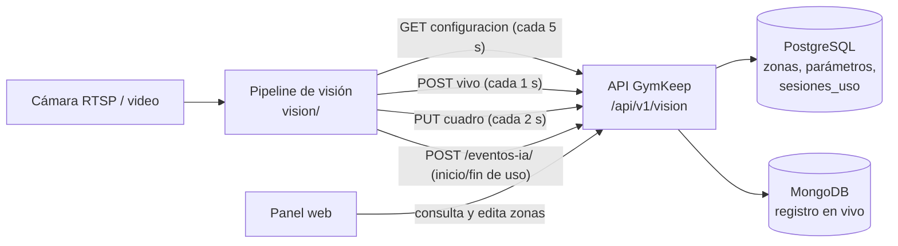

# Integración del módulo de visión con la plataforma

Guía para conectar el módulo de visión con el panel web: **tiempo de uso de cada máquina,
cámaras en vivo y zonas de las máquinas dibujadas sobre la imagen**, con el registro en vivo
guardado en MongoDB.

## 1. Componentes

| Componente | Dónde |
|---|---|
| API `/api/v1/vision`: cámaras, zonas, parámetros, estado en vivo, imagen, uso de máquinas y fotos | `app/` (con tests en `tests/test_vision_api.py`) |
| Pipeline en vivo: lee las zonas de la plataforma, envía su estado cada 1 s y la imagen cada 2 s, y aplica cambios de zonas sin reiniciarse | `vision/` (con tests) |
| Registro en vivo en MongoDB: `camaras_vivo`, `detecciones_raw`, `telemetria_camaras`, `fotos_equipos` | Base `gymkeep_ai` |
| Pipeline en Docker (CPU, sin GPU) | `docker-compose.vision.yml` |
| Pantallas del panel web | Diseño en la sección 7 |

## 2. Flujo



1. En el panel se dibuja la zona de cada máquina sobre la imagen de la cámara.
2. El pipeline lee esa configuración desde la API y la vuelve a leer cada 5 s: un cambio hecho en
   el panel se aplica sin reiniciarlo.
3. Mientras analiza, informa qué ve (estado de cada máquina, personas, imagen) → MongoDB.
4. Cuando una sesión de uso empieza o termina, envía los eventos de siempre (`POST /eventos-ia/`)
   → `sesiones_uso` en PostgreSQL → horas de uso de cada máquina.

## 3. Dónde vive cada dato

**No hay cambios de esquema en PostgreSQL** (no hay que reiniciar la base):

| Dato | Dónde | Formato |
|---|---|---|
| Zona de una máquina en una cámara | `camara_equipos.roi` (JSONB) | `{"puntos": [[x, y], ...], "normalizado": true}`. También se lee el rectángulo en píxeles de `seed.sql` |
| Parámetros de detección de la cámara | `camaras.configuracion -> 'vision'` | `{"t_on_s", "t_off_s", "confianza_min", "gracia_s", "escala_tiempo"}` |
| Última señal y resolución de la cámara | `camaras.ultima_conexion`, `ancho_px`, `alto_px` | Los actualiza cada envío en vivo |
| Sesiones de uso | `sesiones_uso` | Por los eventos de siempre |

En **MongoDB** (base `gymkeep_ai`) las colecciones nuevas se crean solas al primer uso:

| Colección | Qué guarda | Frecuencia y retención |
|---|---|---|
| `camaras_vivo` | Un documento por cámara (`_id` = id de la cámara): último estado de cada máquina, personas detectadas y **último cuadro en JPEG** | Se reemplaza cada 1 s (estado) y cada 2 s (imagen) |
| `detecciones_raw` (ya existía) | Historial de detecciones: caja, confianza, track y máquina de cada persona | Cada 1 s **solo si hay personas**; TTL 7 días |
| `telemetria_camaras` (ya existía) | Salud del pipeline: fps, latencia, personas, máquinas en uso | Cada 30 s por cámara; TTL 30 días |
| `fotos_equipos` | Foto de referencia de cada máquina (`_id` = id del equipo) | Al subirla o tomarla de la cámara |

## 4. Coordenadas

Las zonas y las cajas de personas van **normalizadas entre 0 y 1** respecto de la imagen de la
cámara (x hacia la derecha, y hacia abajo). No dependen del tamaño con que se muestre la imagen ni
de la resolución del video.

- Para dibujar: `x_px = x * ancho_mostrado`, `y_px = y * alto_mostrado`.
- Un `<svg viewBox="0 0 100 100" preserveAspectRatio="none">` encima de la imagen permite usar
  `x * 100, y * 100` directamente. Con `vector-effect="non-scaling-stroke"`, el grosor de las
  líneas no se deforma.
- Para guardar un clic: `x = (clientX - img.left) / img.width`, igual con y.

## 5. Endpoints (`/api/v1/vision`)

Documentados en `http://localhost:8000/docs`, sección "Vision (integracion)".

| Método y ruta | Lo usa | Qué hace |
|---|---|---|
| `GET /camaras` | panel | Cámaras con `en_linea`, `tiene_cuadro`, `maquinas` (con zona), `ultima_conexion` |
| `GET /camaras/{id}` | panel | Detalle: `lista_maquinas` (con su `roi`) y `parametros` |
| `PUT /camaras/{id}/maquinas/{equipo_id}` | panel | Crea o reemplaza la zona. Cuerpo: `{"puntos": [[0.1, 0.5], [0.4, 0.5], [0.4, 0.9]]}` (3 a 40 puntos, entre 0 y 1). La máquina debe ser de la misma sucursal. Una máquina nueva se crea antes con `POST /equipamiento/` |
| `DELETE /camaras/{id}/maquinas/{equipo_id}` | panel | Quita la máquina de la cámara; el equipo sigue en el inventario |
| `PUT /camaras/{id}/parametros` | panel | `{"t_on_s": 30, "t_off_s": 90, "confianza_min": 0.5, "gracia_s": 2, "escala_tiempo": 1}`; valida que T_off sea mayor que la gracia |
| `GET /camaras/{id}/configuracion` | pipeline | Máquinas activas con zona, más los parámetros |
| `POST /camaras/{id}/vivo` | pipeline | Estado en vivo (ejemplo abajo) → Mongo y `ultima_conexion` |
| `GET /camaras/{id}/vivo` | panel | Último estado, con `en_linea` (falso si no llegan datos hace más de 15 s) y `edad_s` |
| `PUT /camaras/{id}/cuadro` | pipeline y panel | Imagen (cuerpo JPEG o PNG, máx. 5 MB; se guarda en JPEG de hasta 1280 px). Desde el panel sirve para subir una imagen de referencia y dibujar zonas sin pipeline |
| `GET /camaras/{id}/cuadro` | panel | Última imagen (`image/jpeg`, sin caché) |
| `GET /maquinas` | panel | Por máquina: `horas_uso` (horómetro), `horas_ultimos_7_dias`, `sesiones`, `ultima_sesion`, `ultima_mantencion`, `horas_desde_mantencion`, `incidencias_abiertas`, `camaras`, `medido_por_camara`, `en_uso_ahora`, `estado_vivo`, `tiene_foto` |
| `GET /maquinas/{id}` | panel | Historial en una llamada: `resumen`, `uso_diario` (30 días), `sesiones`, `incidencias`, `mantenciones` |
| `GET` y `PUT /maquinas/{id}/foto` | panel | Foto de referencia (JPEG) |
| `POST /maquinas/{id}/foto/desde-camara` | panel | Recorta la zona de la máquina del último cuadro y la guarda como foto (409 si no hay imagen o zona) |

Lo que envía el pipeline cada segundo (`POST /camaras/{id}/vivo`):

```json
{
  "timestamp": "2026-10-03T12:31:05.200-03:00",
  "ancho": 1920, "alto": 1080, "fps_analisis": 5.0, "latencia_ms": 11.3,
  "modelo": {"nombre": "gymkeep-usage-detector", "version": "0.1.0"},
  "maquinas": [
    {"equipo_id": 6, "estado": "en_uso", "sesion_s": 279.4, "progreso_s": null, "umbral_s": null, "personas": 1},
    {"equipo_id": 7, "estado": "candidata", "sesion_s": null, "progreso_s": 12.0, "umbral_s": 30, "personas": 1}
  ],
  "personas": [{"caja": [0.29, 0.23, 0.36, 0.43], "confianza": 0.82, "track_id": 730, "equipo_id": 6}]
}
```

Estados de una máquina:

- `libre`.
- `candidata`: alguien llegó y todavía no cumple T_on (lleva `progreso_s` de `umbral_s`).
- `en_uso`: `sesion_s` es la duración de la sesión.
- `pausa`: se bajó y todavía no se cumple T_off.

## 6. Pipeline en vivo

```bash
cd GymKeep/vision
.venv/bin/python -m gymkeep_vision procesar rtsp://usuario:clave@ip/stream \
    --api http://localhost:8000 --camara CAM-01 --sin-video
```

O con Docker (CPU, sin GPU), sobre el compose del equipo:

```bash
cd GymKeep
VISION_CAMARA=CAM-01 VISION_FUENTE=rtsp://usuario:clave@ip/stream \
  docker compose -f docker-compose.yml -f docker-compose.vision.yml up -d --build vision
```

- `--camara` toma las zonas y los parámetros de la plataforma; el YAML pasa a ser opcional.
- Para probar sin cámara se puede usar un video puesto en `vision/datos/`:
  - Sin Docker: `--tiempo-real --repetir --inicio "$(date -Iseconds)"` lo hace funcionar como
    una cámara en vivo.
  - En Docker: `VISION_FUENTE=/app/datos/mi_video.mp4` y
    `VISION_OPCIONES="--tiempo-real --repetir"` (el compose ya agrega `--inicio`).
- El envío en vivo corre en un hilo aparte: si la API se cae, el análisis sigue y se reintenta.
- `docker stop` (o Ctrl+C) cierra las sesiones abiertas antes de salir.
- La imagen que se envía va sin anotaciones (el panel dibuja las suyas) y con las cabezas
  difuminadas.

## 7. Pantallas del panel web

Propuesta: dos secciones nuevas en el menú, "Uso de máquinas" y "Cámaras".

### 7.1 Uso de máquinas: `GET /vision/maquinas`

- Tarjetas por máquina:
  - Foto (`GET /vision/maquinas/{id}/foto` si `tiene_foto`) o un marcador "Sin foto".
  - Nombre, código y categoría.
  - **Horas de uso total**, en grande, con las sesiones.
  - Últimos 7 días, horas desde la última mantención y último uso.
  - Qué cámara la mide (o "no medido") e incidencias abiertas.
- Chip en vivo sobre la foto, a partir de `estado_vivo`: "En uso 04:39", "Detectando 12/30 s",
  "En pausa 35/90 s" o "Libre".
- Resumen arriba: máquinas medidas por cámara, en uso ahora, uso de los últimos 7 días y la más
  usada.
- Búsqueda, orden (más horas, más uso en 7 días, más horas desde la mantención, nombre) y filtro
  "solo medidas por cámara".
- Refrescar cada ~5 s para que el estado en vivo se mueva.

### 7.2 Detalle de una máquina: `GET /vision/maquinas/{id}`

- Foto con los botones "Subir foto" (`PUT .../foto`) y "Tomar de la cámara"
  (`POST .../foto/desde-camara`).
- Datos de la máquina, estado en vivo, enlace a su cámara y a la ficha del equipo existente.
- Tarjetas: uso total, últimos 7 días, desde la última mantención, sesiones e incidencias
  abiertas.
- Gráfico de barras con `uso_diario` (30 días) y tooltip con fecha, horas y sesiones. Conviene
  dibujarlo al ancho real del contenedor, para que el texto no se agrande.
- Pestañas con tablas de sesiones, incidencias y mantenciones. La sesión `abierta` puede mostrar
  su duración en vivo con `resumen.estado_vivo.sesion_s`.

### 7.3 Cámaras: `GET /vision/camaras`

- Tarjetas con la última imagen (`GET .../cuadro?t=<marca>` para no usar caché), el estado
  "En línea" o "Sin señal · hace X" y cuántas máquinas tienen zona.
- Botón "Agregar cámara", que usa el `POST /camaras/` existente.

### 7.4 Vista de una cámara: `GET /vision/camaras/{id}` + `GET .../vivo`

- **Imagen en vivo**:
  - Si `en_linea`, refrescarla cada ~1,5 s. Conviene precargar la siguiente con `new Image()`
    y cambiarla al cargar, para que no parpadee.
  - Encima, las zonas coloreadas según su estado, con un rótulo y el cronómetro.
  - También las cajas de las personas: sólida si `equipo_id` no es nulo, punteada si no.
  - Si hay muchas zonas juntas, abreviar los rótulos y evitar que se salgan por el borde.
- **Lista lateral** de las máquinas con su estado en vivo y las acciones "Editar zona",
  "Dibujar zona" e "Historial".
- **Editor de zonas**:
  - "Agregar máquina": clic en la imagen para marcar los puntos; se cierra en el primer punto
    (≥ 3 puntos).
  - Al cerrar, elegir una máquina existente de la sucursal o crear una nueva (nombre, código,
    categoría) con `POST /equipamiento/`. Después, `PUT .../maquinas/{equipo_id}`.
  - "Editar zona": arrastrar los vértices (pointer events), guardar, redibujar o quitar
    (`DELETE`), con confirmación dentro de la página.
- **Parámetros de detección** (`PUT .../parametros`), con una ayuda corta para cada uno.
- "Subir imagen de referencia" (`PUT .../cuadro`) y el comando para iniciar el pipeline cuando la
  cámara no tiene señal.

Colores sugeridos (los mismos del video anotado del pipeline): verde = libre, ámbar = detectando,
azul = sesión abierta (en uso o en pausa).

## 8. Cómo probar

```bash
cd GymKeep && docker compose up -d db mongo api
# 1) Crear una cámara (o usar CAM-01 de seed.sql)
curl -X POST localhost:8000/api/v1/camaras/ -H 'Content-Type: application/json' \
  -d '{"codigo": "CAM-02", "nombre": "Camara de prueba", "sucursal_id": 1}'
# 2) Subir una imagen de referencia y dibujar una zona
curl -X PUT localhost:8000/api/v1/vision/camaras/2/cuadro --data-binary @foto.jpg -H 'Content-Type: image/jpeg'
curl -X PUT localhost:8000/api/v1/vision/camaras/2/maquinas/1 -H 'Content-Type: application/json' \
  -d '{"puntos": [[0.2, 0.5], [0.5, 0.5], [0.5, 0.9], [0.2, 0.9]]}'
# 3) Correr el pipeline para esa camara (seccion 6) y mirar GET /api/v1/vision/camaras/2/vivo
```

## 9. Pruebas automáticas

- Backend, `tests/test_vision_api.py` (SQLite + Mongo falso, sin Docker):
  - Zonas: dibujar, editar y quitar; validaciones; sucursal distinta.
  - Parámetros.
  - Configuración del pipeline.
  - Estado en vivo y su registro en Mongo.
  - Imagen.
  - Horas de uso, horas desde la mantención y detalle completo.
  - Fotos.
- Pipeline, `vision/tests/test_vivo.py`:
  - Configuración desde la API.
  - Envío del último estado.
  - Aviso de cambios de zona.
  - Tolerancia a la API caída.
  - Zonas en caliente sin cortar la sesión.

## 10. Pendientes y decisiones abiertas

1. **Privacidad.** Hoy se difumina la cabeza de cada persona que YOLO detecta. Si alguien está
   muy cerca de la cámara o cortado por el borde puede no detectarse, y su cara queda visible en la
   imagen del panel. Antes de mostrar cámaras reales, agregar un detector de rostros (por ejemplo
   YuNet de OpenCV) sobre el cuadro que se envía, o bajar la resolución de esa imagen.
2. **Autenticación.** Como el resto de la API, estos endpoints no tienen login. La edición de
   zonas y parámetros debería quedar solo para administradores.
3. **Volumen en Mongo.** Cada cámara reescribe una imagen de 50–150 KB cada 2 s (no crece) y suma
   un documento por segundo en `detecciones_raw` mientras hay gente (TTL 7 días). Con muchas
   cámaras, conviene enviar la imagen solo cuando alguien está mirando el panel.
4. **Una cámara principal por máquina** (brecha B-54 del estudio). Si dos cámaras miran la misma
   máquina, las dos generan sesiones. El horómetro no cuenta doble (unión de intervalos), pero el
   conteo de sesiones sí se duplica.
5. **Watchdog de sesiones largas** (T_max, §6.6.5 del estudio). Una sesión sin pausas mayores a
   T_off no se corta nunca. Si el pipeline se corta sin enviar `fin_uso`, la sesión queda abierta
   hasta el siguiente `inicio_uso` de esa máquina.
6. **MinIO.** Las fotos y la imagen en vivo quedaron en Mongo porque el contenedor de MinIO no se
   puede descargar. Si se habilita, conviene mover ahí las fotos y dejar en Mongo solo la
   referencia.

## 11. Archivos

| Archivo | Qué es |
|---|---|
| `app/api/v1/vision.py`, `app/schemas/vision.py`, `app/services/vision_service.py` | Endpoints, contratos y lógica |
| `app/api/v1/router.py` | Registra `/vision` |
| `tests/test_vision_api.py` | Tests de la API |
| `vision/gymkeep_vision/vivo.py` | Envío en vivo y relectura de configuración |
| `vision/gymkeep_vision/pipeline.py`, `config.py`, `__main__.py` | `--camara`, `--tiempo-real`, `--repetir`, estado en vivo y zonas en caliente |
| `vision/tests/test_vivo.py` | Tests del modo en vivo |
| `docker-compose.vision.yml`, `vision/Dockerfile`, `vision/.dockerignore` | Pipeline en Docker |
